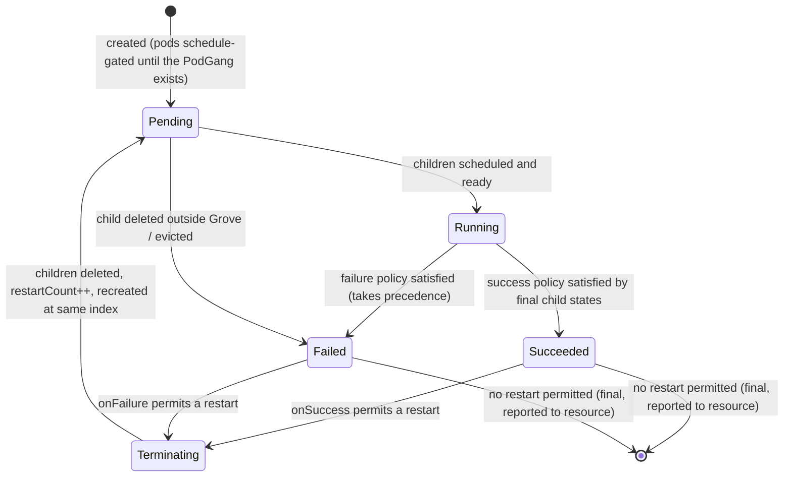
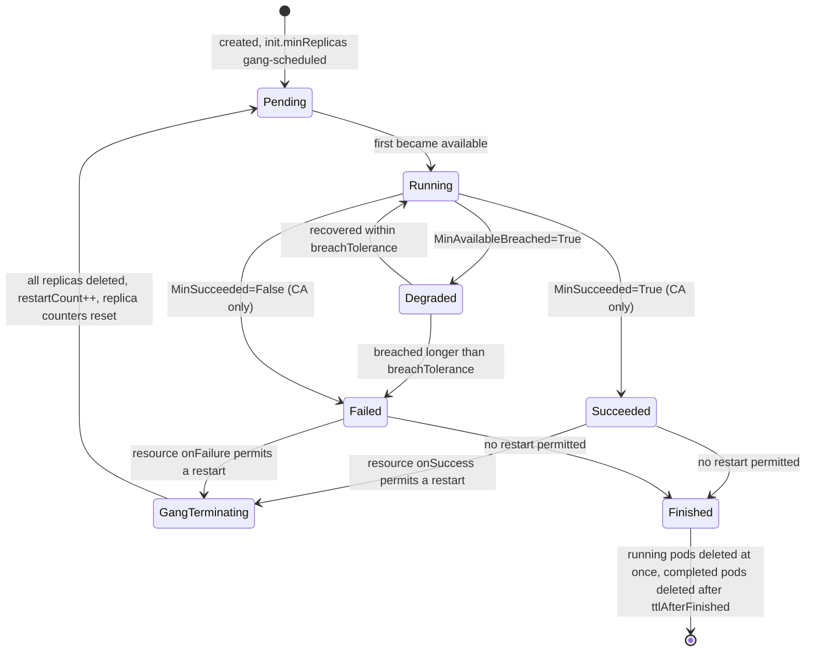
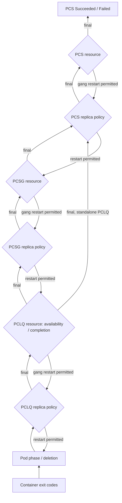
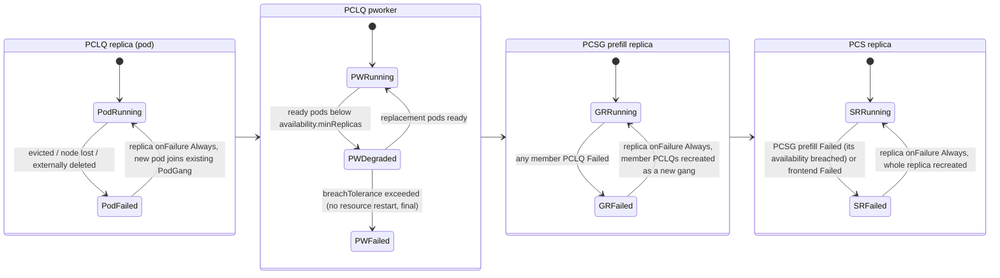
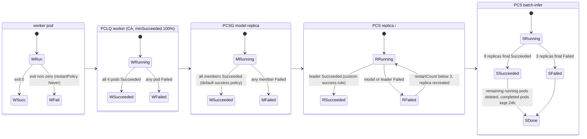

# GREP-0877: Terminal States, Termination and Restart Policies

<!-- toc -->
- [Summary](#summary)
- [Motivation](#motivation)
  - [Goals](#goals)
  - [Non-Goals](#non-goals)
- [Abbreviations](#abbreviations)
- [Proposal](#proposal)
  - [Resources, replicas and children](#resources-replicas-and-children)
  - [Terminal states and restarts](#terminal-states-and-restarts)
  - [Disaggregating MinAvailable](#disaggregating-minavailable)
  - [Workload modes](#workload-modes)
  - [User Stories](#user-stories)
    - [Story 1: Tolerate pod loss without re-gang-scheduling](#story-1-tolerate-pod-loss-without-re-gang-scheduling)
    - [Story 2: Distributed batch inference](#story-2-distributed-batch-inference)
    - [Story 3: Leader-driven completion](#story-3-leader-driven-completion)
    - [Story 4: Opting out of automatic gang termination](#story-4-opting-out-of-automatic-gang-termination)
  - [Limitations/Risks &amp; Mitigations](#limitationsrisks--mitigations)
- [Design Details](#design-details)
  - [API changes](#api-changes)
  - [Status changes](#status-changes)
  - [Per-replica state](#per-replica-state)
  - [Semantics clarified by this GREP](#semantics-clarified-by-this-grep)
  - [Defaulting profiles](#defaulting-profiles)
  - [Validation](#validation)
  - [Replica state machine](#replica-state-machine)
  - [Resource state machine](#resource-state-machine)
  - [Propagation and evaluation](#propagation-and-evaluation)
  - [Long-running lifecycle](#long-running-lifecycle)
  - [Completion-aware lifecycle](#completion-aware-lifecycle)
  - [Pod deletion attribution](#pod-deletion-attribution)
  - [Interaction with existing features](#interaction-with-existing-features)
  - [Migration from legacy fields](#migration-from-legacy-fields)
  - [Update policy defaults](#update-policy-defaults)
  - [Open Questions](#open-questions)
  - [Monitoring](#monitoring)
  - [Dependencies](#dependencies)
  - [Test Plan](#test-plan)
  - [Graduation Criteria](#graduation-criteria)
- [Implementation History](#implementation-history)
- [Alternatives](#alternatives)
- [Appendix](#appendix)
<!-- /toc -->

## Summary

Grove today treats every workload as long-running: pods are always restarted, a Grove resource never "finishes", and the only failure response is a hard-coded gang termination of a whole PodCliqueSet replica after a breach of `MinAvailable`. This GREP gives every Grove resource (PodCliqueSet, PodCliqueScalingGroup and PodClique) and every replica of those resources two well-defined terminal states, **Succeeded** and **Failed**, together with declarative policies that decide when a resource or replica reaches them and whether Grove should restart it afterwards. It also splits the overloaded `MinAvailable` field into three purpose-specific knobs — one for gang scheduling, one for rolling updates and one for availability — so that each can be tuned independently. The result is a single API that handles both long-running inference services and completion-aware workloads (batch inference, evaluation, data preparation, warm-up jobs) with explicit, observable lifecycle semantics.

## Motivation

`MinAvailable` currently carries three unrelated responsibilities: it sets the gang-scheduling minimum (`PodGroup.minReplicas` and the Anchor/Tail split of the PodGangMap), the size of the Minimum Viable Unit in a Coherent update, and the threshold for the `MinAvailableBreached` condition that drives gang termination. Because the field is immutable and shared, users cannot, for example, gang-schedule a full 8-pod tensor-parallel group while tolerating the loss of one pod at runtime, or roll updates in larger units than the availability floor.

Termination and restart behaviour is likewise implicit and fixed:

- The PodCliqueSet validating webhook forces `podSpec.restartPolicy` to `Always`, so a pod can never complete and Grove cannot run completion-aware workloads.
- Gang termination is hard-wired: a breached PodClique or PodCliqueScalingGroup (PCSG) recycles a PCSG replica or the whole PodCliqueSet (PCS) replica after a single global `terminationDelay` (default 4h). There is no way to opt out, cap the number of restarts, or choose which component failures matter.
- No Grove resource reports a terminal state. The `PodGangFailed` and `PodGangSucceeded` phases exist in the API but nothing drives them, so tools built on Grove (for example Dynamo, Kueue or a CI system) cannot tell whether a workload finished, failed permanently, or is still being retried.

Kubernetes defines these semantics for containers (exit code), pods (`restartPolicy`) and Jobs (`successPolicy`, `podFailurePolicy`, `backoffLimit`), but none of them compose across Grove's three-level hierarchy of PCS → PCSG → PodClique → Pod.

### Goals

- Define two logical terminal states, `Succeeded` and `Failed`, for every Grove resource and every replica of a Grove resource, and surface them in status.
- Define a uniform termination policy on PCS, PCSG and PodClique with two scopes:
  - **Resource scope:** an availability policy (`MinAvailableBreached` plus a breach tolerance) and an optional completion policy (`MinSucceeded`).
  - **Replica scope:** success and failure rules evaluated over the terminal states of the replica's children.
- Define resource-scope and replica-scope restart policies (`Always` or `Limit`, separately for success and failure) that only apply once the resource or replica is terminal.
- Split `MinAvailable` into `init.minReplicas` (gang scheduling), `update.minReplicas` (minimum update unit) and `termination.resource.availability.minReplicas` (availability floor).
- Support completion-aware workloads by allowing `Never`/`OnFailure` pod restart policies when completion is enabled.
- Preserve today's behaviour for existing PodCliqueSets through defaulting and a documented mapping from the legacy fields.
- Provide garbage collection of finished pods through `ttlAfterFinished`.

### Non-Goals

- Detecting workloads that never become ready (a startup deadline). Breach evaluation starts only after a resource first becomes available, as it does today; a startup timeout can be proposed separately.
- Container-level restart policies or retry back-off inside a pod. Kubernetes already handles these through the kubelet.
- Suspending and resuming workloads, or queueing/admission semantics. These belong to the Kueue integration (GREP-704).
- Autoscaling of completion-aware resources. Completion-aware resources reject `autoScalingConfig`/`scaleConfig` in this GREP.
- Deleting the Grove custom resources themselves after completion. `ttlAfterFinished` collects pods only, so terminal status stays observable.

## Abbreviations

| Abbreviation | Meaning |
|---|---|
| PCS | PodCliqueSet |
| PCSG | PodCliqueScalingGroup |
| PCLQ | PodClique |
| LR | Long-running (a resource without a completion policy) |
| CA | Completion-aware (a resource with a completion policy) |
| MVU | Minimum Viable (update) Unit, as defined in GREP-393 |

## Proposal

### Resources, replicas and children

Every Grove resource is made up of one or more replicas, and every replica is made up of children. The termination model is defined once and applied at each level:

| Resource | A replica is | Children of a replica |
|---|---|---|
| PCS | One complete copy of the workload | Its standalone PCLQs and its PCSGs |
| PCSG | One group of member PCLQs | Those PCLQs |
| PCLQ | One pod | The pod's application containers |

Two kinds of state are tracked at every level:

- **Replica state** is derived bottom-up from the terminal states of the replica's children, using the replica **success** and **failure** policies.
- **Resource state** is derived from two resource conditions over its replicas: `MinAvailableBreached` (availability policy) and `MinSucceeded` (completion policy).

A resource's own terminal state is what its parent replica sees as "child Succeeded/Failed". That is how terminal states propagate from a pod up to the PCS.

### Terminal states and restarts

Grove defines exactly two terminal states, `Succeeded` and `Failed`. A restart policy is only consulted after a resource or replica becomes terminal:

- **Replica restart:** terminate the replica's children, then recreate the replica at the same index if the policy allows.
- **Resource restart (gang restart):** gang-terminate all replicas, then recreate all of them if the policy allows.

A terminal state that a restart policy acts on is **transient**: the resource or replica goes back to `Pending` and the parent never sees the terminal state. A terminal state that no restart policy acts on (no restart spec, or the limit is exhausted) is **final**, and only final states propagate to the parent. This rule — *restarts absorb terminal states* — is what lets the same rules work for a self-healing inference service and for a one-shot batch job.

### Disaggregating MinAvailable

| New field | Purpose | Replaces |
|---|---|---|
| `init.minReplicas` | Minimum number of replicas gang-scheduled together on initial deployment and on every restart | `MinAvailable` as `PodGroup.minReplicas` and the Anchor/Tail split |
| `update.minReplicas` | Minimum number of replicas rolled together as one gang during an update | `MinAvailable` as the Coherent MVU size |
| `termination.resource.availability.minReplicas` | Minimum number of available replicas before `MinAvailableBreached` becomes true | `MinAvailable` as the breach threshold |

`init.minReplicas` and `update.minReplicas` both default to, and may not be lower than, `max(availability.minReplicas, 1)`: a unit that is gang-scheduled or rolled must at least be functional.

### Workload modes

Setting `termination.resource.completion` makes a resource **completion-aware (CA)**; otherwise it is **long-running (LR)**.

- An **LR** resource can only reach `Failed`, through a sustained availability breach. `MinSucceeded` is permanently `Unknown`.
- A **CA** resource reaches `Succeeded` when enough replicas finish successfully, and `Failed` when too many fail or availability is breached. Every child of a CA resource must also be CA, and CA PodCliques may use `restartPolicy: Never` or `OnFailure`.

A CA child is allowed inside an LR parent, for example a one-shot model warm-up PodClique inside a serving PCS.

The defaulting webhook fills in different restart defaults for the two modes so that LR workloads keep today's self-healing behaviour and CA workloads fail fast unless asked to retry (see [Defaulting profiles](#defaulting-profiles)).

### User Stories

#### Story 1: Tolerate pod loss without re-gang-scheduling

As an operator of a multi-node disaggregated inference service, I want each prefill group to be gang-scheduled with all 8 workers (`init.minReplicas: 8`) but stay in service with 6 (`availability.minReplicas: 6`) so that a single node loss does not tear down a working tensor-parallel group.

#### Story 2: Distributed batch inference

As an ML engineer running offline batch inference, I want a PCS of 10 replicas to succeed once 8 replicas finish (`minSucceeded: 80%`), to retry a failed replica up to 3 times, and to give up as soon as more than 2 replicas fail permanently. Then my pipeline can read a single `Succeeded`/`Failed` phase.

#### Story 3: Leader-driven completion

As a user running an MPI-style job in a PCSG, I want a replica to be `Succeeded` as soon as the leader PodClique succeeds, regardless of whether workers exit cleanly, and `Failed` as soon as the leader fails (`replica.success.rules: [{target: [leader]}]`, `replica.failure.rules: [{target: [leader]}]`).

#### Story 4: Opting out of automatic gang termination

As a platform owner, I want to disable Grove's automatic PCS-replica recycling for a debugging deployment (`replica.restart: null` on the PCS) so that broken pods stay in place for inspection.

### Limitations/Risks & Mitigations

| Risk | Mitigation |
|---|---|
| **Behaviour change for existing workloads.** The proposed default for `breachTolerance` (30s) and the absence of restarts in the bare API differ from today (4h, always recycle). | Legacy fields are translated by the defaulting webhook into explicit new fields (see [Migration from legacy fields](#migration-from-legacy-fields)). LR defaults are materialized by the [defaulting profiles](#defaulting-profiles), so behaviour only changes when a user edits the new fields. |
| **Restart storms.** `Always` restarts combined with a short `breachTolerance` can loop on a cluster that cannot place the gang. | Breach evaluation starts only after the resource was once available (the existing `WasPCLQEverScheduled`/`WasPCSGEverHealthy` gates). A `GangTerminationInProgress`-style condition suppresses re-firing until recovery, and `Limit` gives a hard cap. |
| **Mis-attributing Grove's own deletions as failures.** Rolling updates, scale-in, restarts and gang termination all delete pods. | Grove marks the pods it deletes and excludes them from failure accounting (see [Pod deletion attribution](#pod-deletion-attribution)). |
| **Status size and write amplification.** Per-replica state for PodCliques with thousands of pods would make status grow with replicas, and every pod transition would rewrite it. | Status holds only O(1) aggregates, and per-replica transitions are reported as events. Restart counts and final markers live on per-replica carrier objects, written only when a `Limit` restart, a final terminal state or completion awareness needs them (see [Per-replica state](#per-replica-state)). |
| **Finalizers on carrier objects** can block deletion if the operator is unavailable. | The finalizer is removed during resource deletion and when TTL collection runs. It is the same trade-off Kubernetes Jobs make with `batch.kubernetes.io/job-tracking`. |
| **API surface and cognitive load.** The termination spec is deep. | Every field is optional. The defaulting profiles cover the two common modes, and the user guide will lead with the two profile examples. |
| **PCS-level `init.minReplicas > 1`** requires gang scheduling across PCS replicas (several PodGangs as one unit), which not all scheduler backends support. | `ValidatePodCliqueSet` of the scheduler backend rejects values above 1 unless the backend supports grouped PodGangs (for example GREP-531 CompositePodGroup). |

## Design Details

### API changes

The same three sections are added at every level:

- `PodCliqueSetSpec`
- `PodCliqueScalingGroupConfig` in the PCS template, copied into `PodCliqueScalingGroupSpec`
- `PodCliqueSpec`, used inside `PodCliqueTemplateSpec` and copied into `PodClique`

```go
// InitSpec configures the initial (and every re-) deployment of a resource's replicas.
type InitSpec struct {
	// MinReplicas is the guaranteed minimum number of replicas gang-scheduled together when the
	// resource is first deployed and whenever it, or one of its replicas, is restarted.
	// Defaults to max(termination.resource.availability.minReplicas, 1), which is also the minimum allowed value.
	// +optional
	MinReplicas *int32 `json:"minReplicas,omitempty"`
}

// UpdateSpec configures how template changes are rolled out.
type UpdateSpec struct {
	// Policy is the update strategy. Only allowed on PodCliqueSetSpec; it applies to every component.
	// Defaults to Coherent.
	// +kubebuilder:validation:Enum={Coherent,RollingRecreate,OnDelete}
	// +optional
	Policy *UpdateStrategyType `json:"policy,omitempty"`
	// MinReplicas is the minimum number of replicas rolled together as one gang to keep a functional
	// unit on a single revision. Distinct from MaxUnavailable.
	// Defaults to max(termination.resource.availability.minReplicas, 1), which is also the minimum allowed value.
	// +optional
	MinReplicas *int32 `json:"minReplicas,omitempty"`
	// MaxUnavailable is the maximum number of replicas that may be disrupted at any time during an update.
	// Defaults to MinReplicas.
	// +optional
	MaxUnavailable *intstr.IntOrString `json:"maxUnavailable,omitempty"`
	// ProgressDeadline is carried over unchanged from RollingUpdateConfiguration.
	// +optional
	ProgressDeadline *metav1.Duration `json:"progressDeadline,omitempty"`
}

// TerminationSpec defines the terminal conditions and restart policies of a resource and its replicas.
type TerminationSpec struct {
	// TTLAfterFinished is how long completed pods of this resource are retained after the resource
	// reaches a final terminal state, before Grove deletes them. Nil retains them until the resource is deleted.
	// +optional
	TTLAfterFinished *metav1.Duration `json:"ttlAfterFinished,omitempty"`
	// Resource defines resource-scope terminal conditions and the gang-restart policy.
	// +optional
	Resource *ResourceTerminationSpec `json:"resource,omitempty"`
	// Replica defines replica-scope terminal conditions and the replica restart policy.
	// +optional
	Replica *ReplicaTerminationSpec `json:"replica,omitempty"`
}

type ResourceTerminationSpec struct {
	// Availability: nil means MinAvailableBreached is never set to true.
	// +optional
	Availability *AvailabilityPolicy `json:"availability,omitempty"`
	// Completion: non-nil makes the resource completion-aware. Nil keeps MinSucceeded permanently Unknown.
	// +optional
	Completion *CompletionPolicy `json:"completion,omitempty"`
	// Restart: nil means no gang termination followed by gang restart.
	// +optional
	Restart *RestartSpec `json:"restart,omitempty"`
}

type AvailabilityPolicy struct {
	// MinReplicas is the minimum number of available replicas. Default 1, minimum 1.
	// +optional
	MinReplicas *int32 `json:"minReplicas,omitempty"`
	// BreachTolerance is how long MinAvailableBreached may stay true before the resource is Failed.
	// +optional
	BreachTolerance *metav1.Duration `json:"breachTolerance,omitempty"`
}

type CompletionPolicy struct {
	// MinSucceeded is the number (or percentage of spec.replicas, rounded up) of replicas that must be
	// in final Succeeded state for the resource to succeed. Defaults to 100%.
	// +optional
	MinSucceeded *intstr.IntOrString `json:"minSucceeded,omitempty"`
}

type RestartSpec struct {
	// +optional
	OnSuccess *RestartPolicy `json:"onSuccess,omitempty"`
	// +optional
	OnFailure *RestartPolicy `json:"onFailure,omitempty"`
}

// +kubebuilder:validation:Enum={Always,Limit}
type RestartPolicyType string

type RestartPolicy struct {
	// Policy defaults to Always.
	Policy RestartPolicyType `json:"policy,omitempty"`
	// Limit is the maximum number of restarts. Only allowed when Policy is Limit. Default 0.
	// +optional
	Limit *int32 `json:"limit,omitempty"`
}

type ReplicaTerminationSpec struct {
	// Success: nil means all children must be Succeeded.
	// +optional
	Success *ReplicaTerminalPolicy `json:"success,omitempty"`
	// Failure: nil means any one child Failed fails the replica.
	// +optional
	Failure *ReplicaTerminalPolicy `json:"failure,omitempty"`
	// Restart: nil means no termination followed by re-creation of the replica's children.
	// +optional
	Restart *RestartSpec `json:"restart,omitempty"`
}

type ReplicaTerminalPolicy struct {
	// Operator combines Rules: Or is satisfied when any rule is satisfied, And when every rule is.
	// Defaults to Or.
	// +optional
	Operator *RuleOperator `json:"operator,omitempty"`
	// +kubebuilder:validation:MinItems=1
	Rules []TerminalRule `json:"rules"`
}

// +kubebuilder:validation:Enum={And,Or}
type RuleOperator string

type TerminalRule struct {
	// Target names children of the replica: clique and PCSG names for a PCS, member clique names
	// for a PCSG, and application container names for a PodClique.
	// +kubebuilder:validation:MinItems=1
	Target []string `json:"target"`
	// Operator: And requires every target, Or requires any target. Defaults to And.
	// +optional
	Operator *RuleOperator `json:"operator,omitempty"`
}
```

A completion-aware PCS for batch inference:

```yaml
apiVersion: grove.io/v1alpha1
kind: PodCliqueSet
metadata:
  name: batch-infer
spec:
  replicas: 10
  termination:
    ttlAfterFinished: 24h
    resource:
      completion:
        minSucceeded: 80%
    replica:
      success:
        rules:
          - target: [leader]
      restart:
        onFailure: {policy: Limit, limit: 3}
  template:
    podCliqueScalingGroups:
      - name: model
        cliqueNames: [leader, worker]
        replicas: 1
    cliques:
      - name: leader
        spec:
          replicas: 1
          termination: {resource: {completion: {}}}
          podSpec: {restartPolicy: Never, containers: [...]}
      - name: worker
        spec:
          replicas: 4
          init: {minReplicas: 4}
          termination: {resource: {completion: {}}}
          podSpec: {restartPolicy: Never, containers: [...]}
```

### Status changes

Added to `PodCliqueSetStatus`, `PodCliqueScalingGroupStatus` and `PodCliqueStatus`:

```go
// +kubebuilder:validation:Enum={Pending,Running,Succeeded,Failed}
type TerminalPhase string

// Phase is the resource phase. Succeeded and Failed are only reported once final.
Phase TerminalPhase `json:"phase,omitempty"`
// SucceededReplicas and FailedReplicas count replicas in final terminal states.
SucceededReplicas int32 `json:"succeededReplicas"`
FailedReplicas    int32 `json:"failedReplicas"`
// RestartCount is the number of resource-scope gang restarts performed.
RestartCount int32 `json:"restartCount"`
// RestartingReplicas counts replicas that are terminal and currently being restarted.
RestartingReplicas int32 `json:"restartingReplicas"`
// ReplicaRestarts is the total number of replica restarts since the last gang restart.
ReplicaRestarts int64 `json:"replicaRestarts"`
// FinishedAt is when the resource reached a final terminal state; ttlAfterFinished is measured from it.
FinishedAt *metav1.Time `json:"finishedAt,omitempty"`
```

Every status field is O(1) in the number of replicas. Per-replica state is not stored in the parent's status; it lives on the objects that make up each replica (see [Per-replica state](#per-replica-state)).

### Per-replica state

Each controller already lists a replica's objects through its informer cache in every reconcile. Most per-replica state can therefore be **recomputed** rather than stored:

- A replica's phase (`Pending`, `Running`, `Succeeded`, `Failed`) follows from its children's states and the replica policies.
- The aggregate counts in status are recomputed from those phases on every reconcile.

Only two facts must survive a reconcile and cannot be recomputed:

- **Restart count**, needed only when the replica restart policy is `Limit`.
- **Final marker**, which records that a replica is final terminal and must not be recreated. It is needed only when a terminal state is not followed by a restart.

Both are stored on the replica's own **carrier objects** as labels and annotations, so the cost of storing them is spread across objects that already exist:

| Replica of | Carrier objects | Existing index label |
|---|---|---|
| PCLQ | The replica's pod | `grove.io/podclique-pod-index` |
| PCSG | Every member PCLQ of the replica | `grove.io/podcliquescalinggroup-replica-index` |
| PCS | The replica's PodGangMap (already one per PCS replica) | `grove.io/podcliqueset-replica-index` |

Carriers use the following keys:

- `grove.io/replica-restart-count` (annotation) holds the restart count.
- `grove.io/replica-phase` (label, `Succeeded` or `Failed`) is set only on final replicas. As a label it can be selected, so `kubectl get pods -l grove.io/replica-phase=Failed` lists the failed PodClique replicas.

When several carriers of one PCSG replica disagree after a partial write, Grove uses the highest restart count and treats the replica as final if any carrier is marked final.

**Carrying state across a restart.** A replica restart deletes the carriers and creates new ones. A crash between the deletion and the creation would lose the restart count, so the restart is done in four steps:

1. Grove adds the `grove.io/replica-accounting` finalizer to carriers when they are created.
2. To restart, Grove deletes the old carriers. The finalizer keeps them visible in the `Terminating` state with their annotations intact.
3. Grove creates the new carriers stamped with `restart-count + 1`. When a new carrier is created, Grove reads the count from any carrier still `Terminating` at the same index.
4. Grove removes the finalizer from the old carriers.

Each step is idempotent. A new carrier that exists with the higher count proves step 3 completed, and a `Terminating` predecessor is never counted twice. Kubernetes Jobs use the same pattern: their per-index failure counter lives in a pod annotation (`batch.kubernetes.io/job-index-failure-count`), protected by the `batch.kubernetes.io/job-tracking` finalizer.

**Keeping final replicas final.** A final replica's carriers keep the finalizer until the resource itself is final and its `ttlAfterFinished` has expired, or until the resource is deleted. If a user deletes the completed pod of a final PodClique replica, it stays `Terminating` with its `replica-phase` label, so Grove does not mistake the index for a missing replica and recreate it.

**Gang restarts reset the counters for free.** A resource gang restart deletes every carrier and recreates them with no restart count. No status field needs clearing.

**PodGangMap as the PCS carrier.** Today's gang termination deletes the PodGangMap so the replica is rebuilt from scratch. With this GREP, a PCS replica restart instead resets the PodGangMap's entries in place and increments its annotation. The object keeps its name and identity.

**Finalizer cost.** The finalizer and annotations are only needed when they carry information, so the default long-running profile adds no extra writes per pod. Grove adds them to a resource's carriers only when at least one of these holds:

- the replica restart policy for success or failure is `Limit`;
- a terminal state can be final (`replica.restart` is nil for that outcome);
- the resource is completion-aware.

Conditions:

| Condition | True | False | Unknown |
|---|---|---|---|
| `MinAvailableBreached` (existing) | Satisfied replicas below `availability.minReplicas` | At or above it, or `availability` is nil | Update in progress (as today) |
| `MinSucceeded` (new) | Final `Succeeded` replicas at least `minSucceeded` | Final `Failed` replicas exceed `spec.replicas − minSucceeded` | Neither yet, or `completion` is nil |
| `GangRestartInProgress` (new; generalizes `GangTerminationInProgress`) | Gang termination for a restart is in flight | Otherwise | — |

### Semantics clarified by this GREP

Applying the rules to the current controllers exposes several ambiguities. This GREP resolves them as follows:

1. **`MinSucceeded` polarity.** The draft rules say `MinSucceeded` is set to *false* when enough replicas succeed. That is taken to be a typo: the condition is **true** on success and **false** on failure, as stated in rules 3c and 3d.
2. **Restarts absorb terminal states.** A child only reports a terminal state to its parent once it is final (see [Terminal states and restarts](#terminal-states-and-restarts)). Without this rule, a PCLQ configured to restart itself would also fail its parent PCSG replica and trigger a second restart one level up.
3. **Succeeded replicas satisfy availability.** Rule 5b.i removes a terminal replica from the available count. In a CA resource, that would make `MinAvailableBreached` fire as replicas finish successfully, failing a workload that is succeeding. Availability is therefore evaluated over *satisfied* replicas = available replicas + final `Succeeded` replicas. The `availableReplicas` status field keeps its current meaning.
4. **Failure takes precedence.** If the success and failure policies of a replica are satisfied in the same evaluation, the replica is `Failed`. Likewise, at resource scope, `MinAvailableBreached` past tolerance wins over `MinSucceeded=True` observed in the same reconcile.
5. **Rule combination.** Combining operators work at two levels. Within a rule, `operator` combines the targets and defaults to `And`. Across rules, the policy-level `operator` combines the rules and defaults to `Or`, matching Kubernetes Job `successPolicy`. The draft example becomes unambiguous: with the default, `{A,B} And` and `{X,Y} Or` read as "A and B succeeded, **or** X or Y succeeded". Setting the policy `operator: And` makes it "A and B succeeded, **and** X or Y succeeded". The `Or` default lets a failure policy list independent triggers, such as "leader failed" or "both workers failed".
6. **Pod deletion is evaluated once, at the PodClique.** Rules 6a.iii and 7a.iii (pods of a child deleted) double-count failures that rule 5a.iii already turns into PCLQ replica failures, which then reach the parent through the PCLQ's own state. Parents only observe child *resource* terminal states. Deleting a child Grove object (PCLQ or PCSG) outside Grove counts as that child `Failed`.
7. **Termination frees resources but keeps evidence.** Rules 3f and 9b conflict on whether pods are deleted when there is no restart spec. When a replica or resource becomes final terminal, Grove deletes its *running* pods immediately, so a partially broken gang does not hold accelerators. Pods that already completed (`Succeeded`/`Failed` phase) are kept for logs until a restart replaces them or `ttlAfterFinished` expires. Child Grove objects are kept with their terminal status until a restart recreates them.
8. **Breach evaluation starts after first availability**, per rule 9a and today's `WasPCLQEverScheduled`/`WasPCSGEverHealthy` gates. A resource that never becomes available stays `Pending`.
9. **Scaled-to-zero children** neither block the default success policy nor trigger the default failure policy. A PCLQ or PCSG at `replicas: 0` is skipped, consistent with today's `MinAvailableBreached` handling.
10. **Restart limits are per replica index** for replica restarts and per resource for gang restarts. Replica counters live on the replica's carrier objects and reset when the resource itself gang-restarts (see [Per-replica state](#per-replica-state)).
11. **`update.policy` exists only on the PCS.** A Coherent update coordinates all components of a PCS replica, so per-component policies cannot be honoured. PCSG and PCLQ accept only `update.minReplicas`, `update.maxUnavailable` and `update.progressDeadline`.
12. **PodClique replica rules target containers.** Without rules, the PCLQ replica state follows the pod phase (rule 5a). With rules, Grove evaluates container termination states. This lets a replica become terminal before the pod phase does (for example, the `main` container failed while a sidecar keeps running), after which Grove terminates the pod. Native sidecars (init containers with `restartPolicy: Always`) cannot be targeted.

### Defaulting profiles

Defaulting depends on the workload mode and materializes explicit values into the stored object, so `kubectl get -o yaml` always shows the effective policy. "nil" in the user-facing API keeps its documented meaning; the defaulting webhook simply does not leave LR restarts nil.

| Field | LR default | CA default |
|---|---|---|
| `podSpec.restartPolicy` (PCLQ) | `Always` (only value allowed) | `Never` (`Never` or `OnFailure` allowed) |
| `availability` on PCLQ and PCSG | `{minReplicas: 1, breachTolerance: 30s}` | nil |
| `availability` on PCS | nil | nil |
| `replica.restart` on PCLQ | `onFailure: Always` (pods are recreated, as today) | nil |
| `replica.restart` on PCSG | `onFailure: Always` (PCSG replica recycle, as today) | nil |
| `replica.restart` on PCS | `onFailure: Always` (PCS replica gang termination, as today) | nil |
| `resource.restart` (all levels) | nil | nil |
| `completion.minSucceeded` | — | `100%` |
| `init.minReplicas`, `update.minReplicas` | `max(availability.minReplicas, 1)` | `max(availability.minReplicas, 1)` |
| `update.maxUnavailable` | `update.minReplicas` | `update.minReplicas` |
| Child `completion` under a CA parent | — | `{}` when omitted |

### Validation

- `1 ≤ availability.minReplicas ≤ init.minReplicas ≤ replicas` and `availability.minReplicas ≤ update.minReplicas ≤ replicas`.
- Under `Coherent`, the resolved `update.maxUnavailable` must be at least `update.minReplicas`. This is today's `maxUnavailable ≥ minAvailable` rule.
- `RestartPolicy.limit` is only allowed with `policy: Limit`, and must be `≥ 0`.
- `TerminalRule.target` entries must name existing children of the replica at that level.
- A CA resource:
  - requires every child to be CA (explicit LR children are rejected);
  - rejects `autoScalingConfig`/`scaleConfig`;
  - rejects `podSpec.restartPolicy: Always`.
- An LR PodClique rejects `podSpec.restartPolicy` other than `Always`.
- `update.policy` is rejected outside `PodCliqueSetSpec`.
- `init.minReplicas`, `update.minReplicas`, `availability.minReplicas` and `completion` are immutable, as `MinAvailable` is today. The PodGangMap layout, pod dependency names and in-flight Coherent plans are derived from them.
- Restart specs, `breachTolerance` and `ttlAfterFinished` are mutable.
- Scale guard: `spec.replicas` must be `0` or `≥ availability.minReplicas` (today it is `≥ minAvailable`). The anchor `PodGroup.minReplicas` is clamped to `min(init.minReplicas, replicas)`, as non-base anchors already are.
- PCS `init.minReplicas > 1` is rejected unless the scheduler backend supports grouped PodGangs.

### Replica state machine

Applies to a PCLQ replica (pod), a PCSG replica and a PCS replica.



A replica in `Terminating` or `Pending` after a restart does not count as available; a final `Succeeded` replica counts as satisfied for availability (clarification 3).

### Resource state machine

Applies to a PCLQ, a PCSG and a PCS.



`Degraded` is not a phase value. It is the `Running` phase with `MinAvailableBreached=True`, and the breach-tolerance timer is the condition's `lastTransitionTime`. `Finished` is the `Succeeded` or `Failed` phase with `FinishedAt` set. While an update is in progress, `MinAvailableBreached` is `Unknown` and the timer is suspended, as gang termination is today.

### Propagation and evaluation

Each controller evaluates its own resource and replicas and only reads the status of its direct children. The PCLQ controller evaluates pods; the PCSG controller evaluates member PCLQs; the PCS controller evaluates standalone PCLQs and PCSGs.



Per reconcile, for each level:

```text
for each replica r:
    childStates = final terminal states of r's children (non-final children count as non-terminal)
    if failurePolicy(childStates):  r.terminal = Failed
    elif successPolicy(childStates): r.terminal = Succeeded
    if r.terminal and restartPermitted(replica.restart, r.terminal, r.restartCount):
        terminate r's children; r.restartCount++; recreate r      # transient
    elif r.terminal:
        delete running pods of r; mark r final                    # reported to resource
satisfied = available replicas + final Succeeded replicas
set MinAvailableBreached from satisfied vs availability.minReplicas (once ever available)
set MinSucceeded from final Succeeded / Failed counts vs completion.minSucceeded
resource.terminal = Failed if breached > breachTolerance or MinSucceeded=False
                    else Succeeded if MinSucceeded=True
apply resource.restart likewise (gang terminate, then recreate with init.minReplicas)
```

### Long-running lifecycle

The diagram below shows a disaggregated inference PCS with a standalone `frontend`, and a `prefill` PCSG of `{pleader, pworker}`, using LR defaults.



1. A lost `pworker` pod is replaced in place, as the PodClique does today.
2. If replacements cannot become ready within `breachTolerance`, the `pworker` PodClique fails. That fails its PCSG replica, which is recycled as a fresh gang, matching today's PCSG-replica gang termination.
3. If the PCSG as a whole drops below its own `availability.minReplicas` for longer than its tolerance, the PCSG fails. The PCS replica then fails and is recreated, matching today's PCS-replica gang termination.
4. The PCS has no availability policy and no resource restart by default, so it never reaches a terminal state.

### Completion-aware lifecycle

The diagram below shows the `batch-infer` example from [API changes](#api-changes): a PCS of 10 replicas with `minSucceeded: 80%`, success on `leader`, and `onFailure: Limit 3`.



1. A worker exiting non-zero fails its PodClique, the PCSG replica and the PCS replica.
2. The PCS replica is retried up to 3 times. Only after the fourth failure does it become final `Failed`.
3. Once 8 replicas succeed, the PCS succeeds even if 2 replicas are still running; those 2 replicas' running pods are terminated.
4. Three final `Failed` replicas make 8 successes impossible (`3 > 10 − 8`), so the PCS fails immediately rather than waiting for the remaining replicas.

### Pod deletion attribution

Before deleting a pod for a rolling update, scale-in, replica or gang restart, ttl collection, or PodGang migration, Grove records the reason on the pod with a `grove.io/deletion-reason` annotation, using the same patch it already issues to remove finalizers or labels where applicable. When carriers have the `grove.io/replica-accounting` finalizer (see [Per-replica state](#per-replica-state)), Grove observes every deletion, even while the operator is down, before the pod disappears. A pod that disappears or terminates without that annotation counts as a `Failed` child. This includes:

- deletion by a user;
- eviction, including when the pod's `DisruptionTarget` condition is set;
- preemption;
- node loss.

### Interaction with existing features

- **Gang scheduling:** `init.minReplicas` replaces `MinAvailable` in PodGang construction (`podgang/syncflow.go`), the bootstrap Anchor/Tail split (`podgangmap/steadystate.go`) and startup-dependency thresholds (`initcontainer.go`, `GenerateDependencyNamesForBasePodGang`). Every restart rebuilds the replica's PodGangMap entries, as gang termination does today.
- **Updates:** `update.minReplicas` replaces `MinAvailable` in `computeMVUTemplate`, `CoherentMinAvailableByComponent` and `EffectiveMaxUnavailable`. Rolling updates skip final-terminal replicas; such replicas pick up the new revision only if they are restarted.
- **Availability status:** `MinAvailableBreached` computation in the PCLQ and PCSG status reconcilers switches from `MinAvailable` to `availability.minReplicas`, and gains the PCS level.
- **Gang termination:** `gangterminate.go` and the PCSG-replica recycle in `podcliquescalinggroup/components/podclique/sync.go` become the replica-restart executors at PCS and PCSG level, driven by policy instead of being unconditional.
- **TTL:** a per-resource requeue at `FinishedAt + ttlAfterFinished` deletes the resource's completed pods. TTLs on children run independently, so a finished warm-up PodClique can release its pods while the PCS keeps serving.

### Migration from legacy fields

The legacy fields stay in `v1alpha1`, marked deprecated, and are mutually exclusive with their replacements. The defaulting webhook translates them when the new fields are absent, so existing objects keep today's behaviour:

| Legacy field | Translated to |
|---|---|
| PCLQ `minAvailable: N` | `init.minReplicas: N`, `update.minReplicas: N`, `availability.minReplicas: N` |
| PCSG `minAvailable: N` | Same three fields on the PCSG |
| `template.terminationDelay: D` (default 4h) | `availability.breachTolerance: D` on every PCLQ and PCSG |
| `updateStrategy.type` (default `RollingRecreate`) | `update.policy` with the same value |
| `rollingUpdate.{maxUnavailable, progressDeadline}` | `update.{maxUnavailable, progressDeadline}` |
| (implicit) | LR defaulting profile restarts |

Removal of the legacy fields happens in a later API version through the CRD upgrader (GREP-436).

### Update policy defaults

- **Default policy.** `update.policy` defaults to `Coherent` when a PodCliqueSet uses the new `update` section. Objects that still use the legacy `updateStrategy`, or set neither, keep the GREP-393 default of `RollingRecreate`, so existing manifests do not change behaviour silently.
- **Allowed values.** `OnDelete` (GREP-291) remains a valid value. With `OnDelete`, `update.minReplicas` is not used, and `update.maxUnavailable` and `update.progressDeadline` are rejected, as `rollingUpdate` is today.
- **Breach tolerance.** `availability.breachTolerance` defaults to 30s when it is set through the new API. Legacy objects get the value translated from `terminationDelay` (4h by default) instead.

### Open Questions

1. **`update.minReplicas` under `RollingRecreate`:** ignore it (warning), or recreate in batches of `update.minReplicas`?
2. **Updating a finished resource:** should a template change on a resource in a final terminal state trigger a fresh run, or be stored and applied only on the next restart (as proposed)?
3. **PCLQ container-targeted rules:** ship in alpha, or derive PCLQ replica states from pod phase only until beta?

### Monitoring

**Status:** `phase`, `succeededReplicas`, `failedReplicas`, `restartingReplicas`, `replicaRestarts`, `restartCount` and `finishedAt` on all three resources, plus the `MinAvailableBreached`, `MinSucceeded` and `GangRestartInProgress` conditions. Printer columns `Phase` and `Restarts` are added to `pcs`, `pcsg` and `pclq`.

**Per-replica inspection:** final replicas are selectable by the `grove.io/replica-phase` label on their carrier objects. For example, `kubectl get pclq -l grove.io/podcliqueset-replica-index=3,grove.io/replica-phase=Failed` lists the failed scaling-group replicas of PCS replica 3. Restart counts are read from the `grove.io/replica-restart-count` annotation.

**Events** on the owning resource:

| Event | Type | When |
|---|---|---|
| `ReplicaSucceeded` / `ReplicaFailed` | Normal / Warning | A replica becomes terminal. The message names the replica index, its restart count and the reason (the matched rule, such as `FailureRule[0]`, or the triggering event, such as `PodEvicted`) |
| `ReplicaRestarted` | Normal | A replica restart is executed |
| `ReplicaRestartLimitReached` | Warning | `Limit` is exhausted and a replica becomes final |
| `BreachToleranceExceeded` | Warning | A resource fails on availability |
| `ResourceSucceeded` / `ResourceFailed` | Normal / Warning | A resource reaches a terminal state |
| `GangRestarted` | Normal | A resource gang restart completes |
| `FinishedPodsCollected` | Normal | `ttlAfterFinished` expired |

**Metrics:**

- `grove_resource_terminal_total{kind,phase}` (counter)
- `grove_replica_restarts_total{kind,terminal_state}` (counter)
- `grove_gang_restarts_total{kind}` (counter)
- `grove_min_available_breached{kind,namespace,name}` (gauge)
- `grove_time_to_terminal_seconds{kind,phase}` (histogram, measured from creation or last restart)

### Dependencies

- GREP-393 (Coherent rolling updates) for the MVU and PodGangMap machinery that `update.minReplicas` and `init.minReplicas` plug into.
- GREP-531, or an equivalent backend capability, for PCS-level `init.minReplicas > 1`.
- GREP-436 (CRD upgrader) for removal of the legacy fields in a later API version.
- Kubernetes 1.28 or later for the native sidecar container semantics assumed by clarification 12.

### Test Plan

**Unit tests:**

- Defaulting profiles (LR and CA) and the legacy-field translation table.
- Every validation rule listed above, including immutability and scale-guard changes.
- The rule evaluator: And/Or targets, And/Or across rules (including the `Or` default), failure precedence, scaled-to-zero children.
- `MinSucceeded` arithmetic with integer and percentage values, including early failure.
- Satisfied-replica availability, including final `Succeeded` replicas.
- Restart permission and counter accounting (per index, reset on gang restart).
- Pod deletion attribution.

**Envtest:** propagation of terminal states across PCLQ → PCSG → PCS reconcilers without a scheduler, including the "restarts absorb terminal states" rule.

**E2E** (extending `operator/e2e/tests`):

- **Equivalence:** `gang_termination_test.go` and `scaleguard_test.go` pass unchanged with legacy fields, and again with the equivalent new fields.
- **Long-running:**
  - pod eviction leads to in-place replacement;
  - a sustained PCLQ breach leads to a PCSG replica restart;
  - a sustained PCSG breach leads to a PCS replica restart;
  - `replica.restart: null` leaves broken replicas in place;
  - startup gating is respected.
- **Completion-aware:**
  - success with `minSucceeded` below 100%;
  - early failure;
  - a leader-only success rule;
  - `Limit` exhaustion;
  - resource `onSuccess: Always` re-runs the workload;
  - `ttlAfterFinished` collects only completed pods.
- **Updates:** Coherent updates use `update.minReplicas` while availability uses a lower `availability.minReplicas`; final-terminal replicas are skipped.

A tracking issue with the detailed scenario matrix will be linked here once the GREP issue is filed.

### Graduation Criteria

**Alpha:**

- New API fields behind a `TerminationPolicies` feature gate.
- The `MinAvailable` split, LR defaulting profile and legacy translation, with equivalence tests passing.
- Completion-aware PCLQ and PCSG, plus PCS completion with default (unruled) replica policies.
- Unit and e2e coverage for the scenarios above.

**Beta:**

- Custom success/failure rules at all levels, including container targets.
- `ttlAfterFinished`.
- PCS-level `init.minReplicas > 1` on at least one backend.
- Open questions resolved.
- User guide published.
- Feature gate on by default.

**GA:**

- At least two releases after beta with no API changes.
- Validated in production for both a long-running and a completion-aware workload.
- Legacy `MinAvailable`/`terminationDelay` fields scheduled for removal through the CRD upgrader.

## Implementation History

- 2026-10-07: Initial draft. Tracking issue: [#877](https://github.com/ai-dynamo/grove/issues/877).

## Alternatives

- **Keep `MinAvailable` and add separate update and termination overrides.** This keeps one field with implicit fallbacks, which is the root of today's coupling, and it makes defaulting order-dependent. It was rejected in favour of three explicit fields with a single defaulting rule.
- **Wrap Kubernetes Jobs/JobSets for completion-aware workloads.** Jobs cannot express Grove's hierarchical gang scheduling, PodGangMap-based updates or topology constraints, and would split Grove into two APIs. It was rejected in line with Grove's "one API" goal.
- **A single restart policy per resource, without a replica scope.** This cannot express "recycle one PCSG replica but give up on the PCS after N failures", which today's controllers already do implicitly. It was rejected.
- **Report every terminal state to the parent, including restarted ones.** This causes cascading double restarts (clarification 2). It was rejected in favour of only propagating final states.

## Appendix

- Kubernetes Job [success policy](https://kubernetes.io/docs/concepts/workloads/controllers/job/#success-policy), [pod failure policy](https://kubernetes.io/docs/concepts/workloads/controllers/job/#pod-failure-policy) and [`ttlSecondsAfterFinished`](https://kubernetes.io/docs/concepts/workloads/controllers/ttlafterfinished/), which inspired the replica rules and TTL.
- [JobSet](https://jobset.sigs.k8s.io/) `successPolicy`/`failurePolicy`, which is the closest prior art for multi-level completion.
- GREP-393 Coherent Rolling Updates, for the MVU and PodGangMap model reused here.
