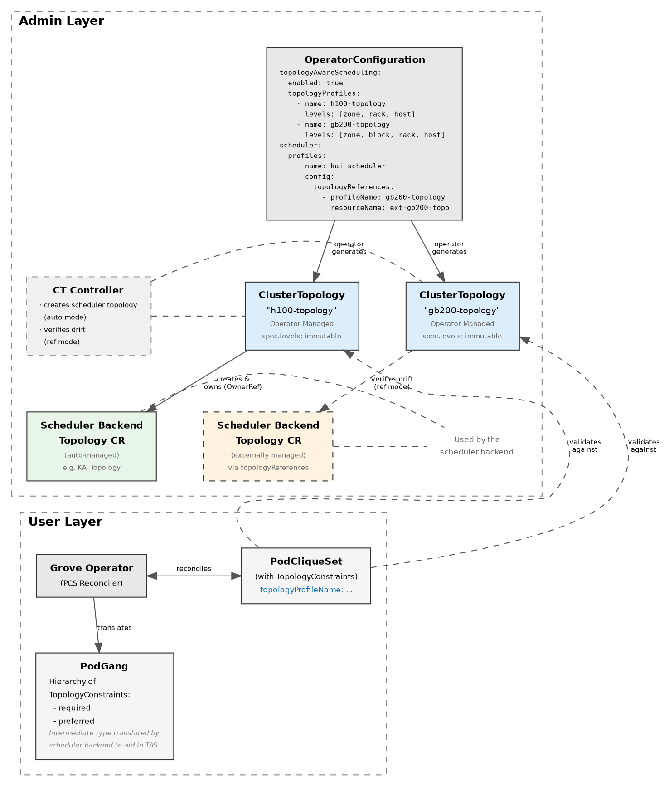
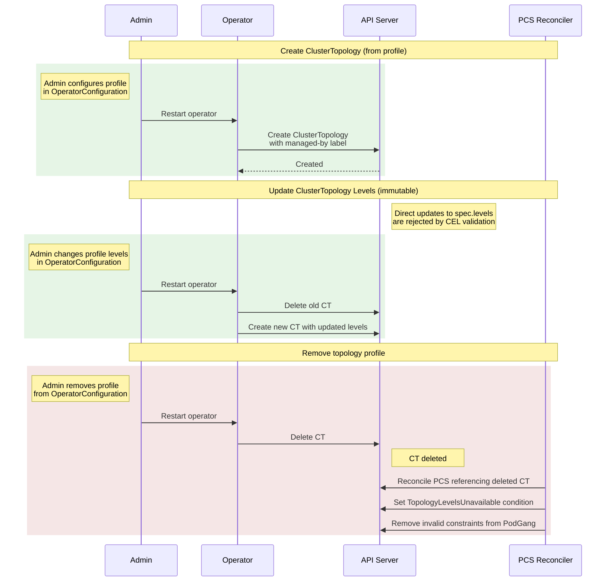

# GREP-244: Topology Aware Scheduling

<!-- toc -->
- [Summary](#summary)
- [Motivation](#motivation)
  - [Goals](#goals)
  - [Non-Goals](#non-goals)
- [Proposal](#proposal)
  - [User Stories](#user-stories)
    - [Story 1: Workload Portability](#story-1-workload-portability)
    - [Story 2: Disaggregated Inference Locality](#story-2-disaggregated-inference-locality)
    - [Story 3: NUMA-Aware GPU Benchmarking](#story-3-numa-aware-gpu-benchmarking)
    - [Story 4: Heterogeneous GPU Clusters](#story-4-heterogeneous-gpu-clusters)
    - [Story 5: Topology Retry Before Scheduling](#story-5-topology-retry-before-scheduling)
  - [Limitations/Risks &amp; Mitigations](#limitationsrisks--mitigations)
    - [Topology Constraints Only Guaranteed for Initial Deployment](#topology-constraints-only-guaranteed-for-initial-deployment)
    - [Operational Complexity](#operational-complexity)
    - [Topology Configuration Drift](#topology-configuration-drift)
    - [Topology Aware Cluster Autoscaling](#topology-aware-cluster-autoscaling)
    - [Workload Portability](#workload-portability)
    - [ClusterTopology Deletion](#clustertopology-deletion)
    - [Immutable Topology Levels](#immutable-topology-levels)
    - [Topology Profile Immutability After Scheduling](#topology-profile-immutability-after-scheduling)
- [Design Details](#design-details)
  - [Cluster Admin API](#cluster-admin-api)
    - [Topology Domains](#topology-domains)
    - [Validation](#validation)
    - [Operator Startup behavior](#operator-startup-behavior)
    - [Topology Configuration Updates](#topology-configuration-updates)
  - [ClusterTopology custom resource](#clustertopology-custom-resource)
    - [ClusterTopology Lifecycle](#clustertopology-lifecycle)
  - [Topology Constraints in PodCliqueSet](#topology-constraints-in-podcliqueset)
    - [Topology Profile Reference](#topology-profile-reference)
    - [Validation](#validation-1)
  - [PodGang: Scheduler API Enhancements](#podgang-scheduler-api-enhancements)
  - [Backward Compatibility](#backward-compatibility)
  - [Monitoring](#monitoring)
  - [Dependencies](#dependencies)
  - [Test Plan](#test-plan)
- [Alternatives](#alternatives)
  - [Hybrid Management: Operator-Managed Default + Admin-Created Topologies](#hybrid-management-operator-managed-default--admin-created-topologies)
<!-- /toc -->

## Summary

AI Inference workloads require low-latency data transfer between model layers or shards. Topology-aware placement of such workloads is critical to maximize performance on GPU scale-out clusters. This GREP proposes a unified topology model in Grove and introduces new API for users to define scheduling constraints that will guarantee topology optimized placement of their workloads.

In clusters with heterogeneous hardware, a single topology definition cannot accurately represent different interconnect hierarchies. This GREP also extends the topology API to support multiple named ClusterTopology resources created by the operator from configured topology profiles, enabling the cluster to be partitioned into segments with distinct topology hierarchies. Each ClusterTopology defines its own set of node label keys, so nodes matching one topology's labels are naturally separated from nodes matching another. Workloads select the appropriate partition via a topology profile reference on PodCliqueSet.

## Motivation

In multi-node disaggregated AI inference workloads, minimizing time-to-first-token (TTFT) and maximizing tokens per second (TPS) are key objectives. This requires optimal placement of prefills and decodes across Kubernetes nodes. These applications are highly sensitive to network latency and bandwidth, as model shards, leaders, and workers frequently exchange large volumes of data. Topology-aware scheduling is therefore essential to:

* Maximize network locality and leverage high-bandwidth interconnects.
* Minimize network hops between interdependent components.
* Co-locate related model shards within the same topology domain (rack/zone/host group).

Since different inference workloads have distinct communication patterns and packing needs, an advanced scheduler, such as KAI, is necessary to ensure topology optimized workload scheduling. Workload operators must be able to declaratively specify their topology and packing requirements when defining `PodCliqueSet`s. Combining expressive workload intent with topology-aware scheduling unlocks significant latency and throughput improvements for production-scale, multi-node LLM inference.

AI clusters often contain heterogeneous hardware with different interconnect characteristics. Each hardware type may require a distinct topology definition for optimal scheduling. For example, a cluster with both 3-level (zone > rack > host) DGX H100 nodes and 4-level (zone > block > rack > host) GB200 NVL72 racks cannot be accurately represented by a single topology definition. Supporting multiple ClusterTopology resources allows administrators to effectively split the cluster along hardware boundaries, where each topology definition captures the interconnect hierarchy of a specific hardware segment. This enables:

* **Cluster Partitioning by Hardware**: Each ClusterTopology defines its own node label keys, naturally partitioning the cluster into segments. Workloads targeting a specific topology are scheduled only on nodes that match that topology's labels.
* **Accurate Infrastructure Modeling**: Administrators can define topologies matching their actual hardware rather than forcing a single approximation across different interconnect hierarchies.
* **Workload Portability**: Users specify topology domains (e.g., "rack", "block") without embedding infrastructure-specific label keys into their workload definitions.

### Goals

* Define a uniform cluster topology model for any Kubernetes cluster across cloud providers and on-prem clusters.
* Enable cluster administrator to declaratively specify the cluster network topology (manually or auto-generated by a tool) as a startup configuration option for Grove operator.
* Extend the existing Grove declarative APIs to provide a way to define hierarchical topology pack constraints at `PodCliqueSet`, `PodCliqueScalingGroup` and `PodClique` levels.
* Enhance existing Grove scheduler APIs (`PodGang`) to translate user-defined topology constraints defined in `PodCliqueSet` to cluster-specific scheduling constraints.
* Automatically generate and synchronize relevant custom resources for the downstream schedulers that implement topology-aware-scheduling.
* Define a mechanism for creating multiple named ClusterTopology resources from configured topology profiles.
* Extend the PodCliqueSet API to reference a specific topology profile.

### Non-Goals

* Honoring defined pack constraints for scale-outs for any `Scale` subresource in a `PodCliqueSet`.
* Define and honor pack constraints for proportional scaling amongst scaling groups. For e.g. one wishes to proportionally scale decodes and prefills in a disaggregated inference workload and ensure that decodes and prefills for every such scale are packed optimally.
* Automatic topology discovery or inference from node labels.
* Dynamic topology switching for running workloads.
* Cross-topology scheduling within a single PodCliqueSet.

## Proposal



Grove implements topology-aware scheduling through a two-layer approach:

**Admin Layer:**
Grove defines a ClusterTopology CRD and manages the lifecycle of all ClusterTopology CRs. Administrators define one or more topology profiles in `OperatorConfiguration`, and the operator creates a `ClusterTopology` resource for each profile at startup. All ClusterTopologies are labeled with `app.kubernetes.io/managed-by: grove-operator` and are fully managed by the operator — manually created ClusterTopology resources are not recognized by Grove controllers.

The scheduling backend determines what additional resources it requires for topology-aware scheduling. For example, the KAI scheduler requires a `Topology` custom resource for each ClusterTopology. By default, the operator automatically creates the scheduler backend topology CR at startup with an `OwnerReference` to the corresponding ClusterTopology, ensuring cascade deletion.

Administrators who manage their own scheduler backend topology resources (e.g., created by an external tool or a separate team) can map topology profiles to existing resources via the scheduler profile's `topologyReferences` config in `OperatorConfiguration` (see [GREP-375](../375-scheduler-backend-framework/README.md)). When a topology profile has a corresponding entry in `topologyReferences`, the operator does not create the scheduler backend topology. Instead, it verifies that the referenced topology's levels match the ClusterTopology's levels and reports drift via a `SchedulerTopologyInSync` status condition (see [Scheduler Backend Topology](#scheduler-backend-topology)).

```yaml
# ClusterTopology created by operator from "h100-topology" profile
apiVersion: grove.io/v1alpha1
kind: ClusterTopology
metadata:
  name: h100-topology
  labels:
    app.kubernetes.io/managed-by: grove-operator
spec:
  levels:
    - domain: zone
      key: topology.kubernetes.io/zone
    - domain: rack
      key: topology.kubernetes.io/rack
    - domain: host
      key: kubernetes.io/hostname
---
# ClusterTopology created by operator from "gb200-topology" profile
apiVersion: grove.io/v1alpha1
kind: ClusterTopology
metadata:
  name: gb200-topology
  labels:
    app.kubernetes.io/managed-by: grove-operator
spec:
  levels:
    - domain: zone
      key: topology.kubernetes.io/zone
    - domain: block
      key: example.com/nvl-block
    - domain: rack
      key: example.com/nvlink-domain
    - domain: host
      key: kubernetes.io/hostname
```

**User Layer:**
Workload developers can specify topology constraints at three hierarchical levels (`PodCliqueSet`, `PodCliqueScalingGroup`, and `PodClique`) using domain names. They select which topology to use via the `topologyProfileName` field on PodCliqueSet, which is required when any `TopologyConstraint` is specified.

The operator validates these constraints against the referenced ClusterTopology using three key validation rules:

1. *Domain existence*: All topology domains referenced in workload's topology constraints must exist in the ClusterTopology CR. This ensures workloads only reference valid, configured topology levels.
2. *Topology Constraint Hierarchy*: Topology levels are ordered by their position in the ClusterTopology's levels array (index 0 = broadest scope). When topology constraints are hierarchically applied to a workload from PodCliqueSet → PodCliqueScalingGroup → PodClique, each level's constraints must reference a domain that is equal to or narrower (higher index) than the parent level's domain. A child resource cannot specify a broader topology domain than its parent. For example, if the referenced ClusterTopology defines levels `[zone, rack, host]` and the PodCliqueSet specifies `rack`, then PodCliqueScalingGroup can specify `rack` (equal) or `host` (narrower), but not `zone` (broader).
3. *Topology profile reference*: The `topologyProfileName` must reference an existing ClusterTopology. The reference can only be changed while no pods in the PCS are scheduled.

After validation, the operator translates the topology domain names (e.g., "rack", "host") into cluster-specific topology keys (e.g., "topology.kubernetes.io/zone", "kubernetes.io/hostname") using the referenced ClusterTopology and configures these hierarchical topology keys in the `PodGang` API. The `PodGang` serves as an intermediate representation that will eventually be mapped to the specific types that the configured scheduler backend understands. This abstraction allows workload portability across clusters with different topology configurations and scheduler implementations.

**Workload portability across clusters**

Grove, via `ClusterTopology`, allows administrators to define topology domain names (e.g. `rack`, `zone`, `host`) that abstract away infrastructure-specific node labels. Domain names are free-form strings — administrators choose names that describe their infrastructure hierarchy. Workloads specify topology constraints using these domain names, and the operator resolves them to the correct label keys for the target cluster. When different clusters use the same domain naming conventions, workloads can be migrated without changing their topology constraints.

### User Stories

#### Story 1: Workload Portability

As a cluster admin who manages multiple clusters, I would like a capability to configure `Grove` to use infrastructure provider specific node labels mapped to uniform topology domains, thus allowing migration of workloads across clusters without impacting the topology pack constraints defined on `PodCliqueSet` resources.

#### Story 2: Disaggregated Inference Locality

As an AI application developer running disaggregated inference workloads at scale, I need my multi-node prefill and decode tasks to be co-located within a high-performance network domain to minimize the KV cache transfer latency. Grove's topology model should allow me to specify my locality requirement as a scheduling constraint so that my application runs with deterministic performance.

#### Story 3: NUMA-Aware GPU Benchmarking

As a software developer of benchmarking applications, when I request only 2 GPUs from a 8-GPU node, I want the two GPUs to be allocated on the same NUMA node along with all the CPUs. This will optimize communication costs between the host and device resulting in benchmark performance improvements. On GPU generations before NVSwitch, this optimization is also critical to optimize GPU-GPU communication costs over NVLink.

#### Story 4: Heterogeneous GPU Clusters

As a cluster administrator managing a cluster with different GPU architectures, I want to define separate topologies for each architecture to partition the cluster into hardware-specific segments. Each topology captures the interconnect hierarchy of its hardware, and workloads targeting a specific topology are scheduled only on nodes whose labels match that topology's definitions.

For a concrete example with DGX H100 and GB200 NVL72 hardware demonstrating the H100 and GB200 paths, see [Story 4: Heterogeneous GPU Cluster Example](story-4-heterogeneous-gpu-example.md).

#### Story 5: Topology Retry Before Scheduling

As a user submitting a PodCliqueSet to a cluster with multiple scheduling shards, I want to be able to change the target topology while my workload is pending, so I can retry on a different shard if the first one cannot accommodate my gang. Once the gang starts running, the topology should be locked.

### Limitations/Risks & Mitigations

#### Topology Constraints Only Guaranteed for Initial Deployment

Topology-aware scheduling constraints are only guaranteed to be honored during the initial deployment of a PodCliqueSet. In several scenarios, these constraints may not be satisfied:

**Scale-Out scenarios:**

*Scale-Out of PodClique:*
This will result in creation of additional Pods. There is no guarantee that the topology constraints will be honoured for these additional Pods as that is subject to resource availability.

*Scale-Out of PodCliqueScalingGroup:*
This results in creation of a new `PodGang`. At present there is no way to correlate multiple `PodGang`s to KAI scheduler as belonging to a single PCS replica. If there is a topology constraint defined at the `PodCliqueSet` level, then without the association amongst `PodGang`s it is not possible to enforce that all Pods that are part of the correlated PodGangs respect the topology constraint defined for a `PodCliqueSet` replica.

Consider the following example:

```yaml
apiVersion: grove.io/v1alpha1
kind: PodCliqueSet
metadata:
  name: hierarchical-inference
spec:
  replicas: 2
  template:
    topologyProfileName: h100-topology
    topologyConstraint:
      packDomain: zone  # Each replica within a zone
    cliques:
      - name: p-leader
        topologyConstraint:
          packDomain: host  # Each leader on its own host
        spec:
          replicas: 2
      - name: p-worker
        spec:
          replicas: 4  # Workers spread across hosts in the rack
    podCliqueScalingGroups:
      - name: prefill
        topologyConstraint:
          packDomain: "block"
        replicas: 3
        minAvailable: 1
        cliqueNames:
          - p-worker
          - p-leader
```

In the above `PodCliqueSet` for replica indexes 1 and 2 (above the `minAvailable`) of `prefill` PodCliqueScalingGroup two new scaled `PodGang`s will be created. Each `PodGang` will have `p-leader` and `p-worker` PodClique Pods which should all be scheduled such that they are packed within topology domain `block`. However there is no guarantee that these `block` topology domains should be within the same `zone` (topology constraint on a PodCliqueSet replica) for a single PodCliqueSet replica.

**Pod Rescheduling Scenarios**

Pods have to rescheduled when:

* When there are higher priority pods which wish to use resources that are used by a lower priority workload Pods.
* Node failures or maintenance which causes pod evictions.
* Explicit deletion of Pods

Without resource reservation for `PodCliqueSet`, the scheduler cannot satisfy topology constraints since other workloads might consume the resources in preferred node-pod placements.

#### Operational Complexity

Providing a way to define cluster topology entails that the cluster administrators must:

* Understand the cluster network topology.
* Ensure that the nodes are correctly labeled with the topology information.
* Define appropriate topology profiles in `OperatorConfiguration` when configuring the `Grove` operator.

CEL validation on the CRD ensures that domain names and node label keys are unique within a ClusterTopology, and that no domain name collides with a key value. However, there is no way for `Grove` operator to ensure that the node labels mapped to each topology domain are in line with the ones actually present on nodes in the kubernetes cluster.

**Mitigation**

* Adequate documentation will be provided to the cluster administrators to help them properly configure topology profiles in `OperatorConfiguration`.
* Tools like [Topograph](https://github.com/NVIDIA/topograph) can be leveraged to automate discovery of cluster network topology and ensuring that topology levels are added as labels on Kubernetes Node(s).

#### Topology Configuration Drift

ClusterTopology levels are immutable after creation (enforced by CEL validation), so the levels of a running ClusterTopology cannot drift. However, when an administrator changes a topology profile's levels in `OperatorConfiguration` and restarts the operator, the operator deletes the existing ClusterTopology and creates a new one with the updated levels (see [Operator Startup behavior](#operator-startup-behavior)). Existing PodCliqueSets that referenced the old topology may now use topology domains that no longer exist in the new ClusterTopology.

**Mitigation:**

Grove operator will:

* Clearly reflect that one or more topology levels are no longer available by setting a `TopologyLevelsUnavailable` status condition on the respective `PodCliqueSet` resources (see [PodCliqueSet Status Conditions](#podcliqueset-status-conditions)).
* Remove invalid topology constraints from the `PodGang` resource(s) that are created for a `PodCliqueSet`.
* Ensure that the validating webhook rejects new `PodCliqueSet` resources that reference topology domains not present in the referenced ClusterTopology.

#### Topology Aware Cluster Autoscaling

When there are insufficient nodes to gang schedule PodGangs created from a PodCliqueSet, cluster autoscalers need to provision additional nodes. However, there is currently *no support from any cluster autoscaling solution* to launch nodes that would match the topology-aware scheduling (TAS) constraints defined within a PodGang. Underline reason is that no public cloud provider today provides APIs offering an ability to specify preferences on topology placements when launching instances. In addition none of the existing cluster autoscaling solutions (CA - [Issue#8783](https://github.com/kubernetes/autoscaler/issues/8783), Karpenter) have first class support for gang scheduled pod groups.

*Impact:* `PodGang`'s with strict topology constraints may remain unscheduled indefinitely.

**Mitigation**

There are ways in which you can either minimize the need for on-demand scaling or reduce the risk of pods remaining in pending state.

* Leverage cloud provider capabilities

  * AWS provides [Cluster Placement Groups](https://docs.aws.amazon.com/AWSEC2/latest/UserGuide/placement-groups.html)
  * GCP provides [Compact Placement Policies](https://docs.cloud.google.com/compute/docs/instances/use-compact-placement-policies)
  * Azure provides [Proximity Placement Groups](https://learn.microsoft.com/en-us/azure/virtual-machines/co-location)

  However these might not always give you the best packing as they only offer best-effort placement of newly launched nodes. So the best bet is to club placement policies with capacity reservation.

#### Workload Portability

`PodCliqueSet` with strict topology constraints may not always be portable across clusters which are created with different topology configurations. For example: A workload requiring "block" level packing may fail on a cluster that does not define this topology level.

**Mitigation**

Validating webhook for `PodCliqueSet` will reject resources that are created with unsupported topology constraints.

#### ClusterTopology Deletion

When an administrator removes a topology profile from `OperatorConfiguration` and restarts the operator, the operator deletes the corresponding ClusterTopology. If PodCliqueSets still reference the deleted topology, the PCS reconciler detects this and sets the `TopologyLevelsUnavailable` condition to `Unknown` with reason `ClusterTopologyNotFound`. Invalid topology constraints are removed from the PodGang resources created for those PodCliqueSets.

**Mitigation**

* Administrators should migrate or delete PodCliqueSets that reference a topology before removing its profile from `OperatorConfiguration`. The kubectl query described in [Monitoring](#monitoring) identifies which PodCliqueSets reference a given topology.
* The `TopologyLevelsUnavailable` condition on affected PodCliqueSets clearly surfaces which workloads lost their topology configuration.

#### Immutable Topology Levels

A ClusterTopology's `spec.levels` field is immutable after creation, enforced by a CEL validation rule (`self == oldSelf`) on the CRD. This matches the immutability contract of the downstream KAI `Topology` CR and eliminates the risk of topology changes invalidating in-flight scheduling decisions. Metadata changes (labels, annotations) are not affected.

**Mitigation**

* To change a topology's levels, administrators update the profile in `OperatorConfiguration` and restart the operator. The operator handles the delete+recreate workflow automatically. If existing PodCliqueSets referenced domains that no longer exist in the new topology, the PCS reconciler sets the `TopologyLevelsUnavailable` condition and removes invalid constraints from PodGang resources. This delete+recreate workflow is consistent with the KAI scheduler's topology update model.

#### Topology Profile Immutability After Scheduling

The `topologyProfileName` field on a PodCliqueSet becomes immutable once any pod in the PCS has been scheduled (bound to a node). The scheduler has already made placement decisions based on the referenced topology, and changing the topology reference after scheduling would invalidate those decisions. Users can change `topologyProfileName` freely while all pods are still pending, supporting the topology retry use case (Story 5).

**Mitigation**

* This restriction only applies after pods are scheduled. Users who need to change the topology reference for a running workload can delete the PodCliqueSet and recreate it with the desired topology. The pending-state flexibility supports the common case of retrying on a different topology when the first choice cannot accommodate the gang.

## Design Details

> NOTE: For brevity we will refer to topology aware scheduling as `TAS`.

### Cluster Admin API

Topology profiles and scheduler backend topology mappings are defined by a cluster admin as part of `OperatorConfiguration`. Each named topology profile results in a `ClusterTopology` CR managed by the operator at startup. Scheduler backend topology mappings are defined inside each scheduler profile's backend-specific config (see [GREP-375: Scheduler Backend Framework](../375-scheduler-backend-framework/README.md)).

```go
// TopologyAwareSchedulingConfiguration defines the configuration for topology-aware scheduling.
type TopologyAwareSchedulingConfiguration struct {
	// Enabled indicates whether topology-aware scheduling is enabled.
	Enabled bool `json:"enabled"`
	// TopologyProfiles is a list of named topology profiles.
	// Each profile defines a set of topology levels and results in a ClusterTopology CR managed by the operator.
	// +optional
	TopologyProfiles []TopologyProfile `json:"topologyProfiles,omitempty"`
}

// TopologyProfile defines a named topology profile with an ordered set of topology levels.
type TopologyProfile struct {
	// Name is the unique identifier for this profile.
	// It becomes the name of the corresponding ClusterTopology CR.
	// +required
	Name string `json:"name"`
	// Levels is an ordered list of topology levels from broadest to narrowest scope.
	// +required
	Levels []corev1alpha1.TopologyLevel `json:"levels"`
}
```

Scheduler backend topology references are configured inside each `SchedulerProfile.Config` (GREP-375). For the KAI scheduler, this extends the backend-specific config:

```go
// KaiSchedulerConfig holds the configuration for the KAI scheduler backend.
// This is deserialized from SchedulerProfile.Config (runtime.RawExtension) when Name == "kai-scheduler".
type KaiSchedulerConfig struct {
	// TopologyReferences maps topology profile names to KAI Topology CR names.
	// Each entry tells the operator which KAI Topology CR corresponds to a given topology profile.
	// +optional
	TopologyReferences []TopologyReference `json:"topologyReferences,omitempty"`
}

// TopologyReference maps a topology profile to a scheduler backend's topology resource.
type TopologyReference struct {
	// ProfileName is the name of the topology profile (must match a TopologyProfile.Name).
	// +required
	ProfileName string `json:"profileName"`
	// ResourceName is the name of the scheduler backend's topology resource (e.g., KAI Topology CR name).
	// +required
	ResourceName string `json:"resourceName"`
}
```

Example `OperatorConfiguration` (shows TAS and scheduler configuration):
```yaml
apiVersion: operator.config.grove.io/v1alpha1
kind: OperatorConfiguration
...
topologyAwareScheduling:
  enabled: true
  topologyProfiles:
    - name: h100-topology
      levels:
        - domain: zone
          key: "topology.kubernetes.io/zone"
        - domain: rack
          key: "topology.kubernetes.io/rack"
        - domain: host
          key: "kubernetes.io/hostname"
    - name: gb200-topology
      levels:
        - domain: zone
          key: "topology.kubernetes.io/zone"
        - domain: block
          key: "example.com/nvl-block"
        - domain: rack
          key: "example.com/nvlink-domain"
        - domain: host
          key: "kubernetes.io/hostname"
scheduler:
  profiles:
    - name: "kai-scheduler"
      default: true
      config:
        topologyReferences:
          - profileName: h100-topology
            resourceName: h100-kai-topology
          - profileName: gb200-topology
            resourceName: gb200-kai-topology
```

> NOTE: The above values for `key` are examples and will differ across infrastructure providers. The `topologyReferences` in each scheduler profile's config map topology profiles to the scheduler backend's topology resource names.

#### Topology Domains

Topology domain names are free-form strings that administrators choose to describe their infrastructure hierarchy. The order of levels in the ClusterTopology's `levels` array defines the hierarchy: index 0 is the broadest scope, and each subsequent level is narrower. A ClusterTopology can have up to 16 levels.

Grove provides the following well-known domain conventions as a recommendation for common deployments, but any domain name matching the pattern `^[a-z][a-z0-9-]*$` is valid:

| Domain       | Description                                         |
| ------------ | --------------------------------------------------- |
| `region`     | Cloud provider region                               |
| `zone`       | Availability zone within a region                   |
| `datacenter` | Physical data center within a zone                  |
| `block`      | Large switching block or network segment            |
| `rack`       | Physical rack containing multiple hosts             |
| `host`       | Individual host (virtual/server)                    |
| `numa`       | NUMA (Non-Uniform Memory Access) node within a host |

Using a consistent set of domain names across clusters enables workload portability — the same `PodCliqueSet` can be deployed on different clusters without changing its topology constraints, as long as each cluster's ClusterTopology maps those domain names to the correct infrastructure-specific node labels. Across `GCP`, `AWS` and `Azure` the network topology node labels differ, so the `ClusterTopology` CR maps these uniform domain names to infrastructure provider specific node labels.

#### Validation

`OperatorConfiguration` is validated upon starting of `Grove` operator. If `TopologyAwareScheduling.Enabled` is true, then following is checked:

* At least one `TopologyProfile` must be defined.
* Each `TopologyProfile` must have a unique name.
* Within each profile, at least one `TopologyLevel` must be set.
* Within each profile, each `TopologyLevel` must be unique — neither the domain nor the key should be duplicated.
* Each `TopologyReference.ProfileName` in any scheduler profile's config must match a defined `TopologyProfile.Name`.

Additional CEL validation on the ClusterTopology CRD ensures that no domain name collides with any key value (prevents ambiguity for scheduler backends).

> NOTE: There is no validation done for `TopologyLevel.Key` (which is a node label) as that can be different across cloud providers and on-prem data centers.

If any of the validation fails then the operator will exit with a non-zero error code and an appropriate error message which will be visible in the logs of the operator `Pod`.

#### Operator Startup behavior

When `Grove` operator starts, it checks if TAS is enabled.

**TAS is enabled**

* Validate TAS configuration.

* For each topology profile in `TopologyAwareScheduling.TopologyProfiles`:
  * Ensure a `ClusterTopology` custom resource exists with the profile's name and levels. Since `spec.levels` is immutable, the operator cannot update an existing ClusterTopology's levels directly. If an existing ClusterTopology's levels differ from the profile, the operator deletes it and creates a new one. All operator-managed ClusterTopologies are labeled with `app.kubernetes.io/managed-by: grove-operator`. If the levels match, the operator updates only metadata (e.g., labels) if needed.

* For each topology profile that is **not** referenced in any scheduler backend's `topologyReferences` config:
  * Automatically create the corresponding scheduler backend topology CR if it does not exist. For the KAI scheduler, this means creating a `Topology` CR with an `OwnerReference` to the corresponding ClusterTopology. When the operator deletes and recreates a ClusterTopology due to level changes, the scheduler backend topology is cascade-deleted via the `OwnerReference` and then recreated alongside the new ClusterTopology.
* For each topology profile that **is** referenced in a scheduler backend's `topologyReferences` config:
  * The named scheduler backend topology resource is assumed to be externally managed. The operator does not create it. Drift detection is handled by the ClusterTopology controller (see [Scheduler Backend Topology](#scheduler-backend-topology)).

* Delete any ClusterTopology resources that are labeled `app.kubernetes.io/managed-by: grove-operator` but do not correspond to any configured profile. If PodCliqueSets still reference a deleted topology, the PCS reconciler sets the `TopologyLevelsUnavailable` condition at runtime.

If any of the create/delete of `ClusterTopology` CR or scheduler backend topology CR fails, the operator exits with a non-zero exit code and a clear message indicating the issue.

**TAS is disabled**

* Delete all `ClusterTopology` CRs that are labeled `app.kubernetes.io/managed-by: grove-operator`. Because the scheduler backend topology CRs are owned by their respective `ClusterTopology` CRs (via `OwnerReference`), they will be cascade-deleted when the ClusterTopology is deleted. If PodCliqueSets still reference a deleted topology, the PCS reconciler sets the `TopologyLevelsUnavailable` condition at runtime.

**Only operator-managed ClusterTopologies are recognized.** Grove controllers (PCS reconciler, ClusterTopology controller, PCS validating webhook) only operate on ClusterTopology resources that carry the `app.kubernetes.io/managed-by: grove-operator` label. Manually created ClusterTopology resources without this label are ignored — PodCliqueSets cannot reference them, and the operator will not create scheduler backend topology resources for them.

#### Topology Configuration Updates

`OperatorConfiguration` is mounted as an immutable `ConfigMap` to the operator. To make any changes to the TAS configuration via `OperatorConfiguration`, the `Grove` operator needs to be restarted with the changed `OperatorConfiguration`.

On restart, the operator reconciles all ClusterTopology resources to match the configured profiles:

* New profiles result in new ClusterTopology CRs.
* Profiles with changed levels cause a delete+recreate of the corresponding ClusterTopology (see [Operator Startup behavior](#operator-startup-behavior)).
* Removed profiles cause deletion of the corresponding ClusterTopology CRs. If PodCliqueSets still reference the deleted topology, the PCS reconciler sets the `TopologyLevelsUnavailable` condition (see [ClusterTopology Lifecycle](#clustertopology-lifecycle)).

### ClusterTopology custom resource

`ClusterTopology` is a custom resource that defines an ordered list of topology levels from largest to smallest network distance. Each `TopologyLevel` is a pair of topology domain and a node label key specific for the infrastructure provider.

ClusterTopology Go API:

```go
// TopologyDomain represents a topology level identifier.
// Domain names are free-form strings that administrators define to match their infrastructure.
// Well-known conventions include: region, zone, datacenter, block, rack, host, numa.
type TopologyDomain string

// +kubebuilder:object:root=true
// +kubebuilder:resource:scope=Cluster,shortName=ct
// +kubebuilder:subresource:status

// ClusterTopology defines the topology hierarchy for the cluster.
type ClusterTopology struct {
    metav1.TypeMeta   `json:",inline"`
    metav1.ObjectMeta `json:"metadata,omitempty"`
    Spec   ClusterTopologySpec   `json:"spec"`
    Status ClusterTopologyStatus `json:"status,omitempty"`
}

// ClusterTopologySpec defines the topology hierarchy specification.
type ClusterTopologySpec struct {
    // Levels is an ordered list of topology levels from broadest to narrowest scope.
    // The order in this list defines the hierarchy (index 0 = broadest level).
    // +kubebuilder:validation:MinItems=1
    // +kubebuilder:validation:MaxItems=16
    // +kubebuilder:validation:XValidation:rule="self == oldSelf",message="field is immutable"
    // +kubebuilder:validation:XValidation:rule="self.all(x, self.filter(y, y.domain == x.domain).size() == 1)",message="domain must be unique across all levels"
    // +kubebuilder:validation:XValidation:rule="self.all(x, self.filter(y, y.key == x.key).size() == 1)",message="key must be unique across all levels"
    // +kubebuilder:validation:XValidation:rule="!self.exists(a, self.exists(b, a.domain == b.key))",message="domain names must not collide with key values"
    Levels []TopologyLevel `json:"levels"`
}

type TopologyLevel struct {
    // Domain is a topology level identifier used in TopologyConstraint references.
    // Administrators can use any name that describes their infrastructure hierarchy.
    // Well-known conventions: region, zone, datacenter, block, rack, host, numa
    // +kubebuilder:validation:Required
    // +kubebuilder:validation:MinLength=1
    // +kubebuilder:validation:MaxLength=63
    // +kubebuilder:validation:Pattern=`^[a-z][a-z0-9-]*$`
    Domain TopologyDomain `json:"domain"`

    // Key is the node label key that identifies this topology domain.
    // Must be a valid Kubernetes qualified label key.
    // Examples: "topology.kubernetes.io/zone", "kubernetes.io/hostname"
    // +kubebuilder:validation:Required
    // +kubebuilder:validation:MinLength=1
    // +kubebuilder:validation:MaxLength=316
    // +kubebuilder:validation:Pattern=`^(([A-Za-z0-9][-A-Za-z0-9_.]*)?[A-Za-z0-9]/)?([A-Za-z0-9][-A-Za-z0-9_.]*)?[A-Za-z0-9]$`
    Key string `json:"key"`
}

// ClusterTopologyStatus defines the observed state of a ClusterTopology.
type ClusterTopologyStatus struct {
    // Conditions represent the latest available observations of the ClusterTopology's state.
    // +optional
    Conditions []metav1.Condition `json:"conditions,omitempty"`
}
```

The `SchedulerTopologyInSync` condition on `ClusterTopologyStatus` reports the state of the scheduler backend topology for profiles that are referenced in a scheduler backend's `topologyReferences` config:

| Status    | Reason                    | Description                                                                         |
| --------- | ------------------------- | ------------------------------------------------------------------------------------ |
| `True`    | `InSync`                  | The scheduler backend topology levels match the ClusterTopology levels               |
| `False`   | `Drift`                   | The scheduler backend topology levels do not match the ClusterTopology levels        |
| `Unknown` | `TopologyNotFound`        | The referenced scheduler backend topology resource was not found                     |

When the topology profile is not referenced in any scheduler backend's `topologyReferences`, the operator auto-manages the scheduler backend topology and does not set this condition.

#### ClusterTopology Lifecycle

ClusterTopology resources are cluster-scoped and define the mapping between topology domain names and infrastructure-specific node labels. Their lifecycle is fully managed by the operator from topology profiles configured in `OperatorConfiguration`.

**Creation**

The operator creates a ClusterTopology for each topology profile at startup. All ClusterTopologies are labeled with `app.kubernetes.io/managed-by: grove-operator`. Manually created ClusterTopology resources without this label are not recognized by Grove controllers.

**Updates**

A ClusterTopology's `spec.levels` field is immutable after creation, enforced by a CEL validation rule (`self == oldSelf`). This matches the immutability contract of the downstream KAI `Topology` CR and eliminates the need for a validating webhook to guard against unsafe level modifications. Metadata changes (labels, annotations) are not affected. To change a topology's levels, administrators update the profile in `OperatorConfiguration` and restart the operator — the operator handles the delete+recreate automatically (see [Topology Configuration Drift](#topology-configuration-drift)).

**Deletion**

When the operator deletes a ClusterTopology (due to profile removal or TAS being disabled), the deletion proceeds immediately. If PodCliqueSets still reference the deleted topology, the PCS reconciler detects this at runtime and sets the `TopologyLevelsUnavailable` condition to `Unknown` with reason `ClusterTopologyNotFound`. Invalid topology constraints are removed from the PodGang resources created for those PodCliqueSets.



**Scheduler Backend Topology**

The operator manages the relationship between each ClusterTopology and its corresponding scheduler backend topology resource (e.g., KAI `Topology` CR). The behavior depends on whether the topology profile is referenced in a scheduler profile's backend-specific `topologyReferences` config:

*Auto-managed (profile not in `topologyReferences`):* When a topology profile has no corresponding entry in any scheduler backend's `topologyReferences`, the operator automatically creates and manages the scheduler backend topology CR with an `OwnerReference` to the ClusterTopology. For the KAI scheduler, this means creating a `Topology` CR with the same name as the ClusterTopology. Since both the ClusterTopology and KAI Topology have immutable levels, the operator only needs to handle creation and deletion — no update path is needed. When the ClusterTopology is deleted, the scheduler backend topology is cascade-deleted via the `OwnerReference`.

*Referenced (profile in `topologyReferences`):* When a topology profile has a corresponding entry in a scheduler backend's `topologyReferences`, the named scheduler backend topology resource is assumed to be externally managed. The operator does not create, update, or delete the referenced topology. Instead, it compares the referenced topology's levels against the ClusterTopology's levels and sets a `SchedulerTopologyInSync` status condition:

* `True` (InSync) — the scheduler backend topology levels match the ClusterTopology levels
* `False` (Drift) — the levels do not match; the condition message describes the mismatch
* `Unknown` (TopologyNotFound) — the referenced scheduler backend topology resource was not found

### Topology Constraints in PodCliqueSet

`PodCliqueSet` API has been enhanced, allowing users to specify topology constraints. A new type `TopologyConstraint` has been introduced which allows users to define `required` topology constraints that must be satisfied for the scheduling to succeed.

```go
// TopologyConstraint defines topology placement requirements.
type TopologyConstraint struct {
	// PackDomain specifies the topology domain for grouping replicas.
	// Must reference a domain defined in the ClusterTopology's levels.
	// Controls placement constraint for EACH individual replica instance.
	// Example: "rack" means each replica independently placed within one rack.
	// Note: Does NOT constrain all replicas to the same rack together.
	// Different replicas can be in different topology domains.
	PackDomain TopologyDomain `json:"packDomain"`
}
```

`TopologyConstraint` can be specified at three levels:

At `PodCliqueSet` you can set the constraints using:

```go
// PodCliqueSetTemplateSpec defines a template spec for a PodGang.
// A PodGang does not have a RestartPolicy field because the restart policy is predefined:
// If the number of pods in any of the cliques falls below the threshold, the entire PodGang will be restarted.
// The threshold is determined by either:
// - The value of "MinReplicas", if specified in the ScaleConfig of that clique, or
// - The "Replicas" value of that clique
type PodCliqueSetTemplateSpec struct {
  ...
  	// TopologyConstraint defines topology placement requirements for PodCliqueSet.
	// +optional
	TopologyConstraint *TopologyConstraint `json:"topologyConstraint,omitempty"`
  ...
}
```

At `PodCliqueScalingGroup` level you can set the topology constraint using:

```go
// PodCliqueScalingGroupConfig is a group of PodClique's that are scaled together.
// Each member PodClique.Replicas will be computed as a product of PodCliqueScalingGroupConfig.Replicas and PodCliqueTemplateSpec.Spec.Replicas.
// NOTE: If a PodCliqueScalingGroupConfig is defined, then for the member PodClique's, individual AutoScalingConfig cannot be defined.
type PodCliqueScalingGroupConfig struct {
  ...
  // TopologyConstraint defines topology placement requirements for PodCliqueScalingGroup.
	// Must be equal to or stricter than parent PodCliqueSet constraints.
	// +optional
	TopologyConstraint *TopologyConstraint `json:"topologyConstraint,omitempty"`
  ...
}
```

`TopologyConstraint` defined at the `PodCliqueScalingGroup` level should be:

* Equal to or lower than the one that is defined at `PodCliqueSet` level.
* Equal to or higher than the constraints defined for each constituent `PodClique`.

At `PodClique` level you can set the topology constraint using:

```go
// PodCliqueTemplateSpec defines a template spec for a PodClique.
type PodCliqueTemplateSpec struct {
  ...
  // TopologyConstraint defines topology placement requirements for PodClique.
	// Must be equal to or stricter than parent resource constraints.
	// +optional
	TopologyConstraint *TopologyConstraint `json:"topologyConstraint,omitempty"`
  ...
}
```

`TopologyConstraint` defined at the `PodClique` level should be lower than or equal to the ones defined for the parent resources a.k.a (`PodCliqueScalingGroup` and `PodCliqueSet`).

Example PodCliqueSet with topology constraints (For brevity many parts of the PodCliqueSet spec has been omitted):

```yaml
apiVersion: grove.io/v1alpha1
kind: PodCliqueSet
metadata:
  name: disaggregated-inference
spec:
  replicas: 1
  template:
    topologyProfileName: h100-topology
    topologyConstraint:
      packDomain: "zone"
    cliques:
      - name: router
        topologyConstraint:
          packDomain: "block"
        spec:
          roleName: router
          replicas: 1
          podSpec:
            ...
      - name: p-leader
        topologyConstraint:
          packDomain: "rack"
        spec:
          roleName: prefill-leader
          replicas: 1
          podSpec:
            ...
      - name: p-worker
        topologyConstraint:
          packDomain: "rack"
        spec:
          roleName: prefill-worker
          replicas: 4
          podSpec:
            ...
      - name: d-leader
        topologyConstraint:
          packDomain: "rack"
        spec:
          roleName: decode-leader
          replicas: 1
          podSpec:
            ...
      - name: d-worker
        topologyConstraint:
          packDomain: "rack"
        spec:
          roleName: decode-worker
          replicas: 2
          podSpec:
            ...
    podCliqueScalingGroups:
      - name: prefill
        topologyConstraint:
          packDomain: "block"
        replicas: 2
        minAvailable: 1
        cliqueNames:
          - p-worker
          - p-leader
      - name: decode
        topologyConstraint:
          packDomain: "rack"
        replicas: 2
        minAvailable: 1
        cliqueNames:
          - d-worker
          - d-leader
```

The above example is only a representation of how users can set topology constraints at different levels to control how the pods are going to be packed during the initial deployment.

#### Topology Profile Reference

A new field `topologyProfileName` is added to `PodCliqueSetTemplateSpec`, alongside the existing `topologyConstraint` field. It is required whenever any `TopologyConstraint` is specified in the PCS:

```go
type PodCliqueSetTemplateSpec struct {
    // ... existing fields ...

    // TopologyProfileName is the name of the topology profile (and corresponding ClusterTopology resource)
    // to use for topology-aware scheduling. Required when any TopologyConstraint is specified.
    // +optional
    TopologyProfileName string `json:"topologyProfileName,omitempty"`

    // TopologyConstraint defines topology placement requirements for PodCliqueSet.
    // +optional
    TopologyConstraint *TopologyConstraint `json:"topologyConstraint,omitempty"`

    // ... existing fields ...
}
```

**Example YAML:**

```yaml
apiVersion: grove.io/v1alpha1
kind: PodCliqueSet
metadata:
  name: my-inference
spec:
  template:
    topologyProfileName: gb200-topology    # must match a configured topology profile name
    topologyConstraint:
      packDomain: rack
    cliques:
      - name: worker
        # ...
```

#### Validation

Existing validating webhook which validates `PodCliqueSet`, has been enhanced to additionally check topology constraints.

*Rule-1: Check for supported TopologyDomains*

* All topology domains that are referenced in the `PodCliqueSet` must be amongst the defined topology levels in the ClusterTopology referenced by `topologyProfileName`. If a non-supported topology domain is found then creation of the `PodCliqueSet` will be rejected.
* Topology domains for an already deployed `PodCliqueSet` cannot be changed. Validating webhook will reject such updates on the `PodCliqueSet`.

*Rule-2: Check for Hierarchical strictness*

As you traverse down the resource hierarchy (PodCliqueSet → PodCliqueScalingGroup → PodClique), topology constraint levels must become equal or narrower (higher index in the ClusterTopology's levels array). A child resource cannot specify a broader topology domain than its parent. If this rule is violated, then the creation of the `PodCliqueSet` will be rejected by the validating webhook.

> NOTE: The hierarchy is determined by the position of domains in the referenced ClusterTopology's levels array, not by a fixed global order. The examples below assume a ClusterTopology with levels ordered as `[zone, block, rack, host, numa]`.

Example:

| Parent | Child   | Valid? | Reason                                                       |
| ------ | ------- | ------ | ------------------------------------------------------------ |
| `rack` | `host`  | ✅ Yes  | `host` is narrower (higher index) than `rack`                |
| `rack` | `rack`  | ✅ Yes  | Equal is allowed                                             |
| `rack` | `numa`  | ✅ Yes  | `numa` is the narrowest (highest index)                      |
| `host` | `rack`  | ❌ No   | `rack` is broader (lower index) than `host`                  |
| `zone` | `block` | ✅ Yes  | `block` is narrower than `zone`                              |

*Rule-3: Topology profile reference validation*

* On create: `topologyProfileName` must be set and the referenced ClusterTopology must exist
* Reject if any `TopologyConstraint` is set (at PCS, PCSG, or PodClique level) without `topologyProfileName`
* On update: if `topologyProfileName` is changed, the new ClusterTopology must exist and no pod in the PCS may be scheduled (`ScheduledReplicas == 0` across all PodCliques)
* Reject if `topologyProfileName` is set but TAS is disabled cluster-wide
* Reject if any `TopologyConstraint` is set (at PCS, PCSG, or PodClique level) but TAS is disabled cluster-wide

Rules 1 and 2 apply to `TopologyConstraint` fields. Rule-3 validates the `topologyProfileName` reference. Together, these three rules ensure that workloads can only reference valid topology levels, maintain logical topology nesting throughout the resource hierarchy, and target an existing operator-managed ClusterTopology.

### PodGang: Scheduler API Enhancements

Grove operator translates the hierarchical topology constraints to infrastructure specific node labels in the `PodGang` scheduler API. The operator resolves the topology as follows:
* PCS has `TopologyConstraint` set → `topologyProfileName` is required; resolve the ClusterTopology by that name
* PCS has no `TopologyConstraint` at any level → topology does not apply

The following additional types have been defined to capture the topology constraints. Provision has been made to capture:

* `Required` topology constraints which are hard requirements for the scheduler to consider.  These constraints are guaranteed to be satisfied.
* `Preferred` topology constraints are soft requirements and often point to the best possible packing that can be achieved.

```go
// TopologyConstraint defines topology packing constraints with required and preferred levels.
type TopologyConstraint struct {
	// PackConstraint defines topology packing constraint with required and preferred levels.
	// Operator translates user's level name to corresponding topologyKeys.
	// +optional
	PackConstraint *TopologyPackConstraint `json:"packConstraint,omitempty"`
}

// TopologyPackConstraint defines a topology packing constraint.
// Each of Required and Preferred fields hold a topologyKey, e.g. "kubernetes.io/hostname" ( these are key of labels added on nodes).
type TopologyPackConstraint struct {
	// Required defines a topology constraint that must be satisfied as a hard requirement. The workload will not be
	// scheduled if this constraint cannot be satisfied. Generally, it is easier for the scheduler to satisfy constraints
	// on topology domains with larger compute capacity, (e.g. zone or datacenter), than smaller domains, (e.g. host or
	// numa). Holds topologyKey (not level name) translated from user's packLevel specification.
	// Example: "topology.kubernetes.io/rack"
	// +optional
	Required *string `json:"required,omitempty"`
	// Preferred defines best-effort topology constraint. Topology domains that provide the most optimized performance
	// with dense packing (e.g. host or numa) are typically used as preferred constraints for topology packing. It might be
	// harder to satisfy these constraints if the topology domains are limited in compute  capacity. Since it is preferred
	// constraint, it is therefore not binding on the scheduler to mandatorily satisfy this packing constraint. Scheduler
	// can fall back to higher topology levels (upto Required constraint) if preferred cannot be satisfied.
	// Example: "kubernetes.io/hostname"
	// +optional
	Preferred *string `json:"preferred,omitempty"`
}
```

`TopologyConstraint`s can be defined at multiple levels:

**PodGangSpec.TopologyConstraint**

This is the top level constraint defined at the `PodGang` level that applies to all the `PodGroup`s in the `PodGang`.  We have two variants of `PodGang`s:

* `PodGang` that comprises of minimum number of replicas across all standalone `PodClique` and `PodCliqueScalingGroup`s that together make a workload functional. At present we also name this as the `base` PodGang. For the base PodGang, `TopologyConstraint` is the value of `PodCliqueSetTemplateSpec.TopologyConstraint` (`spec.template.topologyConstraint`)
* `PodGang`that is created for every replica of `PodCliqueScalingGroup` above the `minAvailable` as specified in `spec.template.podCliqueScalingGroups[x].minAvailable`. At present we call these as `scaled` PodGang. For the scaled PodGang, `TopologyConstraint` is the value of `PodCliqueScalingGroupConfig.TopologyConstraint` (`spec.template.podCliqueScalingGroups[x].topologyConstraint`).
  * In case there is no topology constraint defined at `spec.template.podCliqueScalingGroups[x].topologyConstraint` then it will inherit the topology constraint  defined at `spec.template.topologyConstraint` if defined.


**PodGangSpec.TopologyConstraintGroupConfigs**

Users can define topology constraints that are applied for all constituent `PodClique`s in a `PodCliqueScalingGroup` (`spec.template.podCliqueScalingGroups[x].topologyConstraint`).

> NOTE: This field is used only for `Base` PodGangs. For `Scaled` PodGangs this will be empty.


**PodGroup.TopologyConstraint**

Users can define topology constraints at the `PodClique` level (`spec.template.cliques[x].topologyConstraint`) This will be captured in `PodGroup.TopologyConstraint`.

```go
// PodGangSpec defines the specification of a PodGang.
type PodGangSpec struct {
	// PodGroups is a list of member pod groups in the PodGang.
	PodGroups []PodGroup `json:"podgroups"`
	// TopologyConstraint defines topology packing constraints for entire pod gang.
	// This is the top level topology constraint that applies to all PodGroups in the PodGang.
	// Updated by operator on each reconciliation when PodCliqueSet topology constraints change.
	// +optional
	TopologyConstraint *TopologyConstraint `json:"topologyConstraint,omitempty"`
	// TopologyConstraintGroupConfigs defines TopologyConstraints for a strict subset of PodGroups.
	// +optional
	TopologyConstraintGroupConfigs []TopologyConstraintGroupConfig `json:"topologyConstraintGroupConfigs,omitempty"`
  ...
}

// PodGroup defines a set of pods in a PodGang that share the same PodTemplateSpec.
type PodGroup struct {
	// Name is the name of the PodGroup.
	Name string `json:"name"`
  ...
	// TopologyConstraint defines topology packing constraints for this PodGroup.
	// Enables PodClique-level topology constraints.
	// Updated by operator when PodClique topology constraints change.
	// +optional
	TopologyConstraint *TopologyConstraint `json:"topologyConstraint,omitempty"`
}

```

### Backward Compatibility

TAS is a new feature with no existing production users, so strict backward compatibility is not required at this stage. The API can evolve to the right design without being constrained by prior deployments.

The addition of multiple ClusterTopology resources and the `topologyProfileName` field changes the topology reference model from the single-topology design. Existing PodCliqueSets that use topology constraints will require a `topologyProfileName` field to be added. Existing PodCliqueSets without topology constraints are unaffected.

### Monitoring

**Topology usage overview**

Understanding which topologies are in use is important before attempting deletions. Administrators can list which PodCliqueSets reference each ClusterTopology using kubectl:

```bash
# List all PCSs grouped by their topology profile reference
kubectl get podcliquesets -A -o json | jq -r '
  .items[]
  | {
      name: .metadata.name,
      namespace: .metadata.namespace,
      topology: (.spec.template.topologyProfileName // "<none>")
    }
  | [.topology, .namespace + "/" + .name]
  | @tsv
' | sort | column -t
```

Example output:
```
gb200-topology   ml-team/inference-llama-405b
gb200-topology   ml-team/inference-mixtral
h100-topology    ml-team/inference-llama-70b
<none>           default/simple-inference
```

**PodCliqueSet Status Conditions**

It is possible that one or more topology constraints defined on a deployed `PodCliqueSet` are no longer available because the cluster admin decided to make changes to the `ClusterTopology`. It is therefore important to create visibility that one or more topology levels are no longer available. A new `metav1.Condition` has been introduced for `PodCliqueSet`.

```go
// PodCliqueSetStatus defines the status of a PodCliqueSet.
type PodCliqueSetStatus struct {
  ...
	// Conditions represents the latest available observations of the PodCliqueSet by its controller.
	// +optional
	Conditions []metav1.Condition `json:"conditions,omitempty"`
	...
}

```

Condition: `TopologyLevelsUnavailable`
Condition States:

| Status    | Reason                              | Description                                                  |
| --------- | ----------------------------------- | ------------------------------------------------------------ |
| `Unknown` | `ClusterTopologyNotFound`           | When `ClusterTopology` CR is no longer existing              |
| `True`    | `ClusterTopologyLevelsUnavailable`  | When one or more topology levels used by a deployed `PodCliqueSet` are no longer present in `ClusterTopology` |
| `False`   | `AllClusterTopologyLevelsAvailable` | All topology levels used by a deployed `PodCliqueSet` are amongst the supported topology levels as defined in `ClusterTopology` |

### Dependencies

**Scheduler backend with Topology Aware Scheduling Support**

Currently the only scheduler backend that supports hierarchical TAS is [KAI Scheduler](https://github.com/NVIDIA/KAI-Scheduler). See [here](https://github.com/NVIDIA/KAI-Scheduler/tree/main/docs/topology) for more information.
Follow [instructions](https://github.com/NVIDIA/KAI-Scheduler?tab=readme-ov-file#installation) to install KAI scheduler. By default, the operator automatically creates and manages a KAI `Topology` CR for each ClusterTopology in the cluster. Administrators who manage their own KAI `Topology` resources externally can map topology profiles to existing resources via the KAI scheduler's `topologyReferences` config — the operator will then verify drift instead of creating the resource (see [Scheduler Backend Topology](#scheduler-backend-topology)). KAI Scheduler supports multiple `Topology` resources within a single cluster.

> NOTE: The scheduling backend determines what resources it requires. Grove Operator is not limited to one scheduler backend, and any other scheduler providing TAS functionality can be plugged in via the Scheduler Backend Framework (see [GREP-375](../375-scheduler-backend-framework/README.md)). The `topologyReferences` mechanism in each scheduler profile's config maps topology profiles to backend-specific resources.

**Nodes labeled with Topology specific labels**

To enable the scheduler to select/filter nodes that satisfy the topology constraints defined for a `PodCliqueSet` it is essential that the topology specific labels are set on kubernetes `Node` objects.

### Test Plan

**Unit tests** for TAS has been implemented in the following packages:

* `OperatorConfiguration` validation tests are present at `operator/api/config/validation/validation_test.go`
* Core API helper function tests are included at `operator/api/core/v1alpha1/clustertopology_test.go`
* Validating webhook specific validation tests are present at `operator/internal/webhook/admission/pcs/validation/topologyconstraints_test.go`
* Reconciler specific tests that inspect `PodCliqueSet` topology constraints and update the `PodGang` resource are present at `operator/internal/controller/podcliqueset/components/podgang/syncflow_test.go`

**Unit tests** for multi-topology:

* PCS validating webhook: `topologyProfileName` existence check on create and update, required when `TopologyConstraint` is set, immutability after scheduling, rejection when TAS is disabled
* PCS reconciler: `TopologyLevelsUnavailable` condition logic — set when ClusterTopology is missing or domains are unavailable, cleared when all domains are available
* PCS reconciler: topology resolution logic that resolves `topologyProfileName` to the correct ClusterTopology when building the PodGang

**E2E tests** are defined in [Issue#305](https://github.com/ai-dynamo/grove/issues/305).

**E2E tests** for multi-topology:

* Extend existing TAS e2e tests to include a multi-topology case: configure two topology profiles with different label keys, relabel a subset of worker nodes accordingly, deploy a PCS with `topologyProfileName` pointing to each topology, and verify that pods are placed correctly and the KAI PodGroup references the expected topology

## Alternatives

An alternative was discussed to allow cluster admin to externally create `ClusterTopology` CR and provide a controller in Grove whose responsibility would be to reconcile creates/updates/deletes on externally managed `ClusterTopology` resource. Grove operator can then be started by specifying the name of the `ClusterTopology` CR.

In future we will auto-detect cluster topology via tools similar to [Topograph](https://github.com/NVIDIA/topograph) and extend it to also automatically create `ClusterTopology` CR.

### Hybrid Management: Operator-Managed Default + Admin-Created Topologies

An alternative is to have the operator manage only a single default topology from `OperatorConfiguration`, while allowing administrators to create additional ClusterTopology resources directly via kubectl or GitOps. This hybrid model gives teams independence — different teams can manage their own topologies without coordinating operator restarts.

However, the hybrid model introduces two management paths with different lifecycle guarantees and semantics:

* The operator-managed default topology is reconciled on each restart and can be accidentally overwritten by a `helm upgrade`.
* Admin-created topologies are standard Kubernetes resources but are not reconciled by the operator — they can drift from the intended state or be accidentally deleted.
* Documentation must carefully distinguish between operator-managed and admin-managed topologies to avoid confusion.

With the fully operator-managed model chosen in this proposal, all topologies are defined as named profiles in `OperatorConfiguration`, providing a single source of truth and a consistent ownership model. The trade-off is that topology management is coupled to the operator lifecycle — adding or changing a topology requires redeploying the operator. When a profile is removed while PodCliqueSets still reference it, the PCS reconciler sets the `TopologyLevelsUnavailable` condition and removes invalid topology constraints from PodGang resources (see [ClusterTopology Deletion](#clustertopology-deletion)).
