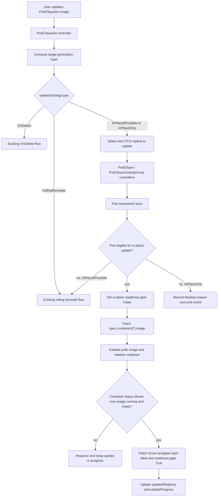

# GREP-292: In-Place Pod Image Update

<!-- toc -->
- [Summary](#summary)
- [Motivation](#motivation)
  - [Goals](#goals)
  - [Non-Goals](#non-goals)
- [Proposal](#proposal)
  - [Limitations/Risks &amp; Mitigations](#limitationsrisks--mitigations)
    - [Unsupported Pod Template Changes](#unsupported-pod-template-changes)
    - [Premature Update Completion](#premature-update-completion)
    - [Readiness and Traffic Impact](#readiness-and-traffic-impact)
    - [Image Pull or Startup Failures](#image-pull-or-startup-failures)
- [Design Details](#design-details)
  - [API Changes](#api-changes)
  - [High-Level Architecture](#high-level-architecture)
  - [Eligibility Detection](#eligibility-detection)
  - [Pod In-Place Update State](#pod-in-place-update-state)
  - [Completion Detection](#completion-detection)
  - [Standalone PodClique Flow](#standalone-podclique-flow)
  - [PodCliqueScalingGroup Flow](#podcliquescalinggroup-flow)
  - [Status and Conditions](#status-and-conditions)
  - [Monitoring](#monitoring)
  - [Test Plan](#test-plan)
    - [Unit Tests](#unit-tests)
    - [Integration Tests](#integration-tests)
    - [E2E Tests](#e2e-tests)
  - [Graduation Criteria](#graduation-criteria)
<!-- /toc -->

## Summary

This GREP extends `PodCliqueSet` updates with opt-in in-place Pod image updates. When a workload update only changes regular container images, Grove can patch existing Pods by updating `spec.containers[*].image` and wait for kubelet to restart the affected containers, instead of deleting Pods and forcing rescheduling. Existing `RollingRecreate` and `OnDelete` behavior remain unchanged unless users explicitly select one of the new in-place strategies.

## Motivation

Grove currently applies PodCliqueSet template changes through either automatic recreate with `RollingRecreate` or user-driven deletion with `OnDelete`. Recreating Pods is expensive for AI workloads even when the only change is an image tag:

- Pods enter scheduler queues again, and PodCliqueScalingGroup replacements may require gang scheduling.
- Scarce accelerator placement can be lost between deletion and replacement.
- Node-local placement, warm caches, mounted resources, IP address continuity, and scheduler backend state can be disrupted.
- Under cluster pressure, rescheduling can take longer than pulling and restarting a new image on the same node.

Kubernetes allows updating regular container images on an existing Pod. Grove should use this capability for image-only changes while preserving recreate semantics for unsupported changes.

### Goals

- Add explicit `PodCliqueSet` update strategy types for in-place image updates.
- Apply in-place updates when the effective Pod template change is limited to regular container image changes.
- Preserve `RollingRecreate` as the default update strategy.
- Reuse Grove's existing update progress and template hash model.
- Keep PodCliqueScalingGroup updates gang-aware by updating one selected replica at a time.
- Surface in-place update progress, completion, blocked state, and fallback behavior through status and events.

### Non-Goals

- Supporting in-place updates for fields other than regular container images.
- Supporting in-place updates for `initContainers`, ephemeral containers, resources, commands, args, env, probes, volumes, scheduling fields, resource claims, topology constraints, startup order, or service discovery fields.
- Changing the default `RollingRecreate` behavior.
- Providing application-level compatibility checks between old and new images.
- Guaranteeing zero traffic impact while kubelet restarts updated containers.
- Introducing a new history resource for PodCliqueSet revisions.

## Proposal

Introduce two new `PodCliqueSet` update strategy types:

- `InPlaceIfPossible`: Grove attempts eligible image-only updates in place. If the change is not eligible, Grove falls back to the existing `RollingRecreate` behavior.
- `InPlaceOnly`: Grove only attempts in-place updates. If the change is not eligible, Grove blocks the update and does not delete Pods.

The new strategies are opt-in. Existing users continue to get the current `RollingRecreate` behavior when `spec.updateStrategy` is omitted or explicitly set to `RollingRecreate`. The existing `OnDelete` strategy remains manual and does not automatically patch or delete existing Pods.

In-place update is evaluated per Pod. For each Pod with an outdated template hash, Grove builds the desired Pod from the current PodCliqueSet template and compares it with the existing Pod. If the only Pod spec differences are regular container image changes, Grove patches the existing Pod. After kubelet restarts the updated containers and reports new container status, Grove marks the Pod as updated by changing its Grove template hash label to the target hash.

### Limitations/Risks & Mitigations

#### Unsupported Pod Template Changes

Only regular container image changes are eligible for in-place update. Any other Pod spec change requires recreate semantics.

*Mitigation*: `InPlaceIfPossible` falls back to `RollingRecreate`; `InPlaceOnly` blocks the update with status and events that describe why the Pod is not eligible.

#### Premature Update Completion

If Grove updates the Pod template hash label before kubelet actually restarts containers, `status.updatedReplicas` could incorrectly report success.

*Mitigation*: Grove records in-place update state separately and updates the Pod template hash label only after kubelet reports changed `status.containerStatuses[*].imageID` for updated containers and those containers are ready.

#### Readiness and Traffic Impact

Patching an image causes kubelet to restart the container. The Pod should not stay ready from Grove's perspective during the update.

*Mitigation*: Grove injects a Grove-managed readiness gate into newly created Pods when in-place update is enabled. Before patching images, Grove sets the condition to `False`; after completion, Grove sets it back to `True`. Existing Pods without the readiness gate are not patched in place.

#### Image Pull or Startup Failures

If the new image cannot be pulled or fails to become ready, the Pod remains in an update-in-progress state.

*Mitigation*: Grove keeps the old template hash label until completion and surfaces the failure through status and events. After a Pod has been patched, Grove waits for kubelet or user intervention rather than switching strategies mid-update.

## Design Details

### API Changes

Extend `UpdateStrategyType` with two new values:

```go
// UpdateStrategyType defines the type of update strategy for PodCliqueSet.
// +kubebuilder:validation:Enum={RollingRecreate,OnDelete,InPlaceIfPossible,InPlaceOnly}
type UpdateStrategyType string

const (
    // RollingRecreateStrategy indicates that replicas will be progressively
    // deleted and recreated when templates change. This remains the default.
    RollingRecreateStrategy UpdateStrategyType = "RollingRecreate"

    // OnDeleteStrategy indicates that replicas will only be updated when users
    // manually delete Pods or PodCliqueScalingGroup replicas.
    OnDeleteStrategy UpdateStrategyType = "OnDelete"

    // InPlaceIfPossibleStrategy indicates that Grove should update Pods in place
    // when the template change is eligible, and fall back to RollingRecreate when
    // it is not.
    InPlaceIfPossibleStrategy UpdateStrategyType = "InPlaceIfPossible"

    // InPlaceOnlyStrategy indicates that Grove should only update Pods in place.
    // Unsupported changes block the update instead of deleting Pods.
    InPlaceOnlyStrategy UpdateStrategyType = "InPlaceOnly"
)
```

Example usage:

```yaml
apiVersion: grove.io/v1alpha1
kind: PodCliqueSet
metadata:
  name: inference
spec:
  replicas: 2
  updateStrategy:
    type: InPlaceIfPossible
  template:
    cliques:
      - name: decode
        spec:
          replicas: 4
          podSpec:
            containers:
              - name: server
                image: ghcr.io/example/decode:v2
```

### High-Level Architecture



### Eligibility Detection

Grove builds the desired Pod using the same code path used for new Pod creation. It then compares the existing Pod against the desired Pod after normalizing fields that Grove or Kubernetes mutate at runtime.

An update is eligible for in-place patch when all of the following are true:

- The Pod is managed by a PodClique in the current update scope.
- The Pod is not terminating.
- The Pod carries the Grove in-place readiness gate.
- The existing Pod and desired Pod have the same regular container set, matched by container name.
- The only Pod spec changes are `spec.containers[*].image`.
- `initContainers`, ephemeral containers, volumes, resource claims, scheduling fields, resources, probes, env, command, args, security context, restart policy, and DNS settings are unchanged.

When eligibility fails, Grove records a structured reason for status and events.

### Pod In-Place Update State

Grove stores in-place update state on the Pod:

```go
type InPlaceUpdateState struct {
    // PodTemplateHash is the target Pod template hash.
    PodTemplateHash string `json:"podTemplateHash"`

    // PodCliqueSetGenerationHash is the target PodCliqueSet generation hash.
    PodCliqueSetGenerationHash string `json:"podCliqueSetGenerationHash"`

    // UpdateStartedAt is when Grove started this Pod in-place update.
    UpdateStartedAt metav1.Time `json:"updateStartedAt,omitempty"`

    // LastContainerStatuses records image IDs before the image patch.
    LastContainerStatuses map[string]InPlaceUpdateContainerStatus `json:"lastContainerStatuses,omitempty"`

    // ContainerImages records target images by container name.
    ContainerImages map[string]string `json:"containerImages,omitempty"`
}

type InPlaceUpdateContainerStatus struct {
    ImageID string `json:"imageID,omitempty"`
}
```

Grove uses:

- Pod annotation `grove.io/in-place-update-state`
- Pod condition `grove.io/InPlaceUpdateReady`

The condition is injected as a Pod readiness gate for new Pods created when the selected update strategy is `InPlaceIfPossible` or `InPlaceOnly`.

### Completion Detection

An in-place Pod update is complete when:

- The Pod still has the target in-place update state.
- For each updated container, the current `status.containerStatuses[name].imageID` differs from the image ID recorded before the patch.
- Each updated container is ready.

After completion, Grove patches the Pod:

- `metadata.labels[grove.io/pod-template-hash]` to the target hash.
- `grove.io/InPlaceUpdateReady=True`.
- Removes stale in-place update state.

The existing PodClique status calculation can then count the Pod in `updatedReplicas` because the Pod template hash label matches the target hash.

### Standalone PodClique Flow

For a standalone PodClique under `InPlaceIfPossible` or `InPlaceOnly`:

1. `PodCliqueSet` initializes `status.updateProgress` with the target generation hash.
2. `PodClique` initializes or resets `status.updateProgress` with the target Pod template hash.
3. The Pod component lists existing Pods and identifies Pods whose `grove.io/pod-template-hash` does not match the target hash.
4. The Pod component updates one eligible ready Pod at a time.
5. Old non-ready Pods are not patched in place. `InPlaceIfPossible` recreates them; `InPlaceOnly` blocks until they become suitable or are manually handled.
6. The PodClique update completes when all Pods have the target template hash and the current minAvailable condition is satisfied.

### PodCliqueScalingGroup Flow

For PodCliqueScalingGroups, Grove continues to select one PodCliqueSet replica for update at a time.

1. PCSG records update progress for the selected replica.
2. Child PodCliques receive updated target template hashes.
3. Each child PodClique's Pod controller applies the standalone in-place logic to its Pods.
4. PCSG marks the replica updated when every child PodClique in the replica has reached the target Pod template hash and minAvailable requirements.

If any Pod in the selected PCSG replica is not eligible:

- `InPlaceIfPossible` falls back to the existing PCSG rolling recreate logic for that replica.
- `InPlaceOnly` blocks the PCSG update and records the blocked reason.

### Status and Conditions

The existing fields remain authoritative:

- `PodCliqueSet.status.updatedReplicas`
- `PodCliqueSet.status.updateProgress`
- `PodCliqueScalingGroup.status.updatedReplicas`
- `PodCliqueScalingGroup.status.updateProgress`
- `PodClique.status.updatedReplicas`
- `PodClique.status.updateProgress`

When `InPlaceOnly` cannot progress, Grove records an update-blocked condition on the smallest relevant resource: PodClique for standalone updates, PodCliqueScalingGroup for PCSG replica updates, and PodCliqueSet when a child update blocks top-level progress.

### Monitoring

Grove should emit Kubernetes Events:

- `StartedPodInPlaceUpdate`: Pod image patch flow has started.
- `SuccessfulPodInPlaceUpdate`: Pod reached the target image and target template hash.
- `FailedPodInPlaceUpdate`: Pod patch failed or completion check failed with a terminal error.
- `SkippedPodInPlaceUpdate`: Pod is not eligible and Grove is falling back to recreate.
- `BlockedInPlaceUpdate`: `InPlaceOnly` cannot apply the update in place.

### Test Plan

#### Unit Tests

- API validation accepts `InPlaceIfPossible` and `InPlaceOnly`.
- Eligibility detection returns true for image-only changes.
- Eligibility detection returns false for env, resources, command, args, init container image, volume, scheduler, resource claim, and other non-image changes.
- Pod patch generation only updates expected container images and Grove-managed annotations/labels.
- In-place update completion waits for container status changes before updating the Pod template hash label.
- `InPlaceIfPossible` falls back to recreate when eligibility fails before patching.
- `InPlaceOnly` records a blocked condition and does not delete Pods when eligibility fails.

#### Integration Tests

- Standalone PodClique image-only update patches Pods in place and preserves Pod names.
- PodCliqueScalingGroup image-only update patches Pods in place while preserving PCSG replica PodClique names.
- Updating a non-image field with `InPlaceIfPossible` recreates the affected Pod or PCSG replica.
- Updating a non-image field with `InPlaceOnly` blocks without deleting Pods.

#### E2E Tests

- Deploy a PodCliqueSet with `InPlaceIfPossible`, update an image, and verify Pod names stay unchanged while container image IDs change.
- Verify `updatedReplicas` progresses from old value to desired replicas only after kubelet reports the new image.
- Verify an image pull failure leaves the Pod not updated and surfaces Events/status.

### Graduation Criteria

The implementation is complete when:

- `PodCliqueSet` accepts `InPlaceIfPossible` and `InPlaceOnly`.
- Image-only Pod updates are patched in place.
- In-place updates use a Grove-managed readiness gate.
- Completion is detected from container status before the Pod template hash label is advanced.
- `InPlaceIfPossible` falls back to recreate for unsupported changes.
- `InPlaceOnly` blocks without deleting Pods for unsupported changes.
- Standalone PodClique and PodCliqueScalingGroup flows preserve existing update ordering.
- Unit and integration tests cover successful, fallback, blocked, and failed update paths.
