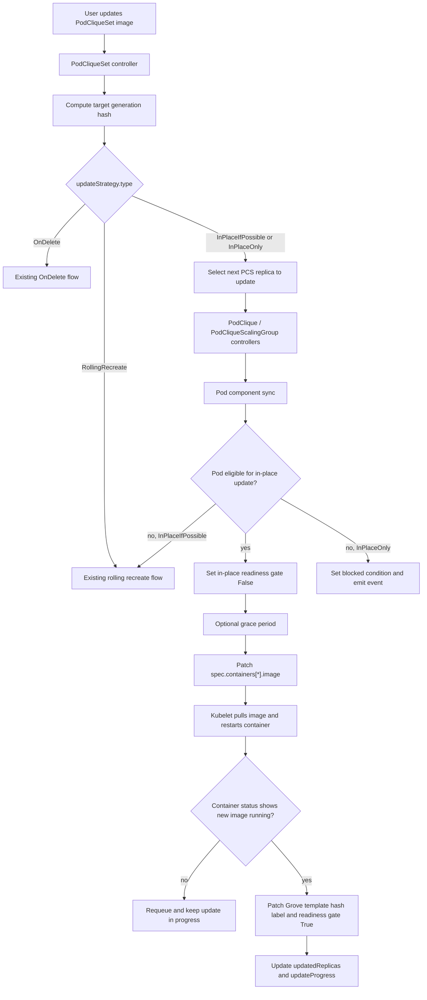

# GREP-292: In-Place Pod Image Update

<!-- toc -->
- [Summary](#summary)
- [Motivation](#motivation)
  - [Goals](#goals)
  - [Non-Goals](#non-goals)
- [Proposal](#proposal)
  - [User Stories](#user-stories)
    - [Story 1: Image-Only Rollout for GPU Inference](#story-1-image-only-rollout-for-gpu-inference)
    - [Story 2: Strict No-Delete Upgrade](#story-2-strict-no-delete-upgrade)
    - [Story 3: Fallback for Mixed Changes](#story-3-fallback-for-mixed-changes)
  - [Limitations/Risks &amp; Mitigations](#limitationsrisks--mitigations)
    - [Unsupported Pod Template Changes](#unsupported-pod-template-changes)
    - [Premature Update Completion](#premature-update-completion)
    - [Readiness and Traffic Impact](#readiness-and-traffic-impact)
    - [Image Pull or Startup Failures](#image-pull-or-startup-failures)
    - [Older Kubernetes Versions](#older-kubernetes-versions)
- [Design Details](#design-details)
  - [API Changes](#api-changes)
  - [High-Level Architecture](#high-level-architecture)
  - [Eligibility Detection](#eligibility-detection)
  - [Pod In-Place Update State](#pod-in-place-update-state)
  - [Completion Detection](#completion-detection)
  - [Standalone PodClique Flow](#standalone-podclique-flow)
  - [PodCliqueScalingGroup Flow](#podcliquescalinggroup-flow)
  - [Status and Conditions](#status-and-conditions)
  - [Monitoring](#monitoring)
  - [Dependencies](#dependencies)
  - [Test Plan](#test-plan)
    - [Unit Tests](#unit-tests)
    - [Integration Tests](#integration-tests)
    - [E2E Tests](#e2e-tests)
  - [Graduation Criteria](#graduation-criteria)
    - [Alpha](#alpha)
    - [Beta](#beta)
    - [GA](#ga)
- [Implementation History](#implementation-history)
- [Alternatives](#alternatives)
  - [Add an <code>inPlace</code> Flag Under <code>RollingRecreate</code>](#add-an-inplace-flag-under-rollingrecreate)
  - [Always Try In-Place Update Under <code>RollingRecreate</code>](#always-try-in-place-update-under-rollingrecreate)
  - [Reuse <code>OnDelete</code>](#reuse-ondelete)
  - [Introduce ControllerRevision History](#introduce-controllerrevision-history)
- [Appendix](#appendix)
<!-- /toc -->

## Summary

This GREP extends `PodCliqueSet` updates with an opt-in in-place pod image update strategy. When a workload update only changes regular container images, Grove can update existing Pods by patching `spec.containers[*].image` and waiting for kubelet to restart the affected containers, instead of deleting the Pods and forcing rescheduling. This reduces update cost for large AI workloads, especially workloads that rely on gang scheduling, scarce accelerators, or expensive scheduler placement decisions. Existing `RollingRecreate` and `OnDelete` behavior remain unchanged unless users explicitly select the new strategy.

## Motivation

Grove currently updates PodCliqueSet templates by either automatically recreating resources with `RollingRecreate` or waiting for user-driven deletion with `OnDelete`. Both strategies create a new Pod whenever the updated specification must be applied. For AI inference and training workloads, Pod recreation can be expensive even when the only meaningful change is a container image tag:

- The Pod has to pass through scheduler queues again, and for PodCliqueScalingGroups the replacement may involve gang scheduling.
- Scarce GPU resources can be reallocated to another workload between deletion and replacement.
- Existing node-local placement, warm caches, mounted resources, IP address continuity, and scheduler backend state can be lost.
- Large clusters under load can spend more time rescheduling a Pod than kubelet spends pulling and restarting a container image.

Kubernetes permits updating Pod container images in place. When `spec.containers[*].image` changes, kubelet pulls the new image and restarts the affected container without deleting the Pod object. Grove should expose this capability in its update orchestration while preserving the current recreate-based strategy for changes that cannot be safely applied in place.

### Goals

- Add explicit `PodCliqueSet` update strategy types for in-place image updates.
- Support in-place updates when the effective Pod template change is limited to regular container image changes and Grove-managed metadata.
- Preserve `RollingRecreate` as the default update strategy for backward compatibility.
- Reuse Grove's existing update progress and template hash model so users can track convergence with `updatedReplicas` and `updateProgress`.
- Keep PodCliqueScalingGroup updates gang-aware by updating one selected PodCliqueSet replica at a time, while avoiding deletion when in-place update is possible.
- Provide events, status fields, and conditions that show whether an update is progressing in place, completed, blocked, or falling back to recreate.

### Non-Goals

- Supporting in-place updates for fields other than regular container images in the initial implementation.
- Supporting in-place updates for `initContainers`, ephemeral containers, resources, commands, args, env, probes, volumes, scheduling fields, resource claims, topology constraints, startup order, or service discovery fields.
- Changing the default `RollingRecreate` behavior.
- Providing application-level compatibility checks between old and new images.
- Guaranteeing zero traffic impact for workloads that do not opt into the proposed readiness gate.
- Introducing `ControllerRevision` resources for PodCliqueSet history. Grove already has generation hashes and template hashes that are sufficient for this scoped feature.

## Proposal

Introduce two new `PodCliqueSet` update strategy types:

- `InPlaceIfPossible`: Grove first attempts to apply eligible image-only updates in place. If the change is not eligible, Grove falls back to the existing `RollingRecreate` behavior.
- `InPlaceOnly`: Grove attempts only in-place updates. If the change is not eligible, Grove does not delete Pods and instead exposes a blocked update state through status and events.

The new strategies are opt-in. Existing users continue to get the current `RollingRecreate` behavior when `spec.updateStrategy` is omitted or explicitly set to `RollingRecreate`. The existing `OnDelete` strategy remains manual and does not automatically patch or delete existing Pods.

In-place update is evaluated per Pod. For each Pod that has an outdated template hash, Grove compares the existing Pod against the desired Pod that would be created from the current PodCliqueSet template. If the only pod spec differences are regular container image changes, Grove patches the existing Pod. After kubelet restarts the updated containers and reports new container status, Grove marks the Pod as updated by changing its Grove template hash label to the target hash.

### User Stories

#### Story 1: Image-Only Rollout for GPU Inference

As an inference platform operator, I want to deploy a new model server image without deleting Pods so that existing GPU placement and scheduling decisions are preserved. I configure `spec.updateStrategy.type: InPlaceIfPossible`, update the image in the PodCliqueSet template, and Grove rolls the image across Pods without rescheduling eligible Pods.

#### Story 2: Strict No-Delete Upgrade

As a platform operator running a highly constrained GPU cluster, I want Grove to avoid Pod deletion during a rollout even if the update cannot be applied in place. I configure `spec.updateStrategy.type: InPlaceOnly`. If my change includes unsupported fields, Grove blocks the update and emits a clear event instead of falling back to Pod deletion.

#### Story 3: Fallback for Mixed Changes

As an application developer, I want the same update strategy to optimize image-only changes while still allowing broader template changes. I use `InPlaceIfPossible`. When I update only images, Grove patches Pods in place. When I later change resources or environment variables, Grove automatically falls back to `RollingRecreate`.

### Limitations/Risks & Mitigations

#### Unsupported Pod Template Changes

Only regular container image changes are eligible for in-place update. Any other Pod spec change requires recreate semantics.

*Mitigation*: `InPlaceIfPossible` falls back to `RollingRecreate`; `InPlaceOnly` blocks the update with a status condition and event that lists the first unsupported field path.

#### Premature Update Completion

If Grove updates the Pod template hash label before kubelet actually restarts containers, `status.updatedReplicas` could incorrectly report success.

*Mitigation*: Grove records in-place update state separately and updates the Pod template hash label only after kubelet reports completion through changed `status.containerStatuses[*].imageID` or equivalent runtime metadata.

#### Readiness and Traffic Impact

Patching an image causes kubelet to restart the container. Without readiness gate integration, the Pod may continue to be considered ready until kubelet transitions its conditions.

*Mitigation*: Grove injects a Grove-managed readiness gate into newly created Pods when in-place update is enabled. During an in-place update, Grove sets the condition to `False` before patching the Pod and restores it to `True` after completion. For existing Pods that do not carry the readiness gate, the alpha behavior is conservative: `InPlaceIfPossible` falls back to recreate and `InPlaceOnly` blocks the update.

#### Image Pull or Startup Failures

If the new image cannot be pulled or fails to become ready, the Pod remains in an update-in-progress state.

*Mitigation*: Grove surfaces the failure through Pod and PodClique status, Kubernetes Events, and unchanged `updatedReplicas`. Grove does not automatically delete the Pod as a recovery action in `InPlaceOnly`. In `InPlaceIfPossible`, fallback is decided before the in-place patch; after the Pod has been patched, Grove waits for kubelet or user intervention rather than switching strategies mid-update.

#### Older Kubernetes Versions

Pod image mutation behavior depends on Kubernetes support for updating `spec.containers[*].image` on existing Pods.

*Mitigation*: The feature depends on Kubernetes versions that allow Pod image updates. The controller should treat API validation failures during Pod patch as update failure and surface a clear event. Documentation will call out the required Kubernetes support level.

## Design Details

### API Changes

Extend `UpdateStrategyType` with two new values:

```go
// UpdateStrategyType defines the type of update strategy for PodCliqueSet.
// +kubebuilder:validation:Enum={RollingRecreate,OnDelete,InPlaceIfPossible,InPlaceOnly}
type UpdateStrategyType string

const (
    // RollingRecreateStrategy indicates that replicas will be progressively
    // deleted and recreated when templates change. This remains the default.
    RollingRecreateStrategy UpdateStrategyType = "RollingRecreate"

    // OnDeleteStrategy indicates that replicas will only be updated when users
    // manually delete Pods or PodCliqueScalingGroup replicas.
    OnDeleteStrategy UpdateStrategyType = "OnDelete"

    // InPlaceIfPossibleStrategy indicates that Grove should update Pods in place
    // when the template change is eligible, and fall back to RollingRecreate when
    // it is not.
    InPlaceIfPossibleStrategy UpdateStrategyType = "InPlaceIfPossible"

    // InPlaceOnlyStrategy indicates that Grove should only update Pods in place.
    // Unsupported changes block the update instead of deleting Pods.
    InPlaceOnlyStrategy UpdateStrategyType = "InPlaceOnly"
)
```

Add optional in-place settings to `PodCliqueSetUpdateStrategy`:

```go
type PodCliqueSetUpdateStrategy struct {
    // Type indicates the type of update strategy.
    // Default is RollingRecreate.
    // +kubebuilder:default=RollingRecreate
    Type UpdateStrategyType `json:"type,omitempty"`

    // InPlaceUpdate configures behavior for InPlaceIfPossible and InPlaceOnly.
    // +optional
    InPlaceUpdate *InPlaceUpdateStrategy `json:"inPlaceUpdate,omitempty"`
}

type InPlaceUpdateStrategy struct {
    // GracePeriodSeconds is the delay between marking a Pod not-ready through
    // the Grove in-place readiness gate and patching container images.
    // Defaults to 0.
    // +optional
    GracePeriodSeconds *int32 `json:"gracePeriodSeconds,omitempty"`
}
```

Example usage:

```yaml
apiVersion: grove.io/v1alpha1
kind: PodCliqueSet
metadata:
  name: inference
spec:
  replicas: 2
  updateStrategy:
    type: InPlaceIfPossible
    inPlaceUpdate:
      gracePeriodSeconds: 30
  template:
    cliques:
      - name: decode
        spec:
          replicas: 4
          podSpec:
            containers:
              - name: server
                image: ghcr.io/example/decode:v2
```

### High-Level Architecture



### Eligibility Detection

Grove builds the desired Pod using the same code path used for new Pod creation. It then compares the existing Pod against the desired Pod after removing fields that Kubernetes or Grove are expected to mutate at runtime.

An update is eligible for in-place patch when all of the following are true:

- The Pod is managed by a PodClique that is currently part of the selected update scope.
- The Pod is not terminating.
- The Pod carries the Grove in-place readiness gate.
- The existing Pod and desired Pod have the same regular container set, matched by container name.
- The only `spec` changes are `spec.containers[*].image`.
- `initContainers`, ephemeral containers, volumes, resource claims, scheduling gates, scheduler name, affinity, tolerations, resources, probes, env, command, args, security context, restart policy, and DNS settings are unchanged.
- Grove-managed metadata changes can be represented as labels and annotations on the existing Pod.

The implementation should produce a structured reason when eligibility fails. This reason is used in events and conditions.

### Pod In-Place Update State

Grove will store update state on the Pod:

```go
type InPlaceUpdateState struct {
    // PodTemplateHash is the target Pod template hash.
    PodTemplateHash string `json:"podTemplateHash"`

    // PodCliqueSetGenerationHash is the target PodCliqueSet generation hash.
    PodCliqueSetGenerationHash string `json:"podCliqueSetGenerationHash"`

    // UpdateStartedAt is when Grove started this Pod in-place update.
    UpdateStartedAt metav1.Time `json:"updateStartedAt,omitempty"`

    // LastContainerStatuses records image IDs before the image patch.
    LastContainerStatuses map[string]InPlaceUpdateContainerStatus `json:"lastContainerStatuses,omitempty"`
}

type InPlaceUpdateContainerStatus struct {
    ImageID string `json:"imageID,omitempty"`
}
```

Suggested annotation keys:

- `grove.io/in-place-update-state`
- `grove.io/in-place-update-grace`

Suggested Pod condition:

- `grove.io/InPlaceUpdateReady`

The condition should be injected as a Pod readiness gate for new Pods created when the selected update strategy is `InPlaceIfPossible` or `InPlaceOnly`.

### Completion Detection

An in-place Pod update is complete when:

- The Pod still has the target in-place update state.
- The Pod no longer has an active grace annotation.
- For each updated container, the current `status.containerStatuses[name].imageID` differs from the image ID recorded before the patch, unless `status.containerStatuses[name].image` already equals the requested image and kubelet reports the container ready.
- The Pod's containers are ready.

After completion, Grove patches the Pod:

- `metadata.labels[grove.io/pod-template-hash]` to the target hash.
- `grove.io/InPlaceUpdateReady=True` when the readiness gate exists.
- Removes stale in-place grace state.

The existing PodClique status calculation can then count the Pod in `updatedReplicas` because the Pod template hash label matches the target hash.

### Standalone PodClique Flow

For a standalone PodClique under `InPlaceIfPossible` or `InPlaceOnly`:

1. `PodCliqueSet` initializes `status.updateProgress` with the target generation hash.
2. `PodClique` initializes or resets `status.updateProgress` with the target Pod template hash.
3. The Pod component lists existing Pods and identifies Pods whose `grove.io/pod-template-hash` does not match the target hash.
4. The Pod component updates one eligible ready Pod at a time, preserving the current rolling update safety behavior.
5. Old non-ready Pods are not patched in place in alpha. `InPlaceIfPossible` recreates them; `InPlaceOnly` blocks until they become suitable or are manually handled.
6. The PodClique update completes when all Pods have the target template hash and the current minAvailable condition is satisfied.

### PodCliqueScalingGroup Flow

For PodCliqueScalingGroups, Grove continues to select one PodCliqueSet replica for update at a time. The difference is that when the selected replica contains PCSG-managed PodCliques, the PCSG controller should not delete the replica immediately. Instead:

1. PCSG records update progress for the selected replica.
2. The child PodCliques receive updated target template hashes.
3. Each child PodClique's Pod controller applies the standalone in-place logic to its Pods.
4. PCSG marks the replica updated when every child PodClique in the replica has reached the target Pod template hash and minAvailable requirements.

If any Pod in the selected PCSG replica is not eligible:

- `InPlaceIfPossible` falls back to the existing PCSG rolling recreate logic for that replica.
- `InPlaceOnly` blocks the PCSG update and records the blocked reason.

This keeps the update order and gang-aware safety model from the existing rolling update implementation while avoiding deletion for image-only changes.

### Status and Conditions

The existing fields remain authoritative:

- `PodCliqueSet.status.updatedReplicas`
- `PodCliqueSet.status.updateProgress`
- `PodCliqueScalingGroup.status.updatedReplicas`
- `PodCliqueScalingGroup.status.updateProgress`
- `PodClique.status.updatedReplicas`
- `PodClique.status.updateProgress`

Add a condition type where the update can become blocked:

```go
const ConditionTypeUpdateBlocked = "UpdateBlocked"
```

The condition should be set on the smallest relevant resource:

- PodClique for standalone Pod update blocks.
- PodCliqueScalingGroup for PCSG replica blocks.
- PodCliqueSet when the top-level update cannot make progress because a child update is blocked.

Suggested reasons:

- `InPlaceUpdateUnsupportedChange`
- `InPlaceUpdateMissingReadinessGate`
- `InPlaceUpdatePodPatchFailed`
- `InPlaceUpdateImagePullPending`
- `InPlaceUpdateContainerRestartPending`

### Monitoring

Grove should emit Kubernetes Events:

- `StartedPodInPlaceUpdate`: Pod image patch flow has started.
- `SuccessfulPodInPlaceUpdate`: Pod reached the target image and target template hash.
- `FailedPodInPlaceUpdate`: Pod patch failed or completion check failed with a terminal error.
- `SkippedPodInPlaceUpdate`: Pod is not eligible and Grove is falling back to recreate.
- `BlockedInPlaceUpdate`: `InPlaceOnly` cannot apply the update in place.

Useful future Prometheus metrics:

- `grove_inplace_update_attempts_total{result,strategy}`
- `grove_inplace_update_duration_seconds`
- `grove_inplace_update_blocked_total{reason}`

Metrics are not required for alpha, but events and status conditions are required.

### Dependencies

- Kubernetes API server and kubelet support for updating `spec.containers[*].image` on existing Pods.
- The Grove operator service account must be allowed to `get`, `list`, `watch`, `patch`, and `update` Pods and Pod status.
- No dependency on RBG or Kruise. RBG is a reference implementation for the control pattern, not a runtime dependency.

### Test Plan

#### Unit Tests

- API defaulting and validation accepts `InPlaceIfPossible` and `InPlaceOnly`.
- Eligibility detection returns true for image-only changes.
- Eligibility detection returns false for env, resources, command, args, init container image, volume, scheduler, resource claim, and metadata changes outside Grove-managed keys.
- Pod patch generation only updates expected container images and Grove-managed annotations/labels.
- In-place update completion waits for container status changes before updating the Pod template hash label.
- `InPlaceIfPossible` falls back to recreate when eligibility fails before patching.
- `InPlaceOnly` records a blocked condition and does not delete Pods when eligibility fails.
- Stale in-place state is ignored or reset when a newer PodCliqueSet generation supersedes it.

#### Integration Tests

- Standalone PodClique image-only update patches Pods in place and preserves Pod names.
- PodCliqueScalingGroup image-only update patches Pods in place while preserving PCSG replica PodClique names.
- Updating a non-image field with `InPlaceIfPossible` recreates the affected Pod or PCSG replica.
- Updating a non-image field with `InPlaceOnly` blocks without deleting Pods.
- Existing Pods without the readiness gate follow the alpha conservative behavior.

#### E2E Tests

- Deploy a PodCliqueSet with `InPlaceIfPossible`, update an image, and verify Pod names stay unchanged while container image IDs change.
- Verify `updatedReplicas` progresses from old value to desired replicas only after kubelet reports the new image.
- Verify an image pull failure leaves the Pod not updated and surfaces Events/status.
- Verify `gracePeriodSeconds` delays the Pod image patch after readiness is set to false.

### Graduation Criteria

#### Alpha

- API fields are implemented and documented.
- Standalone PodClique in-place image update works for regular containers.
- PCSG updates either work in place for image-only updates or correctly fall back/block according to strategy.
- Unit tests and at least one e2e test cover successful image-only update.

#### Beta

- PCSG in-place update has e2e coverage across multiple PodCliqueSet replicas.
- Failure handling is covered for image pull errors, unsupported changes, missing readiness gates, and generation supersession.
- Events and status conditions have been validated by users.
- Documentation includes operational guidance and examples.

#### GA

- The API has been stable for at least two releases after beta.
- The feature has been validated in production-like AI workload deployments.
- No known data-loss, readiness, or scheduler interaction issues remain open.

## Implementation History

- 2026-05-08: Initial GREP draft.

## Alternatives

### Add an `inPlace` Flag Under `RollingRecreate`

Instead of adding new strategy types, Grove could add `spec.updateStrategy.rollingRecreate.inPlaceIfPossible`. This was rejected because it makes the strategy harder to reason about: a field named `RollingRecreate` would sometimes avoid recreation. Explicit strategy types make user intent and status reporting clearer.

### Always Try In-Place Update Under `RollingRecreate`

Grove could silently optimize image-only updates while keeping the existing API unchanged. This was rejected because it changes operational semantics for existing users. Some users may depend on Pod recreation to reset state, force rescheduling, or clear runtime-local caches.

### Reuse `OnDelete`

Users could update the template and manually patch Pods themselves under `OnDelete`. This was rejected because the goal is for Grove to orchestrate safe, observable, one-at-a-time image updates while preserving PodCliqueSet progress tracking.

### Introduce ControllerRevision History

RBG uses ControllerRevision to compare old and new templates. Grove could adopt the same pattern. This is unnecessary for the initial scope because Grove already persists generation hashes and computes Pod template hashes from the current PodCliqueSet template. Adding ControllerRevision would increase API and controller complexity without being required for image-only eligibility checks.

## Appendix

- [Issue 292: Rolling Update support inplace update pod image](https://github.com/ai-dynamo/grove/issues/292)
- [GREP-291: `OnDelete` Update Strategy for PodCliqueSets](../291-ondelete-update/README.md)
- [Kubernetes documentation: Pod update and replacement](https://kubernetes.io/docs/concepts/workloads/pods/#pod-update-and-replacement)
- [RBG in-place update reference implementation](https://github.com/sgl-project/rbg)
