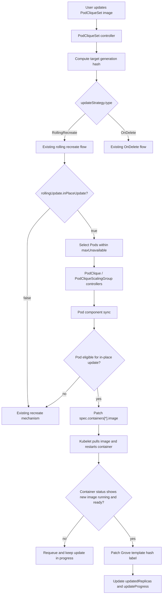

# GREP-292: In-Place Pod Image Update

<!-- toc -->
- [Summary](#summary)
- [Motivation](#motivation)
  - [Goals](#goals)
  - [Non-Goals](#non-goals)
- [Proposal](#proposal)
  - [Limitations/Risks &amp; Mitigations](#limitationsrisks--mitigations)
    - [Unsupported Pod Template Changes](#unsupported-pod-template-changes)
    - [Premature Update Completion](#premature-update-completion)
    - [Traffic and Connection Impact](#traffic-and-connection-impact)
    - [Image Pull or Startup Failures](#image-pull-or-startup-failures)
- [Design Details](#design-details)
  - [API Changes](#api-changes)
  - [High-Level Architecture](#high-level-architecture)
  - [Eligibility Detection](#eligibility-detection)
  - [In-Place Update Progress](#in-place-update-progress)
  - [Completion Detection](#completion-detection)
  - [Policy Changes During Active Updates](#policy-changes-during-active-updates)
  - [Standalone PodClique Flow](#standalone-podclique-flow)
  - [PodCliqueScalingGroup Flow](#podcliquescalinggroup-flow)
  - [Status and Conditions](#status-and-conditions)
  - [Monitoring](#monitoring)
  - [Test Plan](#test-plan)
    - [Unit Tests](#unit-tests)
    - [Integration Tests](#integration-tests)
    - [E2E Tests](#e2e-tests)
  - [Graduation Criteria](#graduation-criteria)
<!-- /toc -->

## Summary

This GREP extends `PodCliqueSet` rolling updates with opt-in in-place Pod image updates. When a workload update only changes regular container images, Grove can patch existing Pods by updating `spec.containers[*].image` and wait for kubelet to restart the affected containers, instead of deleting Pods and forcing rescheduling. Existing `RollingRecreate` and `OnDelete` behavior remain unchanged unless users explicitly enable in-place image updates under the rolling update settings.

## Motivation

Grove currently applies PodCliqueSet template changes through either automatic recreate with `RollingRecreate` or user-driven deletion with `OnDelete`. Recreating Pods is expensive for AI workloads even when the only change is an image tag:

- Pods enter scheduler queues again, and PodCliqueScalingGroup replacements may require gang scheduling.
- Scarce accelerator placement can be lost between deletion and replacement.
- Node-local placement, warm caches, mounted resources, IP address continuity, and scheduler backend state can be disrupted.
- Under cluster pressure, rescheduling can take longer than pulling and restarting a new image on the same node.

Kubernetes allows updating regular container images on an existing Pod. Grove should use this capability for image-only changes while preserving recreate semantics for unsupported changes.

A common target use case is a platform-managed CD workflow. The platform or CD system owner configures the workload update policy during Day 0 setup. After that, Day 1 changes are usually submitted by an application owner or CD pipeline that only changes workload fields, such as container images. Those Day 1 users should not need to choose the low-level Pod update mechanism on every rollout. `rollingUpdate.inPlaceUpdate` provides a platform-level optimization knob: prefer in-place image updates whenever the Pod change is eligible, in order to reduce resource preemption, rescheduling, and gang scheduling overhead; fall back to recreate when the change cannot be safely applied in place.

### Goals

- Add an opt-in rolling update setting for in-place image updates.
- Apply in-place updates when the effective Pod template change is limited to regular container image changes.
- Preserve `RollingRecreate` as the default update strategy.
- Reuse Grove's existing update progress and template hash model.
- Bound parallel in-place updates through a Deployment-style `maxUnavailable` setting.
- Surface in-place update progress, completion, fallback behavior, and failures through status and events.

### Non-Goals

- Supporting in-place updates for fields other than regular container images.
- Supporting in-place updates for `initContainers`, ephemeral containers, resources, commands, args, env, probes, volumes, scheduling fields, resource claims, topology constraints, startup order, or service discovery fields.
- Changing the default `RollingRecreate` behavior.
- Providing application-level compatibility checks between old and new images.
- Providing a zero-impact traffic guarantee during updates. Grove can reduce rescheduling disruption, but service availability still depends on sufficient replicas, `minAvailable`, application graceful shutdown behavior, connection handling, and `terminationGracePeriodSeconds`.
- Introducing `maxSurge` behavior. In-place image update does not create extra Pods; surge semantics for recreate-based updates can be considered separately.
- Introducing a new history resource for PodCliqueSet revisions.

## Proposal

Keep `RollingRecreate` and `OnDelete` as the only top-level `PodCliqueSet` update strategy types. Add an opt-in `rollingUpdate.inPlaceUpdate` setting under `RollingRecreate`:

```yaml
updateStrategy:
  type: RollingRecreate
  rollingUpdate:
    inPlaceUpdate: true
    maxUnavailable: 1
```

When `rollingUpdate.inPlaceUpdate` is enabled, Grove treats in-place image update as a per-Pod update mechanism within the existing automatic rolling update flow. For each outdated Pod, Grove decides whether the effective Pod change is eligible for an in-place image patch. If the change is eligible, Grove patches `spec.containers[*].image` on the existing Pod. If the change is not eligible, Grove falls back to the existing recreate path.

The setting is opt-in. Existing users continue to get the current `RollingRecreate` behavior when `spec.updateStrategy` is omitted, when it is explicitly set to `RollingRecreate` without `rollingUpdate.inPlaceUpdate`, or when `rollingUpdate.inPlaceUpdate` is false. The existing `OnDelete` strategy remains manual and does not automatically patch or delete existing Pods.

`rollingUpdate.maxUnavailable` bounds how many Pods may be unavailable or in an active in-place update at the same time. It follows Deployment-style integer-or-percentage syntax. The default is `1`, percentages are rounded up, and the effective value must be at least `1` when `rollingUpdate.inPlaceUpdate` is enabled. This proposal does not introduce `maxSurge` because in-place image update does not create extra Pods.

### Limitations/Risks & Mitigations

#### Unsupported Pod Template Changes

Only regular container image changes are eligible for in-place update. Any other Pod spec change requires recreate semantics.

*Mitigation*: When `rollingUpdate.inPlaceUpdate` is enabled, Grove falls back to the existing recreate path for Pods whose effective change is not eligible for in-place image patching. Grove records a structured eligibility reason in status and events.

#### Premature Update Completion

If Grove updates the Pod template hash label before kubelet actually restarts containers, `status.updatedReplicas` could incorrectly report success.

*Mitigation*: Grove updates the Pod template hash label only after kubelet reports that every updated container is running the desired image and is ready. Grove should not rely only on a previous `imageID` snapshot because mutable tags, unchanged digests, or unrelated container restarts can make `imageID` comparisons misleading.

#### Traffic and Connection Impact

Patching an image causes kubelet to restart the affected container. Grove does not provide a zero-impact traffic guarantee for this restart. In-flight requests, already established connections, and long-lived streams are outside the scope of the Grove controller.

*Mitigation*: Grove keeps the update orchestration limited to eligible image-only Pod patches and completion detection. Workloads that need graceful request completion must handle container termination at the application or inference framework layer and configure `terminationGracePeriodSeconds` accordingly.

#### Image Pull or Startup Failures

If the new image cannot be pulled or fails to become ready, the Pod remains in an update-in-progress state.

*Mitigation*: Grove keeps the old template hash label until completion and surfaces the failure through status and events. After a Pod has been patched, Grove waits for kubelet or user intervention rather than switching strategies mid-update.

## Design Details

### API Changes

Extend `PodCliqueSetUpdateStrategy` with a `rollingUpdate` configuration block:

```go
type PodCliqueSetUpdateStrategy struct {
    // Type indicates the type of update strategy.
    // Default is RollingRecreate.
    // +kubebuilder:default=RollingRecreate
    Type UpdateStrategyType `json:"type,omitempty"`

    // RollingUpdate configures automatic rolling updates when Type is
    // RollingRecreate. It is ignored when Type is OnDelete.
    // +optional
    RollingUpdate *PodCliqueSetRollingUpdateStrategy `json:"rollingUpdate,omitempty"`
}

type PodCliqueSetRollingUpdateStrategy struct {
    // InPlaceUpdate allows Grove to patch eligible regular container image
    // changes in place. When the effective Pod change is not eligible, Grove
    // falls back to the existing recreate path.
    // +optional
    InPlaceUpdate bool `json:"inPlaceUpdate,omitempty"`

    // MaxUnavailable bounds how many Pods may be unavailable or actively
    // updating in place at the same time when InPlaceUpdate is enabled.
    // Percentages are evaluated against the current rolling update scope.
    // Defaults to 1.
    // +optional
    MaxUnavailable *intstr.IntOrString `json:"maxUnavailable,omitempty"`
}
```

Example usage:

```yaml
apiVersion: grove.io/v1alpha1
kind: PodCliqueSet
metadata:
  name: inference
spec:
  replicas: 2
  updateStrategy:
    type: RollingRecreate
    rollingUpdate:
      inPlaceUpdate: true
      maxUnavailable: 1
  template:
    cliques:
      - name: decode
        spec:
          replicas: 4
          podSpec:
            containers:
              - name: server
                image: ghcr.io/example/decode:v2
```

### High-Level Architecture



### Eligibility Detection

Grove builds the desired Pod using the same code path used for new Pod creation. It then compares the existing Pod against the desired Pod after normalizing fields that Grove or Kubernetes mutate at runtime.

An update is eligible for in-place patch when all of the following are true:

- The Pod is managed by a PodClique in the current update scope.
- The Pod is not terminating.
- The existing Pod and desired Pod have the same regular container set, matched by container name.
- The only Pod spec changes are `spec.containers[*].image`.
- `initContainers`, ephemeral containers, volumes, resource claims, scheduling fields, resources, probes, env, command, args, security context, restart policy, and DNS settings are unchanged.

Examples of changes that are not eligible include container set changes, init container changes, resource changes, env/command/args changes, volume changes, scheduling changes, and workloads that require all containers to restart and re-establish startup order.

When eligibility fails, Grove records a structured reason for status and events.

### In-Place Update Progress

Grove should reuse the existing `PodCliqueStatus.UpdateProgress` model instead of adding a parallel in-place update state shape. The current progress model already tracks the target PodCliqueSet generation hash, target Pod template hash, update start time, update end time, and selected Pods.

In-place update only needs bounded strategy-specific progress for the currently active update targets. The size of this list is limited by `rollingUpdate.maxUnavailable`:

```go
type PodCliqueUpdateProgress struct {
    // Existing fields are reused for in-place updates:
    UpdateStartedAt metav1.Time `json:"updateStartedAt,omitempty"`
    UpdateEndedAt *metav1.Time `json:"updateEndedAt,omitempty"`
    PodCliqueSetGenerationHash string `json:"podCliqueSetGenerationHash"`
    PodTemplateHash string `json:"podTemplateHash"`
    ReadyPodsSelectedToUpdate *PodsSelectedToUpdate `json:"readyPodsSelectedToUpdate,omitempty"`

    // InPlaceUpdates stores progress for Pods currently being patched in place.
    // The list is bounded by rollingUpdate.maxUnavailable and must not grow with
    // the full PodClique size.
    InPlaceUpdates []InPlaceUpdateProgress `json:"inPlaceUpdates,omitempty"`
}

type InPlaceUpdateProgress struct {
    // PodName is the Pod currently being patched in place.
    PodName string `json:"podName"`

    // Phase describes the current in-place step, for example Patching or
    // WaitingForCompletion.
    Phase InPlaceUpdatePhase `json:"phase,omitempty"`
}
```

Target container images are derived from the desired Pod during reconciliation. Grove does not need to persist target images or previous container status snapshots for every Pod.

`rollingUpdate.maxUnavailable` is evaluated before starting another in-place patch. Pods already patched in place and not yet converged count against the budget even if kubelet has not yet reported the Pod as not ready. This prevents Grove from patching too many Pods before readiness changes are observed.

For standalone PodCliques, the percentage denominator is the PodClique replica count. For PodCliqueScalingGroups, the percentage denominator is the number of Pods in the affected child PodCliques for the current PodCliqueSet update scope. Fallback recreate updates continue to use the existing rolling recreate ordering.

### Completion Detection

An in-place Pod update is complete when:

- `PodCliqueStatus.UpdateProgress` still targets the current PodCliqueSet generation hash and Pod template hash.
- For each updated container, the current `status.containerStatuses[name].image` matches the desired image from the target Pod spec.
- Each updated container is ready.

After completion, Grove patches the Pod:

- `metadata.labels[grove.io/pod-template-hash]` to the target hash.
- Clears the active in-place update progress.

The existing PodClique status calculation can then count the Pod in `updatedReplicas` because the Pod template hash label matches the target hash.

If kubelet never reports the desired image and readiness, Grove keeps the Pod on the old template hash and surfaces the stalled update through status and events. `imageID` may be recorded for diagnostics, but it is not the primary convergence signal.

### Policy Changes During Active Updates

If users change `updateStrategy` or `rollingUpdate` settings while an in-place update is active, Grove reconciles from the latest desired state:

- Pods already patched in place are not rolled back. Grove waits for them to converge to the desired image and readiness before advancing their template hash label.
- Pods not yet patched are evaluated using the latest `updateStrategy` and `rollingUpdate` settings on the next reconcile.
- If `rollingUpdate.inPlaceUpdate` is disabled during an update, no new Pods are patched in place; remaining outdated Pods use the existing recreate path.
- If `rollingUpdate.maxUnavailable` is reduced below the number of active in-place updates, Grove does not start additional in-place patches until enough active updates complete.

### Standalone PodClique Flow

For a standalone PodClique under `RollingRecreate` with `rollingUpdate.inPlaceUpdate: true`:

1. `PodCliqueSet` initializes `status.updateProgress` with the target generation hash.
2. `PodClique` initializes or resets `status.updateProgress` with the target Pod template hash.
3. The Pod component lists existing Pods and identifies Pods whose `grove.io/pod-template-hash` does not match the target hash.
4. The Pod component patches eligible Pods in place while respecting `rollingUpdate.maxUnavailable`.
5. Pods that are not eligible for in-place update use the existing recreate path.
6. The PodClique update completes when all Pods have the target template hash and the current minAvailable condition is satisfied.

### PodCliqueScalingGroup Flow

For PodCliqueScalingGroups, in-place image updates may proceed across multiple eligible Pods while respecting `rollingUpdate.maxUnavailable`. This differs from recreate-based rolling updates: in-place patching keeps Pods scheduled, so the gang-scheduling reason for hard-coded one-replica-at-a-time pacing does not apply in the same way.

1. PCSG records update progress for the target generation.
2. Child PodCliques receive updated target template hashes.
3. Each child PodClique's Pod controller applies the standalone in-place logic to its Pods.
4. PCSG marks the update complete when every child PodClique has reached the target Pod template hash and minAvailable requirements.

If any Pod is not eligible:

- Grove falls back to the existing rolling recreate logic for that Pod or replica scope.

### Status and Conditions

The existing fields remain authoritative:

- `PodCliqueSet.status.updatedReplicas`
- `PodCliqueSet.status.updateProgress`
- `PodCliqueScalingGroup.status.updatedReplicas`
- `PodCliqueScalingGroup.status.updateProgress`
- `PodClique.status.updatedReplicas`
- `PodClique.status.updateProgress`

If in-place patching stalls after a Pod has been patched, Grove keeps the old template hash label and surfaces the stalled update through status and events.

### Monitoring

Grove should emit Kubernetes Events:

- `StartedPodInPlaceUpdate`: Pod image patch flow has started.
- `SuccessfulPodInPlaceUpdate`: Pod reached the target image and target template hash.
- `FailedPodInPlaceUpdate`: Pod patch failed or completion check failed with a terminal error.
- `SkippedPodInPlaceUpdate`: Pod is not eligible and Grove is falling back to recreate.

### Test Plan

#### Unit Tests

- API validation accepts `rollingUpdate.inPlaceUpdate` and `rollingUpdate.maxUnavailable` when `updateStrategy.type` is `RollingRecreate`.
- Eligibility detection returns true for image-only changes.
- Eligibility detection returns false for env, resources, command, args, init container image, volume, scheduler, resource claim, and other non-image changes.
- Eligibility detection returns false for workloads that require all containers to restart and re-establish startup order.
- Pod patch generation only updates expected container images and Grove-managed labels.
- In-place update completion waits until each updated container reports the desired image and readiness before updating the Pod template hash label.
- In-place update completion does not depend only on a previous `imageID` snapshot.
- In-place update respects `rollingUpdate.maxUnavailable`.
- Grove falls back to recreate when eligibility fails before patching.

#### Integration Tests

- Standalone PodClique image-only update patches Pods in place and preserves Pod names.
- PodCliqueScalingGroup image-only update patches Pods in place while preserving PCSG replica PodClique names.
- Updating a non-image field with `rollingUpdate.inPlaceUpdate` enabled recreates the affected Pod or PCSG replica.
- `rollingUpdate.maxUnavailable` allows bounded parallel in-place updates.

#### E2E Tests

- Deploy a PodCliqueSet with `rollingUpdate.inPlaceUpdate` enabled, update an image, and verify Pod names stay unchanged while container status reports the desired image.
- Verify `updatedReplicas` progresses from old value to desired replicas only after kubelet reports the new image.
- Verify an image pull failure leaves the Pod not updated and surfaces Events/status.

### Graduation Criteria

The implementation is complete when:

- `PodCliqueSet` accepts `rollingUpdate.inPlaceUpdate` and `rollingUpdate.maxUnavailable` under `RollingRecreate`.
- Image-only Pod updates are patched in place.
- Parallel in-place updates are bounded by `rollingUpdate.maxUnavailable`.
- Completion is detected from the desired image and container readiness before the Pod template hash label is advanced.
- Grove falls back to recreate for unsupported changes.
- Standalone PodClique and PodCliqueScalingGroup flows preserve existing rolling update behavior when in-place update is disabled.
- Unit and integration tests cover successful, fallback, bounded parallelism, and failed update paths.
