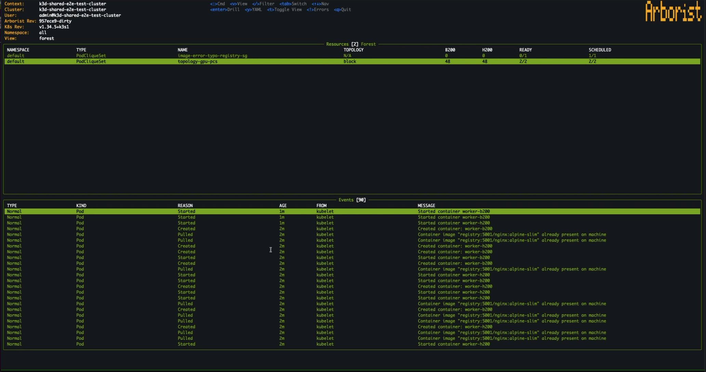
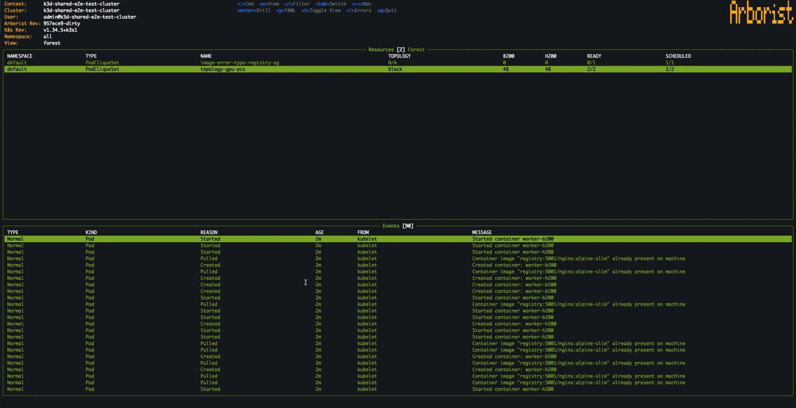
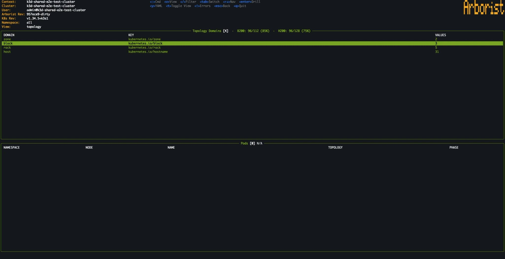
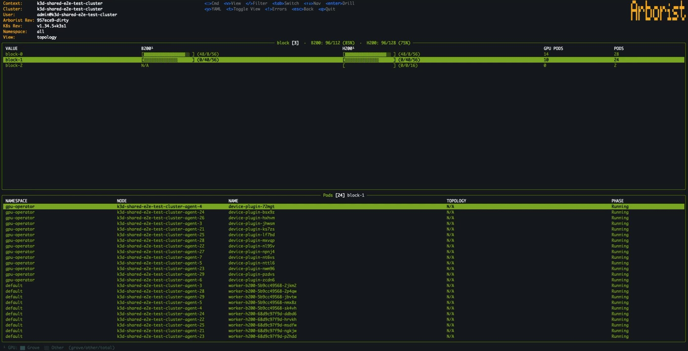
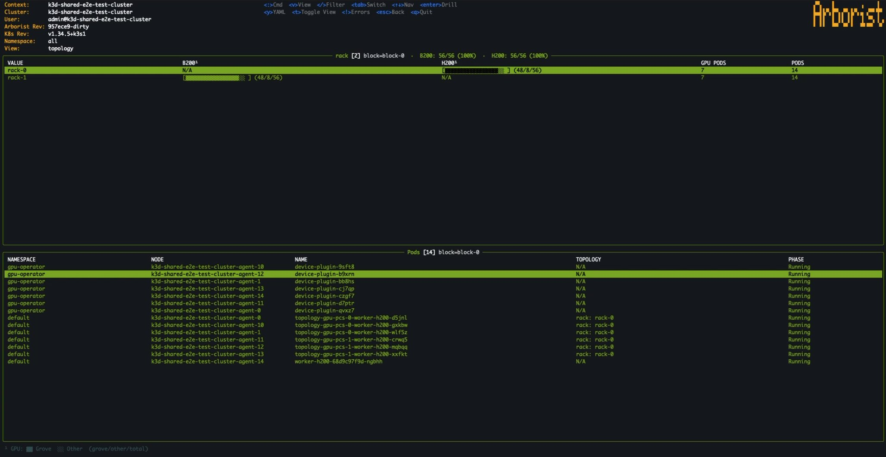
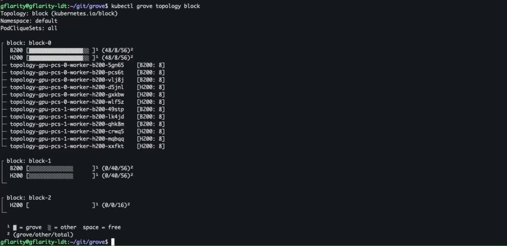

# GREP-373: Arborist (aka kubectl-grove) — CLI for Grove

<!-- toc -->
- [Summary](#summary)
- [Motivation](#motivation)
  - [Goals](#goals)
  - [Non-Goals](#non-goals)
- [Proposal](#proposal)
  - [User Stories](#user-stories)
    - [Story 1: Debugging a Stuck PodCliqueSet Rollout](#story-1-debugging-a-stuck-podcliqueset-rollout)
    - [Story 2: Visualizing GPU Placement Across Topology in the TUI](#story-2-visualizing-gpu-placement-across-topology-in-the-tui)
    - [Story 3: Understanding GPU Utilization Across Topology](#story-3-understanding-gpu-utilization-across-topology)
    - [Story 4: Collecting Diagnostics for a Support Case](#story-4-collecting-diagnostics-for-a-support-case)
  - [Limitations/Risks &amp; Mitigations](#limitationsrisks--mitigations)
    - [Large Cluster Rendering Slowdowns](#large-cluster-rendering-slowdowns)
    - [High Memory Usage from Informer Caches](#high-memory-usage-from-informer-caches)
    - [API Server Load from Informer Watches](#api-server-load-from-informer-watches)
    - [Read-Only Design](#read-only-design)
    - [Broad RBAC Requirements](#broad-rbac-requirements)
    - [Grove Missing Errors](#grove-missing-errors)
    - [Sensitive Data in Diagnostic Bundles](#sensitive-data-in-diagnostic-bundles)
    - [Tight Version Coupling with Operator API](#tight-version-coupling-with-operator-api)

- [Design Details](#design-details)
  - [Architecture Overview](#architecture-overview)
  - [Package Structure](#package-structure)
  - [TUI (`kubectl grove tui`)](#tui-kubectl-grove-tui)
    - [Bubble Tea &amp; Informer Integration](#bubble-tea--informer-integration)
    - [Data Flow](#data-flow)
    - [Views](#views)
      - [Forest View](#forest-view)
      - [Topology View](#topology-view)
    - [Full-Screen Overlays](#full-screen-overlays)
    - [Error UX](#error-ux)
  - [Topology CLI (`kubectl grove topology`)](#topology-cli-kubectl-grove-topology)
  - [Diagnostics (`kubectl grove diagnostics`)](#diagnostics-kubectl-grove-diagnostics)
  - [GPU Accounting](#gpu-accounting)
  - [kubectl Plugin Integration](#kubectl-plugin-integration)
  - [k9s Plugin](#k9s-plugin)
  - [Monitoring](#monitoring)
  - [Dependencies](#dependencies)
  - [Test Plan](#test-plan)
  - [Graduation Criteria](#graduation-criteria)
- [Implementation History](#implementation-history)
- [Alternatives](#alternatives)
- [Appendix](#appendix)
<!-- /toc -->

## Summary

Arborist will be the CLI for Grove. It will provide an interactive Terminal User Interface (TUI), non-interactive CLI commands, and a diagnostic bundle collector — giving operators and developers immediate visibility into Grove-managed AI inference workloads without requiring deep knowledge of the underlying CRD hierarchy. A `kubectl-grove` entry point will be provided, making it immediately usable as a kubectl plugin (`kubectl grove`). Its source will live in the Grove monorepo under `tools/arborist/`, with planned distribution through [Krew](https://krew.sigs.k8s.io/).

This proposal covers three subcommands (`tui`, `topology`, `diagnostics`). Additional commands (e.g., `status`, `health`, lifecycle operations) are planned as follow-up work in a separate proposal. In parallel, we will enrich the Kubernetes events emitted by the operator; combined with the tooling in this proposal, richer events significantly improve the debugging experience for Grove-managed workloads.

## Motivation

Grove introduces a multi-level CRD hierarchy (PodCliqueSet, PodCliqueScalingGroup, PodClique, PodGang) that, while powerful, can be difficult to navigate with `kubectl` alone. Operators managing GPU clusters running AI inference workloads need to quickly answer questions like:

- Why is part of my workload not scheduling? What errors are occurring, on which resources, and what is the root cause?
- Which pods belong to which PodCliqueSet, and what is their status?
- Where in the CRD hierarchy is the problem — at the PodCliqueSet level, a specific PodClique, or an individual pod?
- How are GPUs allocated across the cluster topology?
- Which workloads are Grove-managed vs. non-Grove, and how does that affect available capacity?

Today, answering these questions requires multiple `kubectl` commands, manual cross-referencing of owner references, and mental reconstruction of the resource hierarchy. Grove is a powerful system, but its multi-layered CRD hierarchy (PodCliqueSet → PodClique → PodCliqueScalingGroup → PodGang → Pod) means that debugging a workload effectively demands an understanding of Grove's custom resource hierarchy and some of its internals. The most advanced general-purpose Kubernetes tools like k9s are completely agnostic to this hierarchy and cannot provide a unified view. The result: operators who just want to fix a broken Grove workload are forced to learn the hierarchy and some of the internals first. During an outage or incident is the worst time to be learning on the fly — the tool should facilitate guided debugging, rather than burdening operators with that complexity.

### Goals

- Provide a real-time, interactive TUI that renders the full Grove CRD hierarchy as a navigable tree.
- Visualize cluster topology with GPU utilization broken down by Grove-managed, non-Grove, and free capacity.
- Facilitate guided debugging: enable drill-in navigation from high-level PodCliqueSets down to individual pods, with contextual Kubernetes events, YAML, and log inspection — so operators can diagnose issues without needing to have memorized Grove's CRD hierarchy or manually trace owner references across multiple `kubectl` calls.
- Provide a non-interactive CLI mode for topology inspection, suitable for CI or users who prefer not to use the TUI.
- Provide a diagnostics bundle collector that gathers operator logs, CRD state, events, and pod summaries into a single `.tgz` archive for support cases.
- Deliver a single static binary with no external dependencies beyond a valid kubeconfig.
- Integrate with kubectl as `kubectl grove` via the kubectl plugin mechanism.
- Provide a [k9s plugin](https://k9scli.io/topics/plugins/) that allows k9s users to launch Arborist views directly from k9s when navigating Grove resources.

### Non-Goals

- **General-purpose Kubernetes dashboard.** Arborist will be purpose-built for Grove resources, not a replacement for k9s or Lens.
- **Mutating operations.** Arborist will be strictly read-only in this proposal. Lifecycle commands (`rollout`, `scale`, `restart`, etc.) are planned for a future proposal.
- **Historical or time-series data.** Arborist will show a continuously-updated view of current cluster state — it will not retain or display historical snapshots, trends, or time-series data.
- **Status and health commands.** `kubectl grove status` and `kubectl grove health` could be explored in a future proposal.
- **Metrics.** Live metrics from pod endpoints (`kubectl grove metrics`) could be explored in a future proposal.

## Proposal

Arborist will be delivered as a standalone Go binary and provide a kubectl plugin (`kubectl grove`). Initially there will be three subcommands:

| Subcommand | Mode | Description |
|------------|------|-------------|
| `kubectl grove` / `kubectl grove tui` | Interactive TUI (default) | Full-featured terminal UI with forest and topology views |
| `kubectl grove topology` | Non-interactive CLI | Prints topology tree with GPU utilization to stdout |
| `kubectl grove diagnostics` | Non-interactive CLI | Collects and bundles cluster diagnostic data |

The TUI will be built on the [Bubble Tea](https://github.com/charmbracelet/bubbletea) framework (Elm architecture) and will use informer-based watches for real-time updates. All cluster reads will go through a shared informer cache, minimizing API server load.

### User Stories

#### Story 1: Debugging a Stuck PodCliqueSet Rollout

An operator notices that a PodCliqueSet rollout is not completing. They launch `kubectl grove` and navigate the forest view to the PodCliqueSet in question. As they drill into its PodCliqueScalingGroups and PodCliques, the events pane at the bottom of the screen updates to show Kubernetes events aggregated from the selected resource and its descendants — immediately surfacing why certain pods are not being scheduled (e.g., insufficient GPU resources, scheduling gates, topology constraints). They can inspect any resource's YAML (`y`), tail pod logs (`l`), or continue drilling deeper — all while the contextual events pane keeps them informed at every level of the hierarchy. The combination of hierarchical navigation, contextual events, YAML inspection, and log tailing gives operators a complete debugging picture without leaving the TUI. Future work will enrich the events pane with additional Grove-specific events to make this workflow even more powerful.

#### Story 2: Visualizing GPU Placement Across Topology in the TUI

An operator managing a shared GPU cluster needs to plan capacity before deploying a new large inference workload. They need to know not just how many GPUs are free, but *where* the free capacity is in the network topology — because topology-aware scheduling means a workload requiring 16 GPUs packed within a single rack can only be placed where a rack actually has 16 GPUs available. From the forest view, they press `t` to switch to the topology view within the TUI. The display changes to show a table of topology domains from the ClusterTopology resource (e.g., region, zone, datacenter, block, rack, host, numa), each with its label key and the number of distinct values in the cluster. They drill into a domain — say, "zone" — and the table updates to show each zone value. They continue drilling through successive domain levels (zone → block → rack → host) to narrow the view further. At each domain-value level, GPU bar graphs show a three-way breakdown: **Grove** (GPUs allocated to Grove-managed workloads), **Other** (GPUs consumed by non-Grove workloads sharing the cluster), and **Free** (unallocated GPUs available for new workloads). This breakdown is critical — an operator might see 200 free GPUs cluster-wide, but the topology drill-down reveals they are scattered across many racks with only 2–4 free per rack, meaning a topology-constrained workload requiring dense packing cannot be placed. Or they might discover that non-Grove workloads are unexpectedly consuming GPUs in a rack they assumed was reserved for inference. As they navigate, the pods pane below updates in real-time to show which pods are placed on nodes matching the current drill path. They can press Backspace to step back up through the drill stack, or press `t` again to return to the forest view and continue navigating by PodCliqueSet. The live-updating topology view gives operators the spatial awareness needed for capacity planning, fragmentation analysis, and identifying resource contention across the cluster — without leaving the interactive session.

#### Story 3: Understanding GPU Utilization Across Topology

A platform team maintains a capacity dashboard and runbooks for their GPU cluster. As part of a pre-deployment checklist, they run `kubectl grove topology rack` to get a point-in-time snapshot of GPU allocation grouped by rack. The output shows each rack value with a three-way GPU bar graph (Grove / Other / Free) and the pods placed there. They can narrow the view to a specific workload with `kubectl grove topology rack my-inference-app`. Because the output is non-interactive plain text, they pipe it into their CI pipeline logs, append it to deployment tickets, or include it in runbooks — workflows where launching an interactive TUI is impractical.

#### Story 4: Collecting Diagnostics for a Support Case

A user encounters unexpected behavior and needs to file a support case. They run `kubectl grove diagnostics`, which collects operator pod logs, all Grove CRD instances (PodCliqueSets, PodCliques, PodCliqueScalingGroups, PodGangs, ClusterTopology), recent Kubernetes events, and a pod summary table. The output is a timestamped `.tgz` archive ready to attach to a GitHub issue or discretely share with the Grove team.

### Limitations/Risks & Mitigations

#### Large Cluster Rendering Slowdowns

Large clusters (hundreds of PodCliqueSets, thousands of pods) may cause rendering slowdowns.

**Mitigation:** Informer events will be coalesced by a 250ms debounce window with a 500ms max wait to avoid excessive snapshot rebuilds while guaranteeing bounded staleness (see [Data Flow](#data-flow)). GPU data will be pre-computed during snapshot construction to avoid re-scanning on every render frame. Performance will be validated with manual tests against local Kind clusters with thousands of simulated pods using [KWOK](https://kwok.sigs.k8s.io/) (Kubernetes WithOut Kubelet), following the same approach used to scale-test the Grove operator (see `operator/hack/kind-up.sh --fake-nodes`).

#### High Memory Usage from Informer Caches

Informer caches hold full Kubernetes objects in memory, including all pods for GPU accounting, which could lead to high memory usage in large clusters.

**Mitigation:** Informers will use `cache.TransformFunc` to strip unneeded fields before caching. Users can optionally pass `-n` to scope all informers to a single namespace, further reducing memory (see [Architecture](#architecture)).

#### API Server Load from Informer Watches

Informer watches for all Grove CRDs might create many API server connections, adding load to the API server.

**Mitigation:** All informers will share a single `InformerGlobalCache`, so each resource type is watched exactly once regardless of how many TUI components consume the data.

#### Read-Only Design

Read-only design means operators will not be able to take corrective action from within Arborist.

**Mitigation:** This is an intentional design choice. Lifecycle commands are planned for a future proposal.

#### Broad RBAC Requirements

Arborist requires broad read RBAC permissions (Pods, Nodes, Events, pod logs, all Grove CRDs) and users with restricted roles may get partial or confusing views.

**Mitigation:** Permission errors from informers and API calls will be surfaced in the TUI error log box (`!`) so users can identify which resources they lack access to. Future work may add a `--check-permissions` flag that verifies all required RBAC rules before launching.

#### Grove Missing Errors

Launching Arborist on a cluster without Grove installed would produce confusing errors.

**Mitigation:** A pre-flight check will verify core Grove CRDs (PodCliqueSet, PodCliqueScalingGroup, PodClique) exist and fail fast with a clear message before entering the TUI. Optional CRDs (ClusterTopology) will degrade gracefully with a warning in the TUI error log instead of blocking startup.

#### Sensitive Data in Diagnostic Bundles

Diagnostic bundles do not collect Secrets, ConfigMaps, ServiceAccounts, or pod environment variables. The primary sensitivity risk is operator log content, which may contain request details or error messages that reference cluster-specific information, and CRD YAML dumps, which may contain user-specified annotations or labels with organizational context.

**Mitigation:** Bundles are written to a local `.tgz` and are never transmitted automatically — the user controls where they are shared.

#### Tight Version Coupling with Operator API

Arborist imports Grove operator API types directly (`operator/api`), creating tight version coupling between Arborist and the operator CRD schemas.

**Mitigation:** Arborist will be built and released from the Grove monorepo, ensuring the binary always matches the CRD definitions for that release. Version skew guidance will be documented (e.g., Arborist version should match the deployed operator version).

## Design Details

### Architecture Overview

Arborist is a single static binary with three subcommands (`tui`, `topology`, `diagnostics`) and no external dependencies beyond a valid kubeconfig. The TUI uses informer-based watches for real-time updates through a shared `InformerGlobalCache`, while the non-interactive commands use targeted API calls. All cluster reads go through in-memory caches or direct API calls — Arborist never modifies cluster state.

| Subcommand | Mode | Data Source |
|------------|------|-------------|
| `tui` | Interactive TUI | Shared informer cache (all Grove CRDs + Pods + Nodes + Events) |
| `topology` | Non-interactive CLI | 3 targeted API calls (ClusterTopology, Nodes, Pods) |
| `diagnostics` | Non-interactive CLI | Direct API calls for CRDs, events, operator logs |

### Package Structure

| Package | Responsibility |
|---------|---------------|
| `cmd/kubectl-grove` | Binary entry point |
| `internal/cli` | CLI argument parsing and subcommand dispatch |
| `internal/tui` | Bubble Tea model, views, update loop, key bindings, overlays |
| `internal/k8s` | `InformerGlobalCache` implementation, informer factories, snapshot builder |
| `internal/clusterstate` | Pure types and logic — `Resource`, `Event`, `ViewState`, GPU, Topology |
| `internal/diagnostics` | Diagnostic bundle collector |
| `internal/debug` | File-based debug logging |

### TUI (`kubectl grove tui`)

The default subcommand. Running `kubectl grove` with no arguments will launch the TUI.

```bash
kubectl grove [pcs|pcsg|pc|pod] [-n namespace | -A] [-f filter]
```

- **Resource type argument** (`pcs`, `pcsg`, `pc`, `pod`) will set the initial hierarchy level (default: `pcs`).
- **Pre-flight check** will verify core Grove CRDs (PodCliqueSet, PodCliqueScalingGroup, PodClique) exist before entering the TUI to avoid rendering errors on a non-Grove cluster. Optional CRDs (ClusterTopology) degrade gracefully with a warning.

#### Bubble Tea & Informer Integration

The TUI will be built on the [Bubble Tea](https://github.com/charmbracelet/bubbletea) framework — the most widely adopted Go TUI framework (~28k GitHub stars), backed by [Charm](https://charm.sh/) and used in production across the Go ecosystem. Bubble Tea implements a unidirectional [Elm Architecture](https://guide.elm-lang.org/architecture/) (Model → Update → View) that makes state transitions predictable and unit-testable without a terminal. See the [Bubble Tea documentation](https://github.com/charmbracelet/bubbletea/tree/master/tutorials) for details on the framework itself; this section focuses on how the TUI integrates with Kubernetes.

```
┌──────────────────────────────────────────────────────────────┐
│                    Informer Cache (k8s)                       │
│  client-go informers for all Grove CRDs + Pods + Nodes       │
└─────────────────────────────┬────────────────────────────────┘
                              │ informer events
                              ▼
┌──────────────────────────────────────────────────────────────┐
│                     Snapshot Builder                         │
│  debounce (250ms / 500ms max) → walk owner refs → GPU sums   │
│  → build ViewState (flat rows, events, topology)             │
└─────────────────────────────┬────────────────────────────────┘
                              │ new snapshot (async message)
                              ▼
┌──────────────────────────────────────────────────────────────┐
│                      TUI (Bubble Tea)                        │
│  Model holds: snapshot, cursor, active view, filter state    │
│  Update: handles keypresses + incoming updated snapshots     │
│  View: renders Model to terminal output                      │
└─────────────────────────────┬────────────────────────────────┘
                              │ on-demand API calls
                              ▼
                      YAML fetch, pod log tail
```

When the TUI's View function needs to render, it reads pre-assembled data from the Model (populated from the latest `CacheSnapshot`). The Model contains render-ready table rows for the current view, pre-filtered events for the selected resource, and pre-computed topology data with aggregated GPU counts. A separate `ViewState` tracks only navigation state — which view is active and which resources are selected. The View function simply composes these structures into terminal output — it does not query Kubernetes or traverse owner references at render time.

Key design decisions:

- **Unit-testable TUI logic.** All TUI code programs against a `GlobalCache` interface defined in the `clusterstate` package, not against Kubernetes client-go. A `MockGlobalCache` in the same package lets tests exercise navigation, filtering, and rendering without a real cluster. The Kubernetes-specific implementation (`InformerGlobalCache`) lives in a separate `k8s` package.
- **Cursor stability across snapshot rebuilds.** When informer events trigger a new snapshot (see [Data Flow](#data-flow)), the selected row will be tracked by resource name rather than index, so the cursor will stay on the same logical item even as the underlying data refreshes.
- **Immutable full-rebuild snapshots.** Each informer-triggered rebuild will construct a new snapshot from scratch rather than incrementally patching the previous one. The snapshot builder will be a pure function over an explicit input struct (informer cache contents), producing an immutable snapshot that the TUI reads without locks during rendering. This trades some rebuild cost for simplicity and correctness — incremental patching would be more performant but introduces subtle consistency bugs when multiple related objects change in the same event burst (e.g., a pod deletion and its parent PodClique status update arriving in the same debounce window). The debounce strategy (250ms quiet / 500ms max wait) keeps rebuild frequency bounded.
- **Graceful CRD degradation.** Arborist will check for Grove CRD availability at startup using the discovery API. If optional CRDs are absent (e.g., ClusterTopology not installed), Arborist will emit a warning and continue with degraded functionality rather than failing. This makes Arborist usable on partial Grove installations, during phased rollouts, and in version-skew scenarios where CRD schemas have been updated but not all CRDs are deployed. Required CRDs (PodCliqueSet, PodCliqueScalingGroup, PodClique) will still trigger a fail-fast pre-flight error.
- **Informer memory minimization.** The Pod informer watches all pods (not just Grove-managed ones) because non-Grove pods are needed for three-way GPU accounting. To keep the memory footprint low, all informers will register a [`cache.TransformFunc`](https://pkg.go.dev/k8s.io/client-go/tools/cache#TransformFunc) that strips unneeded fields — `managedFields`, unused annotations, container environment variables, verbose status subfields — from objects *before* they enter the informer store. This is the standard Kubernetes approach for reducing informer memory, used in production by projects like kube-state-metrics. The `-n` namespace flag further scopes all informers to a single namespace if desired/required, and Events are bounded by a 1-hour max age cutoff. Because informer objects are stripped, on-demand operations like YAML inspection and log tailing will use direct API calls to fetch complete, fresh data.

#### Data Flow

The TUI will maintain a **snapshot** — a lightweight, point-in-time view of all Grove resources, their hierarchy, GPU summaries, and topology placement. The TUI renders directly from this snapshot. When cluster state changes, a new snapshot is built from scratch to replace the previous one (no incremental patching, avoiding subtle inconsistencies).

1. **Informer watches** are established for Pods, PodCliqueSets, PodCliqueScalingGroups, PodCliques, and ClusterTopology CRs.
2. **Informer events** (add/update/delete) are coalesced using a debounce-with-max-wait strategy: wait for 250ms of quiet before rebuilding, but force a rebuild after at most 500ms regardless of ongoing activity. This avoids excessive rebuilds during bursts while guaranteeing bounded staleness.
3. When the debounce fires, the **snapshot builder** reads current state from the in-memory informer caches (no API server calls), walks owner references to assemble the hierarchy, computes GPU summaries from pod resource requests, and resolves topology placement from node labels.
4. The new snapshot is delivered to the TUI as an async message and rendered.

#### Views

##### Forest View

Will render the Grove CRD hierarchy as a full-screen navigable tree with a contextual events pane.





Features:
- **6-level hierarchy** with automatic single-replica level skipping for cleaner display.
- **Drill-in / drill-back** navigation (Enter / Backspace) to focus on a subtree.
- **Live filtering** (press `/`) with inline autocomplete.
- **Events pane** showing Kubernetes events scoped to the selected resource and its descendants.
- **GPU columns** with three-way accounting at every level.

##### Topology View

Will render the cluster topology as a domain-based drill-down view with GPU utilization bars. Pressing `t` from the forest view enters the topology view at the top-level domain list. The user drills into successively narrower domains (e.g., zone → block → rack → host), with a pods pane showing which pods are placed at the current drill level.







Features:
- **Domain hierarchy** ordered (eg zone → block → rack → host) and navigated via drill-in/drill-back.
- **Three-way GPU bar columns** showing Grove-managed, non-Grove, and free GPU counts per domain value.
- **Pods pane** showing pods placed at nodes matching the current drill path.
- **Toggle** between forest and topology views (press `t`).

#### Full-Screen Overlays

- **YAML Viewer** (`y`): Will fetch and display the YAML representation of the selected resource. Will support search (`/`) and scroll. Virtual replica mapping will resolve PodClique replicas to their parent context.
- **Logs Viewer** (`l`): Will stream logs for the selected pod with 2-second polling. Will support container selection, word wrap toggle, horizontal scroll, and auto-scroll. Will handle carriage-return-based progress output.

#### Error UX

- **Error log box** will be toggled with `!`, auto-shown on first error.
- **Maximum 3 entries**, newest-first, to avoid overwhelming the display.
- **Connection error pre-seeding** will surface initial connectivity failures immediately.
- **Async error messages** from informer callbacks will be surfaced through the Bubble Tea message bus.

### Topology CLI (`kubectl grove topology`)

Will print a topology tree with GPU utilization to stdout. Suitable for scripting and CI/CD pipelines. Will use 3 targeted API calls (ClusterTopology, Nodes, Pods) instead of the full informer set.

```bash
kubectl grove topology [domain] [pcs-name] [-n namespace | -A]
```

Example output:



Features:
- **Domain filtering** by positional argument (e.g., `rack`, `block`, `host`).
- **PCS filtering** to show only pods from a specific PodCliqueSet.
- **Three-way GPU bar graphs** per domain with legend.
- **Unscheduled pod tracking** separates GPU pods waiting for scheduling.

### Diagnostics (`kubectl grove diagnostics`)

Will collect cluster diagnostic data and bundle it into a timestamped `.tgz` archive.

```bash
kubectl grove diagnostics [-n namespace | -A] [-o output-dir]
```

Will collect:
- **Operator logs** — last 2000 log lines from each container in pods matching the `grove-operator` prefix in the operator namespace, plus container status details (ready state, restart count, last termination reason).
- **Grove CRD instances** — full YAML dumps of PodCliqueSets, PodCliques, PodCliqueScalingGroups, and PodGangs in the target namespace.
- **Pod details** — tabular summary of all pods in the target namespace (name, phase, ready count, node, conditions), plus container-level waiting/terminated reasons and restart counts for unhealthy pods.
- **Kubernetes events** — all events in the target namespace from the last 10 minutes (timestamp, type, reason, involved object, message).

Will **not** collect: Secrets, ConfigMaps, ServiceAccounts, environment variable values, or any resources outside the target and operator namespaces.

Output: `grove-diagnostics-YYYY-MM-DD-HHMMSS.tgz`

### GPU Accounting

All Arborist subcommands that display GPU data use a shared three-way accounting model:

| Category | Description |
|----------|-------------|
| **Grove** | GPUs allocated to pods managed by Grove (owned by a PodClique) |
| **Other** | GPUs allocated to pods not managed by Grove |
| **Free** | Allocatable GPUs minus all allocated GPUs |

GPU counts will be computed bottom-up from actual pod-level data and node allocatable capacity, aggregated upward through both the CRD hierarchy (pod → PodClique → PCSG → PCS) and the topology hierarchy (host → rack → block → zone). This gives immediate visibility into capacity at any granularity in the TUI views, the topology CLI, and any future subcommands.

Both GPU allocation models will be supported: the legacy device plugin model (`nvidia.com/gpu` in container resource requests and node allocatable capacity) and [DRA](https://kubernetes.io/docs/concepts/scheduling-eviction/dynamic-resource-allocation/) via `ResourceClaim` and `ResourceClaimTemplate` objects, where the allocated device count lives in the claim's status. An abstraction layer in the `k8s` package will decouple GPU counting from the specific allocation model, inspecting both container resource requests and a pod's `resourceClaims` with their corresponding `ResourceClaim` allocations; the rest of the GPU aggregation pipeline will be device-model agnostic.

### kubectl Plugin Integration

A `kubectl-grove` entry point will be provided, which kubectl automatically discovers as a plugin when it is on `$PATH`. Running `kubectl grove <subcommand>` will be transparently forwarded to the binary. Distribution via [Krew](https://krew.sigs.k8s.io/) (the kubectl plugin manager) is planned.

The source will live in the Grove monorepo at `tools/arborist/` (currently `arborist/` during initial development, to be relocated).

### k9s Plugin

A [k9s plugin](https://k9scli.io/topics/plugins/) will bring Grove-aware functionality to users who prefer k9s as their primary Kubernetes TUI. The plugin will allow k9s users to launch Arborist views (e.g., forest, topology) directly from k9s when navigating Grove resources.

### Monitoring

Arborist will be a client-side tool and will not expose metrics or health endpoints. Observability will be provided through:

- **Debug logging** to a file (`--debug` flag) for troubleshooting TUI behavior.
- **Diagnostics bundle** captures the state needed to debug cluster-side issues.

### Dependencies

| Dependency | Purpose |
|------------|---------|
| [Bubble Tea](https://github.com/charmbracelet/bubbletea) | TUI framework (Elm architecture) |
| [Lip Gloss](https://github.com/charmbracelet/lipgloss) | Terminal styling |
| [client-go](https://github.com/kubernetes/client-go) | Kubernetes API client and informers |
| Grove operator API (`operator/api/`) | PodCliqueSet, PodClique, PodCliqueScalingGroup, ClusterTopology types |
| Grove scheduler API (`scheduler/api/`) | PodGang types (diagnostics only) |

### Test Plan

#### Unit Tests

All packages under `internal/` will have unit test coverage. Tests will use table-driven patterns, a `MockGlobalCache` (implementing the `GlobalCache` interface with configurable snapshots, pod YAML, logs, and injectable errors), and fake Kubernetes clients (`kubefake`, `dynamicfake`) for the `k8s` package.

Key areas covered:

- **clusterstate**: GPU computation from pod resource requests and node labels (`BuildGPUSummary`, `ComputeDomainGPUSummary`, `ComputeClusterGPUSummary`), topology resolution (`ResolveTopologyDisplay`, `BuildTopologyInfo`), event aggregation scoped to each CRD level, GPU bar formatting.
- **tui**: Model state transitions for navigation (drill-in/drill-back, cursor movement, view toggling), error UX (cap at 3 entries, newest-first ordering, auto-show on first error), cursor stability across snapshot rebuilds, filter/autocomplete behavior, text truncation and rendering.
- **k8s**: `InformerGlobalCache` lifecycle (start, stop, sync), snapshot rebuilding from informer caches with full object hierarchy, topology data fetching for the CLI command.
- **diagnostics**: Collection orchestration (call ordering, error handling, panic recovery), event filtering and sorting, YAML/table output formatting.
- **cli**: CLI argument parsing, default flag handling, version resolution.

#### Scale & Performance Tests (KWOK)

Arborist must have minimal impact on cluster performance even at large scale. Performance will be validated against local Kind clusters using [KWOK](https://kwok.sigs.k8s.io/) to simulate thousands of pods and nodes without real kubelet overhead — the same approach used to scale-test the Grove operator (`operator/hack/kind-up.sh --fake-nodes`).

Scale test scenarios (targeting hundreds of PodCliqueSets, thousands of pods, and hundreds of simulated nodes):

- **Snapshot rebuild latency**: Measure time to build a full snapshot from informer caches at scale. Rebuilds should complete well within the 250ms debounce window to avoid visible lag in the TUI.
- **TUI render responsiveness**: Confirm that frame rendering (View function), navigation (drill-in/drill-back, cursor movement), and view toggling (forest ↔ topology) remain responsive (no perceptible input lag) at scale.
- **Memory footprint**: Profile Arborist's resident memory under sustained operation at scale. Validate that `cache.TransformFunc` stripping and the lightweight snapshot representation keep memory in an acceptable range.
- **Topology aggregation**: Verify that GPU aggregation across large topology trees (hundreds of nodes across many racks/blocks) completes without visible delay during snapshot construction.

These tests will be run manually before each milestone (Alpha, Beta, GA) and documented with results. Any regressions in API server impact or TUI responsiveness will be treated as blocking issues.

### Graduation Criteria

#### Alpha

- Forest view with full CRD hierarchy navigation.
- Topology view with GPU utilization visualization.
- YAML and logs overlays.
- Diagnostics bundle collection.
- Non-interactive topology CLI command.
- Unit test coverage for core packages.

#### Beta

- Krew distribution manifest.
- k9s plugin for launching Arborist views from within k9s.
- Improved large-cluster performance (pagination, virtual scrolling for very long lists).
- Graceful terminal fallback for environments without 256-color support.
- User documentation and installation instructions.
- Published binary releases for Linux and macOS (amd64 and arm64).

#### GA

- Stable CLI interface with backward-compatibility guarantees.
- Integration into Grove's release process and versioning.
- Comprehensive documentation in the Grove docs site.

## Implementation History

- **2026-02**: Initial poc with forest view, topology view, GPU visualization, overlays, diagnostics, and error UX.
- **2026-03**: GREP created, tracking issue [#373](https://github.com/ai-dynamo/grove/issues/373).

## Alternatives

- **kubectl with custom output:** Users can inspect Grove resources using `kubectl get` with `-o custom-columns` or JSONPath, but this requires manual cross-referencing of owner references and does not provide a unified hierarchical view.
- **k9s:** A general-purpose Kubernetes TUI that supports custom resource views. However, it does not understand Grove's CRD hierarchy, cannot compute Grove-specific GPU accounting, and does not provide topology-aware visualization.
- **Web-based dashboard:** A browser-based UI was considered but rejected in favor of a terminal tool that works in SSH sessions, jump hosts, and environments without browser access — common in GPU cluster operations.

## Appendix

* Tracking issue: [#373 — Arborist CLI for Grove](https://github.com/ai-dynamo/grove/issues/373)
* Bubble Tea framework: [github.com/charmbracelet/bubbletea](https://github.com/charmbracelet/bubbletea)
* Krew plugin manager: [krew.sigs.k8s.io](https://krew.sigs.k8s.io/)
* k9s plugin system: [k9scli.io/topics/plugins](https://k9scli.io/topics/plugins/)
* KWOK (Kubernetes WithOut Kubelet): [kwok.sigs.k8s.io](https://kwok.sigs.k8s.io/)
