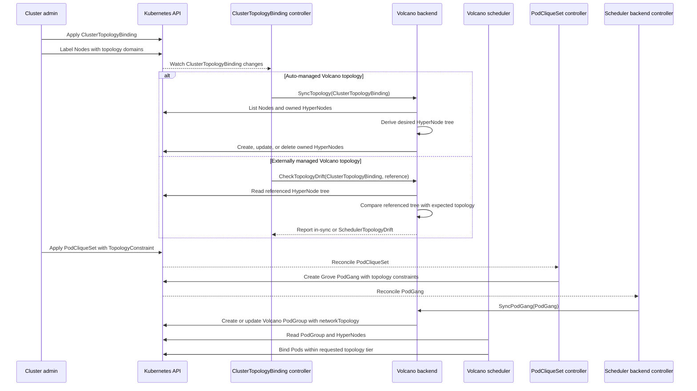
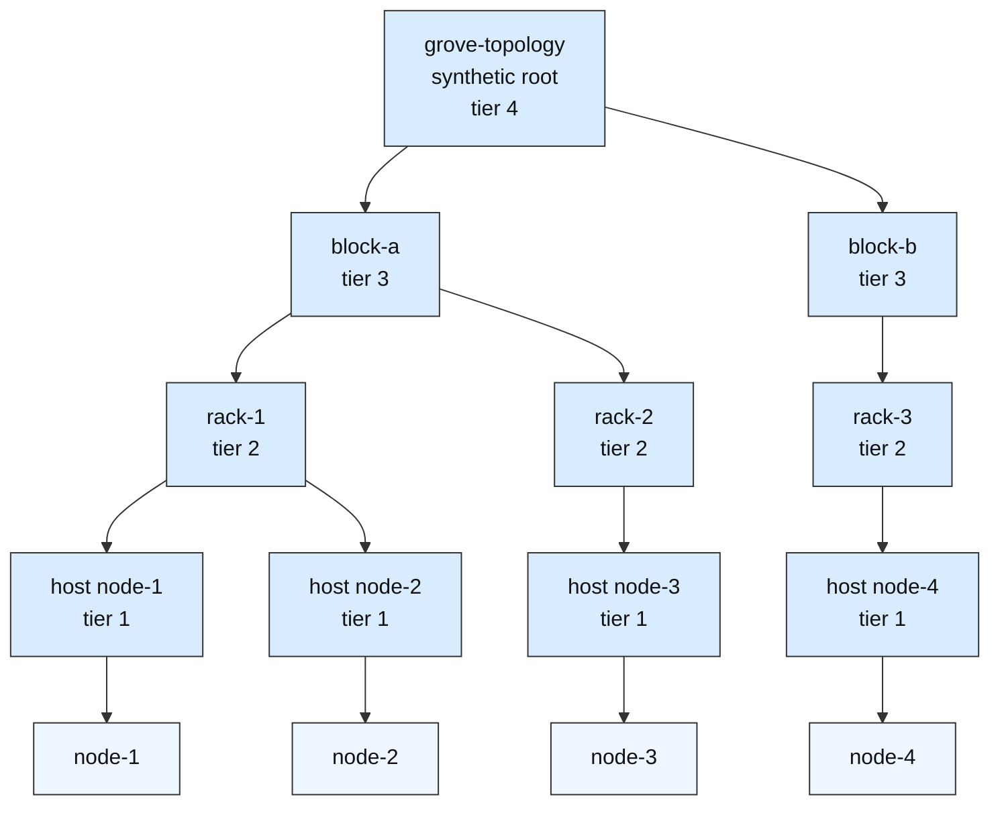

# GREP-377: Volcano Topology-Aware Scheduling Backend

<!-- toc -->
- [Summary](#summary)
- [Motivation](#motivation)
  - [Goals](#goals)
  - [Non-Goals](#non-goals)
- [Proposal](#proposal)
  - [Limitations/Risks &amp; Mitigations](#limitationsrisks--mitigations)
    - [HyperNode Requires Scheduler-Specific Topology Resources](#hypernode-requires-scheduler-specific-topology-resources)
    - [Topology Changes Can Rebuild HyperNodes](#topology-changes-can-rebuild-hypernodes)
    - [Tier Number Mapping](#tier-number-mapping)
    - [Required and Preferred Pack Constraints Share One Volcano Mode](#required-and-preferred-pack-constraints-share-one-volcano-mode)
- [Design Details](#design-details)
  - [Control Flow](#control-flow)
  - [Volcano Scheduler Backend Topology](#volcano-scheduler-backend-topology)
  - [HyperNode Generation](#hypernode-generation)
  - [Externally Managed HyperNodes](#externally-managed-hypernodes)
  - [PodCliqueSet to PodGang to Volcano PodGroup Translation](#podcliqueset-to-podgang-to-volcano-podgroup-translation)
  - [Operator Configuration and Dependencies](#operator-configuration-and-dependencies)
  - [Monitoring](#monitoring)
  - [Test Plan](#test-plan)
- [Appendix](#appendix)
<!-- /toc -->

## Summary

Grove already defines a portable topology-aware scheduling API through `ClusterTopologyBinding`, `TopologyConstraint`, and `PodGang`. This GREP proposes implementing Volcano support for that API by extending the Volcano scheduler backend to implement `TopologyAwareBackend`. The backend will translate Grove `ClusterTopologyBinding` resources into Volcano 1.14+ `HyperNode` resources and translate Grove topology constraints into Volcano `PodGroup.spec.networkTopology` and `PodGroup.spec.subGroupPolicy[*].networkTopology` so Grove workloads can use Volcano for topology-aware gang scheduling.

## Motivation

Grove workloads should be portable across scheduler backends. [GREP-244](../244-topology-aware-scheduling/README.md) defines the Grove topology model, and [GREP-375](../375-scheduler-backend-framework/README.md) defines the scheduler backend framework that lets a scheduler implement topology management without changing the user-facing workload API. [PR #560](https://github.com/ai-dynamo/grove/pull/560) / [GREP-376](https://github.com/ai-dynamo/grove/pull/560) introduces the base Volcano backend for Grove gang scheduling with Volcano `PodGroup` and `subGroupPolicy`. The next step is to make the Volcano backend understand the same topology-aware scheduling intent that KAI already supports.

Volcano 1.14+ exposes topology-aware scheduling through two related primitives:

* `HyperNode` resources model the scheduler-visible network topology hierarchy.
* `networkTopology` fields on Volcano jobs, `PodGroup`, and `subGroupPolicy` express how far a workload or subgroup may cross that hierarchy.

Volcano expresses topology as a HyperNode tree. Leaf HyperNodes contain real Nodes, while non-leaf HyperNodes contain child HyperNodes. Grove `ClusterTopologyBinding` defines a portable hierarchy of domain names and Node label keys, so the Volcano backend must materialize a scheduler-specific HyperNode tree by grouping Nodes according to the administrator-declared `ClusterTopologyBinding` label keys, while preserving Grove's portable domain-based workload API.

### Goals

* Add Volcano as a topology-aware scheduler backend by implementing the `TopologyAwareBackend` interface.
* Translate each Grove `ClusterTopologyBinding` into Volcano `HyperNode` resources when the topology is auto-managed by Grove.
* Support externally managed Volcano HyperNodes through `schedulerTopologyBindings` and drift detection.
* Translate Grove `TopologyConstraint.pack.required` to Volcano `networkTopology.highestTierAllowed` with `mode: hard`, using the numeric tier derived from the referenced `ClusterTopologyBinding` level.
* Translate Grove `TopologyConstraint.pack.preferred` to Volcano `networkTopology.highestTierAllowed` with `mode: soft` when no required pack constraint is present.
* Preserve the base Volcano gang scheduling behavior defined by [GREP-376](https://github.com/ai-dynamo/grove/pull/560) while adding topology constraints to the generated Volcano `PodGroup`.
* Document the Volcano 1.14+ API requirements for users and cluster administrators.

### Non-Goals

* Defining new Grove user-facing topology APIs. This GREP uses the APIs from [GREP-244](../244-topology-aware-scheduling/README.md).
* Implementing automatic topology level discovery. Grove will only instantiate the levels declared by `ClusterTopologyBinding`.
* Supporting Volcano versions earlier than 1.14.
* Supporting topology-aware scheduling with Kubernetes `default-scheduler`.
* Changing the `TopologyAwareBackend` interface.
* Replacing Volcano's own network topology plugin behavior or scoring logic.

## Proposal

The Volcano backend will become a topology-aware scheduler backend. When topology-aware scheduling is enabled and Volcano is configured as an active scheduler profile, the ClusterTopologyBinding controller will invoke the Volcano backend through `TopologyAwareBackend` in the same way it invokes the KAI backend.

For auto-managed topologies, Grove will create and maintain Volcano `HyperNode` resources from each `ClusterTopologyBinding`. The generated HyperNodes will form a tree: leaf HyperNodes select real Nodes, and non-leaf HyperNodes reference child HyperNodes. Workload constraints will target those tiers through `networkTopology.highestTierAllowed`, using the numeric tier that corresponds to the requested Grove pack domain.

For externally managed topologies, the administrator can add a Volcano entry to `ClusterTopologyBinding.spec.schedulerTopologyBindings`. Grove will not create or update the referenced HyperNodes, but it will check whether it is compatible with the Grove `ClusterTopologyBinding` and report drift through the standard `SchedulerTopologyDrift` condition and `schedulerTopologyStatuses`.

In this section, `networkTopology` refers to Volcano's workload-side API field on Volcano resources. Volcano `networkTopology` is the constraint that tells Volcano which HyperNode tier a job or subgroup may cross. Therefore this GREP uses both Volcano primitives:

* `HyperNode` as the backend topology resource managed by `TopologyAwareBackend`.
* `PodGroup.spec.networkTopology` and `PodGroup.spec.subGroupPolicy[*].networkTopology` as the translated workload constraints created by `SyncPodGang`.

### Limitations/Risks & Mitigations

#### HyperNode Requires Scheduler-Specific Topology Resources

Grove `ClusterTopologyBinding` stores the portable topology contract, while Volcano schedules against a HyperNode tree. If Nodes are not labeled with the keys referenced by `ClusterTopologyBinding`, Grove cannot place those Nodes into the generated tree.

**Mitigation:** The backend will generate HyperNodes from Nodes that contain all label keys declared in `ClusterTopologyBinding`. Drift and reconciliation errors will be surfaced through the existing `SchedulerTopologyDrift` status path. Documentation will tell administrators to label Nodes before enabling Volcano TAS.

#### Topology Changes Can Rebuild HyperNodes

Changing `ClusterTopologyBinding.spec.levels` or changing Node label keys can alter the generated HyperNodes.

**Mitigation:** Grove will treat auto-managed HyperNodes as derived resources and reconcile them to the latest desired set. Already running Pods are not evicted. Existing limitations from [GREP-244](../244-topology-aware-scheduling/README.md) still apply: topology constraints are guaranteed only for initial scheduling decisions.

#### Tier Number Mapping

Volcano expresses the scheduling boundary with `highestTierAllowed`. In Volcano's HyperNode model, lower tier numbers represent narrower, higher-locality domains, while higher tier numbers represent broader domains.

**Mitigation:** The Volcano backend will derive tier numbers deterministically from the `ClusterTopologyBinding` order. Grove `ClusterTopologyBinding.spec.levels` are ordered broadest to narrowest, so for `N` Grove levels, level index `i` maps to Volcano tier `N - i`. For example, `[block, rack, host]` maps to `block=3`, `rack=2`, and `host=1`. Workload constraints will use `highestTierAllowed`.

#### Required and Preferred Pack Constraints Share One Volcano Mode

Grove can carry both `pack.required` and `pack.preferred` topology constraints at different workload levels, including `PodCliqueSet`, `PodClique`, and `PodCliqueScalingGroup`. Volcano can represent those levels with `PodGroup.spec.networkTopology` for the whole gang and `PodGroup.spec.subGroupPolicy[*].networkTopology` for subgroups. However, each Volcano `networkTopology` object has only one `mode` and one tier boundary.

**Mitigation:** The translation is scope-local. A whole-gang Grove constraint maps to `PodGroup.spec.networkTopology`; each subgroup Grove constraint maps to its own `subGroupPolicy[*].networkTopology`. If a single Grove constraint scope contains only `pack.preferred`, the backend translates it as `mode: soft`. If the same scope contains `pack.required`, the backend preserves the hard boundary with `mode: hard` and does not encode the preferred hint for that scope. The implementation should emit a Kubernetes event or status message explaining that the preferred hint was not translated for Volcano.

## Design Details

### Control Flow



The control flow has two independent reconciliation paths. The ClusterTopologyBinding path prepares Volcano `HyperNode` topology resources. For auto-managed topologies, Grove reconciles the desired HyperNode tree and repairs drift by creating, updating, or deleting the HyperNodes it owns. For externally managed topologies, Grove does not mutate the referenced HyperNode tree; it only checks compatibility and reports `SchedulerTopologyDrift` when the referenced tree no longer matches the expected Grove topology. The workload path translates Grove `PodGang` scheduling intent into a Volcano `PodGroup`. Volcano only has enough information to enforce topology-aware scheduling when both paths are healthy: the HyperNodes describe the topology tiers, and the PodGroup `networkTopology` fields describe the workload's requested boundary.

### Volcano Scheduler Backend Topology

The Volcano backend will implement the existing optional [`TopologyAwareBackend`](../../../operator/internal/scheduler/types.go) interface. This GREP does not copy the interface definition so future interface changes stay reflected by the source code.

For Volcano:

* `TopologyGVR()` returns `topology.volcano.sh/v1alpha1, Resource=hypernodes`.
* `TopologyResourceName(ct)` returns the synthetic root HyperNode name for the `ClusterTopologyBinding`. The default name is the `ClusterTopologyBinding` name.
* `SyncTopology()` lists Nodes, derives the desired HyperNode tree from the `ClusterTopologyBinding` levels and Node label values, and creates or updates all auto-managed HyperNodes for the `ClusterTopologyBinding`.
* `OnTopologyDelete()` is a no-op because every auto-managed HyperNode will have the `ClusterTopologyBinding` as its controller owner, allowing Kubernetes garbage collection to cascade-delete them.
* `CheckTopologyDrift()` compares the externally managed HyperNode tree rooted at `ref.TopologyReference` with the desired topology derived from `ClusterTopologyBinding` and Node labels.

### HyperNode Generation

The generated HyperNodes are derived from `ClusterTopologyBinding.spec.levels` and the current Node label values. The order of `spec.levels` remains broadest to narrowest, matching [GREP-244](../244-topology-aware-scheduling/README.md).

Given this `ClusterTopologyBinding`:

```yaml
apiVersion: grove.io/v1alpha1
kind: ClusterTopologyBinding
metadata:
  name: grove-topology
spec:
  levels:
    - domain: block
      key: topology.grove.io/block
    - domain: rack
      key: topology.grove.io/rack
    - domain: host
      key: kubernetes.io/hostname
```

The Volcano backend will create value-level HyperNodes for each topology domain. Leaf HyperNodes select real Nodes. Non-leaf HyperNodes reference child HyperNodes by exact name. A synthetic root HyperNode named after the `ClusterTopologyBinding` ties the generated tree together and is the resource returned by `TopologyResourceName()`.

For example, assume the cluster has four Nodes with the following labels:

| Node   | `topology.grove.io/block` | `topology.grove.io/rack` | `kubernetes.io/hostname` |
| ------ | ------------------------- | ------------------------ | ------------------------ |
| node-1 | block-a                   | rack-1                   | node-1                   |
| node-2 | block-a                   | rack-1                   | node-2                   |
| node-3 | block-a                   | rack-2                   | node-3                   |
| node-4 | block-b                   | rack-3                   | node-4                   |

> NOTE: Each generated HyperNode will include Grove management labels and a `ClusterTopologyBinding` controller owner reference. The example below omits repeated metadata fields for readability.

```yaml
apiVersion: topology.volcano.sh/v1alpha1
kind: HyperNode
metadata:
  name: grove-topology
spec:
  tier: 4
  members:
    - type: HyperNode
      selector:
        exactMatch:
          name: grove-topology-block-block-a
    - type: HyperNode
      selector:
        exactMatch:
          name: grove-topology-block-block-b
---
apiVersion: topology.volcano.sh/v1alpha1
kind: HyperNode
metadata:
  name: grove-topology-block-block-a
spec:
  tier: 3
  members:
    - type: HyperNode
      selector:
        exactMatch:
          name: grove-topology-block-block-a-rack-rack-1
    - type: HyperNode
      selector:
        exactMatch:
          name: grove-topology-block-block-a-rack-rack-2
---
apiVersion: topology.volcano.sh/v1alpha1
kind: HyperNode
metadata:
  name: grove-topology-block-block-b
spec:
  tier: 3
  members:
    - type: HyperNode
      selector:
        exactMatch:
          name: grove-topology-block-block-b-rack-rack-3
---
apiVersion: topology.volcano.sh/v1alpha1
kind: HyperNode
metadata:
  name: grove-topology-block-block-a-rack-rack-1
spec:
  tier: 2
  members:
    - type: HyperNode
      selector:
        exactMatch:
          name: grove-topology-block-block-a-rack-rack-1-host-node-1
    - type: HyperNode
      selector:
        exactMatch:
          name: grove-topology-block-block-a-rack-rack-1-host-node-2
---
apiVersion: topology.volcano.sh/v1alpha1
kind: HyperNode
metadata:
  name: grove-topology-block-block-a-rack-rack-2
spec:
  tier: 2
  members:
    - type: HyperNode
      selector:
        exactMatch:
          name: grove-topology-block-block-a-rack-rack-2-host-node-3
---
apiVersion: topology.volcano.sh/v1alpha1
kind: HyperNode
metadata:
  name: grove-topology-block-block-b-rack-rack-3
spec:
  tier: 2
  members:
    - type: HyperNode
      selector:
        exactMatch:
          name: grove-topology-block-block-b-rack-rack-3-host-node-4
---
apiVersion: topology.volcano.sh/v1alpha1
kind: HyperNode
metadata:
  name: grove-topology-block-block-a-rack-rack-1-host-node-1
spec:
  tier: 1
  members:
    - type: Node
      selector:
        labelMatch:
          matchLabels:
            kubernetes.io/hostname: node-1
---
apiVersion: topology.volcano.sh/v1alpha1
kind: HyperNode
metadata:
  name: grove-topology-block-block-a-rack-rack-1-host-node-2
spec:
  tier: 1
  members:
    - type: Node
      selector:
        labelMatch:
          matchLabels:
            kubernetes.io/hostname: node-2
---
apiVersion: topology.volcano.sh/v1alpha1
kind: HyperNode
metadata:
  name: grove-topology-block-block-a-rack-rack-2-host-node-3
spec:
  tier: 1
  members:
    - type: Node
      selector:
        labelMatch:
          matchLabels:
            kubernetes.io/hostname: node-3
---
apiVersion: topology.volcano.sh/v1alpha1
kind: HyperNode
metadata:
  name: grove-topology-block-block-b-rack-rack-3-host-node-4
spec:
  tier: 1
  members:
    - type: Node
      selector:
        labelMatch:
          matchLabels:
            kubernetes.io/hostname: node-4
```

The resulting HyperNode tree is:



Generated names must be deterministic and valid Kubernetes object names. Value-level HyperNode names include the topology path so equal rack names under different blocks do not collide. If raw label values do not fit object-name constraints, the implementation will sanitize them and add a stable hash suffix. Generated HyperNodes must set the `ClusterTopologyBinding` as their controller owner so Kubernetes garbage collection deletes them with the owning topology. They should also carry Grove labels such as the owning `ClusterTopologyBinding` name and topology domain so they can be listed, updated, and repaired as a set.

For Volcano 1.14+, only leaf HyperNodes point directly to Nodes. Non-leaf HyperNodes point to child HyperNodes using `exactMatch`. `regexMatch` must not be used for members whose type is `HyperNode`.

If a `ClusterTopologyBinding` includes a `host` domain backed by `kubernetes.io/hostname`, each host value is unique, so a faithful Volcano topology needs one leaf HyperNode per Node. This can create many HyperNodes in large clusters. Administrators who do not need Grove `pack.required: host` semantics for Volcano can reduce the object count by omitting the `host` level from the Volcano-targeted `ClusterTopologyBinding`; in that case the narrowest generated HyperNodes, such as rack HyperNodes, can select real Nodes directly with `labelMatch` or `regexMatch`. Grove must not collapse all hosts into a single host HyperNode, because that would make `pack.required: host` behave like a broader domain and weaken the user's requested constraint.

### Externally Managed HyperNodes

Administrators may choose to manage Volcano HyperNodes outside Grove:

```yaml
apiVersion: grove.io/v1alpha1
kind: ClusterTopologyBinding
metadata:
  name: grove-topology
spec:
  levels:
    - domain: block
      key: topology.grove.io/block
    - domain: rack
      key: topology.grove.io/rack
    - domain: host
      key: kubernetes.io/hostname
  schedulerTopologyBindings:
    - schedulerName: volcano
      topologyReference: grove-volcano-root
```

When this reference is present, Grove will not create or mutate the referenced HyperNode. The Volcano backend will verify that the referenced HyperNode exists and that its tier and Node selector match the expected domain from `ClusterTopologyBinding.spec.levels`. It will report mismatches through `schedulerTopologyStatuses[*].inSync=false` and the aggregate `SchedulerTopologyDrift` condition.

### PodCliqueSet to PodGang to Volcano PodGroup Translation

Users do not create Volcano `PodGroup` resources directly, and they never create Grove `PodGang` resources directly either. The user-facing workload API is `PodCliqueSet`. The translation path for Volcano topology-aware scheduling is:

```text
PodCliqueSet
  -> Grove PodGang
  -> Volcano PodGroup
```

A `PodCliqueSet` may carry a topology constraint at the whole-workload level and additional topology constraints at the `PodClique` or `PodCliqueScalingGroup` level. The `PodCliqueSet` controller resolves each Grove topology domain against the referenced `ClusterTopologyBinding` and creates a Grove `PodGang` that contains the resolved topology constraints. [GREP-376](https://github.com/ai-dynamo/grove/pull/560) then defines the base translation from Grove `PodGang` to Volcano `PodGroup`, including `minMember` and `subGroupPolicy`. This GREP adds topology fields to the same generated `PodGroup` and uses Volcano `subGroupPolicy` directly for PodGroup subsets.

For example, a user may submit a disaggregated inference `PodCliqueSet` that requests the whole replica to fit inside one block, while the `prefill` clique must fit inside one rack:

```yaml
apiVersion: grove.io/v1alpha1
kind: PodCliqueSet
metadata:
  name: disaggregated-inference
  namespace: default
spec:
  replicas: 1
  template:
    topologyConstraint:
      topologyName: grove-topology
      pack:
        required: block
    cliques:
      - name: prefill
        topologyConstraint:
          topologyName: grove-topology
          pack:
            required: rack
        spec:
          roleName: prefill
          replicas: 4
          podSpec:
            schedulerName: volcano
            containers:
              - name: prefill
                image: example.com/prefill:latest
      - name: decode
        spec:
          roleName: decode
          replicas: 8
          podSpec:
            schedulerName: volcano
            containers:
              - name: decode
                image: example.com/decode:latest
```

The `PodCliqueSet` controller translates that workload into a Grove `PodGang` with both a gang-level topology constraint and a subgroup topology constraint. The `pack.required` values from the user-facing `PodCliqueSet` are resolved through `ClusterTopologyBinding` into the corresponding Node label keys:

```yaml
apiVersion: scheduler.grove.io/v1alpha1
kind: PodGang
metadata:
  name: disaggregated-inference
  namespace: default
spec:
  topologyConstraint:
    packConstraint:
      required: topology.grove.io/block
  topologyConstraintGroupConfigs:
    - name: prefill
      podGroupNames:
        - prefill
      topologyConstraint:
        packConstraint:
          required: topology.grove.io/rack
  podgroups:
    - name: prefill
      minReplicas: 4
      podReferences:
        - namespace: default
          name: prefill-0
        - namespace: default
          name: prefill-1
        - namespace: default
          name: prefill-2
        - namespace: default
          name: prefill-3
    - name: decode
      minReplicas: 8
      podReferences:
        - namespace: default
          name: decode-0
        - namespace: default
          name: decode-1
        # ... decode-2 through decode-7 omitted for brevity
```

The Volcano backend translates this into a single Volcano `PodGroup`. The gang-level topology constraint becomes `PodGroup.spec.networkTopology`, and the subset constraint becomes an entry in `PodGroup.spec.subGroupPolicy`:

```yaml
apiVersion: scheduling.volcano.sh/v1beta1
kind: PodGroup
metadata:
  name: disaggregated-inference
  namespace: default
spec:
  minMember: 12
  networkTopology:
    mode: hard
    highestTierAllowed: 3
  subGroupPolicy:
    - name: prefill
      subGroupSize: 4
      minSubGroups: 1
      labelSelector:
        matchLabels:
          grove.io/podgang-podgroup: prefill
      networkTopology:
        mode: hard
        highestTierAllowed: 2
    - name: decode
      subGroupSize: 8
      minSubGroups: 1
      labelSelector:
        matchLabels:
          grove.io/podgang-podgroup: decode
```

The translation computes `highestTierAllowed` from the required topology key and the referenced `ClusterTopologyBinding`. For `[block, rack, host]`, a required key of `topology.grove.io/block` becomes `highestTierAllowed: 3`, `topology.grove.io/rack` becomes `highestTierAllowed: 2`, and `kubernetes.io/hostname` becomes `highestTierAllowed: 1`.

If a topology constraint only has `pack.preferred`, the `PodCliqueSet` controller resolves it into `PodGang.spec.topologyConstraint.packConstraint.preferred`, and the Volcano backend translates it with `mode: soft`:

```yaml
networkTopology:
  mode: soft
  highestTierAllowed: 2
```

If both `pack.required` and `pack.preferred` are present on the same Grove topology constraint, the Volcano backend must preserve the hard scheduling boundary first. Volcano `networkTopology` has one mode and one tier boundary, so the backend will translate the required constraint with `mode: hard` and will not encode the preferred hint in the generated `PodGroup`. The implementation should emit a Kubernetes event or status message explaining that the preferred hint was not translated for Volcano.

If a PodGang has no topology constraints, the Volcano backend will keep generating a normal Volcano `PodGroup` without `networkTopology` fields.

### Operator Configuration and Dependencies

Volcano topology-aware scheduling requires:

* Volcano 1.14 or newer.
* `podgroups.scheduling.volcano.sh` CRD.
* `hypernodes.topology.volcano.sh` CRD.
* Volcano scheduler configured according to [GREP-376](https://github.com/ai-dynamo/grove/pull/560)'s Volcano 1.14+ requirement, with topology-aware scheduling APIs available.
* Grove `topologyAwareScheduling.enabled=true`.
* A Volcano scheduler profile enabled in `OperatorConfiguration`.

The Volcano scheduler profile name is `volcano`, consistent with [GREP-376](https://github.com/ai-dynamo/grove/pull/560). A topology-aware workload that selects Volcano must be rejected at admission if Volcano is not enabled.

### Monitoring

This feature uses the existing topology monitoring model from [GREP-244](../244-topology-aware-scheduling/README.md):

* `ClusterTopologyBinding.status.conditions[type=SchedulerTopologyDrift]` reports aggregate backend topology health.
* `ClusterTopologyBinding.status.schedulerTopologyStatuses` reports Volcano-specific drift details, including the referenced root HyperNode and observed generation.
* `PodCliqueSet.status.conditions[type=TopologyLevelsUnavailable]` reports workloads whose referenced topology or domain is unavailable.
* Volcano `PodGroup.status.phase` and `PodGroup.status.conditions` remain the scheduler-side signal for pending, running, and unschedulable workloads.

The implementation should emit Kubernetes events when HyperNode sync fails, when an externally managed HyperNode drifts, and when a PodGroup cannot be generated with required topology constraints.

### Test Plan

Unit tests:

* Verify `TopologyGVR()` returns `topology.volcano.sh/v1alpha1` and `hypernodes`.
* Verify deterministic HyperNode generation from a `ClusterTopologyBinding`.
* Verify generated HyperNodes use `labelMatch` selectors with the expected `ClusterTopologyBinding` label keys.
* Verify `SyncTopology()` creates, updates, and deletes stale auto-managed HyperNodes.
* Verify generated HyperNodes have `ClusterTopologyBinding` owner references and are eligible for Kubernetes garbage collection on topology deletion.
* Verify `CheckTopologyDrift()` returns in-sync for matching externally managed HyperNodes and drift for missing HyperNode, wrong tier, or mismatched Node selector.
* Verify `pack.required` translation uses `networkTopology.highestTierAllowed` with `mode: hard`.
* Verify `pack.preferred`-only translation uses `networkTopology.highestTierAllowed` with `mode: soft`.
* Verify constraints that set both `pack.required` and `pack.preferred` preserve the required constraint and report that the preferred hint was not translated for Volcano.
* Verify PodGang-level topology constraints populate `PodGroup.spec.networkTopology`.
* Verify subgroup-level topology constraints populate `PodGroup.spec.subGroupPolicy[*].networkTopology`.

Integration and e2e tests:

* Install Volcano 1.14+ and apply a `ClusterTopologyBinding`.
* Create a Grove workload with a PodGang-level topology constraint and confirm the generated Volcano `PodGroup` contains the expected `networkTopology`.
* Create a workload with subgroup topology constraints and confirm the generated `subGroupPolicy` entries contain the expected `networkTopology`.
* Confirm Pods schedule within the requested HyperNode tier when enough resources exist.
* Confirm the workload remains pending and surfaces useful status when the topology constraint cannot be satisfied.

## Appendix

Related work:

* [GREP-244: Topology Aware Scheduling](../244-topology-aware-scheduling/README.md)
* [GREP-375: Scheduler Backend Framework](../375-scheduler-backend-framework/README.md)
* [GREP-376: Volcano Gang Scheduling Backend](https://github.com/ai-dynamo/grove/pull/560), proposed in [PR #560](https://github.com/ai-dynamo/grove/pull/560)
* Volcano 1.14+ `HyperNode` API in `topology.volcano.sh/v1alpha1`
* Volcano 1.14+ `PodGroup.spec.networkTopology` and `PodGroup.spec.subGroupPolicy[*].networkTopology`
