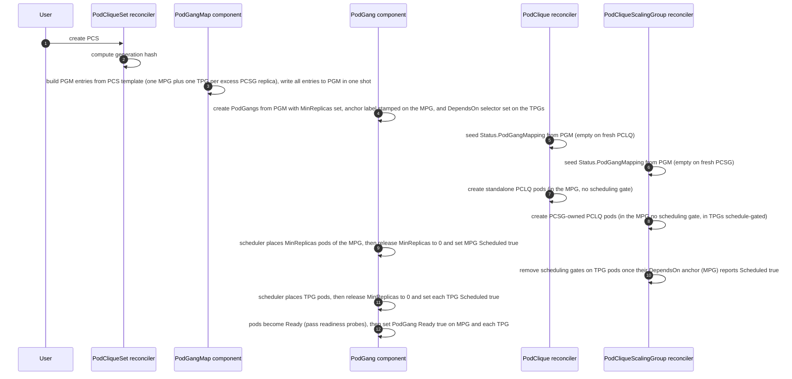
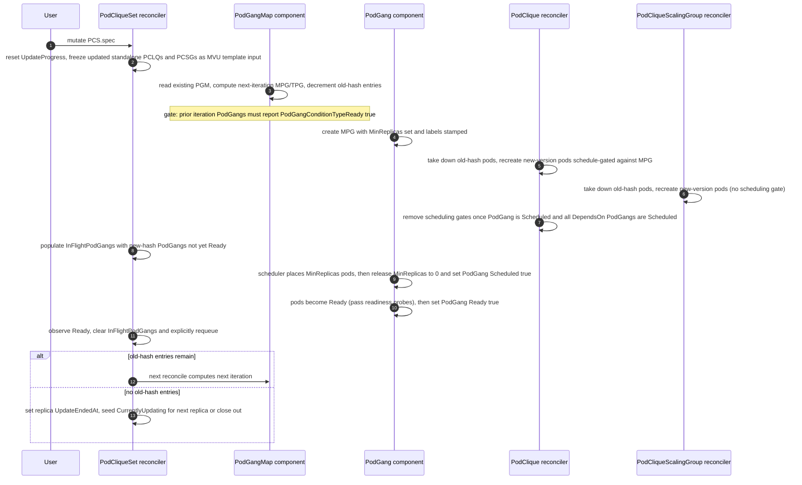
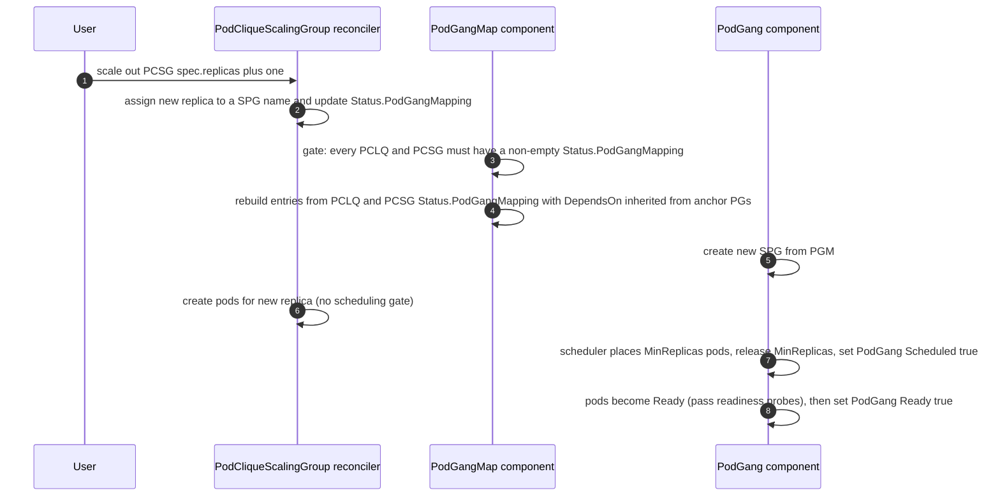
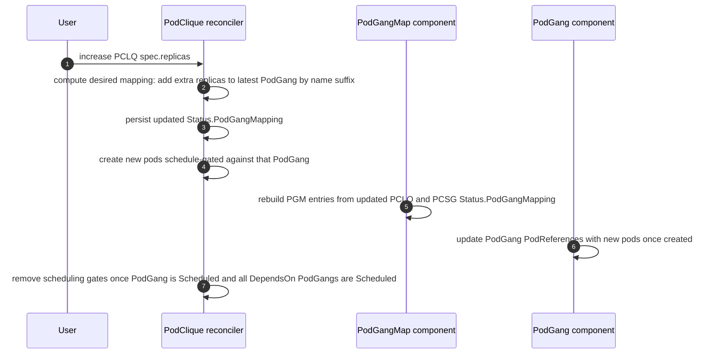
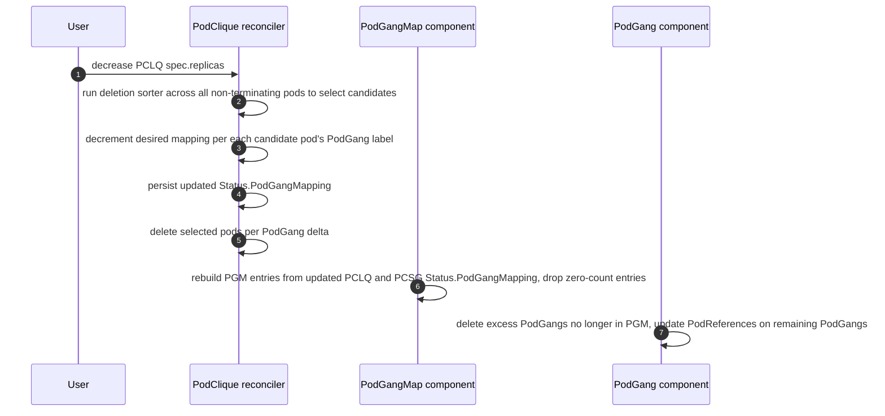

# GREP-393: Coherent Rolling Updates


<!-- toc -->
- [Summary](#summary)
- [Motivation](#motivation)
  - [Why cross-version communication is considered unsafe in Disaggregated Inference?](#why-cross-version-communication-is-considered-unsafe-in-disaggregated-inference)
  - [Goals](#goals)
  - [Non-Goals](#non-goals)
- [Abbreviations](#abbreviations)
- [Proposal](#proposal)
  - [PodGang variants](#podgang-variants)
  - [User Stories](#user-stories)
    - [Story 1](#story-1)
    - [Story 2](#story-2)
  - [Limitations/Risks &amp; Mitigations](#limitationsrisks--mitigations)
- [Design Details](#design-details)
  - [API Changes](#api-changes)
    - [<code>UpdateStrategyType</code> — <code>Coherent</code> is the default](#updatestrategytype--coherent-is-the-default)
    - [<code>PodGangMap</code> — new CRD](#podgangmap--new-crd)
    - [<code>PodCliqueSetStatus.UpdateProgress</code> extensions for Coherent update strategy](#podcliquesetstatusupdateprogress-extensions-for-coherent-update-strategy)
      - [Capturing MVU scope in <code>PodCliqueSetUpdateProgress</code>](#capturing-mvu-scope-in-podcliquesetupdateprogress)
      - [Per-replica iteration tracking on <code>PodCliqueSetReplicaUpdateProgress</code>](#per-replica-iteration-tracking-on-podcliquesetreplicaupdateprogress)
    - [<code>PodGangMapping</code> on <code>PodCliqueStatus</code> and <code>PodCliqueScalingGroupStatus</code>](#podgangmapping-on-podcliquestatus-and-podcliquescalinggroupstatus)
    - [Labels on PodGang resources](#labels-on-podgang-resources)
  - [Gang scheduling during initial deployment of PCS](#gang-scheduling-during-initial-deployment-of-pcs)
  - [Coherent update behavior and flow](#coherent-update-behavior-and-flow)
    - [Actors and responsibilities](#actors-and-responsibilities)
    - [<code>PodGangMap</code> as source of truth — directionality flip](#podgangmap-as-source-of-truth--directionality-flip)
    - [Rules of MPG composition](#rules-of-mpg-composition)
    - [Coherent update flow](#coherent-update-flow)
      - [Bootstrap (initial PCS deploy)](#bootstrap-initial-pcs-deploy)
      - [One coherent update iteration](#one-coherent-update-iteration)
      - [Steady-state PGM follower (post-update)](#steady-state-pgm-follower-post-update)
      - [Steady-state standalone PCLQ scale-out](#steady-state-standalone-pclq-scale-out)
      - [Steady-state standalone PCLQ scale-in](#steady-state-standalone-pclq-scale-in)
    - [PodGang.MinReplicas lifecycle and conditions](#podgangminreplicas-lifecycle-and-conditions)
    - [Gang termination suppression during updates](#gang-termination-suppression-during-updates)
    - [DependsOn and scheduling order](#dependson-and-scheduling-order)
    - [PodGang naming convention](#podgang-naming-convention)
    - [Illustration by example](#illustration-by-example)
  - [PodGang label preservation contract](#podgang-label-preservation-contract)
  - [Update concurrency](#update-concurrency)
  - [Handling scale-outs and scale-ins during update](#handling-scale-outs-and-scale-ins-during-update)
  - [Monitoring](#monitoring)
  - [Dependencies](#dependencies)
  - [Graduation Criteria](#graduation-criteria)
<!-- /toc -->

## Summary

Disaggregated inference architectures split LLM serving into distinct phases — most commonly (but not limited to) **prefill** (context generation) and **decode** (token generation) — running as separate, independently scalable components. While this can improve throughput and hardware utilisation, it introduces a hard operational constraint during version upgrades: prefill and decode instances that communicate must always run compatible software versions. This proposal introduces **Coherent Rolling Updates** for `PodCliqueSet`, enabling atomic, availability-preserving software upgrades at the granularity of **Minimal Viable Units (MVUs)** — the smallest sets of components that must be updated in lockstep to maintain compatibility and ensure availability. `Coherent` is the default `UpdateStrategy` for `PodCliqueSet`.

## Motivation

Inference frameworks (e.g., vLLM, SGLang, TensorRT-LLM) support disaggregated LLM serving, where stages like prefill and decode run as separate, networked components. While this can improve throughput and resource efficiency, it complicates standard deployment practices. A standard Kubernetes rolling update inevitably creates a period where old and new version pods run at the same time and may communicate. In disaggregated systems, this cross-version communication is unsafe, so applications must prevent it. However, once cross-version communication is disabled, rolling updates introduce another issue: different components often update at different rates, which leads to mismatched pools of compatible instances. For example, you might still have many old-version prefill instances running while most old-version decode instances have already been replaced. Since old prefill can only talk to old decode, a portion of the prefill capacity becomes unusable due to the lack of matching decode capacity. This kind of mismatch reduces effective end-to-end serving capacity during the update. Our goal is to design a rolling update strategy that maintains balanced, compatible capacity across components, so version upgrades do not reduce serving capacity.

### Why cross-version communication is considered unsafe in Disaggregated Inference?

AI inference frameworks are evolving rapidly as new architectures/models are released, prioritising performance optimisations over backwards compatibility between versions. In aggregated serving this is generally acceptable — model instances are self-contained within pods of the same version, so internal format changes are invisible to the deployment layer. In disaggregated serving, however, as explained above, a naive rolling update could result in cross-version communication where an old-version prefill may attempt a KV-cache transfer to a new-version decode. Across versions, any number of things can change and break this contract — the KV-cache data layout (dtype, dimension ordering, block size), the protocol used for the transfer handshake, even user-specified updates to the sharding strategy across new versions etc. Ultimately since the kv-cache managers are not backwards compatible and often optimized there is no guarantee that cross version communication is safe and its fairly likely that it is not safe.

### Goals

* Enable rolling updates at a user-chosen granularity: the user selects which components to update in one event, and the system replaces them in lockstep within each MVU so cross-version mixing within the boundary is impossible.
* Each MVU is gang-scheduled as a single unit, so an MVU's pods either come up together at the new version or none of them do.
* Preserve `PodCliqueSet` availability during rolling updates to serve incoming traffic with sets of compatible interdependent components.

### Non-Goals

* Re-use of topology optimized resources during rolling update using resource reservations. Will be handled in future as a separate feature.
* Explicit support for `maxSurge` and `maxUnavailable` API. However, similar concurrency controls and functionality will be supported in future.
* User-configurable concurrency control during a coherent update — neither the number of `PodCliqueSet` replicas updated simultaneously nor the number of MVU iterations in flight per replica is configurable in the current iteration. Both default to one. Configurable knobs will be supported in future.
* `scale-out` and `scale-in` of scale sub-resources (`PodClique`, `PodCliqueScalingGroup`, `PodCliqueSet`) during a coherent update. The current iteration rejects these operations PCS-wide for the duration of an in-flight coherent update — see [Handling scale-outs and scale-ins during update](#handling-scale-outs-and-scale-ins-during-update) for the precise scope and rationale. Narrower per-replica scoping and otherwise composing scale operations with an in-flight coherent update will be supported in future iterations.
* Rollback and roll-forward of `PodCliqueSet` revisions. Tracking PCS revision history and providing operator-driven rollback / roll-forward to a prior version will be supported in future.

## Abbreviations

Throughout this proposal we will be using these short forms for brevity:

| Long Form             | Short Form |
| --------------------- | ---------- |
| PodCliqueSet          | PCS        |
| PodCliqueScalingGroup | PCSG       |
| PodClique             | PCLQ       |
| PodGang               | PG         |
| BasePodGang           | BPG        |
| ScaledPodGang         | SPG        |
| MVUPodGang            | MPG        |
| TailPodGang           | TPG        |
| PodGangMap            | PGM        |
| Minimal Viable Unit   | MVU        |

> ***NOTE:*** `BPG`, `SPG` , `TPG `and `MPG` are abbreviations introduced only to differentiate different types of `PodGang` resources and are not new custom resources. `PGM` is a new custom resource introduced by this GREP..

## Proposal

The GREP introduces a new rolling update strategy, named **Coherent Rolling Updates**, based on the concept of a **Minimal Viable Unit** (a.k.a. MVU).

An MVU is **the set of `MinAvailable` replicas of every component the user has changed in this update event**. The user implicitly defines the compatibility boundary: it is exactly the set of components touched in this update event. Changing only one component (e.g. only `decode`) produces an MVU that contains MinAvailable replicas of just that component; changing multiple components in a single update event (e.g. `prefill` and `decode` together for a non-backward-compatible upgrade) produces an MVU that contains MinAvailable replicas of each.

Components the user has not changed in this update event are not part of the MVU. They continue to serve traffic in their existing PodGangs and are not co-rolled. This is what makes Coherent updates granular: the disruption per update event is bounded by what the user actually changed.

If pods in different PodCliques can't communicate safely across disaggregation boundaries because their software versions are incompatible, updating all pods in an MVU as a unit (rather than individually) eliminates mixed-version imbalance for the components inside the boundary the user has drawn.

### PodGang variants

To realise the MVU model on top of Grove's existing scheduling primitives, Coherent introduces three new kinds of `PodGang` and retains two legacy ones from prior strategies. The full set used throughout this proposal is:

| Name              | Legacy / New | When created | What it holds |
| ----------------- | ------------ | ------------ | ------------- |
| **BPG** (Base PodGang)           | Legacy | Initial deployment under pre-Coherent strategies. | One per PCS replica. Carries `MinAvailable` replicas of every standalone `PodClique` and every `PodCliqueScalingGroup`. |
| **SPG** (Scaled PodGang)         | Legacy / New | One per PCSG replica above `MinAvailable` — created at initial deployment under pre-Coherent strategies, or during steady-state PCSG scale-out after a coherent update. Under the legacy naming convention the name is `<pcs-name>-<replica>-scaled-<n>`; under the new convention (post first coherent update) the name follows `<pcs-name>-<replica>-<unix-nano>`. Structurally the same as a TPG but created outside an update window. | A single PCSG replica. |
| **MPG** (Minimum-Viable PodGang) | New    | Initial deployment under `Coherent`, and again on every iteration of a coherent update. | The smallest PodGang that satisfies availability — `MinAvailable` replicas of every standalone `PodClique` and every `PodCliqueScalingGroup`. Plays the same role BPG used to, but is generated fresh on each update iteration rather than persisted across updates. |
| **TPG** (Tail PodGang)           | New    | During a coherent update, alongside an MPG. | PCSG replicas above `MinAvailable` that need to roll in lockstep with the MPG. Depends on the MPG via `DependsOn`, so the scheduler places it only after the MPG is up. |

A single PCS replica can hold a mix of these variants at any given moment — for example, mid-update a replica might still have its old-hash MPG and TPGs present alongside a new-hash MPG and new-hash TPGs, until the old gangs are fully drained.

BPG and SPG are listed only because pre-existing `PodCliqueSet` resources created with the `RollingRecreate` strategy continue to operate against PodGangs of those shapes, and the implementation has to keep recognising them. The intent is that every `PodCliqueSet` eventually adopts `Coherent`, at which point BPG and the legacy SPG naming can be removed from the codebase entirely. A `PodCliqueSet` can opt in by switching its `UpdateStrategy` to `Coherent`; the first coherent update after the switch drains the legacy BPG/SPGs and generates MPG/TPG/SPG (under the new naming convention) to replace them.

### User Stories

#### Story 1

As a platform engineer operating a disaggregated inference deployment (e.g., prefill and decode components) using modern inference frameworks (such as vLLM, SGLang, or TensorRT-LLM), I need to safely roll out new software versions where components are not backward compatible across versions. During an upgrade, prefills running the old version must not attempt to communicate with decodes running the new version (and vice versa), as this can lead to crashes, corrupted KV transfers, or undefined behavior.

The system must update prefill and decode pods together as a single atomic unit (MVU), ensuring that at no point does an old-version prefill hand off a KV-cache block to a new-version decode, or vice versa. While the update is in progress, replicas that have not yet been updated must continue serving traffic using only old-version components, and replicas that have already been updated must serve using only new-version components. The update should proceed replica-by-replica (or MVU-by-MVU within a replica) without requiring a full deployment restart, so that overall serving capacity is preserved throughout the rollout.

#### Story 2

As an ML infrastructure team member deploying a disaggregated inference system where the prefill tier and decode tier are updated on different release cadences, I need to independently update only the decode `PodClique` (e.g., to pick up a memory-efficiency fix) without touching the prefill `PodClique`. The system should recognise that this is a backward compatible, single-component update and updates decode pods incrementally (up to a configurable concurrency limit), and leave prefill pods untouched — all without requiring a full MVU replacement.

### Limitations/Risks & Mitigations

The current iteration of Coherent Rolling Updates carries the following known limitations. Each is a deliberate scope boundary, with planned follow-up where applicable.

1. **Re-triggering an update while one is in progress is not yet well-supported.** If the user mutates the PCS spec a second time while a coherent update is mid-flight, the system has no formal cancel-and-restart semantics for the in-flight update. The current behavior — the in-flight iteration completes against the previous hash, then the next iteration mints under the newer hash — has not been hardened against corner cases (e.g., a second update that reverts the first while iterations are still running, or that changes the MVU template shape).

   *Mitigation:* operators should let an in-flight coherent update reach completion before triggering another spec change.

2. **No surge-style availability headroom during a coherent update.** Coherent always replaces in place — pods of an updated component are taken down before their new-version replacements are created.

   *Mitigation:* operators who need additional availability headroom during a coherent update can either:
   - Provision more replicas at the PCLQ / PCSG level (so MinAvailable < Replicas, and the surplus continues serving while the MinAvailable floor is rolled), or
   - Provision more PCS replicas (so a fraction of the fleet is always at a non-updating replica index).

## Design Details

### API Changes

This section consolidates every API surface added or modified to support Coherent Rolling Updates.

#### `UpdateStrategyType` — `Coherent` is the default

A new value `Coherent` is introduced on `UpdateStrategyType`. It is the **default** `UpdateStrategy` for a `PodCliqueSet`.

```go
// +kubebuilder:validation:Enum={Coherent,RollingRecreate,OnDelete}
type UpdateStrategyType string

const (
    // CoherentStrategy indicates that replicas will be updated in Minimal Viable Units —
    // MinAvailable replicas of each updated standalone PodClique plus MinAvailable replicas of each
    // updated PodCliqueScalingGroup — scheduled atomically as a new PodGang.
    // This is the default update strategy.
    CoherentStrategy UpdateStrategyType = "Coherent"
)

type PodCliqueSetUpdateStrategy struct {
    // Default is Coherent.
    // +kubebuilder:default=Coherent
    Type UpdateStrategyType `json:"type,omitempty"`
}
```

#### `PodGangMap` — new CRD

`PodGangMap` (PGM) is a new namespaced custom resource that captures the **desired-state mapping between PodGangs and their constituent PodClique pod counts and PodCliqueScalingGroup replica indices** for a single `PodCliqueSet` replica. One `PodGangMap` exists per PCS replica, named `<pcs-name>-<pcs-replica-index>`.

`PodGangMap` has no `Status` subresource as it only captures the desired-state. Mappings captured in this resource are read by the `PodGang` in PCS reconciler, `PodClique` component in PCSG reconciler and `Pod` component in PCLQ reconciler.

```go
type PodGangMap struct {
    metav1.TypeMeta   `json:",inline"`
    metav1.ObjectMeta `json:"metadata,omitempty"`
    Spec              PodGangMapSpec `json:"spec,omitempty"`
}

type PodGangMapSpec struct {
    // PodCliqueSetReplicaIndex is the index of the PodCliqueSet replica this map belongs to.
    PodCliqueSetReplicaIndex int32 `json:"podCliqueSetReplicaIndex"`
    // Entries is the ordered list of desired PodGangs for this PodCliqueSet replica.
    // +listType=map
    // +listMapKey=name
    Entries []PodGangEntry `json:"entries"`
}

type PodGangEntry struct {
    // Name is the name of the PodGang this entry corresponds to.
    Name string `json:"name"`
    // PodCliqueSetGenerationHash is the PCS generation hash that pods in this PodGang must match.
    PodCliqueSetGenerationHash string `json:"podCliqueSetGenerationHash"`
    // PodCliques maps standalone PodClique name to the number of pods that belong to this PodGang.
    // +optional
    PodCliques map[string]int32 `json:"podCliques,omitempty"`
    // PCSGReplicaIndices maps PodCliqueScalingGroup config name to the PCSG replica indices
    // that belong to this PodGang.
    // +optional
    PCSGReplicaIndices map[string][]int32 `json:"pcsgReplicaIndices,omitempty"`
    // Labels are stamped on the materialized PodGang resource by the PodGang component.
    // The PodGangMap component populates this with labels needed for scheduling-order semantics
    // (see [DependsOn and scheduling order]) and any additional labels future iterations require.
    // +optional
    Labels map[string]string `json:"labels,omitempty"`
    // DependsOn is a label selector identifying sibling PodGangs whose pods must be scheduled
    // before pods in this entry's PodGang have their scheduling gates removed. A nil selector
    // means no dependency. See [DependsOn and scheduling order] for the selector authoring rules.
    // +optional
    DependsOn *metav1.LabelSelector `json:"dependsOn,omitempty"`
}
```

> **NOTE:** 
> The `+listType=map` and `+listMapKey=name` annotations on `Entries` are load-bearing on the API contract:
>
> - **Server-side merge semantics.** Patches against `PodGangMap` are merged by entry name rather than replacing the entire `Entries` slice atomically. Each reconcile emits minimal per-entry patches, and changes to one entry never clobber unrelated entries.
> - **Uniqueness of `Entries[*].Name`.** The API server rejects any object where two entries share the same name. This matches the operator's invariant that every PodGang name within a PCS replica is unique, and saves the PodGangMap component from having to defend against duplicates at runtime.
>
> These annotations should be preserved on any future modification of the field.

The `Labels` field is the mechanism by which the PodGangMap component conveys per-entry labels to the PodGang component. It keeps the materialized-PodGang label set under the PodGangMap component's authoring control without requiring per-label fields in the PGM schema — additional labels can be introduced in the future by populating this map, and labels can be removed simply by omitting them.

The role of `PodGangMap` in the update flow — and the directionality flip between update and steady state — is described in [Coherent update behavior and flow](#coherent-update-behavior-and-flow).

#### `PodCliqueSetStatus.UpdateProgress` extensions for Coherent update strategy

##### Capturing MVU scope in `PodCliqueSetUpdateProgress`

Two new fields are added to `PodCliqueSetUpdateProgress` to capture the **frozen set of components** detected as out-of-date when a coherent update started. This is used to deterministically compute the MVU template.

```go
type PodCliqueSetUpdateProgress struct {
    // ... existing fields ...

    // UpdatedStandalonePodCliques captures the names of standalone PodCliques whose pod template
    // was detected as out-of-date when this coherent update started. The set is frozen for the
    // lifetime of the update and used to compute the MVU template. Only populated for Coherent.
    // +optional
    UpdatedStandalonePodCliques []string `json:"updatedStandalonePodCliques,omitempty"`

    // UpdatedPodCliqueScalingGroups captures the config names of PodCliqueScalingGroups that had
    // at least one constituent PodClique detected as out-of-date when this coherent update started.
    // Same lifetime semantics as UpdatedStandalonePodCliques. Only populated for Coherent.
    // +optional
    UpdatedPodCliqueScalingGroups []string `json:"updatedPodCliqueScalingGroups,omitempty"`
}
```

Each PCLQ reports its current pod-template hash in status. During a rolling update that hash flips from old to new as pods are replaced, so any "what's still out-of-date?" computation against live status would shrink as the update progresses. If the MVU template were derived that way, components would silently drop out of scope the moment they finished rolling — and the bounded-disruption guarantee ("MinAvailable replicas of *each* updated component") would no longer be enforceable, because the controller would have lost track of which components were originally in scope. The snapshot is therefore taken once at update start and held fixed.

##### Per-replica iteration tracking on `PodCliqueSetReplicaUpdateProgress`

`PodCliqueSetReplicaUpdateProgress` gains two coherent-specific fields:

```go
type PodCliqueSetReplicaUpdateProgress struct {
    // ... existing fields ...

    // InFlightPodGangs are the names of PodGangs that are part of the current update iteration
    // for this replica. The orchestrator waits for all of them to reach `PodGangConditionTypeReady=True` before
    // advancing to the next iteration.
    // +optional
    InFlightPodGangs []string `json:"inFlightPodGangs,omitempty"`

    // ErrorMessage captures the reason the update of this replica is stalled or failing, if any.
    // +optional
    ErrorMessage *string `json:"errorMessage,omitempty"`
}
```

`InFlightPodGangs` is the orchestrator's hand-off to the PodGangMap component and back. In addition it also provide visibility into what PodGang(s) are currently getting updated. A coherent update for a PodCliqueSet replica proceeds in two phases: 

* The **MPG phase**: In this phase MPGs are taken up one at a time — each MPG is rolled to the new hash, and only once it reports `PodGangConditionTypeReady=True` does the orchestrator move on to the next MPG 
* The **TPG phase**: Once every MPG report `PodGangConditionTypeReady=True` , all remaining TPGs are rolled together in a single iteration. 

In both phases the mechanism is the same. While `InFlightPodGangs` is empty, the PodGangMap component computes the next iteration's entries — creating the new-hash PodGangs and draining pods off the corresponding old-hash entries. The orchestrator then reads PGM, picks the new-hash entries that are not yet `Ready`, and writes their names into `InFlightPodGangs`. It waits for every listed PodGang to reach `PodGangConditionTypeReady=True`, at which point it clears the field — which signals the PodGangMap component to compute the next iteration. The field is per-replica so that future configurable concurrency across replicas does not require a schema change.

#### `PodGangMapping` on `PodCliqueStatus` and `PodCliqueScalingGroupStatus`

Both `PodCliqueStatus` and `PodCliqueScalingGroupStatus` gain a `PodGangMapping` field that captures the per-PodGang composition for that owner. The shapes differ — PCLQ is keyed by PodGang and valued by pod count; PCSG is keyed by PodGang and valued by the list of PCSG replica indices belonging to that PodGang — but the role each field plays in the design is identical.

```go
type PodCliqueStatus struct {
    // ... existing fields ...

    // PodGangMapping captures the desired state of per-PodGang pod distribution.
    // During an update, this is derived from the PodGangMap resource — PodGangMap is the
    // single source of truth during updates. In steady state (post-update) this field becomes
    // the source of truth: scale-out and scale-in are reflected here, and PodGangMap is then
    // synced from this field.
    // Key is the PodGang name; value is the number of pods of this PodClique associated with
    // that PodGang.
    PodGangMapping map[string]int32 `json:"podGangMapping,omitempty"`
}

type PodCliqueScalingGroupStatus struct {
    // ... existing fields ...

    // PodGangMapping captures the desired state of per-PodGang replica distribution.
    // Same directionality semantics as PodCliqueStatus.PodGangMapping.
    // Key is the PodGang name; value is the list of PCSG replica indices associated with
    // that PodGang.
    PodGangMapping map[string][]int32 `json:"podGangMapping,omitempty"`
}
```

**Why are these fields needed at all, given that `PodGangMap` already captures per-PodGang composition?**  
It is the directionality flip already described in [`PodGangMap` as source of truth — directionality flip](#podgangmap-as-source-of-truth--directionality-flip): during a coherent update PGM drives and these status fields are followers; in steady state these status fields are authoritative and PGM is rebuilt from them. PGM has a single writer (the PodGangMap component, owned by the PodCliqueSet reconciler), so any per-owner scale-in or scale-out decision needs a place to live within the owner's own reconciler before the PodGangMap component picks it up. That place is `Status.PodGangMapping`.

What forces the field to exist is steady-state scale-in, but the *reason* the decision must be local — and therefore stored on the owner's status — is different for PCLQ and PCSG:

- **PodClique (standalone).** When `PodClique.Spec.Replicas` shrinks, the PodClique reconciler's pod component picks the pods to remove using a deletion sorter that considers pod-template-hash mismatch, readiness, age, and other heuristics over the live pod set. The chosen pods can come from any of the existing PodGangs and the pick is **non-deterministic from outside** the pod component — it depends on which pods exist at that instant. The pod component records the per-PodGang decrement in `PodCliqueStatus.PodGangMapping` during a scale-in, since only it knows which PodGang each removed pod was associated with.
- **PodCliqueScalingGroup.** When `PodCliqueScalingGroup.Spec.Replicas` shrinks, the PodCliqueScalingGroup reconciler's PodClique component runs a deterministic tier walk over the existing PodGang names — legacy SPG entries first, then unified-naming entries — sorted by trailing PodGang-name suffix descending, and pops the highest replica index from each entry until the scale-in count is satisfied. So although the PCSG-side pick is fully deterministic, the work — selecting which entry to drain and which replica index to pop from it — still happens inside the PodCliqueScalingGroup reconciler. The PodCliqueScalingGroup reconciler records the resulting decrement in `PodCliqueScalingGroupStatus.PodGangMapping` so the PodGangMap component can rebuild PGM from it on the next reconcile.

In both cases the directionality contract is the same: the scale decision is made and persisted by the owning reconciler in its own `Status.PodGangMapping`; the PodGangMap component, in its steady-state path, gates on every standalone PCLQ and every PCSG having a non-empty `Status.PodGangMapping`, then reconstructs PGM entries from the union of those mappings. During a coherent update the directionality is reversed — the owning reconciler's pod / PodClique component overwrites `Status.PodGangMapping` from PGM each reconcile.

#### Labels on PodGang resources

In addition to the standard PCS-managed-resource labels mirrored by the PodGang component (`grove.io/part-of`, `grove.io/component`, `grove.io/managed-by`, etc.), every `PodGang` resource managed by Coherent carries the following coherent-update-specific labels:

| Label | Purpose |
| --- | --- |
| `grove.io/podcliqueset-replica-index` | The PCS replica this PodGang belongs to. Allows the operator to identify the owning replica without parsing the PodGang name. |
| `grove.io/podcliqueset-generation-hash` | The PCS generation hash this PodGang was created for. Used by the PodGangMap component to distinguish old-hash from new-hash PodGangs during an update. |
| `scheduling.grove.io/anchor` | Set to `"true"` on every MPG (and on every legacy BPG). Absent on TPGs and SPGs. Used by `DependsOn` selectors to identify the dependency target — see [DependsOn and scheduling order](#dependson-and-scheduling-order). |

These labels are populated via the `Labels` field on the `PodGangEntry` (see [PodGangMap — new CRD](#podgangmap--new-crd)) and stamped onto the materialized `PodGang` resource by the PodGang component on creation.

The contract for the existing `grove.io/podgang` label on `PodClique` resources changes — see [PodGang label preservation contract](#podgang-label-preservation-contract).

### Gang scheduling during initial deployment of PCS

**Legacy behavior (prior to Coherent).** Grove's scheduling API uses PodGangs to represent an application's gang-scheduling constraints. Under the prior design, the first PodGang created as part of a PCS's initial deployment was called the `BasePodGang` (BPG); it carried MinAvailable replicas of every standalone PCLQ and every PCSG. For each PCSG replica above MinAvailable, a separate `ScaledPodGang` (SPG) was created — one PodGang per excess PCSG replica. Both BPG and SPGs persisted across update events: their `PodReferences` were refreshed as pods came and went, but the PodGangs themselves — and the overall BPG/SPG layout — were never torn down and rebuilt.

**New behavior under Coherent.** New PCS deployments produce the following layout in one shot at deploy time:

- **One MPG (Minimum-Viable PodGang)** carrying the full standalone-PCLQ count plus MinAvailable replicas of every PCSG. The MPG carries `scheduling.grove.io/anchor: "true"`.
- **One TPG (Tail PodGang)** per PCSG replica above MinAvailable. Each TPG carries a single PCSG replica and `DependsOn = matchLabels{scheduling.grove.io/anchor: "true"}`, so the scheduler places its pods only after the MPG reports `PodGangConditionTypeScheduled=True`.

The PodGangMap component writes the entire PGM in one shot. The PodGang component then materializes a `PodGang` resource for each entry, with `MinReplicas` set to the gang's MinAvailable.

> **Note on layout.** The MPG-plus-TPG layout produced at initial deployment is structurally identical to the legacy BPG-plus-SPG layout — same per-PodGang composition, same dependency relationships. The differences are in naming and in the new mechanisms layered on top: the unified [PodGang naming convention](#podgang-naming-convention), the `scheduling.grove.io/anchor` label and `DependsOn` selector, and the PodGang condition lifecycle. Subsequent coherent updates depart from this layout (each iteration produces its own MPG); evolving the initial-deployment layout to match is left to a future iteration.

> **Migration note.** When the PodGangMap component first runs against a PCS replica that pre-dates this proposal — one already serving traffic with the legacy BPG/SPG shape — it reconstructs PGM entries from the live `PodGang` resources first, so the existing names and `DependsOn` selectors are preserved. Only when no PodGangs exist for the replica does PGM fall back to computing entries from the PCS template. Legacy gangs are not torn down on first reconcile after a Grove upgrade; they get drained out naturally by subsequent coherent updates.

### Coherent update behavior and flow

A PCS is composed of PCLQs and PCSGs. Updates may target a subset of PCLQs or all of them. An MVU consists of `MinAvailable` replicas of each standalone PCLQ (pods) and each PCSG that are updated. The set of out-of-date components is captured in `Status.UpdateProgress` when an update begins, and a validating webhook rejects scale-in/out across the entire PCS for the lifetime of the update (see [Handling scale-outs and scale-ins during update](#handling-scale-outs-and-scale-ins-during-update)) — so the inputs to the MVU template stay fixed from the start of the update to the end. The MVU template itself is recomputed on every reconcile as it is cheap and deterministic, and helps avoid cached state across reconciles thus simplifying the controller.

Grove encodes the MVU's gang-scheduling intent by generating new `PodGang` resources, **MVU PodGangs (MPGs)**, that hold exactly the MVU's pods. PCSG replicas above MinAvailable go into separate **Tail PodGangs (TPGs)** — one per excess replica. Both MPGs and TPGs are gang-scheduled. Each TPG `DependsOn` every MPG of the same generation. The scheduler places TPG pods only after all those MPGs report `Ready=True`.

A coherent update runs in two phases. **MPG phase**: MPGs are rolled one at a time. Each MPG must reach `Ready=True` before the next one starts. **TPG phase**: once every MPG is at the new hash, all remaining TPGs roll together in a single iteration. This bounds disruption — at most one MPG's worth of pods is unavailable at any moment.

The remainder of this section describes:

- The **actors** that collaborate to drive a coherent update.
- The **directionality flip** between update and steady state — `PodGangMap` is the source of truth during an update; PCLQ/PCSG `Status.PodGangMapping` is the source of truth in steady state.
- The **rules** that determine MVU shape.
- The **flow**, illustrated with sequence diagrams for bootstrap, one update iteration, and steady-state operation.
- A worked **illustration** on a representative disaggregated-inference PCS.

#### Actors and responsibilities

A coherent update is driven by three reconcilers (PCS, PCSG, PCLQ) and the components within them. The actors below are listed by the narrow concern each one owns:

| Actor | Responsibility |
| --- | --- |
| **PodCliqueSet reconciler** (orchestrator) | Detects out-of-date children, captures the `UpdatedStandalonePodCliques`/`UpdatedPodCliqueScalingGroups` set in `Status.UpdateProgress`, picks the next PCS replica to update, populates `InFlightPodGangs`, and waits for them to reach `PodGangConditionTypeReady=True` before advancing the iteration. Closes the update out by setting `UpdateEndedAt`. Currently only one PCS replica is updated at a time. |
| **PodGangMap component** (in PodCliqueSet reconciler) | Computes the next-iteration PGM entries during an update from the frozen MVU template and the existing PGM state. Waits for the previous iteration to be `Ready` before emitting the next, so only one is in flight at a time. In steady state it follows PCLQ/PCSG `Status.PodGangMapping`. |
| **PodGang component** (in PodCliqueSet reconciler) | Reads the PGM as its single source of truth for desired PodGang composition. Materializes (creates / patches / deletes) `PodGang` resources from the PGM entries. Sets `MinReplicas` on creation and releases it (sets `MinReplicas=0`) once the PodGang reaches `MinReplicas` ready pods, then sets `PodGangConditionTypeReady=True`. |
| **PodClique reconciler** (pod component) | For standalone PCLQs, distributes pods across PodGangs based on the PGM entries — takes down old-hash pods of the affected indices and recreates them schedule-gated against the new PodGang. Mirrors PGM into `PodCliqueStatus.PodGangMapping`. |
| **PodCliqueScalingGroup reconciler** (PodClique component) | Symmetrical to the PodClique reconciler's pod component but for PCSG-owned PCLQs. Reassigns PCSG replicas from old-hash PodGangs to in-flight new-hash PodGangs based on PGM. Mirrors PGM into `PodCliqueScalingGroupStatus.PodGangMapping`. |

#### `PodGangMap` as source of truth — directionality flip

`PodGangMap` is the **single descriptor of desired PodGang composition** for a PCS replica throughout its lifecycle. The directionality between PGM and the per-component status fields (`PodCliqueStatus.PodGangMapping`, `PodCliqueScalingGroupStatus.PodGangMapping`) flips between update and steady state:

- **During a coherent update — PGM is authoritative.**
  The PodGangMap component computes the next iteration's entries from the frozen MVU template and the existing PGM state, writing them to PGM. The PodGang component creates the PodGang resources from PGM. The PodClique reconciler (its pod component) and the PodCliqueScalingGroup reconciler (its PodClique component) consume PGM to decide which old-hash pods to take down, which gated pods to release, and how to project the per-PodGang counts back into their own `Status.PodGangMapping` fields. **Status here is a follower view** — it is rebuilt from PGM, not consulted to build PGM. This is what keeps disruption bounded — the takedown set for one iteration is fixed before any pod rolls over.

- **In steady state — PCLQ/PCSG `Status.PodGangMapping` is authoritative.**
  Scale-in and scale-out are blocked while a coherent update is in flight. Once the update completes, those operations are permitted again and are handled by the PodClique and PodCliqueScalingGroup reconcilers — they update their own `Status.PodGangMapping` to reflect the new per-PodGang composition (for example, a PCSG scale-out adds a new `SPG` entry to its mapping). The PodGangMap component then enters its steady-state path: it gates on every standalone PCLQ and every PCSG having a non-empty `Status.PodGangMapping`, and **reconstructs PGM entries** from the union of those mappings. `DependsOn` is preserved on existing entries and inherited by net-new scale-out entries from the anchor PodGangs.

This flip is what allows the same PGM resource to act as both the driver of a coherent update and the eventual cache of steady-state composition, without two competing writers contending for the same fields.

#### Rules of MPG composition

These rules define what goes into a single MPG — how many pods of each updated standalone PCLQ and how many replicas of each updated PCSG are co-located in one MPG entry. TPG formation is covered in [Coherent update flow](#coherent-update-flow).

**For standalone PodCliques**

When one or more standalone PCLQs are updated, each MPG contains `minAvailable` replicas of every updated standalone PCLQ. Residual pods that cannot fill a complete MVU are absorbed into the last MPG of the iteration.

| Case# | Description | MPG composition |
| ----- | ----------- | --------------- |
| 1     | Only one standalone PCLQ is updated | Each MPG contains `minAvailable` replicas of that PCLQ. The last MPG absorbs any remaining pods. |
| 2     | More than one standalone PCLQ are updated | Each MPG contains `minAvailable` replicas of each updated standalone PCLQ. The last MPG absorbs any remaining pods of all updated PCLQs. |

**For PodCliques belonging to PodCliqueScalingGroups**

At the PCSG level, the MPG will contain `MinAvailable` replicas of the updated PCSGs. The entire set of PCLQs (containing all their replicas) of each PCSG are included in the MPG even if a subset of PCLQs are updated.

| Case# | Description | Gang Scheduling behavior |
| ----- | ----------- | ------------------------ |
| 1     | One or more PCLQs of a PCSG updated | MPG will contain the `MinAvailable` replicas of this PCSG. All the constituent PCLQs (with all their replicas) are included as `PodGroups` in the MPG. |
| 2     | One or more PCLQs from more than one PCSG are updated | One or more new MPG created with `minAvailable` replicas from each of the PCLQs of every PCSG and replicated over all the replicas of each PCSG |
| 3     | One or more PCLQs from one or more PCSG and/or one or more standalone PCLQs are updated | One or more new MPG created with `minAvailable` replicas from each of the PCLQs of every PCSG and replicated over all the replicas of each PCSG, along with `minAvailable` replicas of each of the standalone PCLQs |

#### Coherent update flow

A coherent update progresses one PCS replica at a time, and within each replica one MVU iteration at a time. The five actors collaborate as follows:

1. **Trigger.** The user mutates the `PCS.spec`. The PCS generation hash advances. The PodCliqueSet reconciler resets `Status.UpdateProgress` with `UpdateStartedAt` and freezes the set of out-of-date components in `UpdatedStandalonePodCliques` and `UpdatedPodCliqueScalingGroups`. This snapshot is the MVU template's input for the lifetime of the update.

2. **Compute the next iteration's PGM entries.** The PodGangMap component reads the existing PGM, separates entries by PCS generation hash (old vs new), and computes the next iteration's MPG entry from the frozen MVU template. Old-hash entries are decremented by exactly what the new MPG consumes — this is the **take-down set** for this iteration. On the final iteration, when no further full MVU can be formed from the remaining old-hash entries, residual standalone PCLQ pods are absorbed into that last MPG, and any remaining PCSG replicas are each emitted as a **TPG** that depends on all MPGs created so far. The updated entries are written back to the PGM.

3. **Gate on prior iteration availability.** The PodGangMap component will not emit the next iteration until every previously-generated new-hash PodGang reports `PodGangConditionTypeReady=True`. This is how "exactly one MVU in flight at a time" is realized.

4. **Materialize PodGangs.** The PodGang component observes the new PGM entry, creates the corresponding `PodGang` resource with `MinReplicas` set to the gang's MinAvailable, and stamps the labels described in [Labels on `PodGang` resources](#labels-on-podgang-resources).

5. **Take down old, recreate new.** The PodClique reconciler (for standalone PCLQs) and the PodCliqueScalingGroup reconciler (for PCSG-owned PCLQs) consume the PGM. Old-hash pods on the take-down indices are deleted; replacements are created **schedule-gated** against the new PodGang. The schedule gate prevents the scheduler from placing any new-version pod until the entire MPG is present, preserving gang-scheduling semantics.

6. **Wait for `PodGangConditionTypeReady`.** The orchestrator populates `Status.UpdateProgress.CurrentlyUpdating[0].InFlightPodGangs` with the names of new-hash PodGangs that do not yet have `PodGangConditionTypeReady` condition set to `True`, and waits on that condition. The full `PodGang` lifecycle — including how `MinReplicas` is released at `PodGangConditionTypeScheduled=True` and how `PodGangConditionTypeReady=True` is set once readiness probes pass — is described in [PodGang.MinReplicas lifecycle and conditions](#podgangminreplicas-lifecycle-and-conditions).

7. **Advance.** Once all in-flight PodGangs report `PodGangConditionTypeReady=True`, the orchestrator clears `InFlightPodGangs` and explicitly requeues (the status-only patch does not fire a new reconcile on its own since the PCS For-watch uses `GenerationChangedPredicate`). On the next reconcile the PodGangMap component computes the next iteration's entries (step 2). When no old-hash entries remain for the replica, the orchestrator marks the replica's `UpdateEndedAt` and seeds `CurrentlyUpdating[0]` for the next pending replica. When all replicas are done, `UpdateProgress.UpdateEndedAt` is set and the strategy enters steady state.

The three diagrams below illustrate each phase of the lifecycle: bootstrap, one update iteration, and steady-state PGM-follower behavior.

##### Bootstrap (initial PCS deploy)

At t=0 there is no update in flight. The PodGangMap component computes the initial layout from the PCS template (one MPG carrying the full standalone-PCLQ count plus MinAvailable replicas of every PCSG, plus one TPG per excess PCSG replica) and writes the entire PGM in one shot. The PodGang component then materializes the corresponding `PodGang` resources.



##### One coherent update iteration



##### Steady-state PGM follower (post-update)

After the update closes out, scale-out / scale-in events flow in the opposite direction: PCLQ/PCSG `Status.PodGangMapping` is the source of truth, and the PodGangMap component reconstructs PGM entries from it. The example below shows a PCSG scale-out producing a new SPG entry.



##### Steady-state standalone PCLQ scale-out

On scale-out, the PCLQ reconciler adds the new replicas to the PodGang with the largest unix-nano suffix in `Status.PodGangMapping` — i.e. the most recently created PodGang. No new PodGang is created; the existing PodGang absorbs the additional pods. The PodGangMap component reflects the updated mapping in PGM, and the PodGang component updates the PodGang's `PodReferences` once the new pods are created.



##### Steady-state standalone PCLQ scale-in

On scale-in, the PCLQ reconciler uses the deletion sorter to decide which pods to remove. The sorter prioritises: unscheduled before scheduled, pending before running, not-ready before ready, old pod-template-hash before new, newer pods before older. The desired mapping is decremented per the sorter's ordering, then the actual pod deletions are applied. The PodGangMap component reflects the updated mapping in PGM, and the PodGang component removes any PodGangs that have no remaining pods.



#### PodGang.MinReplicas lifecycle and conditions

Every `PodGang` resource carries a `MinReplicas` value on each of its `PodGroups`. This value is the gang-scheduling floor: the scheduler must place at least `MinReplicas` pods of each group together for the gang to be considered placed.

> Depending on the backend scheduler, `MinReplicas` may also act as a termination floor — for example, the KAI scheduler will terminate a gang whose running pod count drops below `MinReplicas` for longer than a configured termination delay. This termination behavior is not enforced by Grove itself and may vary across scheduler implementations.

The PodGang component reports two conditions on every `PodGang.Status` to express the lifecycle of the gang from creation to fully serving:

| Condition | Meaning |
| --- | --- |
| `PodGangConditionTypeScheduled` | Set to `True` once `MinReplicas` pods of every `PodGroup` have been scheduled onto nodes. Setting `Scheduled=True` also implies `MinReplicas` has been released to 0 on all PodGroups. |
| `PodGangConditionTypeReady` | Set to `True` once `MinReplicas` pods of every `PodGroup` are `Ready` (passing readiness probes). |

These conditions are progressive: a PodGang reaches `Scheduled=True` first, then `Ready=True`. Both stay `True` for the rest of the PodGang's lifetime — they are not flipped back to `False` after, for example, a pod failure or scale-in.

The lifecycle of a PodGang the PodGang component creates — legacy BPG and SPG, MPG, and TPG alike — proceeds in three stages:

1. **Set on creation.** Each `PodGroup`'s `MinReplicas` is set to the `minAvailable` value defined in the PCS spec for that PCLQ or PCSG. This forces the scheduler to place the whole gang at once before any constituent pod can run.
2. **Release `MinReplicas`, mark `Scheduled=True`.** Once the scheduler has placed `MinReplicas` pods of every `PodGroup` on nodes, the PodGang component patches `MinReplicas=0` on every PodGroup, then sets `Status.Conditions[Type=Scheduled]=True` with `Reason=PodGangScheduled`. Pod-component scheduling-gate-removal logic uses this condition (see [DependsOn and scheduling order](#dependson-and-scheduling-order)).
3. **Mark `Ready=True`.** Once `MinReplicas` pods of every `PodGroup` pass readiness probes, the PodGang component sets `Status.Conditions[Type=Ready]=True` with `Reason=PodGangReady`. The orchestrator (PodCliqueSet reconciler) uses this condition to advance coherent-update iterations (see [Per-replica iteration tracking on PodCliqueSetReplicaUpdateProgress](#per-replica-iteration-tracking-on-podcliquesetreplicaupdateprogress)).

`MinReplicas` is released at stage 2 — when the scheduler has done its job — rather than at stage 3. The reason: `MinReplicas` is a *scheduler* directive (gang-placement floor and, on some backends, gang-termination floor); pod readiness is the *workload's* concern, not the scheduler's. Holding `MinReplicas` until pods pass readiness probes would conflate the two and would risk the backend scheduler terminating the gang on any pod failure that occurs *before* the gang reaches readiness — a single pod crash on an otherwise-placed gang could trigger termination before the workload has even had a chance to start. Releasing `MinReplicas` at `Scheduled=True` decouples the two concerns: once placement is done, readiness is purely a workload signal that the orchestrator (and only the orchestrator) consults.

The same lifecycle applies in steady state to PodGangs created by PCSG scale-out — the new SPG follows set → release + `Scheduled=True` → `Ready=True` exactly as an MPG does during an update.

#### Gang termination suppression during updates

Grove's gang-termination evaluator runs on the PodCliqueSet reconciler: it terminates a gang for a PCS replica when any constituent PodClique or PodCliqueScalingGroup has reported `MinAvailableBreached=True` for longer than `Spec.Template.TerminationDelay` (default `4h`). Termination triggers a full recreation of the affected PCS replica's PodGangs and pods.

During a coherent update, every iteration deliberately drives `ReadyReplicas` for the in-flight components below `MinAvailable` for as long as it takes to take down the old-hash pods and bring up new-hash replacements. Without suppression, the evaluator would observe `MinAvailableBreached=True` on the in-flight PCLQs and PCSGs, and any iteration running longer than `TerminationDelay` would tear down the replica mid-roll.

To prevent that, **gang termination is suppressed for the duration of any in-flight update**. While a PCLQ or PCSG is being updated, its `MinAvailableBreached` condition is held at `Unknown` rather than evaluated against live replica counts; the gang-termination evaluator skips `Unknown` children, so they cannot accumulate against `TerminationDelay`. Once the update completes for a given child, its condition resumes reflecting live state on the next reconcile and the evaluator returns to normal behavior.

This behavior is **not specific to Coherent** — it is the same mechanism that protects in-flight `RollingRecreate` updates from mid-roll gang termination. The distinction in this iteration is that Coherent additionally rejects scale-in/out at admission for the duration of an update (see [Handling scale-outs and scale-ins during update](#handling-scale-outs-and-scale-ins-during-update)), whereas `RollingRecreate` permits scale operations to proceed while the update is in flight; in both cases the gang-termination evaluator stays paused.

#### DependsOn and scheduling order

Each PGM entry carries a `DependsOn *metav1.LabelSelector` selecting sibling PodGangs whose pods must be scheduled before pods in this entry's PodGang have their scheduling gates removed. A nil selector means no dependency. `DependsOn` is the mechanism by which Coherent enforces an ordering invariant within a PCS replica: **anchor PodGangs schedule before non-anchor PodGangs.**

Anchor identity is expressed via the `scheduling.grove.io/anchor` label (see [Labels on PodGang resources](#labels-on-podgang-resources)):

- **Anchor entries** are entries whose materialized PodGang carries `scheduling.grove.io/anchor: "true"`. For PCS deployed (or already migrated) under Coherent, each iteration's MPG is an anchor. For PCS that pre-date Coherent and still carry their original BPG/SPG layout, the BPG is the anchor — until the legacy gangs are drained out by subsequent coherent updates and replaced with MPGs. Anchors carry a nil `DependsOn` selector.
- **Non-anchor entries** are TPGs (during a coherent update) and SPGs (in steady state, created by PCSG scale-out). Their materialized PodGang does not carry the anchor label. Non-anchor entries carry `DependsOn = matchLabels{scheduling.grove.io/anchor: "true"}` — the selector resolves at runtime to every anchor PodGang in the same PCS replica.

The ordering is enforced at gate-removal time, not at PodGang-creation time. The pod-component (PCLQ pod component / PCSG PodClique component) compiles the entry's `DependsOn` via `metav1.LabelSelectorAsSelector`, lists matching PodGangs in the replica, and removes the pod's scheduling gate only after every matched PodGang reports `PodGangConditionTypeScheduled=True`. A nil selector trivially passes.

This produces three guarantees:

- During an update iteration, an iteration's MPG always reaches `Scheduled` before its TPGs' pods are ungated. The MPG pods are scheduled before any TPG pods of the same iteration.
- If the gang-termination evaluator tears down a PCS replica's PodGangs and the operator recreates them, the anchor PodGangs (MPGs, or a legacy BPG) must report `PodGangConditionTypeScheduled=True` before any SPG's or TPG's pods are ungated. The `DependsOn` selector enforces this regardless of whether the non-anchor PodGang was created in steady state or at recreate time.
- The directionality flip preserves the rule: when the PodGangMap component reconstructs PGM entries from PCLQ/PCSG `Status.PodGangMapping` in steady state, the `DependsOn` selector on existing entries is preserved and **net-new** SPG entries are authored with the same `matchLabels{scheduling.grove.io/anchor: "true"}` selector. Scaling out never accidentally promotes an SPG to anchor status, and never accidentally demotes an existing anchor.

#### PodGang naming convention

With the introduction of coherent updates, all PodGangs follow a consistent naming convention:

```
<pcs-name>-<pcs-replica-index>-<unix-nano>
```

where `unix-nano` is the value returned by `time.Now().UnixNano()` at the time the name is generated, rendered as a decimal integer. The PCS replica index segment is preserved so consumers (and `kubectl`) can identify the owning replica without consulting labels.

Existing PodGangs (BasePodGangs and ScaledPodGangs) on a `PodCliqueSet` that pre-dates this change continue to retain their original names. When a coherent update begins, it drains pods from the old-named BPG/SPGs into newly generated MPGs and TPGs that follow the new convention; once an old-named PodGang has no remaining pods, it is garbage-collected. Over the course of one or more coherent updates, every PodGang on the `PodCliqueSet` ends up under the new convention. New `PodCliqueSet` deployments use the new convention for all PodGangs from t=0.

**Uniqueness guarantee.** Two cases must be safe:

- **Across reconcile calls** — the next reconcile that generates a PodGang name reads `time.Now().UnixNano()` afresh, which is monotonically advanced by at least the wall-clock elapsed time on every supported platform. Two reconcile calls separated by any normal reconcile interval cannot collide.
- **Within a single reconcile call** — a single reconcile call may need to generate K PodGang names at once (e.g. one MPG plus several TPGs in a single coherent-update iteration). To guarantee uniqueness within that call, the i-th PodGang's name is salted with `+i` on top of its nano timestamp. This avoids any dependency on the host clock's nanosecond resolution being fine enough to advance between successive reads within the call.

#### Illustration by example

To illustrate how MVUs are carved out from the child resources of a `PodCliqueSet`, consider a `PodCliqueSet` representing a typical disaggregated inference application, composed of the following PodCliques:

* `FrontEnd` - handles request ingestion, tokenization, KV cache routing, and load balancing.
* `Prefill Leader` - handles batch coordination, KV cache orchestration, sequence splitting, and completion signaling.
* `Prefill Worker` - handles KV cache population and tensor parallel compute.
* `Decode Leader` - handles step orchestration, sampling, and output streaming.
* `Decode Worker` - handles forward pass, KV cache updates, and activation sync.

There are two `PodCliqueScalingGroups` -

* `Prefill` - comprising of `Prefill Leader` and `Prefill Worker` PodCliques.
* `Decode` - comprising of `Decode Leader` and `Decode Worker` PodCliques.

```yaml
apiVersion: grove.io/v1alpha1
kind: PodCliqueSet
metadata:
  name: disagg-serving
spec:
  replicas: 1
  template:
    cliques:
      - name: frontend
        spec:
          replicas: 3
          minAvailable: 2
          podSpec:
            containers:
              - name: frontend
                image: <frontend-image>
                resources:
                  requests:
                    cpu: 10m
      - name: pleader
        spec:
          replicas: 1
          minAvailable: 1
          podSpec:
            containers:
              - name: prefill
                image: <prefill-image>
                resources:
                  requests:
                    cpu: 10m
      - name: pworker
        spec:
          replicas: 3
          minAvailable: 2
          podSpec:
            containers:
              - name: prefill
                image: <prefill-image>
                resources:
                  requests:
                    cpu: 10m
      - name: dleader
        spec:
          replicas: 1
          minAvailable: 1
          podSpec:
            containers:
              - name: decode
                image: <decode-image>
                resources:
                  requests:
                    cpu: 10m
      - name: dworker
        spec:
          replicas: 4
          minAvailable: 2
          podSpec:
            containers:
              - name: decode
                image: <decode-image>
                resources:
                  requests:
                    cpu: 10m
    podCliqueScalingGroups:
      - name: prefill
        minAvailable: 1
        replicas: 1
        cliqueNames:
          - pleader
          - pworker
      - name: decode
        minAvailable: 1
        replicas: 1
        cliqueNames:
          - dleader
          - dworker
```

Prior to update, replicas of each of the child resources of the `disagg-serving` PCS is as shown in the resource YAML above. The initial set of `PodGang`s that are created have the following composition:

*At time T1:*

```
PodGang-1: {  # this is the base PodGang that must be scheduled
  frontend (F): 3 Pod,
  prefill (P): { prefill-leader: 1 Pod, prefill-worker: 3 Pods (minAvailable=2) },
  decode (D): { decode-leader:  1 Pod, decode-worker: 4 Pods (minAvailable=2) },
}
# In short represented as {3F, 1P, 1D}
```

*At time T2 (T2> T1):*

`Prefill` PodCliqueScalingGroup scales out by 3, this results in the following additional PodGangs.

```
[PodGang-2, PodGang-3, PodGang-4] each will have: { prefill-leader: 1 Pod, prefill-worker: 3 Pods (minAvailable=2) } pods.
# In short represented as 3 * {P}
```

*At time T3 (T3> T2):*

`Decode` PodCliqueScalingGroup scales out by 2, this results in the following additional PodGangs:

```
[PodGang-5, PodGang-6] each will have: { decode-leader: 1 Pod, decode-worker: 4 Pods (minAvailable=2) } pods.
# In short represented as 2 * {D}
```

`Frontend` PodClique scales out by 2, this results in update of the first PodGang (a.k.a the base podgang):

```
PodGang-1: {  # this is the base PodGang that must be scheduled
  frontend: 5 Pod,
  prefill: { prefill-leader: 1 Pod, prefill-worker: 3 Pods (minAvailable=2) },
  decode: { decode-leader:  1 Pod, decode-worker: 4 Pods (minAvailable=2) }
}
# In short represented as {5F, 1P, 1D}
```

*At time T4 (T4 > T3)* - An update is triggered
Updates to a PCS can be done to a subset of PodCliques or all of the PodCliques. Lets evaluate how MVUs are computed and PodGangs are created in different cases.

Initial state prior to update:

```
BPG: {5F, 1P, 1D}, SPG: 3 * {P}, 2 * {D}
MinAvailable: {F: 2, P: 1, D: 1}
```

**Case #1: All PCLQs (frontend, prefill, decode) are updated**

In this example the user has updated all PCLQs in a PCS.
MVU template is {2F, 1P, 1D} as it is a function of `MinAvailable` replicas of all standalone PCLQs and PCSGs that have been updated.

Following are the steps demonstrating the creation and update of MPGs during the update:
```
Step-1:
  Take-down set: {2F, 1P, 1D}
  Recreate order: {2Fv1, 1Pv1, 1Dv1}
  Expected state: PG: {3F}, 3 * {P}, 2 * {D}, MPG: {2Fv1, 1Pv1, 1Dv1}
Step-2:
  Take-down set: {3F}, 3 * {P}, 2 * {D}
  Recreate order: [{3Fv1, 1Pv1, 1Dv1}] -> [{1Pv1}, {1Dv1}, {1Pv1}]
  Expected state: MPG: {2Fv1, 1Pv1, 1Dv1}, {3Fv1, 1Pv1, 1Dv1}, TPGs: {1Pv1}, {1Dv1}, {1Pv1}
```

**Case #2: Prefill and Decode are updated**

In this example the user has updated all PCLQs belonging to `Prefill` and `Decode` PCSGs. Updates to any constituent PCLQ of a PCSG is considered as an update of the entire PCSG. Let us represent the new version of Prefill and Decode as `Pv1` and `Dv1` respectively.
MVU template is {1P, 1D} as it is a function of `MinAvailable` replicas of all PCSGs that have been updated.

Following are the steps demonstrating the creation and update of MPGs during the update:

```
Step-1:
  Take-down set: {1P, 1D}
  Recreate order: {1Pv1, 1Dv1}
  Expected state: PG: {5F}, 3 * {P}, 2 * {D}, MPG: {1Pv1, 1Dv1}
Step-2 -> 
  Take-down set: 1 * {P}, 1 * {D}
  Recreate order: {1Pv1, 1Dv1}
  Expected state: PG: {5F}, 2 * {P}, 1 * {D}, MPG: {1Pv1, 1Dv1}, {1Pv1, 1Dv1}
Step-3 -> 
  Take-down set: 2 * {P}, 1 * {D}
  Recreate order: [{1Pv1, 1Dv1}] -> [{1Pv1}]
  Expected state: PG: {5F}, MPG: {1Pv1, 1Dv1}, {1Pv1, 1Dv1}, {1Pv1, 1Dv1}, TPG: {1Pv1}
```

**Case #3: Only standalone PodClique(s) are updated**

In this example, `Frontend` is the only standalone PodClique. Let us represent the new version of `Frontend` PodClique as Fv1 (where standalone `F` represents v0 or the initial version of the PodCliqueTemplateSpec). The `MinAvailable` replicas for `Frontend` PodClique is defined as 2. 
MVU template is {2F} as it is a function of `MinAvailable` replicas of all standalone PCLQs that have been updated.

Following are the steps demonstrating the creation and update of MPGs during the update:

```
Step-1:
  Take-down set: {2F}
  Recreate order: {2Fv1}
  Expected state: PG: {3F, 1P, 1D}, 3 * {P}, 2 * {D}, MPG: {2Fv1}
Step-2 -> 
  Take-down set: {3F}
  Recreate order: {3Fv1}
  Expected state: PG: {1P, 1D}, 3 * {P}, 2 * {D}, MPG: {2Fv1}, {3Fv1}
```


### PodGang label preservation contract

The `grove.io/podgang` label binds a resource to a single `PodGang` by name. Coherent updates change the contract for where this label is meaningful.

The rule is **PodGang membership lives on the pod, not on the PodClique resource** — but with one preserved exception for PCSG-owned PCLQs.

| Resource | Carries `grove.io/podgang`? | Reason |
| --- | --- | --- |
| **Pod** | Always | The pod label is what the scheduler and the operator's gate-removal logic actually consume. Every pod belongs to exactly one PodGang. |
| **Standalone PCLQ** | **No** | A standalone PCLQ's pods can span multiple PodGangs simultaneously — e.g. mid-update, the same PCLQ has pods in the BPG, in an MPG, and in a TPG. A single PCLQ-level label cannot represent the binding correctly, so it is never stamped on standalone PCLQs. |
| **PCSG-owned PCLQ** | **Preserved** | Every pod of a PCSG-owned PCLQ belongs to exactly one PodGang — the PodGang of the owning PCSG replica. The PCLQ-level label encodes the PCLQ→PodGang binding and is the canonical lookup used by the PodCliqueScalingGroup reconciler when creating pods. |

This split applies in both update and steady state. Standalone PCLQs already span multiple PodGangs in steady state (BPG plus any SPGs from PCLQ scale-out); Coherent update simply makes the multi-PodGang case more common during rollouts. PCSG-owned PCLQs preserve the one-PodGang-per-PCSG-replica invariant in all states, so the label remains a reliable binding.

Consumers should therefore source PodGang membership as follows:

- For **standalone** PCLQ pods, look at `pod.metadata.labels[grove.io/podgang]` directly, or consult the PGM entry for the PCS replica.
- For **PCSG-owned** PCLQ pods, either the pod label or the parent PCLQ's `grove.io/podgang` label is authoritative — both refer to the same PodGang.

### Update concurrency

A coherent update has two natural concurrency knobs:

- **PCS-replica concurrency** — how many `PodCliqueSet` replicas may be updated simultaneously.
- **MVU-iteration concurrency within a replica** — how many MVU iterations may be in flight at once for a single replica.

The current iteration enforces the simplest values for both: **exactly one PCS replica × exactly one MVU iteration**. The orchestrator processes `Status.UpdateProgress.CurrentlyUpdating[0]` only; the PodGangMap component will not emit the next iteration's entry until every previously-generated new-hash PodGang reports `PodGangConditionTypeReady=True`. This keeps the disruption surface bounded to a single MVU's worth of pods at any moment.

The status surface is shaped to allow broader concurrency in the future: `CurrentlyUpdating` is a slice rather than a single value, and `InFlightPodGangs` is a per-replica list. Configurable concurrency for both knobs will be supported in future.

### Handling scale-outs and scale-ins during update

Scale operations on PCLQ, PCSG, and PCS resources are gated by the rules in [Limitations/Risks & Mitigations](#limitationsrisks--mitigations) — they are **rejected by the validating webhook PCS-wide** for the entire duration of a coherent update. The block is intentionally coarse in this iteration:

- It applies to children of **every** PCS replica, not just the replica currently being updated. Replicas that have already finished their iteration and replicas that have not yet started are equally blocked.
- The mutation is **rejected at admission time** — the user receives an immediate error, the spec on the API server is never updated, and there is no reconciler-side hold to drain after the update closes out.

The motivation for the coarse-grained block is implementation simplicity: per-replica scoping of scale operations against an in-flight coherent update is not yet hardened in the reconcilers, and lifting the block on a subset of replicas before that work is done would risk silent inconsistencies between PGM, the per-component `Status.PodGangMapping`, and the live pod set. Narrowing the block to only the replicas that are actually mid-update — and otherwise composing scale operations with an in-flight coherent update — will be supported in a subsequent iteration.

Beyond the admission gate, the directionality flip described in [`PodGangMap` as source of truth](#podgangmap-as-source-of-truth--directionality-flip) governs how scale operations land in steady state:

- **During an update (PGM as source of truth):** scale operations cannot reach the reconcilers because they are rejected at admission. The MVU template stays frozen for the lifetime of the update by construction.
- **In steady state (status as source of truth):** scale-out adds a new entry to `Status.PodGangMapping` (a SPG name assigned by the PodCliqueScalingGroup reconciler, or an additional bucket on a standalone PCLQ); scale-in zeroes a count. The PodGangMap component reconstructs PGM from these mappings — preserving `DependsOn` for existing entries, inheriting `DependsOn` from anchor PodGangs for net-new SPG entries, and dropping zero-count entries.

This split ensures scale operations never compete with the update flow for ownership of PGM entries.

### Monitoring

Coherent Rolling Updates expose all observable state via `Status` fields and `Conditions` — no Prometheus metrics are emitted in the current iteration.

**Status fields on `PodCliqueSet`:**

- `Status.UpdateProgress.UpdateStartedAt` / `UpdateEndedAt` — wall-clock bounds of the update.
- `Status.UpdateProgress.UpdatedPodCliquesCount` / `TotalPodCliquesCount` — coarse progress counters.
- `Status.UpdateProgress.UpdatedPodCliqueScalingGroupsCount` / `TotalPodCliqueScalingGroupsCount` — symmetrical for PCSGs.
- `Status.UpdateProgress.UpdatedStandalonePodCliques` / `UpdatedPodCliqueScalingGroups` — frozen sets of out-of-date components computed at update start.
- `Status.UpdateProgress.CurrentlyUpdating[].ReplicaIndex` / `UpdateStartedAt` / `UpdateEndedAt` — per-replica progress.
- `Status.UpdateProgress.CurrentlyUpdating[].InFlightPodGangs` — names of new-hash PodGangs the orchestrator is waiting on; the most useful single field for pinpointing where an update is stuck.
- `Status.UpdateProgress.CurrentlyUpdating[].ErrorMessage` — populated when an update is stalled or failing.

**Status fields on `PodClique` and `PodCliqueScalingGroup`:**

- `PodCliqueStatus.PodGangMapping` and `PodCliqueScalingGroupStatus.PodGangMapping` — per-PodGang composition observability. During an update these reflect the desired layout from PGM; in steady state they are the authoritative composition.

**Conditions:**

- `PodGang.Status.Conditions[Type=Scheduled]` is set to `True` when the scheduler has placed `MinReplicas` pods of every PodGroup; `Reason=PodGangScheduled`. This condition gates pod scheduling-gate removal across both initial deployment and coherent update.
- `PodGang.Status.Conditions[Type=Ready]` is set to `True` when `MinReplicas` pods of every PodGroup are passing readiness probes; `Reason=PodGangReady`. The orchestrator waits on this condition before advancing coherent-update iterations.

**Printer columns on `PodCliqueSet` CRD:** `Replicas`, `Ready`, `Updated`, `PCLQs-Updated`, `PCLQs-Total`, `PCSGs-Updated`, `PCSGs-Total` — surface the headline counters in `kubectl get pcs`.

Prometheus metrics for update duration, iterations per replica, and stall events are deferred to a follow-up.

### Dependencies

The cluster must have a scheduler that supports gang-scheduling, as required by the Grove scheduler backend API. The scheduler must honour gang-placement constraints — placing all pods of a gang together — and, where applicable, respect `MinReplicas` for gang-termination behaviour. Without gang-scheduling support, schedule-gated pods will never be placed and the coherent update will stall.

### Graduation Criteria

**Alpha**
- Coherent update strategy implemented and functional for single and multi-replica PCS
- All core behaviors work: MVU iteration, MPG/TPG formation, absorption, gate removal, `Ready` signaling, orchestrator advance
- Scale-out and scale-in blocked during update (webhook enforcement)
- Legacy BPG/SPG migration on first coherent update works
- Steady-state directionality flip: scale-out/scale-in post-update reflected in PGM
- Strategy switching (Coherent ↔ RollingRecreate) works correctly
- Unit, integration and E2E tests pass

**Beta**
- Configurable concurrency: PCS-replica concurrency and MVU-iteration concurrency knobs
- `maxSurge` and `maxUnavailable` support

**GA**
- Rollback/roll-forward support
- Scale operations composing with in-flight updates supported
- Feature has been running in production for a sufficient period without critical issues

