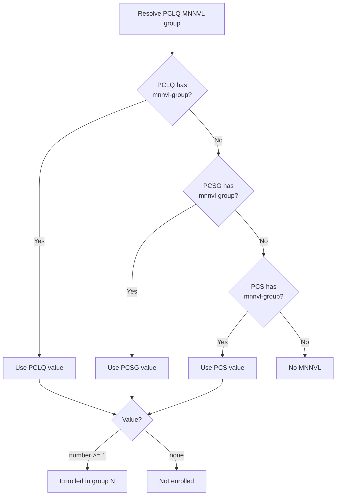
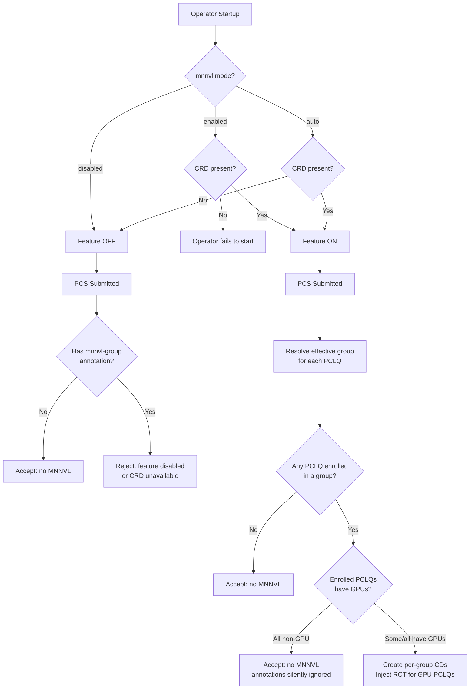

# GREP-417: Auto-MNNVL — Annotation-Based ComputeDomain Management

<!-- toc -->
- [Summary](#summary)
- [Motivation](#motivation)
  - [Goals](#goals)
  - [Non-Goals](#non-goals)
- [Proposal](#proposal)
  - [User Stories](#user-stories)
    - [Story 1: Simple Opt-In for a GPU Workload](#story-1-simple-opt-in-for-a-gpu-workload)
    - [Story 2: Partial MNNVL Within a PCS Replica](#story-2-partial-mnnvl-within-a-pcs-replica)
    - [Story 3: Multiple MNNVL Groups](#story-3-multiple-mnnvl-groups)
    - [Story 4: PCS-Level Default With PCLQ Override](#story-4-pcs-level-default-with-pclq-override)
  - [Limitations/Risks &amp; Mitigations](#limitationsrisks--mitigations)
- [Design Details](#design-details)
  - [Annotation Semantics](#annotation-semantics)
  - [Multi-Layer Resolution](#multi-layer-resolution)
  - [Operator Behavior](#operator-behavior)
  - [Configuration](#configuration)
  - [Decision Flow](#decision-flow)
  - [Behavior Matrix](#behavior-matrix)
  - [Webhook Behavior](#webhook-behavior)
  - [Backward Compatibility](#backward-compatibility)
  - [Monitoring](#monitoring)
  - [Dependencies (*Optional*)](#dependencies-optional)
  - [Test Plan](#test-plan)
  - [Graduation Criteria](#graduation-criteria)
- [Implementation History](#implementation-history)
- [Open Questions](#open-questions)
- [Alternatives (*Optional*)](#alternatives-optional)
- [Appendix (*Optional*)](#appendix-optional)
<!-- /toc -->

## Summary

Grove's auto-MNNVL feature allows users to leverage NVIDIA Multi-Node NVLink acceleration through a simple annotation — without manually authoring `ComputeDomain` resources or wiring `resourceClaims` in their pod specs. The operator automatically creates and manages ComputeDomains, injects RCT references, and handles scaling as PCS replicas scale up or down.

The feature is controlled by a single annotation, `grove.io/mnnvl-group`, which can be placed on a **PodCliqueSet**, **PodCliqueScalingGroup**, or **PodClique**. The annotation value is either a positive integer identifying the MNNVL group (ComputeDomain), or `"none"` to explicitly opt out. Annotations propagate downward from PCS → PCSG → PCLQ, with lower layers overriding higher ones.

The feature uses an **opt-in model**: no PCS receives MNNVL unless it or its sub-resources carry the annotation. The cluster-level configuration (`mnnvl.mode`) controls whether the feature is available — not whether individual workloads use it.

## Motivation

Managing MNNVL manually in Kubernetes requires significant effort: users must create `ComputeDomain` custom resources, author `ResourceClaimTemplate` objects, and wire `resourceClaims` references into pod specs. This is error-prone, repetitive, and difficult to scale — when a PCS scales up or down, users must manually create or delete the corresponding ComputeDomains and keep the references in sync.

Grove's auto-MNNVL feature eliminates this overhead by letting users express MNNVL intent through a single annotation. The operator handles the rest — creating ComputeDomains, injecting RCT references, managing the full lifecycle, and automatically scaling ComputeDomains as PCS replicas change.

Key motivations:

- **Simplicity:** A single annotation replaces multiple manual resources and spec changes.
- **Automatic scaling:** ComputeDomains are created and deleted automatically as PCS replicas scale up or down — no manual intervention required.
- **Granularity:** Users can control MNNVL at the PodClique level — only the pods that need NVLink are enrolled, others are unaffected.
- **Heterogeneous cluster support:** In clusters where only some nodes have NVIDIA IMEX driver support and some nodes don't, users can scope MNNVL to specific PodCliques, avoiding failures on unsupported nodes.
- **Composability:** Multiple MNNVL groups within a single PCS replica allow different PodCliques to participate in separate ComputeDomains.

### Goals

- Provide a **single annotation** (`grove.io/mnnvl-group`) that controls both MNNVL opt-in and group assignment.
- Support **multi-layer propagation** — the annotation can be placed on PCS, PCSG, or PCLQ, with lower layers overriding higher ones.
- Use an **opt-in model** — no MNNVL is applied unless the annotation is present.
- Have the operator **automatically manage ComputeDomain lifecycle** (create, scale, delete, protect) per group per PCS replica.
- Support **heterogeneous clusters** — only annotated PodCliques need NVIDIA DRA-capable nodes.
- Support **multiple MNNVL groups** within a single PCS replica.
- Provide a **clear migration path** from the deprecated `grove.io/auto-mnnvl` annotation.

### Non-Goals

- This GREP does **not** define scheduling or topology placement policy (e.g., which specific nodes or racks pods should land on).
- This GREP does **not** introduce support for user-provided custom `ComputeDomain` specs with arbitrary attributes — the annotation triggers operator-managed domains only.

## Proposal

Users opt into MNNVL by adding the `grove.io/mnnvl-group` annotation to their PCS, PCSG, or individual PCLQ. The annotation value is a **positive integer** that identifies the MNNVL group — PodCliques with the same group number share a single ComputeDomain per replica.

```yaml
spec:
  template:
    cliques:
      - name: workers
        annotations:
          grove.io/mnnvl-group: "1"
        spec:
          ...
```

The annotation can also be placed at the **PCS level** to apply a default to all PodCliques:

```yaml
apiVersion: grove.io/v1alpha1
kind: PodCliqueSet
metadata:
  name: training-job
  annotations:
    grove.io/mnnvl-group: "1"    # all PCLQs default to group 1
spec:
  template:
    cliques:
      - name: workers              # inherits group 1 from PCS
        spec: ...
      - name: param-servers
        annotations:
          grove.io/mnnvl-group: "none"  # override: no MNNVL for this PCLQ
        spec: ...
```

The operator discovers these annotations, determines the set of ComputeDomains required per replica, and:
- manages their full lifecycle — creation, deletion, scaling, and protection via finalizers.
- injects RCT references into the pod's spec of enrolled PodCliques.

**Key behavioral rules:**
- **Opt-in:** No MNNVL is applied unless the annotation is present. Absence of the annotation at all layers means no MNNVL.
- **Propagation:** Annotations propagate downward (PCS → PCSG → PCLQ). A lower layer overrides a higher layer.
- **Non-GPU PCLQs:** If a non-GPU PodClique resolves to a group number (via inheritance), it is silently ignored — no RCT injection, no error.
- **Immutability:** The annotation is immutable after PCS creation.

### User Stories

#### Story 1: Simple Opt-In for a GPU Workload

As a user, I want to enable MNNVL for my entire PodCliqueSet by adding a single annotation at the PCS level. All GPU PodCliques should share one ComputeDomain per replica. I don't want to think about group numbers — just `"1"` is fine.

```yaml
metadata:
  annotations:
    grove.io/mnnvl-group: "1"
```

#### Story 2: Partial MNNVL Within a PCS Replica

As a data scientist, my PCS has workers, parameter servers, and data loaders. Only the workers need NVLink. I annotate only the worker PodClique — the others are unaffected.

```yaml
cliques:
  - name: workers
    annotations:
      grove.io/mnnvl-group: "1"
    spec: ...
  - name: param-servers    # no annotation — no MNNVL
    spec: ...
```

#### Story 3: Multiple MNNVL Groups

As a platform engineer, I have a PCS where decoders need to communicate with each other over NVLink, and encoders need to communicate separately. I assign them to different groups — each group gets its own ComputeDomain.

```yaml
cliques:
  - name: decoders
    annotations:
      grove.io/mnnvl-group: "1"
    spec: ...
  - name: encoders
    annotations:
      grove.io/mnnvl-group: "2"
    spec: ...
```

#### Story 4: PCS-Level Default With PCLQ Override

As a user, I want most of my PodCliques to be in the same MNNVL group, but one PodClique should be excluded. I set the default at the PCS level and override at the PCLQ level.

```yaml
metadata:
  annotations:
    grove.io/mnnvl-group: "1"    # default for all PCLQs
spec:
  template:
    cliques:
      - name: workers              # inherits group 1
        spec: ...
      - name: encoders             # inherits group 1
        spec: ...
      - name: monitoring
        annotations:
          grove.io/mnnvl-group: "none"  # override: no MNNVL
        spec: ...
```

### Limitations/Risks & Mitigations

#### Limitation: Node scheduling constraints for enrolled PodCliques

In [heterogeneous clusters](#homogeneous-vs-heterogeneous-clusters), pods in PodCliques enrolled in an MNNVL group must be scheduled on nodes with NVIDIA IMEX driver support. If these pods land on unsupported nodes, they will fail to start.

**Mitigation:** Users must ensure that enrolled PodCliques include appropriate node scheduling constraints — either via node selector, node affinity, or Topology-Aware Scheduling (TAS) — to target NVIDIA IMEX-capable nodes.

#### Limitation: One IMEX channel per node

Each node can participate in only **one** IMEX channel at a time. If pods from different ComputeDomains are scheduled on the same node, the NVIDIA IMEX driver will prevent the second allocation. This applies to all MNNVL usage — not specific to this feature.

**Mitigation:** The NVIDIA IMEX driver participates in Kubernetes scheduling decisions and will avoid placing conflicting pods on the same node. Users can also employ pod anti-affinity or taints.

#### Limitation: No ComputeDomain customization

ComputeDomain and ResourceClaimTemplate configurations are automatically generated and cannot be customized. Power users who require custom configurations should not use this feature and instead specify their own `resourceClaims` directly in the pod spec template.

## Design Details

### Annotation Semantics

A PodClique's MNNVL participation is controlled by the `grove.io/mnnvl-group` annotation:

```yaml
grove.io/mnnvl-group: "<value>"
```

| Value | Meaning |
|---|---|
| Positive integer (`"1"`, `"2"`, ...) | Opt-in to MNNVL group N. PodCliques with the same group number share a ComputeDomain per replica. |
| `"none"` | Explicit opt-out. Used to override a parent layer's annotation. |
| Absent | Inherit from parent layer. If no parent has it, no MNNVL. |

**Value validation:**
- The value must be either `"none"` or a string that parses as a positive integer >= 1.
- `"0"`, negative numbers, empty strings, and other values are rejected by the validating webhook.
- The `"none"` comparison is **case-insensitive** (e.g., `"None"`, `"NONE"` are accepted). The canonical form is lowercase `"none"`.

**GPU validation:** When a PCLQ resolves to a group number (via its own annotation or inheritance), but does not request GPUs (`nvidia.com/gpu`) in any container, it is **silently ignored** — no RCT injection, no error. This allows PCS-level annotations without requiring `"none"` overrides on every non-GPU PCLQ.

**Immutability:** The `grove.io/mnnvl-group` annotation is **immutable** after PCS creation. The validating webhook rejects any update that attempts to add, modify, or remove the annotation at any level (PCS, PCSG, PCLQ). To change MNNVL assignment, the PCS must be deleted and recreated.

**Example — multiple groups with a non-enrolled PCLQ:**

```yaml
apiVersion: grove.io/v1alpha1
kind: PodCliqueSet
metadata:
  name: training-job
spec:
  replicas: 2
  template:
    cliques:
      - name: workers
        annotations:
          grove.io/mnnvl-group: "1"
        spec:
          replicas: 1
          podSpec:
            containers:
              - name: worker
                resources:
                  limits:
                    nvidia.com/gpu: 8
      - name: encoders
        annotations:
          grove.io/mnnvl-group: "2"
        spec:
          replicas: 1
          podSpec:
            containers:
              - name: encoder
                resources:
                  limits:
                    nvidia.com/gpu: 4
      - name: param-servers
        spec:
          replicas: 1
          podSpec:
            containers:
              - name: ps
                resources:
                  limits:
                    cpu: "4"
```

Result per replica:
- `workers` → enrolled in group 1 → CD `training-job-group-1-0` / `training-job-group-1-1`
- `encoders` → enrolled in group 2 → CD `training-job-group-2-0` / `training-job-group-2-1`
- `param-servers` → no annotation → no MNNVL

### Multi-Layer Resolution

The `grove.io/mnnvl-group` annotation can be placed at three levels: **PCS**, **PCSG**, and **PCLQ**. The effective value for a PCLQ is determined by the lowest layer that carries the annotation — it overrides any higher layer:



**How resolution works in practice:** The flowchart above shows the logical resolution model. In implementation, the resolution is **not** performed by the PCLQ querying its parents at runtime. Instead, it follows the existing PCS reconciliation pattern:

- **PCS → PCSG:** When the PCS controller creates a PCSG, it propagates the `grove.io/mnnvl-group` annotation from the PCS to the PCSG (if present and the PCSG doesn't already have its own value defined in the PCS template).
- **PCS → PCLQ:** When the PCS controller creates a PCLQ, it resolves the effective group value (PCS annotation vs. PCLQ-level annotation in the template) and injects the RCT reference into the PCLQ's pod spec at creation time.
- **PCSG → PCLQ:** When the PCSG controller creates a PCLQ, it uses the same logic — resolve the effective value from the PCSG annotation vs. the PCLQ template, and inject the RCT reference.

This is the same early-binding pattern used today: the decision is made once at resource creation time and baked into the child resource's spec. The PCLQ never checks its parent at runtime.

- **Override:** A lower layer always overrides a higher layer. If a PCLQ has `grove.io/mnnvl-group: "none"` and the PCS has `grove.io/mnnvl-group: "1"`, the PCLQ is **not enrolled**.

**Example — PCS default with PCLQ overrides:**

```yaml
apiVersion: grove.io/v1alpha1
kind: PodCliqueSet
metadata:
  name: inference
  annotations:
    grove.io/mnnvl-group: "1"        # default: all PCLQs in group 1
spec:
  template:
    cliques:
      - name: decoders                 # inherits group 1 from PCS
        spec: ...
      - name: encoders
        annotations:
          grove.io/mnnvl-group: "2"    # override: group 2
        spec: ...
      - name: metrics
        annotations:
          grove.io/mnnvl-group: "none" # override: no MNNVL
        spec: ...
```

Effective resolution:
| PCLQ | PCS value | PCLQ value | Effective | Result |
|---|---|---|---|---|
| `decoders` | `"1"` | absent | `"1"` | Enrolled in group 1 |
| `encoders` | `"1"` | `"2"` | `"2"` | Enrolled in group 2 |
| `metrics` | `"1"` | `"none"` | `"none"` | Not enrolled |

### Operator Behavior

#### ComputeDomain Lifecycle

When the operator reconciles a PodCliqueSet, it resolves the effective `grove.io/mnnvl-group` value for each PCLQ (using multi-layer resolution) and performs the following per replica:

1. **Discovery:** Collect the set of distinct group numbers across all PCLQs that resolve to a valid group (ignoring `"none"` and non-GPU PCLQs).

2. **ComputeDomain management:**
   - **Create:** For each unique group number, create a `ComputeDomain` resource per replica (if it does not already exist).
   - **Scale:** When replicas scale up/down, create/delete the corresponding CD instances.
   - **Delete:** When a PCS is deleted, clean up all associated CDs.
   - **Finalizer:** Add `grove.io/computedomain-finalizer` to prevent accidental deletion while workloads are using it. The finalizer is removed during PCS deletion or scale-in.

3. **RCT reference injection:** Injected into the PCLQ's pod spec template at **PCLQ creation time** (not at pod creation time). This early-binding approach ensures the decision is made once and baked into the PCLQ spec. The injection flow is:
   - **PCS → PCLQ:** The PCS controller resolves the effective group for the PCLQ and injects `resourceClaims` if enrolled.
   - **PCS → PCSG:** The PCS controller propagates the annotation to the PCSG.
   - **PCSG → PCLQ:** The PCSG controller resolves and injects using the same logic.
   - **Pod creation:** No special logic — pods use the PCLQ's pod spec as-is.

4. **Non-enrolled PodCliques:** Left untouched — no CD reference injected.

#### CD Naming Convention

ComputeDomains are named `{pcs-name}-group-{number}-{replica-index}`:

| Example PCS | Group | Replica | CD Name |
|---|---|---|---|
| `training-job` | 1 | 0 | `training-job-group-1-0` |
| `training-job` | 1 | 1 | `training-job-group-1-1` |
| `training-job` | 2 | 0 | `training-job-group-2-0` |

Group numbers are scoped to the PCS — different PCS resources can use the same group numbers without conflict (the PCS name provides uniqueness).

#### Reconciliation Ordering

ComputeDomain resources must be synced **before** creating PCLQs and PCSGs, ensuring the CD exists before pods that reference its RCT are created. If CD creation fails, the sync stops and requeues for retry.

#### ComputeDomain Resource Structure

```yaml
apiVersion: resource.nvidia.com/v1beta1
kind: ComputeDomain
metadata:
  name: training-job-group-1-0
  labels:
    app.kubernetes.io/managed-by: grove-operator
    app.kubernetes.io/part-of: training-job
    app.kubernetes.io/name: training-job-group-1-0
    app.kubernetes.io/component: pcs-computedomain
    grove.io/podcliqueset-replica-index: "0"
    grove.io/mnnvl-group: "1"
  finalizers:
    - grove.io/computedomain-finalizer
  ownerReferences:
    - apiVersion: grove.io/v1alpha1
      kind: PodCliqueSet
      name: training-job
      controller: true
spec:
  channel:
    resourceClaimTemplateName: training-job-group-1-0
```

### Configuration

The auto-MNNVL feature is controlled via the `mnnvl.mode` field in `OperatorConfiguration`:

| Value | Default | Behavior |
|---|---|---|
| `auto` | **Yes** | Feature is active **if** the `ComputeDomain` CRD is present in the cluster. If absent, the operator starts normally but rejects any PCS with `grove.io/mnnvl-group` annotations at admission time. |
| `enabled` | No | Feature is always active. The operator validates that the CRD is installed at startup and **fails to start** if missing. |
| `disabled` | No | Feature is off. Any PCS with `grove.io/mnnvl-group` annotations is rejected. |

```yaml
# OperatorConfiguration example
apiVersion: grove.io/v1alpha1
kind: OperatorConfiguration
spec:
  network:
    mnnvl:
      mode: auto  # default; valid values: auto, enabled, disabled
```

**Important:** The configuration controls whether the feature is **available**, not whether individual workloads use it. MNNVL is always opt-in via the annotation — the operator never automatically applies MNNVL to any PCS.

#### Breaking Change: Configuration Field Rename

This GREP replaces the previous `network.autoMNNVLEnabled` boolean field with `network.mnnvl.mode`. There is **no automatic migration** — the old field is removed from the Helm chart and the operator configuration. Users upgrading must update their Helm values:

```yaml
# Old (removed)
config:
  network:
    autoMNNVLEnabled: true

# New (required)
config:
  network:
    mnnvl:
      mode: auto  # or: enabled, disabled
```

If the operator encounters the old `autoMNNVLEnabled` field, it will **fail to start** with a clear error message instructing the user to migrate to `mnnvl.mode`. This avoids silent misconfiguration.

See [Alternative 3](#alternatives-optional) for a discussion of automatic migration as an alternative approach.

#### Impact on Existing Workloads When Mode Changes

Changing `mnnvl.mode` must **not** affect currently running workloads:

- Switching `mnnvl.mode` from `auto` or `enabled` to `disabled` does **not** delete existing ComputeDomains or modify existing PCS resources.
- New PCS submissions with `grove.io/mnnvl-group` annotations will be rejected after the change.
- To remove MNNVL from an existing workload, the PCS must be deleted and recreated.

### Decision Flow

The following flowchart shows the complete decision logic from operator startup through PCS admission:



### Behavior Matrix

| # | Config | CRD | `mnnvl-group` | Result |
|---|---|---|---|---|
| 1 | `disabled` | — | absent | No MNNVL |
| 2 | `disabled` | — | present | **Reject:** feature disabled |
| 3 | `auto` | no | absent | No MNNVL |
| 4 | `auto` | no | present | **Reject:** CRD unavailable |
| 5 | `auto` | yes | absent | No MNNVL |
| 6 | `auto` | yes | on some PCLQs (GPU) | Per-group CDs for enrolled PCLQs |
| 7 | `auto` | yes | on all PCLQs (GPU) | Per-group CDs for all PCLQs |
| 8 | `auto` | yes | on PCLQs (non-GPU only) | No MNNVL (silently ignored) |
| 9 | `auto` | yes | PCS-level `"1"`, PCLQ overrides `"none"` | Per-group CDs, excluding overridden PCLQs |
| 10 | `enabled` | no | — | **Operator fails to start** |
| 11 | `enabled` | yes | absent | No MNNVL |
| 12 | `enabled` | yes | on some/all PCLQs | Per-group CDs for enrolled GPU PCLQs |

### Webhook Behavior

#### Mutating Webhook (on Create)

In the opt-in model, the mutating webhook **does not** add any MNNVL-related annotations automatically. The user is responsible for providing the `grove.io/mnnvl-group` annotation.

The only mutation the webhook performs for MNNVL is **deprecation handling** — see [Backward Compatibility](#backward-compatibility).

#### Validating Webhook (on Create)

The validating webhook enforces:

- **Value validation:** `grove.io/mnnvl-group` must be either `"none"` (case-insensitive) or a positive integer >= 1. Invalid values are rejected.
- **Feature disabled:** If the feature is off (config `disabled`, or config `auto` with no CRD), reject any PCS that has `grove.io/mnnvl-group` at any level.
- **Deprecated annotation conflict:** If both `grove.io/auto-mnnvl` and `grove.io/mnnvl-group` are present on the same PCS, reject with a clear error.

#### Validating Webhook (on Update)

The `grove.io/mnnvl-group` annotation is **immutable** after PCS creation at all levels (PCS, PCSG, PCLQ). Any attempt to add, modify, or remove the annotation is rejected.

### Backward Compatibility

The `grove.io/auto-mnnvl` annotation is **deprecated**. It is no longer set by the mutating webhook and should not be used in new workloads.

**Migration path:**

| Old annotation | New equivalent |
|---|---|
| `grove.io/auto-mnnvl: "enabled"` (on PCS) | `grove.io/mnnvl-group: "1"` (on PCS) |
| `grove.io/auto-mnnvl: "disabled"` (on PCS) | Remove the annotation (opt-in model — absence = no MNNVL) |

**Deprecation behavior:**
- If the operator encounters a PCS with `grove.io/auto-mnnvl` (and no `grove.io/mnnvl-group`), it logs a **warning** indicating the annotation is deprecated and should be replaced with `grove.io/mnnvl-group`.
- Since the previous model was opt-out (auto-MNNVL was applied by default when the feature was enabled), and the new model is opt-in, the `grove.io/auto-mnnvl: "disabled"` annotation is effectively a no-op — without `grove.io/mnnvl-group`, no MNNVL is applied regardless.
- If **both** `grove.io/auto-mnnvl` and `grove.io/mnnvl-group` are present on the same PCS, the validating webhook **rejects** the PCS with a clear error.

### Monitoring

ComputeDomain observability follows the same pattern as previous iterations: **Kubernetes Events** on the PodCliqueSet resource. The operator emits events when:

- A ComputeDomain is created or deleted.
- A PCS is rejected due to annotation validation errors or feature being disabled.
- ComputeDomain creation fails (sync stops and requeues for retry).
- A deprecated `grove.io/auto-mnnvl` annotation is detected (warning event).

### Dependencies (*Optional*)

- NVIDIA IMEX drivers must be installed on nodes where enrolled PodClique pods are scheduled.
- The `ComputeDomain` CRD must be available in the cluster (required for `enabled` mode, auto-detected for `auto` mode). See the [NVIDIA GPU driver installation guide](https://docs.nvidia.com/datacenter/cloud-native/gpu-operator/latest/gpu-operator-dra.html).

### Test Plan

- **Unit tests:** Cover annotation resolution (multi-layer propagation, override, `"none"`), group number parsing, case-insensitive `"none"` comparison, ComputeDomain lifecycle management (create/delete/scale), RCT injection logic, deprecated annotation handling, and configuration parsing.
- **E2E tests:**
  - PCS with `mnnvl-group` on some PCLQs → per-group CDs, only enrolled GPU PCLQs get RCT.
  - PCS with `mnnvl-group` at PCS level → all GPU PCLQs enrolled.
  - PCS with PCS-level annotation + PCLQ `"none"` override → PCLQ excluded.
  - PCS with multiple group numbers → separate CDs per group per replica.
  - PCS with `mnnvl-group` on non-GPU PCLQ only → silently ignored, no CDs.
  - PCS scale-up/scale-down → CDs created/deleted accordingly.
  - Mode `disabled` + annotations → rejected.
  - Mode `auto` + CRD absent + annotations → rejected.
  - Mode `enabled` + CRD absent → operator fails to start.
  - Deprecated `grove.io/auto-mnnvl` → warning log emitted.
  - Both `grove.io/auto-mnnvl` and `grove.io/mnnvl-group` → rejected.
  - Old `autoMNNVLEnabled` field in config → operator fails to start with migration error.
  - Annotation immutability: update attempts rejected.

### Graduation Criteria

#### Alpha
- `grove.io/mnnvl-group` annotation implemented and functional.
- Multi-layer resolution (PCS → PCSG → PCLQ) working.
- Per-group ComputeDomain lifecycle management per replica.
- Three-value configuration (`auto` / `enabled` / `disabled`) with backward compatibility.
- Deprecated `grove.io/auto-mnnvl` detection with warning log.
- Unit and basic integration tests passing.

#### Beta
- E2E tests covering all key scenarios from the behavior matrix.
- Documentation for users on the annotation and migration from `grove.io/auto-mnnvl`.
- Events fully implemented.

#### GA
- Production deployments validated.
- API and annotation semantics stable.
- Comprehensive test coverage.

## Implementation History

- **Initial implementation (completed):** Cluster-wide auto-MNNVL feature using `grove.io/auto-mnnvl` annotation and boolean `autoMNNVLEnabled` config. Single ComputeDomain per PCS replica, all GPU PCLQs enrolled. Opt-out model. See [MNNVL Design Doc](../../designs/mnnvl-design.md).
- **This GREP:** Redesigns the feature with opt-in model, `grove.io/mnnvl-group` annotation, multi-layer propagation, per-group ComputeDomains, and three-value configuration. Deprecates `grove.io/auto-mnnvl`.

## Open Questions

The following items require discussion with the broader team before finalizing the design:

### 1. Annotation vs. label for group declaration

This GREP proposes using an **annotation** (`grove.io/mnnvl-group`). An alternative is a **label**.

**Arguments for annotation (current proposal):**
- This is a configuration directive that triggers operator behavior — the standard Kubernetes use case for annotations.
- Labels are for identity and selection; no one needs to select PodCliques by group number via label selectors.
- Consistent with Kubernetes conventions.

**Arguments for label:**
- Labels propagate to pods and are queryable (`kubectl get pods -l grove.io/mnnvl-group=1`), which aids observability.
- However, the operator could add a label to pods as a secondary step even if the declaration is via annotation.

### 2. Two-value vs. three-value configuration mode

The current proposal uses three values: `disabled`, `enabled`, and `auto`. An alternative is two values: `disabled` and `auto` (removing `enabled`). The upside is simplicity. The downside is that cluster administrators who want to guarantee MNNVL availability lose the ability to catch CRD misconfigurations at operator startup.

### 3. Reject vs. silently ignore annotations when the feature is disabled

When the feature is disabled and a user submits a PCS with `grove.io/mnnvl-group` annotations, the current proposal rejects the PCS. An alternative is to silently ignore the annotations. The benefit is **portability** — the same manifest works everywhere. The risk is **silent performance degradation** — the user requested MNNVL but the workload runs without it.

## Alternatives (*Optional*)

**Alternative 1: Use string names instead of numeric group values.**
The group annotation could take a string name (e.g., `grove.io/mnnvl-group: "training-domain"`) instead of a number. This is more expressive but adds validation complexity (valid Kubernetes name component checks, length limits). Numeric values are simpler.

**Alternative 2: Two separate annotations (`auto-mnnvl` + `mnnvl-group`).**
Using two annotations — one for MNNVL on/off and one for group assignment — was considered. This adds the risk of inconsistent state (e.g., `auto-mnnvl: "disabled"` + `mnnvl-group: "1"`). A single annotation with `"none"` as the opt-out value eliminates this class of bugs.

**Alternative 3: Automatic migration from `autoMNNVLEnabled` to `mnnvl.mode`.**
Instead of a breaking change, the Helm chart and operator could automatically map the old `autoMNNVLEnabled` boolean to the new `mnnvl.mode` field:

| # | Operation | User's custom values | Old behavior | Template renders | New behavior | Notes |
|---|---|---|---|---|---|---|
| 1 | Fresh install | nothing | N/A | `mnnvl.mode: auto` | ON if CRD present | New default |
| 2 | Fresh install | `mnnvl.mode: enabled` | N/A | `mnnvl.mode: enabled` | ON, fail if no CRD | Explicit |
| 3 | Fresh install | `mnnvl.mode: disabled` | N/A | `mnnvl.mode: disabled` | OFF | Explicit |
| 4 | Fresh install | `autoMNNVLEnabled: true` | N/A | `mnnvl.mode: enabled` | ON, fail if no CRD | Old field still works |
| 5 | Upgrade | nothing (used old default) | OFF | `mnnvl.mode: auto` | ON if CRD present | Behavior change |
| 6 | Upgrade | `autoMNNVLEnabled: true` | ON, fail if no CRD | `mnnvl.mode: enabled` | ON, fail if no CRD | No change |
| 7 | Upgrade | `autoMNNVLEnabled: false` | OFF | `mnnvl.mode: disabled` | OFF | No change |
| 8 | Upgrade | both old + new set | depends | `mnnvl.mode` wins | depends | New field takes precedence |

The Helm template would handle this by checking the new field first, falling back to the old one. The operator would log a warning if the old field is detected. This approach is more user-friendly but adds template complexity and risks silent behavioral changes (scenario 5). The current proposal favors an explicit, clean break to avoid ambiguity.

## Appendix (*Optional*)

### Background

#### What is MNNVL?

**MNNVL (Multi-Node NVLink)** is an NVIDIA technology that extends NVLink-class, high-bandwidth GPU-to-GPU communication across **multiple physical nodes**, rather than being limited to GPUs within a single server. It uses specialized hardware and software mechanisms to allow GPUs on different nodes to access each other's memory with much lower latency and higher bandwidth than traditional network-based approaches like TCP or even standard RDMA. In Kubernetes, MNNVL is exposed through NVIDIA's DRA driver so distributed workloads (for example, large-scale training or tightly coupled inference) can treat GPUs across nodes as part of a single, high-performance compute fabric while preserving isolation and security between workloads.

#### IMEX Channels

**IMEX (Import/Export)** is the underlying mechanism that enables secure GPU memory sharing across nodes in an MNNVL fabric. Each IMEX channel represents a logical connection that allows GPUs on different nodes to import and export memory regions for direct access.

**Key constraint: One IMEX channel per node.** Each node can participate in only **one** IMEX channel at a time. This means:

- A node's GPUs can only belong to a single ComputeDomain simultaneously.
- Multiple independent MNNVL-enabled workloads cannot share the same node.
- When a node is allocated to one ComputeDomain, its NVLink fabric participation is exclusive to that domain.

#### Using MNNVL in Kubernetes

To use MNNVL in Kubernetes with NVIDIA's DRA driver, you start by creating a **ComputeDomain (CD)**. The ComputeDomain represents a logical GPU fabric spanning multiple nodes and defines how inter-node NVLink/IMEX channels are allocated. The `ComputeDomainSpec.Channel` references a `ResourceClaimTemplate`; this template describes the DRA resource class that will be used to provision the interconnect.

Next, pods that want to use MNNVL **reference the ResourceClaimTemplate** in their pod spec. Each pod declares a `resourceClaims` entry pointing to the template name, and the container lists that claim under `resources.claims`. Kubernetes then automatically creates a ResourceClaim per pod from the template. These per-pod claims are handled by the NVIDIA DRA driver, which allocates the necessary MNNVL/IMEX channels for each pod within the ComputeDomain.

As a result, multiple pods — possibly scheduled on different nodes — are joined into the same ComputeDomain and can communicate using multi-node NVLink semantics without manually wiring GPUs or fabric resources.

#### ComputeDomain Status Lifecycle

When a ComputeDomain is first created, it exists without an operational status. The CD only becomes active once pods referencing its RCT are scheduled. At that point, the NVIDIA DRA driver deploys a DaemonSet on the nodes where those pods are scheduled to establish the MNNVL fabric. The CD's status is then derived from the aggregate health of these DaemonSet pods.

### Terminology

| Term | Definition |
|---|---|
| **MNNVL** | Multi-Node NVLink — NVIDIA's technology for extending NVLink connectivity across multiple nodes. |
| **ComputeDomain** | An NVIDIA CRD that defines a set of pods sharing a high-bandwidth NVLink domain. |
| **RCT** | ResourceClaimTemplate — a Kubernetes DRA resource used to claim hardware resources for a pod. |
| **DRA** | Dynamic Resource Allocation — a Kubernetes API for managing hardware resources. |
| **IMEX** | Import/Export — the underlying mechanism for MNNVL, representing a logical connection for cross-node GPU memory sharing. |
| **PCS** | PodCliqueSet — the Grove workload abstraction that groups PodCliques into replicas. |
| **PCSG** | PodCliqueScalingGroup — manages scaling of PodCliques within a PCS. |
| **PCLQ** | PodClique — a group of related pods within a PCS replica. |

### Homogeneous vs. Heterogeneous Clusters

For the purpose of this document, the distinction is based on NVIDIA IMEX driver support:

- **Homogeneous cluster:** All nodes support the NVIDIA IMEX driver. Auto-MNNVL can be used without concern about pod scheduling failures.
- **Heterogeneous cluster:** Some nodes support the NVIDIA IMEX driver and some do not. Users must scope MNNVL participation to specific PodCliques and ensure those pods are scheduled on IMEX-capable nodes.
