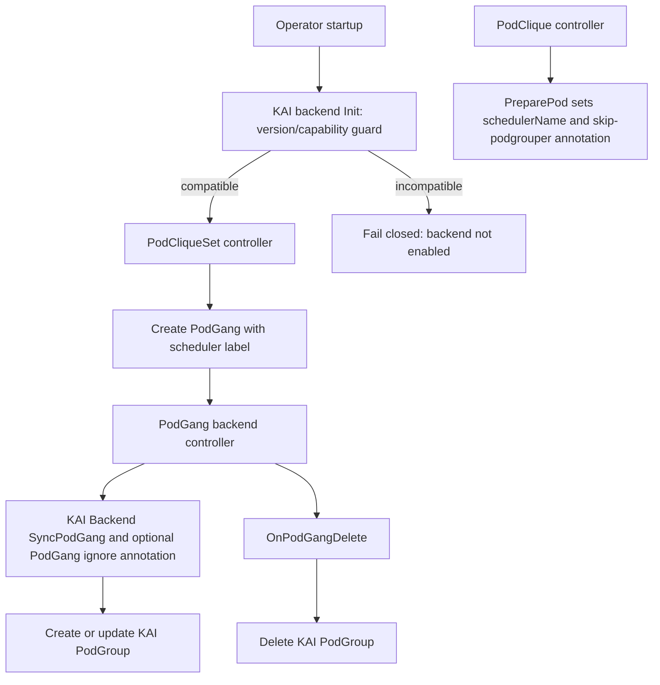

# GREP-525: KAI Scheduler Backend for Scheduler Backend Framework

<!-- toc -->
- [Summary](#summary)
- [Motivation](#motivation)
  - [Goals](#goals)
  - [Non-Goals](#non-goals)
- [Proposal](#proposal)
  - [User Stories](#user-stories)
    - [Story 1: Platform Operator Enables KAI Backend](#story-1-platform-operator-enables-kai-backend)
    - [Story 2: Workload Owner Uses KAI Scheduler](#story-2-workload-owner-uses-kai-scheduler)
  - [Limitations/Risks &amp; Mitigations](#limitationsrisks--mitigations)
    - [Capability Timeline and Upstream References](#capability-timeline-and-upstream-references)
    - [Backend Behavior by KAI Capability Level](#backend-behavior-by-kai-capability-level)
    - [Requirement when <code>#1552</code> is Present and <code>#1001</code> is Absent](#requirement-when-1552-is-present-and-1001-is-absent)
    - [Defining <code>minVersion</code>](#defining-minversion)
- [Design Details](#design-details)
  - [Architecture Overview](#architecture-overview)
  - [Backend Lifecycle Contract](#backend-lifecycle-contract)
  - [Precondition: KAI Backend Enabled](#precondition-kai-backend-enabled)
  - [KAI Backend Responsibilities](#kai-backend-responsibilities)
  - [PodGang to PodGroup Mapping](#podgang-to-podgroup-mapping)
    - [SubGroup Mapping Rules](#subgroup-mapping-rules)
  - [Pod Preparation](#pod-preparation)
  - [PodGroup Update Semantics](#podgroup-update-semantics)
  - [Reconciliation Flow](#reconciliation-flow)
  - [API and Registration Requirements](#api-and-registration-requirements)
  - [RBAC Matrix](#rbac-matrix)
  - [Dynamic RBAC Strategy](#dynamic-rbac-strategy)
  - [Test Plan](#test-plan)
    - [Phase 1 (Current): Unit Tests](#phase-1-current-unit-tests)
    - [Phase 2 (Follow-up): E2E Tests](#phase-2-follow-up-e2e-tests)
  - [Graduation Criteria](#graduation-criteria)
    - [Alpha](#alpha)
    - [Beta](#beta)
    - [GA](#ga)
- [Appendix](#appendix)
<!-- /toc -->

## Summary

This proposal adds a dedicated KAI scheduler backend to Grove's Scheduler Backend Framework so Grove can natively create, update, and delete KAI PodGroup resources for Grove PodGang workloads. This proposal is intentionally limited to PodGroup creation and management; it does not add new topology-aware scheduling support and does not change existing KAI Topology synchronization behavior from Grove ClusterTopology. The change improves maintainability, clarifies ownership boundaries, and enables predictable KAI-specific lifecycle handling for PodGang workloads by relying on KAI-Scheduler's externally-created PodGroup support.

## Motivation

GREP-375 introduced a generic Scheduler Backend Framework, but the KAI integration still needs a concrete backend implementation pattern and operational contract for production use. Without this backend, KAI support depends on legacy behavior that can cause ambiguous ownership of PodGroup resources and complicate migration as Grove evolves.

### Goals

- Define the KAI backend behavior under the Scheduler Backend Framework lifecycle.
- Define `PreparePod` behavior so Pods are scheduled by KAI consistently with Grove's scheduling gate flow and opt out of KAI podgrouper reconciliation when Grove owns the PodGroup.
- Specify PodGang to KAI PodGroup translation and reconciliation responsibilities.
- Define deletion-time cleanup behavior for KAI-owned scheduling resources.
- Document the dependency on KAI-Scheduler support for externally-created PodGroups and podgrouper skip behavior.
- Clarify required RBAC, scheme registration, and dependency/version expectations for KAI resources.
- Establish test expectations for pod preparation, PodGroup sync, and delete paths.

### Non-Goals

- Redesigning the Scheduler Backend Framework introduced by GREP-375.
- Introducing new user-facing scheduling APIs in PodCliqueSet or PodGang for this phase.
- Covering support for all third-party schedulers; this proposal only scopes KAI backend behavior.
- Defining advanced KAI-only scheduling semantics beyond existing PodGang intent.
- Replacing or deprecating non-KAI backends.
- Defining how scheduler backends are enabled, selected, or resolved from operator configuration and workload templates. This proposal assumes the `kai-scheduler` backend is already enabled by the Scheduler Backend Framework.
- Requiring PodGang status-only updates to trigger backend reconciliation. The current backend controller reacts to create, delete, and generation-changing updates.
- Extending or refactoring existing KAI Topology resource management from Grove `ClusterTopology`/`ClusterTopologyBinding`.
- Defining topology-aware scheduling behavior for KAI. That functionality is out of scope for this proposal and should be covered separately.

## Proposal

Grove will ship a built-in `kai-scheduler` backend that implements the Scheduler Backend Framework lifecycle hooks needed to manage KAI PodGroups. The backend is responsible for converting Grove PodGang intent to KAI PodGroup resources, preparing Pods to use KAI, participating in admission validation, and keeping KAI PodGroups in sync with Grove lifecycle events.

This proposal only covers KAI PodGroup creation and management. It does not propose any KAI Topology creation/update flow, does not add startup-time topology synchronization, and does not define topology-aware scheduling behavior.

At a high level, the proposal introduces:

1. **KAI backend ownership model**: Grove backend controller is the single owner of KAI PodGroup reconciliation for PodGang resources that select `kai-scheduler`.
2. **Deterministic lifecycle behavior**: backend initialization happens during operator startup, `PreparePod` sets the scheduler name and podgrouper skip annotation during Pod construction, `SyncPodGang` handles create/update reconciliation, and `OnPodGangDelete` handles cleanup.
3. **External PodGroup support dependency**: This backend relies on KAI-Scheduler support for externally-created PodGroups, including `kai.scheduler/skip-podgrouper`, so KAI does not recreate or overwrite Grove-owned PodGroups.
4. **Operator readiness requirements**: KAI PodGroup API types are registered in Grove scheme and RBAC allows backend operations on KAI PodGroups.
5. **Update safety**: Grove preserves fields that KAI runtime components own so backend reconciliation does not erase scheduler decisions or mutable runtime state.

### User Stories

#### Story 1: Platform Operator Enables KAI Backend

As a platform operator, I want Grove to manage KAI scheduling resources through its backend framework so that KAI integration follows a consistent operator lifecycle and is easier to operate and troubleshoot.

#### Story 2: Workload Owner Uses KAI Scheduler

As a workload owner, I want my PodGang workloads targeting KAI to automatically produce and maintain the required KAI PodGroup resources so that gang scheduling intent is enforced without manual intervention.

### Limitations/Risks & Mitigations

KAI scheduler capabilities relevant to this backend do not appear in a single historical milestone. Grove therefore treats compatibility as capability-based, with a semver floor used as an operator-facing guardrail.

#### Capability Timeline and Upstream References

| Capability | Upstream reference | Upstream status | Compatibility impact for Grove |
| --- | --- | --- | --- |
| Hierarchical `subGroups` in PodGroup | KAI topology/multilevel and subgroup scheduling docs | Available before this GREP and used by existing KAI scheduling flows | Grove may map PodGang pod groups to KAI leaf subgroups when capability is available. |
| External PodGroup support + podgrouper skip annotation (`kai.scheduler/skip-podgrouper`) | [KAI PR #1552](https://github.com/kai-scheduler/KAI-Scheduler/pull/1552) | Merged into KAI main (commit `313dddd`) | Required for safe ownership when Grove creates PodGroups externally; without this, duplicate PodGroup reconciliation risk is high. |
| PodGang-level ignore signal for KAI Grove plugin path | [KAI PR #1001](https://github.com/kai-scheduler/KAI-Scheduler/pull/1001) | Draft / not merged at time of writing | Optional transition aid. Grove must not hard-require this capability for baseline backend enablement. |

#### Backend Behavior by KAI Capability Level

| KAI capability level | Expected Grove backend behavior |
| --- | --- |
| No external PodGroup support (`#1552` absent) | Backend initialization fails (or is disabled per policy). Grove does not activate KAI PodGroup ownership flows. |
| External PodGroup support present (`#1552` present), PodGang ignore absent (`#1001` absent) | Supported only when KAI PodGang plugin path is disabled. Grove sets Pod-level `kai.scheduler/skip-podgrouper`, manages PodGroup lifecycle, and uses external PodGroup conflict safeguards. If PodGang plugin is still enabled, Grove backend init must fail closed and not start ownership reconciliation. |
| External PodGroup support present + PodGang ignore present (`#1552` + `#1001`) | Preferred migration mode. Grove uses Pod-level skip plus PodGang-level temporary ignore annotation for dual-path protection. |
| `subGroups` unavailable or disabled in target KAI build | Grove degrades to flat PodGroup mapping (`minMember` only) or rejects subgroup-required workloads via validation, depending on configured policy. |

#### Requirement when `#1552` is Present and `#1001` is Absent

Because `#1001` is not available, KAI's PodGang plugin path cannot be selectively skipped per PodGang. To avoid double reconciliation, operators MUST disable the KAI PodGang plugin path before enabling Grove KAI backend ownership mode.

Operational guidance:

- Disable the Grove/PodGang plugin in KAI scheduler plugin configuration (remove from enabled plugin set and restart the scheduler rollout).
- Keep podgrouper skip flow enabled via `kai.scheduler/skip-podgrouper` so Pod-based podgrouper reconciliation is still bypassed for Grove-managed workloads.
- Verify the change before enabling backend ownership mode: KAI scheduler logs should not show Grove PodGang plugin reconciliation for Grove-managed PodGangs.

Fail-safe behavior:

- During Grove backend `Init()`, if capability probe indicates `#1552` is present but `#1001` is absent, Grove must additionally verify that KAI PodGang plugin path is disabled.
- If plugin-disable verification fails, backend initialization MUST fail closed (backend not started) and emit a clear operator-facing error.

#### Defining `minVersion`

`minVersion` is the minimum KAI scheduler version required to enable the Grove `kai-scheduler` backend profile for PodGroup ownership mode.

Definition rules:

- `minVersion` MUST correspond to the first released KAI version that includes external PodGroup support from [PR #1552](https://github.com/kai-scheduler/KAI-Scheduler/pull/1552) (or a vetted backport carrying equivalent behavior).
- `minVersion` MUST NOT depend on [PR #1001](https://github.com/kai-scheduler/KAI-Scheduler/pull/1001), because that change is optional transition behavior.
- If subgroup semantics are required by a workload, backend validation SHOULD additionally enforce subgroup-capable KAI builds (version/capability check), even when global `minVersion` is satisfied.

Operational behavior:

- During backend `Init()`, Grove checks detected KAI version/capabilities against `minVersion`.
- If KAI is below `minVersion`, backend startup returns an unsupported-version error and does not enable KAI PodGroup ownership reconciliation.
- If KAI meets `minVersion` but required migration guardrails are not met (for example, `#1001` absent while PodGang plugin path is still enabled), backend startup also fails closed.
- Grove release notes MUST publish and maintain a Grove-to-KAI compatibility matrix whenever `minVersion` or required capabilities change.

## Design Details

### Architecture Overview

The KAI backend extends GREP-375 by implementing KAI-specific translations and lifecycle handling while preserving framework-level control flow.

### Backend Lifecycle Contract

The backend must cover the PodGroup-related backend surface from GREP-375:

| Lifecycle surface | Trigger | KAI backend responsibility |
| --- | --- | --- |
| Backend initialization | Operator startup | Validate `minVersion` and capability guards (`#1552` required). If `#1001` is absent, verify PodGang plugin path is disabled; otherwise fail closed and do not enable backend ownership mode. |
| Pod preparation | PodClique controller builds a Pod | Set Pod `schedulerName` to `kai-scheduler` and ensure `kai.scheduler/skip-podgrouper` is present. |
| PodGang sync | PodGang create or generation-changing update | Reconcile the Grove-owned KAI PodGroup; when `#1001` capability is available, set PodGang annotation `grove.io/ignore: "true"` for transition-time plugin bypass. |
| PodGang deletion | PodGang delete event | Delete associated KAI PodGroup, ignoring not-found errors. |

### Precondition: KAI Backend Enabled

This proposal assumes the Scheduler Backend Framework has already enabled and initialized the `kai-scheduler` backend. The mechanics of enabling scheduler profiles, default scheduler selection, and validation of scheduler names are defined by GREP-375 and are not redefined here.

Under that assumption, this proposal only relies on the resolved backend identity:

- Pods prepared by this backend are scheduled with `schedulerName: kai-scheduler`.
- PodGang resources routed to this backend are reconciled into KAI PodGroups.

### KAI Backend Responsibilities

- Resolve only workloads assigned to `kai-scheduler`.
- Rely on KAI-Scheduler external PodGroup support, ensure prepared Pods have `kai.scheduler/skip-podgrouper` annotation so KAI podgrouper does not create or overwrite PodGroups that Grove owns.
- Enforce compatibility guardrails during `Init()`: require `#1552` capability and fail closed when migration preconditions are not met.
- Apply PodGang-level ignore annotation `grove.io/ignore: "true"` only when `#1001` capability is available.
- Translate PodGang group semantics to KAI PodGroup semantics.
- Reconcile KAI PodGroup state on PodGang create and update.
- Handle KAI resource cleanup on PodGang delete.

### PodGang to PodGroup Mapping

The KAI backend translates a Grove PodGang to a KAI PodGroup with the following ownership and mapping rules:

| Grove source | KAI PodGroup target |
| --- | --- |
| PodGang name and namespace | PodGroup name and namespace |
| PodGang labels and annotations | PodGroup labels and annotations, preserving existing target-only keys |
| Sum of PodGang pod group minimum replicas | PodGroup `minMember` |
| PodGang priority class | PodGroup priority class |
| Queue label or annotation | PodGroup queue on initial creation |
| PodGang pod groups | Leaf KAI subgroups with min member and optional parent |
| PodGang owner reference | PodGroup controller owner reference |

This mapping focuses on PodGroup ownership and gang membership. KAI Topology resources and topology-aware scheduling semantics are outside the scope of this proposal.

#### SubGroup Mapping Rules

SubGroup mapping is capability-gated and follows deterministic translation rules:

- **When subgroup mapping is used**:
  - PodGang contains multiple `spec.podgroups`, or
  - workload policy requires per-group gang thresholds/topology semantics.
- **When subgroup mapping is not used**:
  - single-group PodGang with no subgroup-specific behavior requirements may use flat PodGroup mapping (`minMember` only).

Mapping contract:

- Each Grove `spec.podgroups[i]` maps to one KAI leaf subgroup.
- Subgroup name defaults to Grove PodGroup `name` and must be DNS-label compatible, lowercase, and unique within the PodGang.
- Grove PodGroup `minReplicas` maps to KAI subgroup `minMember`.
- Pod references in each Grove PodGroup are labeled with `kai.scheduler/subgroup-name=<subgroup-name>` during pod preparation/patching flow so every pod is assigned to a valid leaf subgroup.

Validation and fallback behavior:

- If subgroup capability is unavailable on target KAI build and workload requires subgroup semantics, backend validation fails and PodGang is rejected from KAI ownership mode.
- If subgroup capability is unavailable and workload does not require subgroup semantics, backend degrades to flat mapping and sets PodGroup `minMember` as the sum of Grove PodGroup `minReplicas`.
- If a pod points to a subgroup name that does not exist in the generated KAI PodGroup spec, backend treats this as configuration error and surfaces an event (do not silently remap).

Out of scope for this GREP:

- Defining arbitrary multi-level subgroup trees from Grove API. Current design maps Grove PodGroups to KAI leaf subgroups only; future GREP can extend parent/minSubGroup authoring semantics.

### Pod Preparation

When the KAI backend prepares a Pod, it must:

- Set `pod.spec.schedulerName` to `kai-scheduler`.
- Ensure `pod.metadata.annotations["kai.scheduler/skip-podgrouper"]` is present when missing.
- Preserve any existing user or controller annotations on the Pod.

The skip-podgrouper annotation is required because the KAI PodGroup is created externally by Grove. Without it, KAI podgrouper may still try to infer or reconcile PodGroup membership for the same Pod, competing with the Grove-owned PodGroup.

PodGang-level ignore behavior is separate from Pod preparation:

- If KAI capability `#1001` is available, backend writes `podGang.metadata.annotations["grove.io/ignore"] = "true"` during PodGang sync.
- If `#1001` is unavailable, backend must not write this annotation and instead requires PodGang plugin path disablement as an `Init()` precondition.

### PodGroup Update Semantics

After creation, some PodGroup fields are owned or mutated by KAI runtime components. The KAI backend must not blindly overwrite them on every Grove reconciliation. Existing runtime-managed values are inherited before comparison and update. This includes:

- Scheduler backoff state.
- Mark-unschedulable state.
- Existing queue value.
- Runtime-assigned KAI queue and node-pool labels.

For source-owned labels and annotations, Grove ensures values from the desired PodGang are present on the PodGroup while preserving unrelated existing keys.

### Reconciliation Flow

1. During startup, backend `Init()` checks KAI version/capabilities against `minVersion` and migration guards; initialization fails closed when requirements are not met.
2. Backend controller receives PodGang event and resolves `kai-scheduler` backend.
3. If `#1001` capability is available, backend ensures PodGang annotation `grove.io/ignore: "true"` is present.
4. KAI backend computes desired PodGroup representation from PodGang state, including subgroup translation when subgroup mapping is enabled.
5. Backend creates the KAI PodGroup if none exists.
6. Backend inherits KAI runtime-managed fields from the existing PodGroup before comparing desired and actual state.
7. Backend updates only when source-owned fields or desired scheduling intent changed.
8. On PodGang deletion, backend removes the associated KAI PodGroup and ignores not-found errors.

The backend controller only handles PodGang create, delete, and generation-changing update events. Status-only transitions, such as the PodGang `Initialized` condition, do not trigger backend reconciliation. The KAI backend design must therefore rely on spec and metadata changes for PodGroup reconciliation.

### API and Registration Requirements

- Grove runtime scheme includes KAI PodGroup API types for backend client operations.
- Phase 1 uses static minimal RBAC for enabled `kai-scheduler` support. Dynamic RBAC generation is planned for Phase 2 (Beta).
- KAI-Scheduler version includes externally-created PodGroup support from [kai-scheduler/KAI-Scheduler PR #1552](https://github.com/kai-scheduler/KAI-Scheduler/pull/1552).
- Backend initialization must validate required API availability and compatibility guardrails before normal reconciliation.
- If [PR #1001](https://github.com/kai-scheduler/KAI-Scheduler/pull/1001) capability is unavailable, backend initialization must verify KAI PodGang plugin path is disabled; otherwise backend must fail closed.
- KAI dependency imports should consistently use the same module path and version across backend code, scheme registration, unit tests, and e2e helpers (canonical module path: `github.com/kai-scheduler/KAI-scheduler`).

### RBAC Matrix

| Backend | API group | Resource | Scope | Required verbs | Purpose |
| --- | --- | --- | --- | --- | --- |
| `kai-scheduler` | `scheduling.run.ai` | `podgroups` | Namespaced | create, get, list, watch, patch, update, delete | PodGang to KAI PodGroup reconciliation and cleanup. |

### Dynamic RBAC Strategy

This strategy is intentionally deferred to **Phase 2 (Beta)**. Phase 1 keeps static minimal RBAC for `kai-scheduler`.

In Phase 2, RBAC permissions are derived from enabled scheduler backends (`operatorConfig.scheduler.profiles`) rather than statically granting all backend permissions.

Design:

- Maintain a backend-to-rule registry in operator code (for example: `kai-scheduler` -> PodGroup CRUD rules, `default-scheduler` -> no extra scheduler CR rules).
- At startup and on scheduler profile configuration updates, the operator computes the union of rules for currently enabled backends.
- Operator reconciles a managed RBAC object set (`ClusterRole`/`Role` plus binding) containing only computed rules and marks them with Grove ownership labels/annotations.
- Rules for disabled backends are removed from the managed RBAC set on next reconcile.

Safety behavior:

- RBAC reconcile failures are treated as fatal for backend activation: backend initialization fails closed and scheduler-specific reconciliation does not start.
- Drift detection compares live managed RBAC rules with computed desired rules; drift triggers update and warning event.
- Unmanaged RBAC objects are not modified unless explicitly marked as Grove-managed.

Operational implications:

- Enabling `kai-scheduler` backend adds KAI PodGroup permissions automatically.
- Disabling `kai-scheduler` backend removes KAI PodGroup permissions from the managed RBAC set.
- Multi-backend deployments receive the union of enabled backend rules only, not blanket permissions for all supported backends.

### Test Plan

#### Phase 1 (Current): Unit Tests

- Validate `PreparePod` sets Pod `schedulerName` to `kai-scheduler` and adds `kai.scheduler/skip-podgrouper` when missing without dropping existing annotations.
- Validate `Init()` compatibility guardrails: below-`minVersion` and migration guard violations fail closed.
- Validate PodGang sync writes `grove.io/ignore: "true"` only when `#1001` capability is enabled.
- Validate `SyncPodGang` creates and updates KAI PodGroup state, including required field mapping and runtime-managed field preservation.
- Validate subgroup translation: Grove PodGroups map to KAI leaf subgroups with correct `name` and `minMember`.
- Validate subgroup-name constraints (lowercase/unique/valid label) and explicit error surfacing on invalid subgroup references.
- Validate fallback behavior when subgroup capability is unavailable: reject subgroup-required workloads, allow flat-mode workloads with aggregated `minMember`.
- Validate `OnPodGangDelete` removes the associated KAI PodGroup and ignores already-deleted resources.

#### Phase 2 (Follow-up): E2E Tests

Phase 2 adds two deliverables that are explicitly out of scope for Phase 1:

- Dynamic RBAC implementation:
  - synthesize RBAC rules from enabled scheduler backends only,
  - remove rules when a backend is disabled,
  - fail closed when managed RBAC reconciliation fails.
- E2E coverage in cluster environments for PodGroup create/update/delete, subgroup behavior, and ownership/compatibility guardrails.

Phase 2 test plan includes unit/integration tests for dynamic RBAC and E2E tests for end-to-end scheduler-backend behavior.

### Graduation Criteria

#### Alpha

- KAI backend is implemented behind framework lifecycle hooks.
- Phase 1 unit tests cover pod preparation, PodGroup translation, sync, and delete behavior.

#### Beta

- Phase 2 delivers dynamic RBAC strategy and corresponding tests.
- Phase 2 E2E coverage validates KAI backend behavior in realistic cluster environments.

#### GA

- KAI backend is stable across multiple releases with no unresolved critical issues.

## Appendix

- Scheduler Backend Framework baseline: GREP-375.
- KAI scheduler dependency context: [kai-scheduler/KAI-Scheduler PR #1552](https://github.com/kai-scheduler/KAI-Scheduler/pull/1552), which adds support for externally-created PodGroups and allows Grove to own PodGroup creation through this backend.
