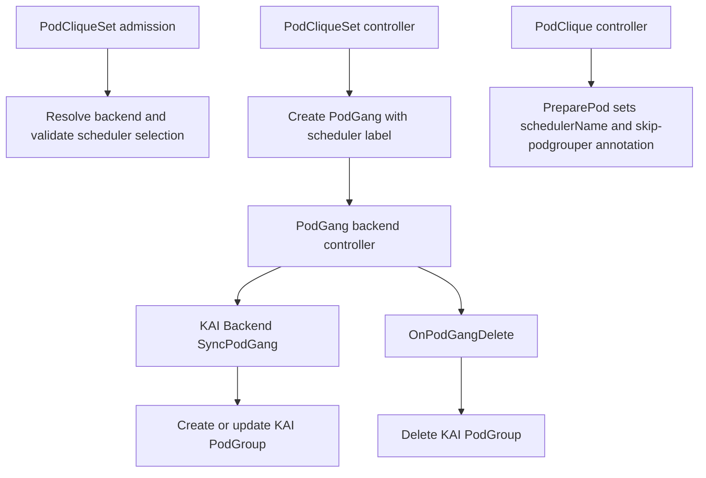

# GREP-525: KAI Scheduler Backend for Scheduler Backend Framework

<!-- toc -->
- [Summary](#summary)
- [Motivation](#motivation)
  - [Goals](#goals)
  - [Non-Goals](#non-goals)
- [Proposal](#proposal)
  - [User Stories](#user-stories)
    - [Story 1: Platform Operator Enables KAI Backend](#story-1-platform-operator-enables-kai-backend)
    - [Story 2: Workload Owner Uses KAI Scheduler](#story-2-workload-owner-uses-kai-scheduler)
  - [Limitations/Risks &amp; Mitigations](#limitationsrisks--mitigations)
    - [Risk: Duplicate Ownership During Migration](#risk-duplicate-ownership-during-migration)
- [Design Details](#design-details)
  - [Architecture Overview](#architecture-overview)
  - [Backend Lifecycle Contract](#backend-lifecycle-contract)
  - [Precondition: KAI Backend Enabled](#precondition-kai-backend-enabled)
  - [KAI Backend Responsibilities](#kai-backend-responsibilities)
  - [PodGang to PodGroup Mapping](#podgang-to-podgroup-mapping)
  - [Pod Preparation](#pod-preparation)
  - [PodGroup Update Semantics](#podgroup-update-semantics)
  - [Reconciliation Flow](#reconciliation-flow)
  - [API and Registration Requirements](#api-and-registration-requirements)
  - [RBAC Matrix](#rbac-matrix)
  - [Test Plan](#test-plan)
    - [Unit Tests](#unit-tests)
    - [E2E Tests](#e2e-tests)
  - [Graduation Criteria](#graduation-criteria)
    - [Alpha](#alpha)
    - [Beta](#beta)
    - [GA](#ga)
- [Appendix](#appendix)
<!-- /toc -->

## Summary

This proposal adds a dedicated KAI scheduler backend to Grove's Scheduler Backend Framework so Grove can natively create, update, and delete KAI PodGroup resources for Grove PodGang workloads. This proposal is intentionally limited to PodGroup creation and management; it does not add new topology-aware scheduling support and does not change existing KAI Topology synchronization behavior from Grove ClusterTopology. The change improves maintainability, clarifies ownership boundaries, and enables predictable KAI-specific lifecycle handling for PodGang workloads by relying on KAI-Scheduler's externally-created PodGroup support.

## Motivation

GREP-375 introduced a generic Scheduler Backend Framework, but the KAI integration still needs a concrete backend implementation pattern and operational contract for production use. Without this backend, KAI support depends on legacy behavior that can cause ambiguous ownership of PodGroup resources and complicate migration as Grove evolves.

### Goals

- Define the KAI backend behavior under the Scheduler Backend Framework lifecycle.
- Define `PreparePod` behavior so Pods are scheduled by KAI consistently with Grove's scheduling gate flow and opt out of KAI podgrouper reconciliation when Grove owns the PodGroup.
- Specify PodGang to KAI PodGroup translation and reconciliation responsibilities.
- Define deletion-time cleanup behavior for KAI-owned scheduling resources.
- Document the dependency on KAI-Scheduler support for externally-created PodGroups and podgrouper skip behavior.
- Clarify required RBAC, scheme registration, and dependency/version expectations for KAI resources.
- Establish test expectations for pod preparation, PodGroup sync, and delete paths.

### Non-Goals

- Redesigning the Scheduler Backend Framework introduced by GREP-375.
- Introducing new user-facing scheduling APIs in PodCliqueSet or PodGang for this phase.
- Covering support for all third-party schedulers; this proposal only scopes KAI backend behavior.
- Defining advanced KAI-only scheduling semantics beyond existing PodGang intent.
- Replacing or deprecating non-KAI backends.
- Defining how scheduler backends are enabled, selected, or resolved from operator configuration and workload templates. This proposal assumes the `kai-scheduler` backend is already enabled by the Scheduler Backend Framework.
- Requiring PodGang status-only updates to trigger backend reconciliation. The current backend controller reacts to create, delete, and generation-changing updates.
- Extending or refactoring existing KAI Topology resource management from Grove `ClusterTopology`/`ClusterTopologyBinding`.
- Defining topology-aware scheduling behavior for KAI. That functionality is out of scope for this proposal and should be covered separately.

## Proposal

Grove will ship a built-in `kai-scheduler` backend that implements the Scheduler Backend Framework lifecycle hooks needed to manage KAI PodGroups. The backend is responsible for converting Grove PodGang intent to KAI PodGroup resources, preparing Pods to use KAI, participating in admission validation, and keeping KAI PodGroups in sync with Grove lifecycle events.

This proposal only covers KAI PodGroup creation and management. It does not propose any KAI Topology creation/update flow, does not add startup-time topology synchronization, and does not define topology-aware scheduling behavior.

At a high level, the proposal introduces:

1. **KAI backend ownership model**: Grove backend controller is the single owner of KAI PodGroup reconciliation for PodGang resources that select `kai-scheduler`.
2. **Deterministic lifecycle behavior**: backend initialization happens during operator startup, `PreparePod` sets the scheduler name and podgrouper skip annotation during Pod construction, `SyncPodGang` handles create/update reconciliation, and `OnPodGangDelete` handles cleanup.
3. **External PodGroup support dependency**: This backend relies on KAI-Scheduler support for externally-created PodGroups, including `kai.scheduler/skip-podgrouper`, so KAI does not recreate or overwrite Grove-owned PodGroups.
4. **Operator readiness requirements**: KAI PodGroup API types are registered in Grove scheme and RBAC allows backend operations on KAI PodGroups.
5. **Update safety**: Grove preserves fields that KAI runtime components own so backend reconciliation does not erase scheduler decisions or mutable runtime state.

### User Stories

#### Story 1: Platform Operator Enables KAI Backend

As a platform operator, I want Grove to manage KAI scheduling resources through its backend framework so that KAI integration follows a consistent operator lifecycle and is easier to operate and troubleshoot.

#### Story 2: Workload Owner Uses KAI Scheduler

As a workload owner, I want my PodGang workloads targeting KAI to automatically produce and maintain the required KAI PodGroup resources so that gang scheduling intent is enforced without manual intervention.

### Limitations/Risks & Mitigations

#### Risk: Duplicate Ownership During Migration

If KAI-Scheduler does not support externally-created PodGroups, KAI podgrouper behavior may compete with Grove-owned PodGroup reconciliation.

**Mitigation**:

- Require a KAI-Scheduler version that includes external PodGroup support from [kai-scheduler/KAI-Scheduler PR #1552](https://github.com/kai-scheduler/KAI-Scheduler/pull/1552).
- Use `PreparePod()` to add KAI-Scheduler's `kai.scheduler/skip-podgrouper` annotation when it is missing, so KAI podgrouper skips Pods that are intentionally backed by externally-created PodGroups.
- Keep ownership boundaries documented and validated in tests.

## Design Details

### Architecture Overview

The KAI backend extends GREP-375 by implementing KAI-specific translations and lifecycle handling while preserving framework-level control flow.

### Backend Lifecycle Contract

The backend must cover the PodGroup-related backend surface from GREP-375:

| Lifecycle surface | Trigger | KAI backend responsibility |
| --- | --- | --- |
| Backend initialization | Operator startup after manager creation | Construct and initialize the `kai-scheduler` backend profile. |
| Admission validation | PodCliqueSet create/update webhook | Validate scheduler selection and run KAI-specific validation when defined. |
| Pod preparation | PodClique controller builds a Pod | Set Pod `schedulerName` to `kai-scheduler` and ensure `kai.scheduler/skip-podgrouper` is present. |
| PodGang sync | PodGang create or generation-changing update | Reconcile the Grove-owned KAI PodGroup. |
| PodGang deletion | PodGang delete event | Delete associated KAI PodGroup, ignoring not-found errors. |

### Precondition: KAI Backend Enabled

This proposal assumes the Scheduler Backend Framework has already enabled and initialized the `kai-scheduler` backend. The mechanics of enabling scheduler profiles, default scheduler selection, and validation of scheduler names are defined by GREP-375 and are not redefined here.

Under that assumption, this proposal only relies on the resolved backend identity:

- Pods prepared by this backend are scheduled with `schedulerName: kai-scheduler`.
- PodGang resources routed to this backend are reconciled into KAI PodGroups.

### KAI Backend Responsibilities

- Resolve only workloads assigned to `kai-scheduler`.
- Participate in PodCliqueSet validation through the framework hook.
- Prepare Pods by setting `schedulerName` to `kai-scheduler`.
- Ensure prepared Pods have `kai.scheduler/skip-podgrouper` annotation so KAI podgrouper does not create or overwrite PodGroups that Grove owns.
- Translate PodGang group semantics to KAI PodGroup semantics.
- Reconcile KAI PodGroup state on PodGang create and update.
- Handle KAI resource cleanup on PodGang delete.
- Rely on KAI-Scheduler external PodGroup support so KAI podgrouper does not take ownership of Grove-managed PodGroups.

### PodGang to PodGroup Mapping

The KAI backend translates a Grove PodGang to a KAI PodGroup with the following ownership and mapping rules:

| Grove source | KAI PodGroup target |
| --- | --- |
| PodGang name and namespace | PodGroup name and namespace |
| PodGang labels and annotations | PodGroup labels and annotations, preserving existing target-only keys |
| Sum of PodGang pod group minimum replicas | PodGroup `minMember` |
| PodGang priority class | PodGroup priority class |
| Queue label or annotation | PodGroup queue on initial creation |
| PodGang pod groups | Leaf KAI subgroups with min member and optional parent |
| PodGang owner reference | PodGroup controller owner reference |

This mapping focuses on PodGroup ownership and gang membership. KAI Topology resources and topology-aware scheduling semantics are outside the scope of this proposal.

### Pod Preparation

When the KAI backend prepares a Pod, it must:

- Set `pod.spec.schedulerName` to `kai-scheduler`.
- Ensure `pod.metadata.annotations["kai.scheduler/skip-podgrouper"]` is present when missing.
- Preserve any existing user or controller annotations on the Pod.

The skip-podgrouper annotation is required because the KAI PodGroup is created externally by Grove. Without it, KAI podgrouper may still try to infer or reconcile PodGroup membership for the same Pod, competing with the Grove-owned PodGroup.

### PodGroup Update Semantics

After creation, some PodGroup fields are owned or mutated by KAI runtime components. The KAI backend must not blindly overwrite them on every Grove reconciliation. Existing runtime-managed values are inherited before comparison and update. This includes:

- Scheduler backoff state.
- Mark-unschedulable state.
- Existing queue value.
- Runtime-assigned KAI queue and node-pool labels.

For source-owned labels and annotations, Grove ensures values from the desired PodGang are present on the PodGroup while preserving unrelated existing keys.

### Reconciliation Flow

1. Backend controller receives PodGang event and resolves `kai-scheduler` backend.
2. KAI backend computes desired PodGroup representation from PodGang state.
3. Backend creates the KAI PodGroup if none exists.
4. Backend inherits KAI runtime-managed fields from the existing PodGroup before comparing desired and actual state.
5. Backend updates only when source-owned fields or desired scheduling intent changed.
6. On PodGang deletion, backend removes the associated KAI PodGroup and ignores not-found errors.

The backend controller only handles PodGang create, delete, and generation-changing update events. Status-only transitions, such as the PodGang `Initialized` condition, do not trigger backend reconciliation. The KAI backend design must therefore rely on spec and metadata changes for PodGroup reconciliation.

### API and Registration Requirements

- Grove runtime scheme includes KAI PodGroup API types for backend client operations.
- Operator RBAC grants read/write/delete access for KAI PodGroup resources.
- KAI-Scheduler version includes externally-created PodGroup support from [kai-scheduler/KAI-Scheduler PR #1552](https://github.com/kai-scheduler/KAI-Scheduler/pull/1552).
- Backend initialization should validate required API availability before normal reconciliation where practical.
- KAI dependency imports should consistently use the same module path and version across backend code, scheme registration, unit tests, and e2e helpers (canonical module path: `github.com/kai-scheduler/KAI-scheduler`).

### RBAC Matrix

| API group | Resource | Scope | Required verbs | Purpose |
| --- | --- | --- | --- | --- |
| `scheduling.run.ai` | `podgroups` | Namespaced | create, get, list, watch, patch, update, delete | PodGang to KAI PodGroup reconciliation and cleanup. |

### Test Plan

#### Unit Tests

- Validate `PreparePod` sets Pod `schedulerName` to `kai-scheduler` and adds `kai.scheduler/skip-podgrouper` when missing without dropping existing annotations.
- Validate `SyncPodGang` creates and updates KAI PodGroup state, including required field mapping and runtime-managed field preservation.
- Validate `OnPodGangDelete` removes the associated KAI PodGroup and ignores already-deleted resources.

#### E2E Tests

- Deploy a minimal PodCliqueSet that uses `schedulerName: kai-scheduler` through the existing e2e `PrepareTest` and `DeployAndVerifyWorkload` flow. Verify the created Pods use `kai-scheduler`, include `kai.scheduler/skip-podgrouper`, the backend creates a KAI PodGroup for the Grove PodGang, and the PodGroup contains the expected basic fields such as owner reference, `minMember`, queue, and subgroups.
- Delete the same PodCliqueSet with the existing workload deletion helper and verify the KAI PodGroup for that workload is removed. This covers the `OnPodGangDelete` path without adding topology-specific e2e coverage.

### Graduation Criteria

#### Alpha

- KAI backend is implemented behind framework lifecycle hooks.
- Unit tests cover pod preparation, PodGroup translation, sync, and delete behavior.

#### Beta

- E2E coverage validates KAI backend behavior in realistic cluster environments.

#### GA

- KAI backend is stable across multiple releases with no unresolved critical issues.

## Appendix

- Scheduler Backend Framework baseline: GREP-375.
- KAI scheduler dependency context: [kai-scheduler/KAI-Scheduler PR #1552](https://github.com/kai-scheduler/KAI-Scheduler/pull/1552), which adds support for externally-created PodGroups and allows Grove to own PodGroup creation through this backend.
