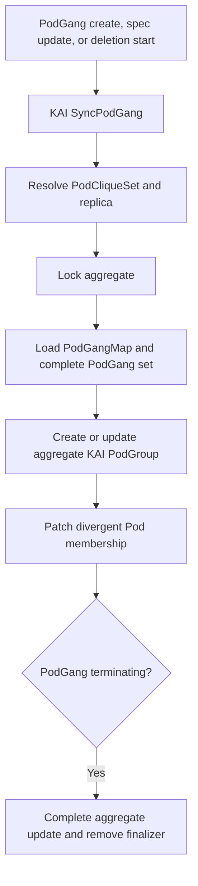

# GREP-525: KAI Scheduler Backend for Scheduler Backend Framework

<!-- toc -->
- [Summary](#summary)
- [Motivation](#motivation)
  - [Goals](#goals)
  - [Non-Goals](#non-goals)
- [Proposal](#proposal)
  - [User Stories](#user-stories)
    - [Story 1: Platform Operator Enables KAI Backend](#story-1-platform-operator-enables-kai-backend)
    - [Story 2: Workload Owner Uses KAI Scheduler](#story-2-workload-owner-uses-kai-scheduler)
  - [Limitations/Risks &amp; Mitigations](#limitationsrisks--mitigations)
    - [Minimum Supported KAI Version](#minimum-supported-kai-version)
    - [Aggregate Reconciliation Risks](#aggregate-reconciliation-risks)
- [Design Details](#design-details)
  - [Architecture Overview](#architecture-overview)
  - [Backend Lifecycle Contract](#backend-lifecycle-contract)
  - [Precondition: KAI Backend Enabled](#precondition-kai-backend-enabled)
  - [KAI Backend Responsibilities](#kai-backend-responsibilities)
  - [PodCliqueSet to PodGroup Mapping](#podcliqueset-to-podgroup-mapping)
    - [KAI Queue Resolution](#kai-queue-resolution)
    - [SubGroup Mapping Rules](#subgroup-mapping-rules)
  - [Pod Preparation](#pod-preparation)
  - [PodGroup Update Semantics](#podgroup-update-semantics)
  - [Reconciliation Flow](#reconciliation-flow)
  - [API and Registration Requirements](#api-and-registration-requirements)
  - [RBAC Matrix](#rbac-matrix)
  - [Dynamic RBAC Strategy](#dynamic-rbac-strategy)
  - [Monitoring](#monitoring)
  - [Test Plan](#test-plan)
    - [Phase 1 (Current): Unit Tests](#phase-1-current-unit-tests)
    - [Phase 2 (Follow-up): E2E Tests](#phase-2-follow-up-e2e-tests)
  - [Graduation Criteria](#graduation-criteria)
    - [Alpha](#alpha)
    - [Beta](#beta)
    - [GA](#ga)
- [Appendix](#appendix)
<!-- /toc -->

## Summary

This proposal adds a dedicated KAI scheduler backend to Grove's Scheduler Backend Framework so Grove can natively manage one KAI PodGroup for all PodGangs in each PodCliqueSet replica. This unified representation preserves workload-level gang and topology constraints across scaling and coherent updates. The proposal remains limited to PodGroup management and does not change existing KAI Topology synchronization from Grove ClusterTopology. The change improves maintainability, clarifies ownership boundaries, and enables predictable KAI-specific lifecycle handling for PodGang workloads by relying on KAI-Scheduler's externally-created PodGroup support.

## Motivation

GREP-375 introduced a generic Scheduler Backend Framework, but the KAI integration still needs a concrete backend implementation pattern and operational contract for production use. Without this backend, KAI support depends on legacy behavior that can cause ambiguous ownership of PodGroup resources and complicate migration as Grove evolves.

### Goals

- Define the KAI backend behavior under the Scheduler Backend Framework lifecycle.
- Define `PreparePod` behavior so Pods are scheduled by KAI consistently with Grove's scheduling gate flow and opt out of KAI podgrouper reconciliation when Grove owns the PodGroup.
- Aggregate all KAI-scheduled PodGangs in each PodCliqueSet replica into one KAI PodGroup using PodGangMap as the source of truth.
- Define deletion-time handling for aggregate KAI PodGroups.
- Document the minimum supported KAI-Scheduler version and required PodGroup capabilities.
- Clarify required RBAC, scheme registration, and dependency/version expectations for KAI resources.
- Establish test expectations for Pod preparation, aggregate reconciliation, migration, and deletion.

### Non-Goals

- Redesigning the Scheduler Backend Framework introduced by GREP-375.
- Introducing new user-facing scheduling APIs in PodCliqueSet or PodGang for this phase.
- Covering support for all third-party schedulers; this proposal only scopes KAI backend behavior.
- Defining advanced KAI-only scheduling semantics beyond existing PodGang intent.
- Replacing or deprecating non-KAI backends.
- Defining how scheduler backends are enabled, selected, or resolved from operator configuration and workload templates. This proposal assumes the `kai-scheduler` backend is already enabled by the Scheduler Backend Framework.
- Requiring PodGang status-only or PodGangMap-only updates to trigger backend reconciliation.
- Extending or refactoring existing KAI Topology resource management from Grove `ClusterTopology`/`ClusterTopologyBinding`.
- Guaranteeing topology placement again when already-running Pods are rescheduled.

## Proposal

Grove will ship a built-in `kai-scheduler` backend that implements the Scheduler Backend Framework lifecycle hooks needed to manage KAI PodGroups. The backend uses `SyncPodGang` events to resolve the owning PodCliqueSet replica, loads its PodGangMap and complete PodGang set, and reconciles one aggregate KAI PodGroup.

This proposal only covers KAI PodGroup creation and management. It does not propose any KAI Topology creation/update flow or startup-time topology synchronization.

At a high level, the proposal introduces:

1. **KAI backend ownership model**: Grove owns one aggregate PodGroup per PodCliqueSet replica. The PodCliqueSet owns the aggregate; PodGangMap defines its membership and Anchor, Tail, and ScaleOut roles.
2. **Deterministic lifecycle behavior**: `PreparePod` assigns aggregate membership, while `SyncPodGang` handles active and terminating PodGangs. A PodGang finalizer preserves deletion as a scale-in/removal trigger.
3. **KAI version dependency**: The backend requires KAI-Scheduler v0.15.0 or newer.
4. **Operator readiness requirements**: KAI PodGroup API types are registered in Grove's scheme and RBAC allows backend operations on KAI PodGroups.
5. **Safe migration**: Grove synchronizes current PodGangs, creates the aggregate, and patches every Pod before deleting legacy PodGangs. Former per-PodGang PodGroups may then be garbage-collected or remain empty.

### User Stories

#### Story 1: Platform Operator Enables KAI Backend

As a platform operator, I want Grove to manage KAI scheduling resources through its backend framework so that KAI integration follows a consistent operator lifecycle and is easier to operate and troubleshoot.

#### Story 2: Workload Owner Uses KAI Scheduler

As a workload owner, I want my PodGang workloads targeting KAI to automatically produce and maintain the required KAI PodGroup resources, aggregated per PodCliqueSet replica, so that gang scheduling intent is enforced without manual intervention and PodCliqueSet-level topology constraints span all related PodGangs.

### Limitations/Risks & Mitigations

The KAI backend depends on KAI scheduler features that are not available in older KAI releases.

#### Minimum Supported KAI Version

The minimum supported KAI-Scheduler version for this backend is **v0.15.0**.

KAI-Scheduler v0.15.0 is required because it provides both capabilities this backend relies on:

- **PodGroup subgroups**: Grove maps PodGang pod groups to KAI PodGroup subgroups so KAI can preserve per-group gang semantics.
- **Externally-created PodGroup support**: Grove owns PodGroup creation and reconciliation, while KAI consumes those PodGroups without recreating or overwriting them. This includes the `kai.scheduler/skip-podgrouper` behavior introduced by [KAI PR #1552](https://github.com/kai-scheduler/KAI-Scheduler/pull/1552).

Operational behavior:

- Operators must deploy KAI `v0.15.0` or newer before enabling the backend.
- Grove release notes MUST publish and maintain a Grove-to-KAI compatibility matrix whenever the minimum supported KAI version changes.

#### Aggregate Reconciliation Risks

- KAI must allocate active Anchor minimums before eligible Tail/ScaleOut minimums, and minimums before surplus. Incremental-capacity E2E tests must validate this ordering.
- PodGangMap is authoritative state but not a reconciliation trigger. Controller tests must verify that every aggregate-relevant change produces a PodGang create, generation change, or deletion-start event.
- Upgrade migration must synchronize current PodGangs and move every Pod to the aggregate before deleting legacy PodGangs. Upgrade E2E tests must cover this ordering.
- PodGangMap may temporarily reference PodGangs that are not yet materialized. The backend preserves the current aggregate and retries until the expected set passes identity validation.

## Design Details

### Architecture Overview

The KAI backend extends GREP-375 by implementing KAI-specific translations and lifecycle handling while preserving framework-level control flow.


```mermaid
flowchart TD
    A[PodGang create, spec update, or deletion start] --> B[KAI SyncPodGang]
    B --> C[Resolve PodCliqueSet and replica]
    C --> D[Lock aggregate]
    D --> E[Load PodGangMap and complete PodGang set]
    E --> F[Create or update aggregate KAI PodGroup]
    F --> G[Patch divergent Pod membership]
    G --> H{PodGang terminating?}
    H -->|Yes| I[Complete aggregate update and remove finalizer]
```

### Backend Lifecycle Contract

The backend must cover the PodGroup-related backend surface from GREP-375:

| Lifecycle surface | Trigger | KAI backend responsibility |
| --- | --- | --- |
| Backend initialization | Operator startup | Register required KAI API types. |
| Pod preparation | PodClique controller builds a Pod | Set scheduler, skip-podgrouper annotation, aggregate PodGroup, and subgroup. |
| PodGang sync | Create or generation-changing update | Ensure metadata/finalizer and reconcile the complete aggregate. |
| PodGang deletion start | `deletionTimestamp` becomes non-zero | Update/remove aggregate membership, then remove finalizer. |
| PodCliqueSet deletion | Owner deletion | Remove PodGang finalizers and allow owner-reference garbage collection. |

### Precondition: KAI Backend Enabled

This proposal assumes the Scheduler Backend Framework has already enabled and initialized the `kai-scheduler` backend. The mechanics of enabling scheduler profiles, default scheduler selection, and validation of scheduler names are defined by GREP-375 and are not redefined here.

Under that assumption, this proposal only relies on the resolved backend identity:

- Pods prepared by this backend are scheduled with `schedulerName: kai-scheduler`.
- PodGang resources routed to this backend are reconciled into the aggregate KAI PodGroup for their PodCliqueSet replica.

### KAI Backend Responsibilities

- Resolve only workloads assigned to `kai-scheduler`.
- Ensure prepared Pods and Grove PodGangs have `kai.scheduler/skip-podgrouper`.
- Resolve each triggering PodGang to its owning PodCliqueSet, replica index, and PodGangMap.
- Reconcile one role-aware aggregate PodGroup from the complete expected PodGang set.
- Serialize reconciliation by namespace and aggregate PodGroup name.
- Migrate Pod membership only after creating the aggregate.
- Handle terminating current PodGangs through a finalizer.

### PodCliqueSet to PodGroup Mapping

The KAI backend creates one Grove-owned KAI PodGroup for each PodCliqueSet replica. `SyncPodGang` uses the triggering PodGang to find the owning PodCliqueSet and replica, then uses the corresponding PodGangMap as the authoritative source for expected PodGangs and their Anchor, Tail, or ScaleOut role.

| Grove source | KAI PodGroup target |
| --- | --- |
| PodCliqueSet replica | One aggregate KAI PodGroup |
| PodCliqueSet | Aggregate owner reference |
| PodGangMap entries | Membership, epoch, generation, role, and expected PodGang names |
| Anchor PodGang | Top-level subgroup branch prefixed with `1-` and included in the root `minSubGroup` threshold |
| Tail and ScaleOut PodGangs | Branches below zero-minimum utility parents in the `0-non-anchor-podgangs` collection |
| PodGang `spec.podgroups[]` | Leaf subgroups with `minMember` and topology |
| PodCliqueSet/PodGang topology | Aggregate, branch, group, or leaf topology boundary |

The backend does not infer membership or role from legacy Base/Scaled names, labels, or generated-name parsing. It waits for the complete expected PodGang set before modifying an existing aggregate.

#### KAI Queue Resolution

KAI accepts one queue per PodGroup. The backend resolves that queue from the PodGang's owning PodCliqueSet:

1. A `kai.scheduler/queue` label on the PodCliqueSet selects the queue for the complete scheduling unit. Its annotation is a compatibility fallback when the label is absent.
2. Any explicitly configured PodClique-template queue must resolve to that same queue. Without a PodCliqueSet-level queue, labels are resolved first and annotations second on every PodClique template; all non-empty template values must name the same queue.
3. For a PodCliqueSet targeting the KAI backend, admission rejects missing queue configuration and conflicting effective queue values. Reconciliation retains the same checks for pre-existing objects and does not create or update the KAI PodGroup when mapping fails.

This preserves existing workloads that set the queue on PodClique templates while allowing the PodCliqueSet to select one queue explicitly for its complete scheduling unit.

#### SubGroup Mapping Rules

SubGroup mapping is always used for KAI backend PodGroup generation.

Let:

- `A` be the number of materialized Anchor PodGangs in the PodGangMap;
- `N` be the number of materialized Tail and ScaleOut PodGangs; and
- `D(pg)` be the number of direct KAI children under a PodGang branch after applying topology grouping.

```text
aggregate KAI PodGroup
minMember: unset
minSubGroup: A + 1 when N > 0, otherwise A

├── 0-non-anchor-podgangs
│   minMember: unset
│   minSubGroup: N
│
│   ├── utility-<Tail-or-ScaleOut-PodGang>
│   │   minMember: unset
│   │   minSubGroup: 0
│   │
│   │   └── <Tail-or-ScaleOut-PodGang> branch
│   │       minMember: unset
│   │       minSubGroup: D(pg)
│   │
│   │       ├── topology group
│   │       │   minMember: unset
│   │       │   minSubGroup: number of leaves in the group
│   │       │   └── PodGroup leaf
│   │       │       minMember: PodGroup.minReplicas
│   │       │       minSubGroup: unset
│   │       └── ungrouped PodGroup leaf
│   │           minMember: PodGroup.minReplicas
│   │           minSubGroup: unset
│   └── ...
│
├── 1-<Anchor-PodGang> branch
│   minMember: unset
│   minSubGroup: D(pg)
│   └── same topology-group and PodGroup-leaf structure
└── ...
```

- Every materialized `Role=Anchor` PodGang maps to a top-level branch and contributes to `A`. `anchorIndex` identifies an Anchor's position within its generation; it neither defines KAI allocation order nor determines whether a Tail or ScaleOut PodGang depends on that Anchor.
- The non-Anchor collection is omitted when `N` is zero. Otherwise, its `N` zero-minimum utility children make the collection initially satisfied while the aggregate root still requires every Anchor branch.
- Each Tail or ScaleOut PodGang maps below its own utility parent. Empty PodGangMap entries create no branch.
- Each PodGang branch contains group nodes for `topologyConstraintGroupConfigs` and leaves for `spec.podgroups`. A topology group requires all of its leaves; an ungrouped leaf is a direct PodGang-branch child.
- Names include the epoch-bearing PodGang identity and are stable, DNS-label compatible, and unique. The `0-` collection and `1-` Anchor prefixes are scheduling-significant: they make the non-Anchor collection win KAI's name-based fallback when satisfied root branches have equal allocation ratios.
- `PodGangMap.spec.entries[*].dependsOn` identifies the exact Anchor epochs that must have been scheduled before a Tail or ScaleOut PodGang becomes eligible. Grove continues enforcing this dependency through scheduling gates; it does not change aggregate membership or subgroup thresholds.

This hierarchy produces the following allocation order:

```text
active Anchor minimums -> eligible Tail/ScaleOut minimums -> elastic surplus
```

Initially, the non-Anchor collection is satisfied and every Anchor branch with an unmet minimum is not, so KAI allocates the Anchor floors first. Once the Anchor branches are satisfied, the collection and Anchor branches have equal direct allocation ratios; the `0-`/`1-` prefixes select the collection. Within it, an untouched zero-minimum utility parent sorts ahead of one whose PodGang branch has reached its floor, distributing allocation across eligible Tail and ScaleOut minimums before surplus. The design does not define an order among Anchor branches or between equally eligible Tail and ScaleOut branches beyond the deterministic name fallback.

The implementation and incremental-capacity E2E tests must validate this comparator behavior against the minimum supported KAI version.

### Pod Preparation

When the KAI backend prepares a Pod, it must:

- Set `pod.spec.schedulerName` to `kai-scheduler`.
- Ensure `pod.metadata.annotations["kai.scheduler/skip-podgrouper"]` is present.
- Set aggregate PodGroup and epoch-qualified leaf subgroup membership from existing PodCliqueSet, replica, PodGang, and PodClique identity.
- Preserve existing user or controller labels and annotations.

Preparation performs no API reads. Missing identity prevents Pod creation.

### PodGroup Update Semantics

After creation, some PodGroup fields are owned or mutated by KAI runtime components. The KAI backend must not blindly overwrite them on every Grove reconciliation. Existing runtime-managed values are inherited before comparison and update. This includes:

- Scheduler backoff state.
- Mark-unschedulable state.
- Existing queue value.
- Runtime-assigned KAI queue and node-pool labels.

For source-owned labels and annotations, Grove ensures desired values are present while preserving unrelated existing keys. Subgroup ordering is normalized before comparison.

### Reconciliation Flow

1. During startup, backend `Init()` registers required KAI API types.
2. Backend controller receives a PodGang create, generation change, or deletion-start event and invokes `SyncPodGang`, including for terminating objects.
3. KAI backend resolves the owning PodCliqueSet and replica, then locks `<namespace>/<aggregate-podgroup-name>`.
4. Reconciliation loads the corresponding PodGangMap and complete expected PodGang set once.
5. For an active replica, backend creates or updates the aggregate before patching Pods. Pod patches are gradual and idempotent.
6. During upgrade migration, the PodCliqueSet controller synchronizes current PodGangs before deleting legacy PodGangs. This creates the aggregate and moves every Pod first. Legacy per-PodGang PodGroups may then be garbage-collected with their owners or remain empty; no Pod continues to reference them.
7. The backend adds `kai.scheduler/aggregate-podgroup` only after validating that an active PodGang is a current PodGangMap materialization. Legacy pre-epoch PodGangs do not receive it.
8. Scale-in deletes the aggregate only after no active Pods remain for the removed replica.
9. If the PodCliqueSet is missing or deleting, backend removes the finalizer and relies on owner-reference garbage collection.

Status-only updates remain ignored. PodGangMap changes that do not change materialized PodGangs do not require reconciliation; a direct PodGangMap watch is added only if tests demonstrate a missing trigger.

### API and Registration Requirements

- Existing `Backend.SyncPodGang`, `PreparePod`, and `ValidatePodCliqueSet` interfaces remain unchanged.
- PodGang controller enqueues deletion-start transitions and continues backend reconciliation for terminating objects.
- Grove runtime scheme includes KAI PodGroup API types for backend client operations.
- Phase 1 uses static minimal RBAC for enabled `kai-scheduler` support. Dynamic RBAC generation is planned for Phase 2 (Beta).
- KAI-Scheduler version is `v0.15.0` or newer, which includes subgroup and externally-created PodGroup support.
- KAI dependency imports should consistently use the same module path and version across backend code, scheme registration, unit tests, and e2e helpers (canonical module path: `github.com/kai-scheduler/KAI-scheduler`).

### RBAC Matrix

| Backend | API group | Resource | Scope | Required verbs | Purpose |
| --- | --- | --- | --- | --- | --- |
| `kai-scheduler` | `scheduling.run.ai` | `podgroups` | Namespaced | create, get, list, watch, patch, update, delete | Aggregate KAI PodGroup reconciliation and migration. |

### Dynamic RBAC Strategy

This strategy is intentionally deferred to **Phase 2 (Beta)**. Phase 1 keeps static minimal RBAC for `kai-scheduler`.

In Phase 2, RBAC permissions are derived from enabled scheduler backends (`operatorConfig.scheduler.profiles`) rather than statically granting all backend permissions.

Design:

- Maintain a backend-to-rule registry in operator code (for example: `kai-scheduler` -> PodGroup CRUD rules, `default-scheduler` -> no extra scheduler CR rules).
- At startup and on scheduler profile configuration updates, the operator computes the union of rules for currently enabled backends.
- Operator reconciles a managed RBAC object set (`ClusterRole`/`Role` plus binding) containing only computed rules and marks them with Grove ownership labels/annotations.
- Rules for disabled backends are removed from the managed RBAC set on next reconcile.

Safety behavior:

- RBAC reconcile failures are treated as fatal for backend activation: backend initialization fails closed and scheduler-specific reconciliation does not start.
- Drift detection compares live managed RBAC rules with computed desired rules; drift triggers update and warning event.
- Unmanaged RBAC objects are not modified unless explicitly marked as Grove-managed.

Operational implications:

- Enabling `kai-scheduler` backend adds KAI PodGroup permissions automatically.
- Disabling `kai-scheduler` backend removes KAI PodGroup permissions from the managed RBAC set.
- Multi-backend deployments receive the union of enabled backend rules only, not blanket permissions for all supported backends.

### Monitoring

Reconciliation errors and Warning Events identify mapping, ownership, migration, or finalizer failures on the triggering PodGang. Logs include the PodCliqueSet, replica, PodGangMap, and aggregate identity. No new status API is introduced.

### Test Plan

#### Phase 1 (Current): Unit Tests

- Validate `PreparePod` sets Pod `schedulerName` to `kai-scheduler`, adds Pod annotation `kai.scheduler/skip-podgrouper`, and assigns aggregate PodGroup and subgroup membership without dropping existing annotations.
- Validate `SyncPodGang` resolves PodGang -> PodCliqueSet replica -> PodGangMap and creates or updates the aggregate KAI PodGroup, including topology, queue, threshold, and runtime-managed field preservation.
- Validate PodCliqueSet queue precedence, consistent PodClique-template queue fallback, and mapping failures for missing or conflicting queue configuration.
- Validate `SyncPodGang` adds the PodGang annotation `kai.scheduler/skip-podgrouper` and aggregate finalizer when missing without dropping existing metadata.
- Validate subgroup translation: Anchor, Tail, and ScaleOut PodGangs map to KAI subgroups with correct `name`, `minSubGroup` / `minMember`, topology grouping, and parent relationships.
- Validate subgroup-name constraints (lowercase/unique/valid label) and explicit error surfacing on invalid subgroup references.
- Validate aggregate locking, aggregate-before-Pod migration, idempotent Pod patching, and current-PodGang synchronization before legacy deletion.
- Validate current PodGangMap identity before finalizer installation, deletion-start reconciliation, scale-in, and finalizer release.

#### Phase 2 (Follow-up): E2E Tests

Phase 2 adds two deliverables that are explicitly out of scope for Phase 1:

- Dynamic RBAC implementation:
  - synthesize RBAC rules from enabled scheduler backends only,
  - remove rules when a backend is disabled,
  - fail closed when managed RBAC reconciliation fails.
- E2E coverage in cluster environments for aggregate PodGroup creation and updates, topology, subgroup allocation order, scaling, PodGangMap reconstruction, workload deletion, and ownership/compatibility guardrails.

Phase 2 test plan includes unit/integration tests for dynamic RBAC and runtime and upgrade E2E tests for aggregate scheduler-backend behavior. Upgrade coverage must prove aggregate-before-patch and Pod-patch-before-legacy-deletion ordering, restart convergence, and finalizer behavior.

### Graduation Criteria

#### Alpha

- KAI aggregate backend and finalizer lifecycle are implemented behind existing framework hooks.
- Phase 1 unit tests cover Pod preparation, aggregate PodGroup translation and reconciliation, migration, and deletion behavior.

#### Beta

- Phase 2 delivers dynamic RBAC strategy and corresponding tests.
- Phase 2 runtime and upgrade E2E coverage validates scaling, coherent updates, migration, cleanup, and required scheduling order against the minimum supported KAI version.

#### GA

- KAI backend is stable across multiple releases with no unresolved critical correctness, migration, or finalizer issues.

## Appendix

- Scheduler Backend Framework baseline: [GREP-375](../375-scheduler-backend-framework/README.md).
- Minimum supported KAI-Scheduler version: `v0.15.0`.
- KAI scheduler dependency context: [kai-scheduler/KAI-Scheduler PR #1552](https://github.com/kai-scheduler/KAI-Scheduler/pull/1552), which adds support for externally-created PodGroups and allows Grove to own PodGroup creation through this backend.
- PodGangMap source-of-truth migration: [Grove PR #778](https://github.com/ai-dynamo/grove/pull/778).
- PodGang status reconciliation: [Grove PR #792](https://github.com/ai-dynamo/grove/pull/792).
- PodGangMap reconstruction behavior: [Grove PR #802](https://github.com/ai-dynamo/grove/pull/802).
