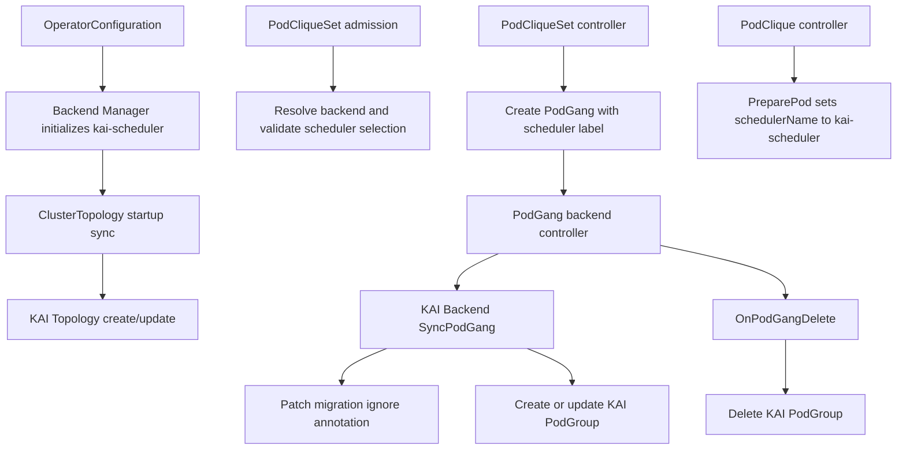

# GREP-525: KAI Scheduler Plugin for Scheduler Backend Framework

<!-- toc -->
- [Summary](#summary)
- [Motivation](#motivation)
  - [Goals](#goals)
  - [Non-Goals](#non-goals)
- [Proposal](#proposal)
  - [User Stories](#user-stories)
    - [Story 1: Platform Operator Enables KAI Backend](#story-1-platform-operator-enables-kai-backend)
    - [Story 2: Workload Owner Uses KAI Scheduler](#story-2-workload-owner-uses-kai-scheduler)
    - [Story 3: Maintainer Performs Safe Migration](#story-3-maintainer-performs-safe-migration)
    - [Story 4: Platform Operator Uses Topology-Aware Scheduling](#story-4-platform-operator-uses-topology-aware-scheduling)
  - [Limitations/Risks &amp; Mitigations](#limitationsrisks--mitigations)
    - [Risk: Duplicate Ownership During Migration](#risk-duplicate-ownership-during-migration)
    - [Risk: API Drift Between Grove and KAI](#risk-api-drift-between-grove-and-kai)
    - [Risk: Insufficient Permissions at Runtime](#risk-insufficient-permissions-at-runtime)
    - [Risk: Overwriting KAI Runtime-Owned Fields](#risk-overwriting-kai-runtime-owned-fields)
    - [Risk: Topology Ownership Conflict](#risk-topology-ownership-conflict)
    - [Limitation: Backend Validation Is Initially Minimal](#limitation-backend-validation-is-initially-minimal)
- [Design Details](#design-details)
  - [Architecture Overview](#architecture-overview)
  - [Backend Lifecycle Contract](#backend-lifecycle-contract)
  - [Operator Configuration and Scheduler Resolution](#operator-configuration-and-scheduler-resolution)
  - [KAI Backend Responsibilities](#kai-backend-responsibilities)
  - [PodGang to PodGroup Mapping](#podgang-to-podgroup-mapping)
  - [PodGroup Update Semantics](#podgroup-update-semantics)
  - [Topology-Aware Scheduling](#topology-aware-scheduling)
  - [Reconciliation Flow](#reconciliation-flow)
  - [API and Registration Requirements](#api-and-registration-requirements)
  - [RBAC Matrix](#rbac-matrix)
  - [Monitoring](#monitoring)
  - [Dependencies (<em>Optional</em>)](#dependencies-optional)
  - [Test Plan](#test-plan)
    - [Unit Tests](#unit-tests)
    - [E2E Tests](#e2e-tests)
  - [Graduation Criteria](#graduation-criteria)
    - [Alpha](#alpha)
    - [Beta](#beta)
    - [GA](#ga)
- [Implementation History (<em>Optional</em>)](#implementation-history-optional)
- [Alternatives (<em>Optional</em>)](#alternatives-optional)
- [Appendix (<em>Optional</em>)](#appendix-optional)
<!-- /toc -->

## Summary

This proposal adds a dedicated KAI scheduler plugin backend to Grove's Scheduler Backend Framework so Grove can natively manage KAI scheduling resources through the full backend lifecycle: operator startup, admission validation, pod preparation, PodGang reconciliation, deletion cleanup, and topology synchronization. The change improves maintainability, clarifies ownership boundaries, and enables predictable KAI-specific lifecycle handling for PodGang workloads without relying on legacy external PodGroup management.

## Motivation

GREP-375 introduced a generic Scheduler Backend Framework, but the KAI integration still needs a concrete backend implementation pattern and operational contract for production use. Without this plugin, KAI support depends on legacy behavior that can cause ambiguous ownership of PodGroup resources and complicate migration as Grove evolves.

Defining a KAI plugin proposal is important because it:

- Transitions KAI support into Grove's standardized backend lifecycle.
- Makes PodGang-to-KAI resource reconciliation explicit and auditable.
- Reduces risk of duplicate resource management during migration.
- Preserves KAI runtime-owned state during Grove-driven reconciliation.
- Brings topology-aware scheduling support under the same backend ownership model.
- Aligns KAI support with future multi-backend extensibility goals.

### Goals

- Define the KAI backend plugin behavior under the Scheduler Backend Framework lifecycle.
- Define how `kai-scheduler` is enabled, selected, and resolved from `OperatorConfiguration`, PodClique templates, Pods, and PodGangs.
- Define `PreparePod` behavior so Pods are scheduled by KAI consistently with Grove's scheduling gate flow.
- Specify PodGang to KAI PodGroup translation and reconciliation responsibilities.
- Specify KAI topology synchronization for Grove `ClusterTopology` when topology-aware scheduling is enabled.
- Define deletion-time cleanup behavior for KAI-owned scheduling resources.
- Document migration-safe coexistence with legacy KAI integration paths.
- Clarify required RBAC, scheme registration, and dependency/version expectations for KAI resources.
- Establish test expectations for backend startup, validation, pod preparation, topology sync, PodGroup sync, and delete paths.

### Non-Goals

- Redesigning the Scheduler Backend Framework introduced by GREP-375.
- Introducing new user-facing scheduling APIs in PodCliqueSet or PodGang for this phase.
- Covering support for all third-party schedulers; this proposal only scopes KAI plugin behavior.
- Defining advanced KAI-only scheduling semantics beyond existing PodGang intent.
- Replacing or deprecating non-KAI backends.
- Requiring PodGang status-only updates to trigger backend reconciliation. The current backend controller reacts to create, delete, and generation-changing updates.

## Proposal

Grove will ship a built-in `kai-scheduler` backend plugin that implements the Scheduler Backend Framework lifecycle hooks for KAI scheduler integration. The backend is responsible for converting Grove scheduling intent to KAI-native resources, preparing Pods to use KAI, participating in admission validation, synchronizing topology resources, and keeping KAI resources in sync with Grove lifecycle events.

At a high level, the proposal introduces:

1. **KAI backend ownership model**: Grove backend controller is the single owner of KAI PodGroup reconciliation for PodGang resources that select `kai-scheduler`.
2. **Deterministic lifecycle behavior**: backend initialization happens during operator startup, `PreparePod` sets the scheduler name during Pod construction, `SyncPodGang` handles create/update reconciliation, `OnPodGangDelete` handles cleanup, and topology sync handles KAI topology resources.
3. **Migration-safe coexistence**: PodGang resources managed via this backend are annotated so legacy KAI paths can ignore them during migration windows.
4. **Operator readiness requirements**: KAI API types are registered in Grove scheme and RBAC allows backend operations on KAI PodGroups and KAI Topologies.
5. **Update safety**: Grove preserves fields that KAI runtime components own so backend reconciliation does not erase scheduler decisions or mutable runtime state.

### User Stories

#### Story 1: Platform Operator Enables KAI Backend

As a platform operator, I want Grove to manage KAI scheduling resources through its backend framework so that KAI integration follows a consistent operator lifecycle and is easier to operate and troubleshoot.

#### Story 2: Workload Owner Uses KAI Scheduler

As a workload owner, I want my PodGang workloads targeting KAI to automatically produce and maintain the required KAI PodGroup resources so that gang scheduling intent is enforced without manual intervention.

#### Story 3: Maintainer Performs Safe Migration

As a Grove maintainer, I want migration-safe controls that prevent legacy and new paths from simultaneously managing the same KAI scheduling resources so that rollout can happen incrementally without resource conflicts.

#### Story 4: Platform Operator Uses Topology-Aware Scheduling

As a platform operator, I want Grove `ClusterTopology` configuration to create and maintain KAI Topology resources so that PodGang topology constraints can be enforced by KAI without separate manual topology provisioning.

### Limitations/Risks & Mitigations

#### Risk: Duplicate Ownership During Migration

If both legacy integration and backend plugin reconcile the same intent, PodGroup conflicts may occur.

**Mitigation**:

- Mark backend-managed PodGang objects with an explicit ignore annotation consumed by legacy KAI paths.
- Keep ownership boundaries documented and validated in tests.

#### Risk: API Drift Between Grove and KAI

Changes in KAI PodGroup API behavior may break translation assumptions.

**Mitigation**:

- Register the KAI API version explicitly in Grove scheme.
- Keep reconciliation logic centralized in the KAI backend and covered by unit tests.
- Use a single canonical KAI module import path and version across scheme registration, backend code, tests, and e2e helpers.

#### Risk: Insufficient Permissions at Runtime

Missing RBAC permissions can cause silent reconciliation failures.

**Mitigation**:

- Define and maintain explicit RBAC permissions for KAI PodGroup resources in operator chart manifests.
- Verify permission-dependent behavior through integration or e2e validation.

#### Risk: Overwriting KAI Runtime-Owned Fields

KAI scheduler components may mutate PodGroup fields after Grove creates the resource. A naive desired-state update from Grove could overwrite those runtime decisions.

**Mitigation**:

- Treat queue, scheduling backoff, unschedulable state, and runtime-assigned labels as KAI-owned once a PodGroup exists.
- Copy these fields from the existing PodGroup before comparing or updating desired state.
- Cover runtime-field preservation in unit tests.

#### Risk: Topology Ownership Conflict

If a KAI Topology with the same name is created outside Grove, the plugin may not be able to safely reconcile it.

**Mitigation**:

- Require Grove-managed KAI Topology resources to be owned by the corresponding Grove `ClusterTopology`.
- Fail reconciliation when an existing KAI Topology has a conflicting owner instead of taking over silently.
- Recreate Grove-owned KAI Topology resources when immutable topology levels change.

#### Limitation: Backend Validation Is Initially Minimal

The framework exposes `ValidatePodCliqueSet`, but the initial KAI backend validation may be intentionally limited while the PodGang API remains the primary source of scheduling intent.

**Mitigation**:

- Keep the validation hook part of the plugin contract.
- Add KAI-specific validation incrementally when KAI has constraints that Grove can detect before reconciliation.

## Design Details

### Architecture Overview

The KAI backend plugin extends GREP-375 by implementing KAI-specific translations and lifecycle handling while preserving framework-level control flow.

### Backend Lifecycle Contract

The plugin must cover the complete backend surface from GREP-375, plus the optional topology interface implemented by KAI:

| Lifecycle surface | Trigger | KAI plugin responsibility |
| --- | --- | --- |
| Backend initialization | Operator startup after manager creation | Construct and initialize the `kai-scheduler` backend profile. |
| Topology synchronization | Operator startup when topology-aware scheduling is enabled | Create or update KAI Topology from Grove `ClusterTopology`. |
| Admission validation | PodCliqueSet create/update webhook | Validate scheduler selection and run KAI-specific validation when defined. |
| Pod preparation | PodClique controller builds a Pod | Set Pod `schedulerName` to `kai-scheduler`. |
| PodGang sync | PodGang create or generation-changing update | Patch migration annotation and reconcile KAI PodGroup. |
| PodGang deletion | PodGang delete event | Delete associated KAI PodGroup, ignoring not-found errors. |

### Operator Configuration and Scheduler Resolution

`OperatorConfiguration.scheduler.profiles` enables the KAI backend by including a profile named `kai-scheduler`. The profile name is also the string that Grove writes into `Pod.spec.schedulerName`; this keeps backend lookup and Kubernetes scheduler selection aligned.

Scheduler resolution follows the framework behavior:

- Empty PodClique template `schedulerName` resolves to `scheduler.defaultProfileName`.
- All PodClique templates in a PodCliqueSet must resolve to the same scheduler backend.
- PodGang resources created by Grove carry the resolved scheduler name in the `grove.io/scheduler-name` label.
- The PodGang backend controller resolves the backend from that label and falls back to the default backend only if the label is absent or invalid.
- A PodCliqueSet that references an enabled non-default scheduler is admitted; a PodCliqueSet that references a non-enabled scheduler is rejected.

### KAI Backend Responsibilities

- Resolve only workloads assigned to `kai-scheduler`.
- Participate in PodCliqueSet validation through the framework hook.
- Prepare Pods by setting `schedulerName` to `kai-scheduler`.
- Translate PodGang group semantics to KAI PodGroup semantics.
- Reconcile KAI PodGroup state on PodGang create and update.
- Handle KAI resource cleanup on PodGang delete.
- Synchronize KAI Topology resources from Grove `ClusterTopology`.
- Mark migration-safe ignore annotation on managed PodGang resources.

### PodGang to PodGroup Mapping

The KAI plugin translates a Grove PodGang to a KAI PodGroup with the following ownership and mapping rules:

| Grove source | KAI PodGroup target |
| --- | --- |
| PodGang name and namespace | PodGroup name and namespace |
| PodGang labels and annotations | PodGroup labels and annotations, preserving existing target-only keys |
| Sum of PodGang pod group minimum replicas | PodGroup `minMember` |
| PodGang priority class | PodGroup priority class |
| Queue label or annotation | PodGroup queue on initial creation |
| PodGang top-level topology constraint | PodGroup topology constraint |
| PodGang topology group configs | Parent KAI subgroups with zero min member |
| PodGang pod groups | Leaf KAI subgroups with min member and optional parent |
| PodGang owner reference | PodGroup controller owner reference |

The topology name is resolved from Grove's topology annotation, with support for the legacy KAI topology annotation during migration. If a topology constraint exists and no topology name is available, reconciliation must fail clearly rather than creating a partial PodGroup.

### PodGroup Update Semantics

After creation, some PodGroup fields are owned or mutated by KAI runtime components. The KAI backend must not blindly overwrite them on every Grove reconciliation. Existing runtime-managed values are inherited before comparison and update. This includes:

- Scheduler backoff state.
- Mark-unschedulable state.
- Existing queue value.
- Runtime-assigned KAI queue and node-pool labels.

For source-owned labels and annotations, Grove ensures values from the desired PodGang are present on the PodGroup while preserving unrelated existing keys.

### Topology-Aware Scheduling

The KAI backend implements the optional topology-aware backend interface. When topology-aware scheduling is enabled in operator configuration:

1. Grove ensures the default `ClusterTopology` exists and reflects configured topology levels.
2. The backend manager exposes all initialized backends to topology synchronization.
3. KAI backend creates or updates a cluster-scoped KAI Topology with the same name as the Grove `ClusterTopology`.
4. The KAI Topology is owned by the Grove `ClusterTopology`.
5. If topology levels change, the KAI Topology is deleted and recreated because KAI topology levels are immutable.
6. PodGang resources receive the Grove topology annotation so PodGroup topology constraints can reference the correct KAI Topology.

### Reconciliation Flow

1. Backend controller receives PodGang event and resolves `kai-scheduler` backend.
2. KAI backend patches the PodGang with the migration ignore annotation if missing.
3. KAI backend computes desired PodGroup representation from PodGang state.
4. Backend creates the KAI PodGroup if none exists.
5. Backend inherits KAI runtime-managed fields from the existing PodGroup before comparing desired and actual state.
6. Backend updates only when source-owned fields or desired scheduling intent changed.
7. On PodGang deletion, backend removes the associated KAI PodGroup and ignores not-found errors.

The backend controller only handles PodGang create, delete, and generation-changing update events. Status-only transitions, such as the PodGang `Initialized` condition, do not trigger backend reconciliation. The KAI plugin design must therefore rely on spec and metadata changes for PodGroup reconciliation.

### API and Registration Requirements

- Grove runtime scheme includes KAI PodGroup API types for backend client operations.
- Grove runtime scheme includes KAI Topology API types for topology synchronization.
- Operator RBAC grants read/write/delete access for KAI PodGroup resources.
- Operator RBAC grants read/write/delete access for KAI Topology resources.
- Backend initialization should validate required API availability before normal reconciliation where practical.
- KAI dependency imports should consistently use the same module path and version across backend code, scheme registration, unit tests, and e2e helpers.

### RBAC Matrix

| API group | Resource | Scope | Required verbs | Purpose |
| --- | --- | --- | --- | --- |
| `scheduling.run.ai` | `podgroups` | Namespaced | create, get, list, watch, patch, update, delete | PodGang to KAI PodGroup reconciliation and cleanup. |
| `kai.scheduler` | `topologies` | Cluster | create, get, list, watch, patch, update, delete | Grove ClusterTopology to KAI Topology synchronization. |

### Monitoring

Operational observability should include:

- Kubernetes events for KAI PodGroup create/update/delete outcomes.
- Backend reconciliation failure counters and success counts by backend name.
- PodGang status conditions or events indicating backend reconciliation state.
- Error logs that include PodGang identity and backend operation stage.
- Topology synchronization logs and failures keyed by backend name and topology name.

The current framework already emits PodCliqueSet-level events for PodGang lifecycle work and logs backend reconciliation outcomes. The KAI plugin should either emit backend-specific events or explicitly document when troubleshooting relies on controller logs.

### Dependencies (*Optional*)

- KAI scheduler CRDs and controller availability in the target cluster.
- Scheduler Backend Framework capabilities from GREP-375.
- Legacy KAI behavior that recognizes migration ignore annotation during transition.
- Consistent KAI API module and CRD versions for PodGroup and Topology APIs.

### Test Plan

#### Unit Tests

- Validate PodGang to KAI PodGroup translation for representative workload patterns.
- Validate PodGroup field mapping for min member, priority class, queue, topology constraints, parent subgroups, and leaf subgroups.
- Validate idempotent create/update reconciliation logic in `SyncPodGang` behavior.
- Validate runtime-managed PodGroup fields are preserved across updates.
- Validate delete-path cleanup behavior in `OnPodGangDelete`.
- Validate `PreparePod` sets `schedulerName` to `kai-scheduler`.
- Validate backend manager initialization and profile resolution for `kai-scheduler`.
- Validate admission behavior for enabled KAI scheduler, disabled KAI scheduler, and mixed scheduler names in one PodCliqueSet.
- Validate KAI Topology create, no-op update, delete/recreate on immutable level changes, and conflicting owner behavior.
- Validate migration annotation behavior on backend-managed PodGang objects.
- Validate scheme registration and error handling when KAI API types are unavailable.

#### E2E Tests

- Deploy Grove with `kai-scheduler` enabled and verify KAI PodGroup lifecycle for PodGang workloads.
- Verify Pods created for KAI-backed workloads have `schedulerName` set to `kai-scheduler`.
- Verify topology-aware PodCliqueSet workloads produce KAI Topology and PodGroup topology constraints.
- Verify no duplicate ownership behavior during migration-compatible deployment setups.
- Verify PodGroup cleanup behavior after PodGang deletion.
- Verify workload scheduling remains functional after backend reconciliation events.

### Graduation Criteria

#### Alpha

- KAI backend plugin is implemented behind framework lifecycle hooks.
- Unit tests cover pod preparation, translation, sync, delete, topology sync, profile resolution, and annotation behavior.
- Required RBAC, scheme registration, and KAI dependency alignment are merged and validated in CI.

#### Beta

- E2E coverage validates KAI backend behavior in realistic cluster environments.
- Operational signals (events/metrics/logging) are sufficient for troubleshooting.
- Migration path is validated without duplicate reconciliation in supported configurations.
- Topology-aware scheduling with KAI is validated for at least one required and one preferred topology constraint scenario.

#### GA

- KAI backend plugin is stable across multiple releases with no unresolved critical issues.
- Documentation clearly defines operational model, migration guidance, and limitations.
- Feature is broadly used in production-like environments with consistent outcomes.
- Plugin behavior remains compatible with the supported KAI API version and has a documented upgrade path for KAI API changes.

## Implementation History (*Optional*)

- **2026-04-27**: Initial GREP draft for KAI Scheduler Plugin created.

## Alternatives (*Optional*)

- **Keep legacy KAI integration only**: Rejected due to unclear ownership boundaries and weaker alignment with GREP-375 architecture.
- **Add KAI-specific logic directly in generic controllers**: Rejected to avoid framework bypass and backend-specific coupling in core reconciliation paths.
- **Build a generic adapter without dedicated KAI backend**: Rejected because KAI lifecycle and migration concerns require explicit backend-owned behavior.

## Appendix (*Optional*)

- Scheduler Backend Framework baseline: GREP-375.
- KAI backend implementation context: [PR #524](https://github.com/ai-dynamo/grove/pull/524).
