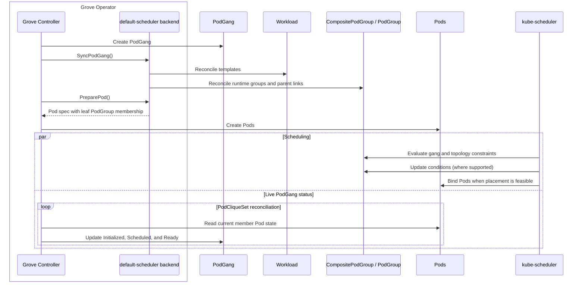

# GREP-531: Hierarchical Scheduling with CompositePodGroup

<!-- toc -->
- [Summary](#summary)
- [Motivation](#motivation)
  - [Goals](#goals)
  - [Non-Goals](#non-goals)
- [Proposal](#proposal)
  - [Limitations/Risks &amp; Mitigations](#limitationsrisks--mitigations)
- [Design Details](#design-details)
  - [Mapping](#mapping)
  - [Gang Scheduling Configuration](#gang-scheduling-configuration)
  - [Topology-Aware Scheduling](#topology-aware-scheduling)
  - [Scheduling Flow](#scheduling-flow)
  - [Lifecycle](#lifecycle)
  - [Status and Observability](#status-and-observability)
  - [Monitoring](#monitoring)
  - [Test Plan](#test-plan)
  - [Graduation Criteria](#graduation-criteria)
<!-- /toc -->

## Summary

Use upstream Kubernetes `Workload`, `CompositePodGroup`, and `PodGroup` APIs to schedule each Grove `PodGang` as one hierarchical gang.

## Motivation

Grove already defines the scheduling intent: `PodGangMap` creates the `PodGang` layout, and each `PodGang` defines its groups, minimums, and topology. This GREP keeps Grove's general Kubernetes >=1.36 baseline. The default-scheduler backend translates that intent into upstream objects and reuses the upstream [workloadbuilder library](https://kubernetes.io/docs/concepts/workloads/workload-api/workloadbuilder/#the-workloadbuilder-library) where applicable when the required WAS capabilities are available. No new Grove API or scheduling model is needed.

### Goals

- Implement Grove `PodGang` scheduling with upstream Kubernetes APIs, reusing `workloadbuilder` where applicable.
- Preserve Grove gang, scaling, update, and required-topology semantics for supported mappings.

### Non-Goals

- Changing existing Grove APIs or scheduling semantics.

## Proposal

With hierarchical scheduling enabled for the default-scheduler backend, Grove translates each `PodGang` into one upstream scheduling hierarchy. Existing Grove APIs, scaling, rollout, and `DependsOn` semantics remain unchanged.

### Limitations/Risks & Mitigations

- Kubernetes [Workload-Aware Scheduling](https://github.com/orgs/kubernetes/projects/251) is still evolving, and Grove must track upstream API changes.
- `workloadbuilder` is reused where applicable; Grove handles translation, runtime object reconciliation, and Pod membership.
- The WAS gang policy requires `minCount >= 1`. Mappings with `MinReplicas=0` are unsupported and fail closed.
- WAS limits each template list to 8 entries and hierarchy depth to 4. `PodGang`s exceeding these limits fail closed.
- WAS supports one required topology key per group. Unsupported preferred constraints are ignored with a warning; required constraints remain enforced.

## Design Details

### Mapping

Each Grove `PodGang` maps to one `Workload` with the following template tree:

```text
Workload template tree
└─ CompositePodGroupTemplate: Grove PodGang
   ├─ CompositePodGroupTemplate: topology subgroup (optional)
   │  └─ PodGroupTemplate: Grove PodGroup
   └─ PodGroupTemplate: Grove PodGroup
```

| Grove | WAS |
| --- | --- |
| `spec.podgroups[].minReplicas` | Leaf `spec.schedulingPolicy.gang.minCount` |
| Direct child count | Composite `spec.schedulingPolicy.gang.minGroupCount`; all children required |
| Required topology key | `spec.schedulingConstraints.topology[0].key` at the corresponding level |
| `spec.priorityClassName` | Same field on all runtime groups |

### Gang Scheduling Configuration

For `default-scheduler`, `config.gangScheduling` defaults to `false`. Enabling it requires Kubernetes >=1.37 with these feature gates enabled:

- `GenericWorkload` on kube-apiserver, kube-scheduler, and kube-controller-manager.
- `CompositePodGroup` and `TopologyAwareWorkloadScheduling` on kube-apiserver and kube-scheduler.

Missing prerequisites fail Grove Operator startup without fallback. The user guide must document these requirements and startup failure behavior.

### Topology-Aware Scheduling

Upstream [Topology-Aware Scheduling](https://kubernetes.io/docs/concepts/workloads/workload-api/topology-aware-scheduling/) attaches a required topology constraint to a group, requiring all descendant Pods to share the same value for the specified node-label key. Nested constraints are resolved from parent to child.

```text
root CompositePodGroup                 <- PodGang.TopologyConstraint
├─ child CompositePodGroup             <- TopologyConstraintGroupConfig
│  ├─ leaf PodGroup                    <- PodGroup.TopologyConstraint
│  └─ leaf PodGroup
└─ leaf PodGroup                       <- ungrouped PodGroup
```

Grove maps `PodGang` constraints to the root `CompositePodGroup`, `PodGroup` constraints to leaves, and each `TopologyConstraintGroupConfig` with member `PodGroup`s to a child `CompositePodGroup`. The child gives its descendants one shared topology domain; applying the constraint separately to each leaf could select different domains. Without a group config, leaves attach directly to the root.

For base `PodGang`s, each `TopologyConstraintGroupConfig` generated from a PCSG constraint maps to a child `CompositePodGroup`. For scaled `PodGang`s, the PCSG occupies the entire `PodGang`, so its constraint is carried by `PodGang.TopologyConstraint` and maps to the root.

### Scheduling Flow

The diagram summarizes asynchronous reconciliation through the Kubernetes API. The default-scheduler backend runs inside the Grove Operator.



### Lifecycle

Pod count changes update existing leaf `PodGroup`s. PCSG scale-out creates new `PodGang` hierarchies, while scale-in deletes the corresponding hierarchies.

`PreparePod()` sets each Pod's immutable `spec.schedulingGroup.podGroupName` to its leaf `PodGroup`. Existing Pods cannot be migrated in place and must be recreated through a Grove rollout.

Grove owns the lifecycle and desired state of generated scheduling objects, while kube-scheduler owns their runtime status.

### Status and Observability

This GREP follows the KAI and Volcano integrations: Grove observes scheduling through member Pods instead of mapping upstream group status into `PodGang.status`. The PodCliqueSet reconciler continues to maintain `Initialized`, `Scheduled`, and `Ready` using existing Pod creation, association, and per-clique `MinAvailable` checks.

`Workload` has no `status`. Initial placement results are reported in runtime-group `status.conditions`: `PodGroupInitiallyScheduled` on leaf `PodGroup`s and `CompositePodGroupInitiallyScheduled` on root and child `CompositePodGroup`s ([kubernetes/kubernetes#140670](https://github.com/kubernetes/kubernetes/pull/140670)). Scheduler-specific diagnostics remain on the upstream groups and Pods.

### Monitoring

No new monitoring is introduced.

### Test Plan

- Unit tests verify object mapping, topology hierarchy, and validation.
- Integration and end-to-end tests verify ordering, scaling, gang scheduling, and topology scheduling.

### Graduation Criteria

Graduation follows upstream Kubernetes Workload-Aware Scheduling maturity and Grove production validation.
